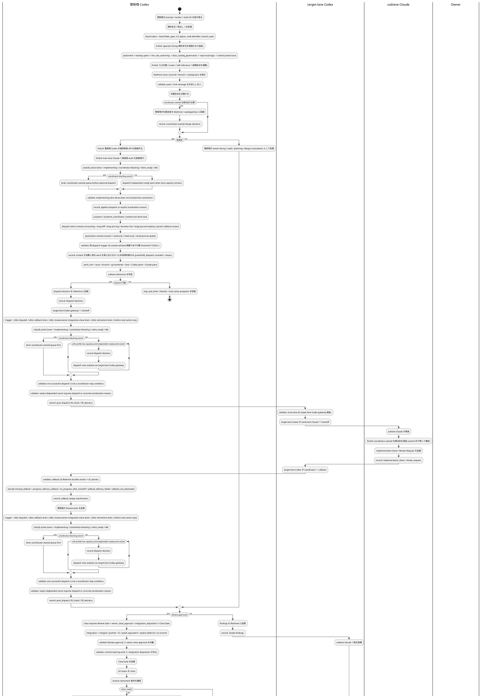

# 管制塔 / サブレーン開発フロー

Redmine #12200。`mozyo_bridge` の通常開発が cockpit-visible sublane 前提へ移行したため、管制塔とサブレーンの責務分担を 1 つの spine として定義する。

この文書は repo-local の **一次 spine** である。管制塔 / サブレーン開発フローに関する dispatch、callback、review、close、integration、retirement の順序と責務はこの文書を先に読む。旧 operating model / runbook 文書の規約本文は本書へ統合済みであり、旧ファイルは物理削除する。

この文書はサブレーン開発フローの実行正本である。dispatch / callback / review / close / integration / retirement に加え、サブレーン帯域、admission、pipeline fill、drain order、dogfood soft profile も本書に一本化する。`agent-workflow.md`、skill workflow reference、central preset は入口・役割・配布面の規約として読み、本書と重なる詳細規則を増やさない。

## 用語と表記ゆれ

owner / user は状況に応じて、同じ運用単位を `管制塔`、`メインレーン`、`メインセッション`、`メインユニット`、`coordinator`、`main lane` と呼ぶことがある。これは人間の記憶と会話上の揺れとして許容する。

本 flow では、これらの語が実装依頼や owner-facing 判断の文脈で出た場合、原則として **管制塔 Codex** を指すものとして解釈する。つまり、owner-facing、dispatch、仕様決定、audit、US close、integration、retirement、後続計画を担う actor である。

ただし、次は区別する。

- `main lane Claude`: 管制塔が補助的に使う Claude pane。read-only 調査、要約、draft、Design Consultation 補助はできるが、通常開発実装者ではない。
- `default lane` / `primary checkout`: checkout / workspace identity の概念。意思決定 actor ではない。
- `Owner`: product、Version close、release、production publish、credential / destructive / security-sensitive 判断の承認者。管制塔とは別である。

ユーザーが `メインでやって`、`メインレーンで判断して`、`管制塔で処理して` と言った場合、それは通常 **管制塔 Codex が判断・routing・audit を行う** という意味であり、main lane Claude に実装 diff を作らせてよいという意味ではない。

## 目的

- 管制塔が owner-facing、仕様決定、dispatch、audit、US close、retirement、後続計画を担当する。
- 通常開発の実装 diff は cockpit-visible sublane へ委譲する。
- 仕様決定と実装判断を混ぜない。
- US close と Version close の承認境界を分ける。
- close 済み sublane を退役させ、cockpit / worktree / agent context を残し続けない。
- ルールを既存 guardrail へ追記し続けるのではなく、本 flow を参照 spine として使う。

## ワークフロー管制ロードマップ

### 背景

#12668 / #12659 の実機 dogfood では、実装そのものよりも
`implementation_done`、`review_request`、`review_result`、owner close approval の
間をつなぐ手続きが詰まりやすいことが分かった。Claude が review request を
Redmine に記録しても、Codex auditor へ live 通知されない。Codex が review result を
記録しても、implementer へ callback されない。これらは単純な pane 操作の失敗ではなく、
手続き型 workflow の runtime state と next action が machine-readable に管理されていない
ことによる。

また、`Codex` / `Claude` という名前は現在の runtime provider であり、workflow 上の責務
そのものではない。今後 Grok、別 Claude model、別 Codex surface などを使う場合でも、
workflow は `auditor` / `implementer` / `root_coordinator` / `project_gateway` /
`implementation_worker` のような抽象 role を正本にし、provider は binding として扱う。

Redmine は durable external memory / audit log であり、細かい state machine を閉じ込める
場所ではない。workflow runtime state、pending delivery、route identity、duplicate
suppression は mozyo DB 側で扱い、Redmine journal は event source と durable anchor として
読む。

### 意図

この roadmap の目的は、agent が「次に何をすべきか」を毎回自然文から推測しない状態へ
移行することである。最初から完全自動化しない。まず lane / role / transition の設計語彙を
固定し、次に mozyo DB に workflow state と next action を持たせ、各 workflow-aware command
が結果として次 action を返す。event watcher と UI はその後に載せる。

重要なのは、`mozyo-bridge next-action` のような別コマンドだけでは足りない点である。
agent は「いつ next-action を叩くべきか」を忘れる。したがって workflow-aware command は、
通常の実行結果に `workflow.next_action` を含める。`suggested_command` は補助であり、正本は
structured field である。

### 設計思想

- Redmine: durable external memory / audit log / owner-visible source。
- mozyo DB: workflow runtime state、pending delivery、route identity、duplicate suppression。
- live tmux / cockpit: liveness evidence と delivery projection。pane id は cache/evidence であり authority ではない。
- repo-local docs: 現在の設計思想、背景、意図、invariant の正本。手順の置き場ではない。
- workflow role: `auditor` / `implementer` / `root_coordinator` / `project_gateway` / `implementation_worker`。
- runtime provider: `codex` / `claude` / future provider。role ではなく binding target。
- command result: workflow-aware command は `workflow.state` と `workflow.next_action` を返す。
- event watcher: Redmine journal update を event source として読み、mozyo DB の pending action に変換する。
- UI: workflow truth ではなく projection。DB / Redmine / live target の read model を表示する。

### ロードマップUS

Redmine Version は semantic version number を含む名前にしない。Version 名は日本語を基本に、
日付・優先度・作業窓を表す計画枠として付ける。番号付き release name にはしない。MCP には
Version 作成と issue の Version 割り当て tool があるため、roadmap bucket は Redmine 上の
Version として作成・割り当てる。一方で Version rename / lock / close / delete と
Version 内 open leaf issue listing は #12651 で操作手段を確定する対象であり、誤作成や
retirement cleanup はそこへ残す。Redmine subject も日本語を基本にし、固定フィールド名、
CLI 名、コード識別子、固有 provider 名だけを literal token として残す。

1. #12670 `ワークフローのレーン所有と遷移関数レジストリを設計する`
   - PlantUML swimlane、lane registry、transition function contract を固定する。
   - lane owner は pane id ではなく workflow role / route identity で表す。
   - `Codex` / `Claude` は provider であり role ではない、という語彙を最初に入れる。
   - #12675 / #12676 / #12677 で、祖父→親→子→孫の実機テスト前ワークフローを
     PlantUML swimlane、command family、fail condition、実機前監査へ分解する。

2. #12671 `DBベースのワークフロー状態とコマンド結果の次アクションを実装する`
   - mozyo DB に workflow state / pending delivery / route identity を持つ。
   - workflow-aware command result に `workflow.next_action` を含める。
   - `workflow resume` / `workflow action run` 相当の明示実行入口を持つ。
   - 自動 watcher ではなく、まず半自動・明示実行で duplicate / risk / fail-closed を固定する。

3. #12672 `Redmine履歴から保留ワークフローアクションを作る監視機構を実装する`
   - Redmine journal / issue update を event source として poll する。
   - 自然文 parse ではなく structured gate / marker を読む。
   - pending action 作成、duplicate suppression、missing / ambiguous route の fail-closed を固定する。

4. #12673 `ワークフロー役割と実行プロバイダの対応を分離する`
   - workflow role から runtime provider への binding を config 化する。
   - DB / event schema は role を正本にし、provider は resolution result として扱う。
   - 表示では `auditor via codex` のように role と provider を分けて出す。

5. #12603 `サブレーンのGit作業木ライフサイクルと統合ドキュメントを整備する`
   - wrong-base lane、base commit、dependency branch、retire / merge policy を強化する。
   - workflow state / role binding が先に無い状態で worktree lifecycle だけを core 化しない。
   - Cockpit UI projection より前には lane / worktree lifecycle の hardening が必要である。

6. #12674 `ワークフロー状態をCockpit UIで追跡できる投影を設計する`
   - UI は source of truth ではなく projection とする。
   - owner_role、provider、lane、next_action、blocked_reason、anchor を見せる。
   - WebSocket / live update は state model と watcher が固まった後に扱う。

## 文書言語

この repo の LLM 向け規約本文は日本語で書く。英字の固定フィールド名、gate 名、CLI option、コード識別子、branch 名、path はそのまま保持してよいが、見出しと説明本文を英語だけで置かない。

LLM 向け規約文書の一般 authoring rule は `.mozyo-bridge/rules/llm_rule_authoring.md` の `## 言語` を正本とする。本 flow では、サブレーン開発フロー固有の適用として「本文は日本語、固定フィールド名は literal token」と明示する。

## ルール配置判断

guardrail は書けばよいものではない。agent が迷った事実を durable record 化するために書くが、配置を誤ると「読まれるべき rule」が増えるだけで、実行時の判断精度は下がる。

新しい超大 rule を作る前に、管制塔は `$placement_decision()` の配置順を確認する。

新規 rule / logic を増やす trigger は、actor / 責務 / 停止条件 / 検証責務が混ざる、同じ判断を複数文書へ重複しそうになる、swimlane なしでは責務境界が誤読される、表記ゆれで routing が壊れる場合に限る。「念のため」だけ、既存 spine へ短く足せるもの、入口文書 / router / skill reference への詳細複製、central 配布面を repo-local で恒久正本化することは hard stop とする。

flow 型 guardrail の書き方、PlantUML activity + swimlane の使い方、Markdown 補足境界、`$validate` / `$forbid` / `$record` primitive は `.mozyo-bridge/rules/llm_rule_authoring.md` を正本とする。この文書にはサブレーン開発フロー固有の判断だけを残す。

## 役割

詳細な実行責務は `標準フロー` の swimlane を読む。authority は、Owner = product / release / Version close / production / credential / destructive approval、管制塔 Codex = owner-facing / dispatch / design decision / audit / US close / integration / retirement / follow-up planning、main lane Claude = read-only 調査 / 要約 / draft / design consultation 補助、target-lane Codex = cross-lane gateway / same-lane Claude handoff / callback、sublane Claude = bounded implementation / implementation_done / review_request である。

## 運用モデル

cockpit-visible sublane では、identity (workspace / lane / role / pane)、routing (handoff を受け取って行動できる agent)、display (pane / window / tab / iTerm / tmux view)、governance (Redmine gate が承認する実行 / close) を混同しない。window layout は display であり routing の source of truth ではない。隣に pane が見えていても、lane 境界や project 境界を越えた direct send の承認にはならない。

### レーンと actor

- **管制塔 Codex** は coordinator、auditor、owner-facing actor である。owner への質問、close approval 回収、Redmine gate 解釈、review conclusion、release / push / CI coordination、sublane 作成・退役、PoC finding の Redmine / repo-local docs 記録を担当する。
- **target-lane Codex** はその lane の gateway である。durable Redmine anchor を読み、自 lane に属する request か確認し、same-lane Claude へ route し、blocked / review-ready / owner-action-needed を管制塔へ callback する。
- **sublane Claude** は bounded implementation worker である。pane scrollback ではなく Redmine journal から実装し、implementation_done / review_request / verification / residual risk を再現可能に残す。owner close approval は回収しない。
- **main lane Claude** は補助 actor である。長い journal / diff / log の要約、candidate 抽出、read-only 調査、draft wording、非権威的な option 比較には使えるが、通常開発実装者でも owner-facing coordinator でもない。

main lane Claude が implementation request を受け取った場合は、実装前の設計矛盾・scope 不足・invariant 衝突を design consultation として整理してよい。ただし、調査や reroute 用の事実整理を終えたら停止する。実装 diff は専用 sublane / worktree に移して、target-lane Codex gateway 経由で same-lane Claude へ渡す。

### レーン作成単位

一つの作業単位は `$work_unit()` の対応で扱う。対応は Redmine issue / journal に記録し、pane 配置から推測しない。

現行実装では、worktree の add / remove は素の git または operator recipe で行う。mozyo-bridge core はまだ Git worktree manager ではない。具体 path / branch 命名、local soft profile、private cockpit composition は operator runtime policy であり OSS default に混ぜない。

#12603 / `sublane lifecycle and worktree integration late window` planning bucket では、この境界を「設定駆動の sublane lifecycle」として再設計する。Git worktree 管理を sublane command に組み込むか、retire 時に target branch へ自動 merge するかは config knob で制御し、mozyo_bridge dogfood では UX 重視の default として core-managed worktree + retire-time merge を採用する方向で検討する。merge conflict / checkout failure / dirty state などで安全に統合できない場合、sublane は退役せず、管制塔へ feedback を返す。

```text
git worktree add <worktree-path> -b <branch>
mozyo cockpit ...
mozyo-bridge init claude   # / codex
mozyo-bridge agents targets --session <cockpit-session>
```

## 帯域 / admission / pipeline fill

sublane bandwidth は CPU capacity ではなく、管制塔の注意力である。実用上の default は pipeline-first であり、管制塔が drain すべき coordinator-owned queue を持たない間は、独立した実装 work を止めずに進める。

lane は、管制塔が durable state を読み、仕様判断を route し、audit し、owner approval を集め、local state を retire する必要がある時に bandwidth を消費する。単に `implementing` の lane よりも、待機中 lane の方が review / close / release / retirement を止めるため高コストになることがある。

効率的な並列開発は明示的な目標である。durable state 上 ready な implementation work があり、下記 admission check を満たすなら、管制塔は sublane を積極的に使う。すべての work を main lane に直列化することは cockpit model を無駄にするため、default ではなく throughput smell として扱う。既に `implementing` の lane があることは positive pipeline occupancy であり、管制塔が idle になる理由ではない。

一方で、pane や worktree を作れるというだけで work を開いてはならない。管制塔は callback を受け、必要な audit を実施し、完了 lane を durable state を失わず retire できる場合に限って dispatch する。

また、並列化が総 latency や risk を増やす場合は意図的に直列化する。例は、未決の design decision、file / invariant overlap、管制塔だけが drain できる review / owner decision、release / credential / destructive-operation gate、別 lane を見えなくする callback backlog である。

### Lane State Classes

bandwidth 判断では、すべての lane を durable record から次のいずれかに分類する。pane layout だけから状態を推測しない。

- `implementing`: local Claude が durable issue / journal に基づいて実装中。
- `callback_due`: dispatch は行われたが、期待される callback または durable gate が無い。
- `review_waiting`: implementation_done / review_request があり Codex audit が必要。
- `owner_waiting`: review / close flow が main coordinator Codex 経由の owner approval を必要とする。
- `close_waiting`: review / owner close approval / integration disposition または明示的 no-integration 判断は記録済みだが、Redmine issue status がまだ open。
- `integration_waiting`: review / owner close approval は満たされ得るが、commit-bearing implementation について target branch merge、CI / merge 用 push、target branch との patch-equivalent、または branch / commit owner 付き explicit deferral が未記録。
- `blocked`: blocker、design consultation、failed handoff、未解決 dependency が記録されている。
- `retire_ready`: work は integrated または patch-equivalent、issue scope は完了、active gate は残っていない。
- `idle`: active durable work が無く、reuse または retire できる。

`callback_due`、`review_waiting`、`owner_waiting`、`integration_waiting`、`close_waiting`、`blocked` は coordinator-blocking state である。optional new work を開く前に drain する。close-ready issue が `着手中` のまま残る状態は harmless な bookkeeping ではなく、durable state の不整合であり、sublane が active なのか retire ready なのかを隠す。同様に、closed issue に unmerged local sublane commit しか無い状態は drain 完了ではない。実装は存在するが、target branch / CI / release path を issue から再構築できない。

`implementing` は coordinator-blocking state ではない。local soft profile の lane count には数えるが、それだけでは次の dispatch を止めない。active set が `implementing` lanes と coordinator だけなら、管制塔の期待 action は独立した ready work を探して pipeline に載せることである。この状態で直列実行を選ぶなら、具体的な durable reason が必要である。

### Completion Semantics

sublane の `implementation_done` / `review approved` / owner close approval は、target branch へ入る前の必要 gate であって、owner-facing な「実装完了」の十分条件ではない。commit-bearing work は、次のいずれかが durable record に残るまで `integration_waiting` として扱う:

- target branch (`main` / release branch / integration branch) へ merge され、push 済みである。
- target branch と patch-equivalent であることを commit / diff / verification と共に記録している。
- branch / commit owner、再開条件、期限、下流消費者を明記した explicit deferral がある。
- no-commit work であることが review / close record 上明確である。

管制塔は、owner から「実装終わったのか」と問われた場合、sublane branch 上の実装だけを根拠に `完了` と答えない。正しい返答は `実装・review は完了、main 統合待ち`、`main 統合済み`、`explicit deferral 済み` のように integration state を含める。closed issue に unmerged sublane commit しか無い状態は、`retire_ready` ではなく `integration_waiting` である。

### Admission Rule

implementation-shaped work に Implementation Request を出す前に、管制塔は dispatch decision を記録する。受信者が既に開いている main-unit Claude であっても同じである。この decision を省略すると、管制塔 lane が黙って implementation lane へ変わるため process gap になる。

decision には次を記録する。

- work が implementation-shaped か coordinator-only か。
- sublane dispatch が default route か。
- sublane dispatch を使わない場合、main-lane / default-lane work の方が安全または速い具体例外。
- current active lane count と coordinator-blocking queue。
- dispatch を止める場合の次 drain action。

implementation-shaped work では sublane dispatch が default である。Main-unit Claude は read-only investigation、summary / draft、design consultation preparation、durable reason 付き urgent minimal correction、または明示的 owner / operator decision の例外に限る。「pane が既に開いている」は理由にならない。

新しい sublane を dispatch する前に、管制塔は次を記録または確認する。

- target issue、target lane、branch / worktree identity、durable dispatch anchor が既知。
- work が implementation-shaped であり、main coordinator lane / main-unit Claude が担うべきではない。
- 未読の `review_request`、`owner_waiting`、`integration_waiting`、`close_waiting`、`blocked`、`callback_delivery_failed` が coordinator action を待っていない。
- 開く lane について、次に必要な review / owner aggregation / retirement を管制塔が実施できる。
- 別 active sublane と file、invariant、release-critical surface が実質的に重ならない。重なる場合は ordering / merge plan が記録済み。
- production、release、credential、destructive-operation、owner decision gate が active な時に lower-priority optional item を開いていない。
- local soft profile を超える `retire_ready` lane がある場合、退役済みまたは保持理由が記録済み。

いずれかが満たせない場合は、追加 sublane を開かない。blocking state を記録し、先に drain する。

すべて満たし ready implementation work がある場合、dispatch が preferred action である。ready work を残して管制塔が止まる場合、または default-lane Claude に直接渡す場合は、その状態で直列実行の方が効率的または安全である理由を記録する。

### Implementation Request Preflight

`mozyo-bridge handoff send --kind implementation_request` を実行する直前に、管制塔は次の
preflight を同一 issue の durable record へ照合する。これは上記 `### Admission Rule`
の実行時 checklist であり、別の正本を増やすものではない。

```yaml
implementation_request_preflight:
  required_before_send:
    - work_shape を分類済み
    - target が sublane / main-unit / default-lane のどれかを明示済み
    - sublane を使わない場合は main_lane_exception を先に journal 記録済み
  default:
    implementation_shaped_work: sublane_dispatch
  valid_main_lane_exception:
    - read_only_investigation
    - summary_or_draft
    - design_consultation_preparation
    - urgent_minimal_correction_with_durable_reason
    - explicit_owner_or_operator_exception
  invalid_main_lane_exception:
    - stale_lane_avoidance_only
    - pane_already_open
    - default_claude_is_nearby
    - old_issue_lane_is_inconvenient
  stop_condition:
    - work_shape が implementation かつ target が main/default Claude で、
      有効な main_lane_exception journal が無い場合は送信しない
    - sublane candidate が無い場合は、送信ではなく sublane create/adopt または
      blocked/retry plan を記録する
```

この preflight は pane 選択を routing authority に昇格させない。target pane が一意に
見えても、implementation-shaped work の default は sublane dispatch である。例外は
「既存 lane が使いづらい」ではなく、main lane で処理する方が安全または速いことを
durable record から説明できる場合だけである。

### Pipeline Dispatch Check

待つかどうかを決める前に、次の quick classification を使う。

- `review_waiting`、`owner_waiting`、`integration_waiting`、`close_waiting`、`blocked`、`callback_due`、`callback_delivery_failed` があれば、まず coordinator-owned queue を drain する。
- 既存 active lanes が `implementing` のみで、新しい work が独立しているなら、local soft profile 内で別 sublane を dispatch する。
- 独立性が不明なら、疑われる overlap を記録し、bounded read-only investigation または明示的 serialization decision のどちらかを選ぶ。黙って待たない。
- 管制塔が otherwise idle なのに待つ場合、journal に dispatch を unblock する条件を書く。

### Post-Dispatch Fill Loop

pipeline-first は dispatch 前の一回限りの admission ではない。管制塔は、次の各時点で active lane set を再分類し、local soft profile まで pipeline を埋めるか、止める理由を durable record に残す。

- sublane dispatch が 1 本成功した直後。
- callback / review / owner / integration / close / retirement を drain した直後。
- owner-facing next action を提示する前。
- 「次にやるべきタスク」を判断する前。

この loop では、まず coordinator-blocking state を drain する。coordinator-blocking state が無く、`implementing` lane だけが active で、独立した ready implementation work が残っており、local soft profile に余力があるなら、管制塔は次の sublane を dispatch する。1 本目の dispatch が成功したことは stop condition ではない。

ready work が残っているのに追加 dispatch しない場合、次のいずれかの durable reason を record する。理由なしの待機、pane 上の雰囲気、または「いま 1 本動いているから」は invalid である。

- `stop_no_ready_work`: ready implementation work が無い。
- `stop_overlap`: file / invariant / merge order の衝突があり、直列化が安全。
- `stop_coordinator_blocking`: review / owner / integration / close / blocked / callback_due を先に drain する。
- `stop_soft_profile_full`: local soft profile の target / burst / stop 条件に達している。
- `stop_owner_or_release_gate`: owner decision、release、credential、destructive-operation gate が active。

post-dispatch fill は無制限 dispatch ではない。soft profile、overlap、owner / release gate、callback backlog、retirement cadence は維持する。変えるのは default の停止条件であり、「1 lane が implementing 中」は停止条件から外す。

### Drain Order

複数 lane が attention を必要とする場合、durable issue により強い依存が無ければ次の順に扱う。

1. production / release / credential / destructive-operation blockers。
2. 管制塔だけが集約できる `owner_waiting`。
3. `review_waiting`。
4. commit はあるが merge / push / patch-equivalence / explicit deferral が未記録の `integration_waiting`。
5. durable close gates が満たされた `close_waiting`。
6. `blocked` または `callback_due`。callback delivery failure を含む。
7. cockpit / worktree attention を消費する `retire_ready` lane。
8. new dispatch。

この順序は coordinator bandwidth のためのものであり、Redmine gate、review quality、owner close approval separation を変更しない。

### Local Soft Profile

mozyo_bridge dogfooding では次の repo-local soft profile を使う。

- target: main coordinator に加えて active implementation sublane 3 本。
- burst: active implementation sublane 4 本目は、既存 review / owner / blocker / retirement queue を飢えさせない理由を管制塔が記録した場合のみ許容。
- stop: 5 本目以降の active implementation sublane は、explicit owner / operator decision を durable issue に記録せず開かない。
- cleanup: lane count が target を超える場合、次の optional dispatch batch の前に `retire_ready` lane を退役する。

これらの数字は portable な mozyo-bridge core default ではない。downstream project は別の private operating profile を定義してよい。portable rule は上記 admission / drain model と、burst decision を durable ticket system に記録する requirement である。

### Bandwidth Record Template

target 超過 dispatch または bandwidth full による dispatch stop では、短い journal を記録する。

```markdown
## Sublane dispatch decision

- current_lanes:
  - <issue>: <state>
- coordinator_blocking_states: <none | list>
- active_implementing_lanes: <none | list>
- ready_independent_work: <none | issue list>
- capacity_remaining: <number within local soft profile>
- work_shape: <implementation | coordinator_only | read_only | design_consultation>
- admission_decision: <dispatch_sublane | stop_and_drain | burst_dispatch | main_lane_exception>
- purpose: <preserve_coordinator_context | throughput | not_applicable>
- grandchild_dispatch: <dispatched | avoided | not_applicable>
- post_dispatch_fill_check: <done | not_applicable>
- fill_decision: <dispatch_next | stop_no_ready_work | stop_overlap | stop_coordinator_blocking | stop_soft_profile_full | stop_owner_or_release_gate>
- reason: <why this decision is safe; if serializing, the concrete dependency or overlap>
- next_drain_action: <review | owner aggregation | blocker | retirement | none>
```

journal には issue ID と state class を書き、private path や operator-specific cockpit details は書かない。

### 孫 dispatch / context 保護

帯域 admission が「lane を開くか」を管制塔の注意力で判断するのに対し、孫 (grandchild) dispatch は別の軸で判断する。子 coordinator から孫 implementation lane を開く主目的は **`purpose: preserve_coordinator_context`** であり、作業サイズそのものではない。判断基準は「実装が一定行数を超えるか」ではなく、「その作業を coordinator 自身の context window 内で実行すると、後続の dispatch / callback / audit / owner aggregation を保つために必要な context を圧迫するか」である。

ここで保護する context は、parent 管制塔と、委譲された子 coordinator の双方の LLM context window である。large diff や log を coordinator 自身が読み込むと、coordinator が保持すべき durable anchor pointer、active lane state、callback routing、未処理 owner decision の保持余地が削られる。孫 lane へ逃がすことで、coordinator は pointer と判断だけを context に残せる。`purpose: preserve_coordinator_context` を明示しない「大きそうだから孫に出す」判断は、この policy の対象ではない。

#### 孫 dispatch を選ぶ候補条件

次のいずれかに該当し、coordinator の context を保護する利益が dispatch 1 往復の overhead を上回る場合、孫 dispatch を default route とする。これらは context 消費の signal であり、行数 threshold ではない。

- **long diff**: 実装 / review 対象の diff が大きく、coordinator が全体を読み込むと context を占有する。
- **long test log**: test / build / lint の出力が長く、失敗解析を coordinator context 内で回すと膨らむ。
- **iterative trial**: 試行錯誤 (repro → 修正 → 再実行) を複数往復する見込みで、中間状態が context に積もる。
- **大量 journal 読解**: 複数 issue / 長い journal 履歴を読み込んで実装する必要があり、読解だけで context を消費する。
- **parent callback context 保持**: coordinator が parent からの callback を受けて route し続ける必要があり、その routing context を実装ノイズで汚したくない。

これらは OR 条件であり、複数該当するほど孫 dispatch の利益は明確になる。単一条件でも該当すれば dispatch してよい。

#### 孫 dispatch を避けてよい作業

次の作業は context window をほとんど消費しないため、coordinator / 子 coordinator が自 lane で直接処理してよく、孫 dispatch を避けられる。

- **read-only investigation**: durable anchor の確認、状態分類、grep / 単一ファイル参照など、diff を生まない調査。
- **ticket-only update**: Redmine status / 進捗 / relation の更新など、ticket system に閉じる操作。
- **小さい journal update**: 1 件の短い gate / pointer journal の記録など、読解 / 実装を伴わない durable record。

これらは「サイズが小さいから sublane を避ける」のではなく、「context 圧迫が無いから coordinator が保持すべき pointer / 判断を失わない」点が判断基準である。実装 diff を伴う work は、たとえ短くても、context preservation 以外の理由 (urgent minimal correction の durable reason など `### Admission Rule` の例外) が無い限り、通常の sublane dispatch default に従う。

#### no-dispatch 記録の粒度

孫を使わない判断を毎回 journal 化すると、ticket-only / read-only / 小さい update のたびに記録 noise が増え、durable record の信号対雑音比が下がる。記録粒度は作業種別に応じて次のように抑える。

- read-only investigation / ticket-only update / 小さい journal update を coordinator が自 lane で処理する場合、**専用の no-dispatch journal を要求しない**。これらは context-neutral な default であり、明示記録なしで進めてよい。
- context を消費し得る work (上記候補条件のいずれかに触れる) を孫 dispatch せずに coordinator 自身が処理する場合は、新しい独立 journal を起票せず、`### Admission Rule` の dispatch decision に `grandchild_dispatch: avoided` と短い `reason` (例: `context_cost_low` / `single_pass_no_iteration` / `urgent_minimal_correction`) を 1 行追記する。
- 判断が borderline (context を消費しそうだが coordinator が context を保持したい) の場合のみ、reason を具体化する。

つまり記録は「context を消費し得る work を孫に出さなかった非自明な判断」に集中させ、context-neutral な default work には記録を課さない。

## 実行 runbook

この節はサブレーン作成から退役までの時系列手順である。判断規約は本書の各節を正とし、旧 runbook へ再分散しない。

1. Redmine issue / journal / parent / Version / 参照 docs を読む。
2. work unit と branch / worktree / lane / pane の対応を Redmine に記録する。
3. dispatch 前に bandwidth admission を確認する。未読 review_request、owner_waiting、close_waiting、integration_waiting、blocked、callback_due / callback_delivery_failed は coordinator-blocking state として先に drain する。
4. 既存 lane が `implementing` のみで、coordinator が review / owner / close / callback / blocker を待っていない場合は、新しい independent ready work を止めない。`implementing` lane は coordinator-blocking state ではなく、pipeline dispatch の対象である。止める場合は、file / invariant overlap、merge order、release gate、owner decision など具体的な直列化理由を Redmine dispatch decision に残す。
5. sublane を 1 本 dispatch しただけで管制塔 turn を完了扱いしない。dispatch 成功後、callback / review / owner / integration / close / retirement drain 後、または next-action planning の前に、必ず pipeline fill を再実行する。local soft profile に余力があり、coordinator-blocking state がなく、independent ready work が残るなら次の sublane を dispatch する。止める場合は Redmine に `stop_no_ready_work`、`stop_overlap`、`stop_coordinator_blocking`、`stop_soft_profile_full`、`stop_owner_or_release_gate` のいずれかと根拠を書く。
6. cross-lane handoff は target-lane Codex gateway へ送る。Claude への direct delivery は same-lane addressing に限定する。
7. target-lane Codex が durable anchor を読み、same-lane Claude へ実装依頼を submit 完結で渡す。`--no-submit` / `--mode pending` は operator / debug fallback であり標準 dispatch default にしない。
8. sublane Claude が implementation_done / review_request を Redmine に記録する。commit hash を gate に書く場合は origin reachability を先に確認する。
9. sublane は handoff-worthy state で管制塔 Codex へ callback する。callback は Redmine durable anchor への pointer であり、work log ではない。
10. 管制塔 Codex が review / owner close approval / integration disposition / Close Gate を処理する。
11. close 後、管制塔 Codex が retirement drain を実行する。retire_ready / retired journal で destructive 操作の前後を bracket する。
12. callback / review / owner / integration / close / retirement を drain してから、pipeline fill を再実行し、その後に後続 Version / US 提案へ進む。

### callback 欠落時の sweep

callback は pointer なので、欠けても durable progress は消えない。管制塔は新しい sublane を開く前に active lane の Redmine journal を sweep し、`$callback_sweep()` の 4 状態へ分類して記録する。done な work は再 dispatch しない。この sweep は owner approval や close を self-authorize しない。

### Redmine journal recovery と nagger の位置づけ

handoff-worthy state の欠落検出は、pane 状態や Claude / Codex の自己申告ではなく、
Redmine issue / journal から復元する。`implementation_done`、`review_request`、
`review_result`、`owner_close_approval_waiting`、`blocked`、`verification green`
などの durable gate が進んでいるのに、対応する callback outcome が無い状態は
`progress_without_callback` として扱い、管制塔が sweep で回収する。

Claude Nagger や類似の機械的 reminder は、品質を上げる補助 tool であって governance
authority ではない。nagger の通知、pane prompt、local cache、LLM への注意喚起を
Redmine gate の代替にしない。nagger が callback を促すことは許すが、callback が成立
したか、どの issue が次 action を待つか、close / owner approval へ進めるかは Redmine
journal から判定する。

この境界は、LLM に規約遵守を完全に期待しないためのものでもある。Claude が最後に確認
質問で止まる、pane notification を送り切らない、宛先を取り違える、といった失敗は
起こり得る前提で設計する。是正は「Claude を機械的に従わせる」方向ではなく、Redmine
journal を source of truth とした callback sweep / recovery で行う。

## 仕様決定 routing

管制塔が持つ仕様決定は、後戻りコストが高いもの、横断的なもの、または authority / safety に触れるものである。

### 管制塔で決める

- 複数 UserStory、複数 Version、複数 provider / module / surface に影響する判断。
- file path、config file name、schema version、source-of-truth、config precedence。
- workflow authority、owner approval、review authority、close approval、routing authority、handoff / send safety、credential / secret / auth / permission / billing / destructive-operation、release / publish approval に関わる判断。
- user-facing behavior、operator UX、diagnostics、validation command の標準。
- migration、backward compatibility、public/private boundary、future plugin API への制約。
- 「どちらでも実装できる」が、選択により今後の roadmap が変わる判断。
- sublane 間で file / invariant / merge order が衝突する判断。

### サブレーンで決めてよい

- 1 UserStory 内に閉じる local implementation detail。
- helper 関数、class split、test file 分割、internal naming。
- coordinator 決定済み方針から機械的に導ける edge case。
- migration や利用者影響が無い小さい error message detail。

### エスカレーション

実装中に coordinator-owned 仕様決定が必要になった場合、sublane は実装を止め、Redmine に design consultation / blocked / owner-action-needed を記録し、coordinator Codex へ callback する。

## 標準フロー

PlantUML の activity diagram + swimlane 記法で、誰が責務を持つかを明示する。管制塔と sublane の境界を読むための図なので、細かい retry path はここに複製しない。

validation / 禁止事項 / durable record は、図の流れから離れた長い箇条書きにせず、必要に応じて `$validate` / `$forbid` / `$record` で近接させる。



## US close と Version close

US close は管制塔 Codex が担当し、条件は `$close_contract()` を正とする。Version close は owner approval を要求する。管制塔は readiness summary、残 open issue、release / publish scope、follow-up version を提示し、owner 承認後に閉じる。ここでの Version は Redmine planning bucket / acceptance bundle であり、package release 番号の決定ではない。package release 番号、tag、publish scope は release gate へ渡して別に決める。

US close / Version readiness / session retrospective の前に、管制塔は `$backlog_reconciliation()` を実行する。目的は backlog を綺麗に保つことではなく、owner intent が durable record から消えないことを優先することである。特に、owner が将来機能、未決判断、標準化、配布形態、責務境界について述べた場合、実装しない判断でも未記録のまま scope 外として閉じない。

加えて、管制塔または agent 自身が `後で`、`別 Version`、`follow-up`、`later-stage`、`deferred` として後続作業を提案した時点で、close 前の棚卸しを待たず immediate durable classification を行う。分類先は `new issue` / `existing issue` / `explicit no-op` / `owner decision pending` のいずれかであり、会話だけに仮置きしない。分類が未確定なら `owner decision pending` として Redmine に残し、何を owner が決めれば `new issue` または `explicit no-op` へ進めるかを書く。

棚卸し対象は、Redmine journal、review notes、docs diff、owner chat から観測された次の語彙・論点である。

- `non-goal` / `非目標`
- `future scope` / `later-stage` / `deferred`
- `owner decision pending` / 意思決定待ち
- 標準化、標準プラグイン、配布形態、public/private boundary
- private consumer 側に置くか、`mozyo-bridge` の reusable primitive に切り出すかで迷った論点

各項目は、次のいずれかに分類して Redmine に残す。

- new issue: UserStory / inquiry / decision issue として起票する。
- existing issue: 既存 issue に relation / journal で紐づける。
- explicit no-op: 採用しない理由と再評価条件の有無を記録する。
- owner decision pending: 実装せず、owner 判断待ちとして残す。

未分類の owner intent / deferred decision が残る場合、管制塔は「全部完了」「残 scope なし」と表現しない。backlog が一時的に粗くなることより、owner intent が消えることを重い失敗として扱う。重複や不要 issue は後で close / `不要` / 統合できるが、未記録の intent は次セッションで検出できないためである。

Version 単位の roadmap を提案する場合は、各 Version について少なくとも container issue または `owner decision pending` を残す。Version 名だけ、chat 上の箇条書きだけ、または「次で扱う」という宣言だけでは durable classification を満たさない。container issue を作る場合は、Version の目的、受け入れ観点、既知の関連 issue、現時点で非目標にする scope を description または journal に残す。

Version close 前に open issue が残っている場合、管制塔は「未完のまま黙って無視」しない。各 issue について次のいずれかを durable record に残す。

- current Version の completion blocker として扱い、実装 / review / close / retirement を drain する。
- current Version scope から外す。移動先 Version、理由、残る受け入れ条件、current Version に残さない根拠を issue journal に記録し、Version を実際に付け替える。
- explicit defer とする。defer 先が未定なら follow-up planning decision として記録し、current Version の readiness summary に residual scope として載せる。

Version status の更新 API / MCP / UI が使えない場合でも、管制塔は Version readiness を止めたままにしない。open issue が 0、commit-bearing work が main / release branch に統合済み、sublane retirement が drain 済み、owner が Version close を承認済みであれば、Version issue / parent Feature / relevant durable anchor に `Version Close Approval / Readiness Summary` を記録して先へ進む。これは Redmine Version object の status 更新を代替する operational record であり、後で API / UI が復旧したら status を同期する。

## サブレーン退役

管制塔は、US close 後に sublane retirement を必ず検討する。retirement は後続提案より前に行う。

routine retirement の条件:

- issue が close 済み、または scope が explicit defer 済み。
- commit-bearing work が target branch に統合済み、または patch-equivalent / explicit deferral が durable record にある。
- worktree が clean、または残 diff が disposable local runtime state と判定済み。
- active review / owner_waiting / blocked / callback_due が無い。
- lane identity が明確で、削除対象 worktree を取り違えない。

条件を満たす場合、管制塔は owner 確認なしに退役してよい。条件を外れる場合は Redmine に理由を残し、retirement を止める。

### 退役 fixed fields

retirement は destructive 寄りの操作なので、pane kill / worktree remove の前後を Redmine journal で挟む。閉じた lane は default retire candidate だが、dependency ancestor lane は downstream merge / rebase が消費されるまで保持できる。状態、fixed fields、safety preflight、blocker は `$retirement_contract()` を正とする。`retired` journal には removed / killed した worktree、pane、branch、`durable_anchor` (`retire_ready` journal) を残す。retirement は close を自己承認しない。

## 後続 Version / US 提案の順序

後続計画は `$followup_contract()` の順序で扱う。実装前に必要な coordinator-owned 仕様決定は Redmine / cataloged doc に残し、新規セッション prompt 例は開始すべき issue ID と durable anchor 付きで提示する。

提案順は、まず callback / review / owner / integration / close / retirement を drain し、次に `$backlog_reconciliation()` で immediate durable classification の漏れを確認し、その後に Version / US を提案する。Version roadmap を提案する場合は、各 Version を `container issue exists` または `owner decision pending` に分類してから owner approval へ進む。owner approval 後に作る Version / US も、作成結果の issue id / Version id を元の planning issue に relation または journal で戻す。

2026-06-20 時点の module health / PyLint responsibility hardening roadmap では、次の Version anchor と container issue が作成済みである。これらは「後で」「別 Version」の会話を durable classification へ落とした歴史的な例として扱う。番号付き Version 名は当時の anchor であり、新規 planning bucket の命名例ではない。

- Version #238 `v0.10.7 module health visibility / PyLint gate foundation` -> #12321
- Version #239 `v0.10.8 presentation responsibility split` -> #12322
- Version #240 `v0.10.9 cockpit UI responsibility split` -> #12323
- Version #241 `v0.10.10 module health ratchet / regression policy` -> #12324

## 失敗として扱う例

`標準フロー` の `$forbid` / `$validate` に反する状態は失敗として扱う。特に、main lane Claude への実装直送、hidden subagent の sublane 扱い、owner close approval と Review Gate の混同、integration disposition なし close、retirement 未検討の lane 放置、Version close の owner approval bypass、後続提案の未分類放置は invalid である。

## 参照正本

- `vibes/docs/rules/agent-workflow.md`
- `vibes/docs/specs/delegated-coordinator-role-profile.md` (親→子委譲時の `coordinator` / `delegated_coordinator` / `implementation_gateway` / `implementation_worker` role 語彙と責務境界の正本)
- `vibes/docs/logics/sublane-bandwidth-policy.md` (互換 pointer。帯域正本は本書)
- `vibes/docs/logics/worktree-lifecycle-boundary.md`
- `skills/mozyo-bridge-agent/references/workflow.md`
- `.mozyo-bridge/rules/presets/redmine-governed/agent-workflow.md`
- `.mozyo-bridge/rules/llm_rule_authoring.md`
- `.mozyo-bridge/rules/docs_catalog_governance.yaml`

## 検証

- `mozyo-bridge docs validate --repo .`
- `mozyo-bridge docs validate --check-file-coverage --repo .`
- `mozyo-bridge docs generate-file-conventions --check --repo .`
- `mozyo-bridge docs audit-impact --all-changed --check-generated --repo .`
- `mozyo-bridge docs resolve vibes/docs/logics/coordinator-sublane-development-flow.md --repo . --format text`
