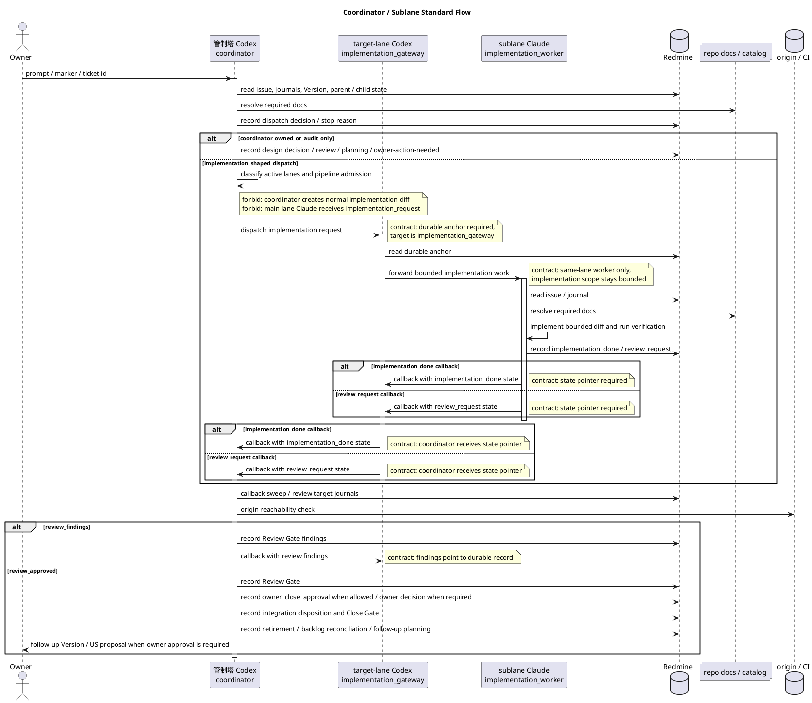

# 管制塔 / サブレーン開発フロー

Redmine #12200。`mozyo_bridge` の通常開発が cockpit-visible sublane 前提へ移行したため、管制塔とサブレーンの責務分担を 1 つの spine として定義する。

この文書は repo-local の **一次 spine** である。管制塔 / サブレーン開発フローに関する dispatch、callback、review、close、integration、retirement の順序と責務はこの文書を先に読む。旧 operating model / runbook 文書の規約本文は本書へ統合済みであり、旧ファイルは物理削除する。workspace identity / launch / worktree / callback / retire / merge / acceptance smoke を横断したライフサイクル段階関係と各段階の正本所在を一望する index は [[logic-sublane-lifecycle-map]] を読む (段階の実行正本は引き続き本書ほか canonical doc 側)。

この文書はサブレーン開発フローの実行正本である。dispatch / callback / review / close / integration / retirement に加え、サブレーン帯域、admission、pipeline fill、drain order、dogfood soft profile も本書に一本化する。`agent-workflow.md`、skill workflow reference、central preset は入口・役割・配布面の規約として読み、本書と重なる詳細規則を増やさない。

## 用語と表記ゆれ

owner / user は状況に応じて、同じ運用単位を `管制塔`、`メインレーン`、`メインセッション`、`メインユニット`、`coordinator`、`main lane` と呼ぶことがある。これは人間の記憶と会話上の揺れとして許容する。

本 flow では、これらの語が実装依頼や owner-facing 判断の文脈で出た場合、原則として **管制塔 Codex** を指すものとして解釈する。つまり、owner-facing、dispatch、仕様決定、audit、US close、integration、retirement、後続計画を担う actor である。

ただし、次は区別する。

- `main lane Claude`: 管制塔が補助的に使う Claude pane。read-only 調査、要約、draft、Design Consultation 補助はできるが、通常開発実装者ではない。
- `default lane` / `primary checkout`: checkout / workspace identity の概念。意思決定 actor ではない。
- `Owner`: product、Version close、release、production publish、credential / destructive / security-sensitive 判断の承認者。管制塔とは別である。

ユーザーが `メインでやって`、`メインレーンで判断して`、`管制塔で処理して` と言った場合、それは通常 **管制塔 Codex が判断・routing・audit を行う** という意味であり、main lane Claude に実装 diff を作らせてよいという意味ではない。

## 目的

- 管制塔が owner-facing、仕様決定、dispatch、audit、US close、retirement、後続計画を担当する。
- 通常開発の実装 diff は cockpit-visible sublane へ委譲する。
- 仕様決定と実装判断を混ぜない。
- US close と Version close の承認境界を分ける。
- close 済み sublane を退役させ、cockpit / worktree / agent context を残し続けない。
- ルールを既存 guardrail へ追記し続けるのではなく、本 flow を参照 spine として使う。

## ワークフロー管制ロードマップ

### 背景

#12668 / #12659 の実機 dogfood では、実装そのものよりも
`implementation_done`、`review_request`、`review_result`、owner close approval の
間をつなぐ手続きが詰まりやすいことが分かった。Claude が review request を
Redmine に記録しても、Codex auditor へ live 通知されない。Codex が review result を
記録しても、implementer へ callback されない。これらは単純な pane 操作の失敗ではなく、
手続き型 workflow の runtime state と next action が machine-readable に管理されていない
ことによる。

また、`Codex` / `Claude` という名前は現在の runtime provider であり、workflow 上の責務
そのものではない。今後 Grok、別 Claude model、別 Codex surface などを使う場合でも、
workflow は `auditor` / `implementer` / `root_coordinator` / `project_gateway` /
`implementation_worker` のような抽象 role を正本にし、provider は binding として扱う。

Redmine は durable external memory / audit log であり、細かい state machine を閉じ込める
場所ではない。workflow runtime state、pending delivery、route identity、duplicate
suppression は mozyo DB 側で扱い、Redmine journal は event source と durable anchor として
読む。

### 意図

この roadmap の目的は、agent が「次に何をすべきか」を毎回自然文から推測しない状態へ
移行することである。最初から完全自動化しない。まず lane / role / transition の設計語彙を
固定し、次に mozyo DB に workflow state と next action を持たせ、各 workflow-aware command
が結果として次 action を返す。event watcher と UI はその後に載せる。

重要なのは、`mozyo-bridge next-action` のような別コマンドだけでは足りない点である。
agent は「いつ next-action を叩くべきか」を忘れる。したがって workflow-aware command は、
通常の実行結果に `workflow.next_action` を含める。`suggested_command` は補助であり、正本は
structured field である。

### 設計思想

- Redmine: durable external memory / audit log / owner-visible source。
- mozyo DB: workflow runtime state、pending delivery、route identity、duplicate suppression。
- live tmux / cockpit: liveness evidence と delivery projection。pane id は cache/evidence であり authority ではない。
- repo-local docs: 現在の設計思想、背景、意図、invariant の正本。手順の置き場ではない。
- workflow role: `auditor` / `implementer` / `root_coordinator` / `project_gateway` / `implementation_worker`。
- runtime provider: `codex` / `claude` / future provider。role ではなく binding target。
- command result: workflow-aware command は `workflow.state` と `workflow.next_action` を返す。
- event watcher: Redmine journal update を event source として読み、mozyo DB の pending action に変換する。
- UI: workflow truth ではなく projection。DB / Redmine / live target の read model を表示する。

### ロードマップUS

Redmine Version は semantic version number を含む名前にしない。Version 名は日本語を基本に、
日付・優先度・作業窓を表す計画枠として付ける。番号付き release name にはしない。Version は
roadmap / milestone / acceptance bundle の候補範囲 (grouping surface) であり、active lane-set の正本ではない。
Version rename / lock / close / delete と Version 内 open leaf issue listing は #12651 で操作手段を
確定する対象であり、誤作成や retirement cleanup はそこへ残す。Redmine subject も日本語を基本にし、
固定フィールド名、CLI 名、コード識別子、固有 provider 名だけを literal token として残す。

管制塔の lane 配置は **ready work unit 数最大化問題** として扱う (標準単位は UserStory)。入力は Redmine issue / journal、review /
owner / integration / close state、branch ancestry、changed paths、merge-tree、module_health baseline、
callback state、release / credential / destructive / real-machine gates である。Version / `fixed_version`
は候補探索や roadmap 表示の補助情報として読んでよいが、dispatch / hold の authority ではない。

- Version は作業単位そのものではない。標準作業単位は UserStory (`1US=1作業単位`; owner decision #13002)、
  受け入れ単位も UserStory、実行中の local state は lane / worktree / journal で扱う。
  work-unit granularity は `epic` | `feature` | `user_story` | `leaf_issue` の設定 enum で表し、
  schema / dispatch 契約の正本は [[spec-work-unit-granularity-config]] を読む。`leaf_issue` は
  central preset の `us_level_audit.task_level例外` に該当する場合の例外単位であり、新しい例外語彙を
  作らない。`epic` / `feature` は explicit owner/operator decision (durable anchor) なしに
  implementation dispatch しない。
- active lane-set は coordinator の drain / dispatch decision journal で決まる。Version が同じことは
  stop reason ではなく、Version が違うことも独立性の証明ではない。
- dispatch する work unit は、file / module / command surface、runtime invariant、route identity、
  handoff rail、cockpit projection、workflow state、module_health baseline、merge order の overlap を
  読んで選ぶ。
- OOP-first decomposition、workflow runtime、Redmine event watcher、role/provider binding のように
  依存はあるが file surface が薄いものは、live conflict cost が低いなら別 lane 候補にする。
- Smoke / acceptance / real-machine rerun は実装 blocker と混ぜず、owner 承認付きの run window として
  最後に扱う。実装 blocker が残る間は blocker issue を実装候補として扱い、smoke issue は実行承認まで
  hold する。
- 親 UserStory が umbrella で複数 roadmap / acceptance group にまたがる場合は、親の fixed_version を
  lane-set 正本にしない。子 issue の実行可否は各 leaf の durable record と live integration state から
  読み、親には umbrella / cross-group であることと close 条件を記録する。
- Version 付け替えを行う場合は、移動先、理由、roadmap / acceptance / close readiness への影響を移動元
  または関連 issue の journal に残す。lane-set を変えるための付け替えではなく、owner-visible roadmap を
  整えるための付け替えとして扱う。
- Roadmap group を細かく切ることで scope が押し出される場合、押し出した scope を不可視にしない。
  移動先 Version、残す container issue、owner decision pending、または explicit no-op のいずれかを
  durable record に残す。Version 名だけ、chat 上の合意だけ、または coordinator journal だけで
  owner intent を仮置きしない。
- Redmine custom field (`lane_group` / `lane_set` 相当) や workflow DB が整備された場合も、
  それは candidate grouping / decision support であり、active lane-set authority ではない。authority は
  coordinator の drain / dispatch decision journal と、その根拠になる Redmine / Git / gate state である。
- #12922 / #12919 の provider 境界 (`LaneBucketProvider`) と `workflow dispatch-plan --bucket-source ...` は
  candidate grouping を正規化する読み取り経路である。`fixed-version` provider も custom-field provider も
  dispatch-plan の input であり、project の active lane-set source of truth を切り替えるものではない。
  未設定値、multi-value、allow-list 外値は fail-closed で扱い、最終 dispatch / hold はこの節の
  coordinator decision として記録する。
- #13687 Increment 1 の `workflow dispatch-plan --live-redmine` は、この読み取り経路を live Redmine へ
  接続する **read-only opt-in** である。candidate grouping を live に読むだけであり、上記の authority 境界は
  変わらない: dispatch / hold は依然として coordinator decision journal が決める。live path の性質:
  - **explicit opt-in**。snapshot `--issues-json` と mutually-exclusive-required。flag の書き忘れが
    network 到達や API key 使用へ暗黙に昇格することはない。
  - **project-scoped**。repo の project defaults が宣言する project identifier と host を読み、host が
    trusted credential host と一致する場合のみ読む (不一致は request 発行前に block)。issues read も
    `project_id` で scope するため、shared Version から他 project の issue を混入させない。
    ここで `project_id` は **numeric id** である: official Issues REST contract が identifier ではなく
    numeric を要求するため、`GET /projects/<identifier>.json` で numeric id を解決してから issues read に
    渡す (identifier をそのまま渡すと project isolation が undocumented な server 挙動に依存する)。
    Version 側の path segment は identifier のままでよい。shared Version が持つ owner project id を
    current project id として流用しない。
  - **confirmed-open のみ**。`GET /projects/<identifier>/versions.json` で Version status を live に読み、
    `open` と確認できない (closed / locked / unknown / 欠落) 場合は zero-actuation で block する。pure
    snapshot provider の unknown-status 互換 (advisory 用) は変更していない。live 側だけが厳格である。
  - **blocked read ≠ 候補ゼロ**。credential / host / project / version / transport のいずれの失敗も
    exit 2 + 明示 reason であり、空の plan を返さない。「読めなかった」を「やることが無い」に潰さない。
  - **actuation を含まない**。selection / Start record / sublane dispatch は Increment 3 の範囲であり、
    この経路は Redmine write も handoff も行わない。custom-field bucket source の live 読みは
    (live issues read が custom field を取得しないため) 明示 reject する。

1. #12670 `ワークフローのレーン所有と遷移関数レジストリを設計する`
   - PlantUML sequence、lane registry、transition function contract を固定する。
   - lane owner は pane id ではなく workflow role / route identity で表す。
   - `Codex` / `Claude` は provider であり role ではない、という語彙を最初に入れる。
   - #12675 / #12676 / #12677 で、祖父→親→子→孫の実機テスト前ワークフローを
     PlantUML sequence、transition surface、fail condition、実機前監査へ分解する。

2. #12671 `DBベースのワークフロー状態とコマンド結果の次アクションを実装する`
   - mozyo DB に workflow state / pending delivery / route identity を持つ。
   - workflow-aware command result に `workflow.next_action` を含める。
   - `workflow resume` / `workflow action run` 相当の明示実行入口を持つ。
   - 自動 watcher ではなく、まず半自動・明示実行で duplicate / risk / fail-closed を固定する。

3. #12672 `Redmine履歴から保留ワークフローアクションを作る監視機構を実装する`
   - Redmine journal / issue update を event source として poll する。
   - 自然文 parse ではなく structured gate / marker を読む。
   - pending action 作成、duplicate suppression、missing / ambiguous route の fail-closed を固定する。

4. #12673 `ワークフロー役割と実行プロバイダの対応を分離する`
   - workflow role から runtime provider への binding を config 化する。
   - DB / event schema は role を正本にし、provider は resolution result として扱う。
   - 表示では `auditor via codex` のように role と provider を分けて出す。

5. #12603 `サブレーンのGit作業木ライフサイクルと統合ドキュメントを整備する`
   - wrong-base lane、base commit、dependency branch、retire / merge policy を強化する。
   - workflow state / role binding が先に無い状態で worktree lifecycle だけを core 化しない。
   - Cockpit UI projection より前には lane / worktree lifecycle の hardening が必要である。

6. #12674 `ワークフロー状態をCockpit UIで追跡できる投影を設計する`
   - UI は source of truth ではなく projection とする。
   - owner_role、provider、lane、next_action、blocked_reason、anchor を見せる。
   - WebSocket / live update は state model と watcher が固まった後に扱う。

## 文書言語

この repo の LLM 向け規約本文は日本語で書く。英字の固定フィールド名、gate 名、CLI option、コード識別子、branch 名、path はそのまま保持してよいが、見出しと説明本文を英語だけで置かない。

LLM 向け規約文書の一般 authoring rule は `.mozyo-bridge/rules/llm_rule_authoring.md` の `## 言語` を正本とする。本 flow では、サブレーン開発フロー固有の適用として「本文は日本語、固定フィールド名は literal token」と明示する。

## ルール配置判断

guardrail は書けばよいものではない。agent が迷った事実を durable record 化するために書くが、配置を誤ると「読まれるべき rule」が増えるだけで、実行時の判断精度は下がる。

新しい超大 rule を作る前に、管制塔は `$placement_decision()` の配置順を確認する。

新規 rule / logic を増やす trigger は、actor / 責務 / 停止条件 / 検証責務が混ざる、同じ判断を複数文書へ重複しそうになる、sequence なしでは lane boundary が誤読される、表記ゆれで routing が壊れる場合に限る。「念のため」だけ、既存 spine へ短く足せるもの、入口文書 / router / skill reference への詳細複製、central 配布面を repo-local で恒久正本化することは hard stop とする。

flow 型 guardrail の一般 authoring rule、Markdown 補足境界、`$validate` / `$forbid` / `$record` primitive は `.mozyo-bridge/rules/llm_rule_authoring.md` を正本とする。ただし本 spine では lane boundary の解釈幅を減らすため、標準フローの正本図は sequence diagram とし、activity + swimlane 図は併置しない。この文書にはサブレーン開発フロー固有の判断だけを残す。

## 役割

詳細な実行責務と lane boundary は `標準フロー` の sequence を読む。authority は、Owner = product / release / Version close / production / credential / destructive approval、管制塔 Codex = owner-facing / dispatch / design decision / audit / US close / integration / retirement / follow-up planning、main lane Claude = read-only 調査 / 要約 / draft / design consultation 補助、target-lane Codex = cross-lane gateway / same-lane Claude handoff / callback、sublane Claude = bounded implementation / implementation_done / review_request である。

## 運用モデル

cockpit-visible sublane では、identity (workspace / lane / role / pane)、routing (handoff を受け取って行動できる agent)、display (pane / window / tab / iTerm / tmux view)、governance (Redmine gate が承認する実行 / close) を混同しない。window layout は display であり routing の source of truth ではない。隣に pane が見えていても、lane 境界や project 境界を越えた direct send の承認にはならない。

### レーンと actor

- **管制塔 Codex** は coordinator、auditor、owner-facing actor である。owner への質問、close approval 回収、Redmine gate 解釈、review conclusion、release / push / CI coordination、sublane 作成・退役、PoC finding の Redmine / repo-local docs 記録を担当する。
- **target-lane Codex** はその lane の gateway である。durable Redmine anchor を読み、自 lane に属する request か確認し、same-lane Claude へ route し、blocked / review-ready / owner-action-needed を管制塔へ callback する。
- **sublane Claude** は bounded implementation worker である。pane scrollback ではなく Redmine journal から実装し、implementation_done / review_request / verification / residual risk を再現可能に残す。owner close approval は回収しない。
- **main lane Claude** は補助 actor である。長い journal / diff / log の要約、candidate 抽出、read-only 調査、draft wording、非権威的な option 比較には使えるが、通常開発実装者でも owner-facing coordinator でもない。

main lane Claude が implementation request を受け取った場合は、実装前の設計矛盾・scope 不足・invariant 衝突を design consultation として整理してよい。ただし、調査や reroute 用の事実整理を終えたら停止する。実装 diff は専用 sublane / worktree に移して、target-lane Codex gateway 経由で same-lane Claude へ渡す。管制塔 Codex は `$forbid("main lane Claude へ実装型 work を直接渡す")` を遵守し、実装型 work を main lane Claude へ直接渡さない。

### レーン作成単位

一つの作業単位は `$work_unit()` の対応で扱う。対応は Redmine issue / journal に記録し、pane 配置から推測しない。

標準の dispatch 単位は UserStory である (`1US=1作業単位`; #13002)。coordinator は 1US を target-lane Codex gateway へ渡し、gateway が同一 US を same-lane Claude worker へ渡す。worker は US 配下の Task / Test / Bug を US scope 内で一気通貫に処理し、各 child の implementation_done / task_close 相当と US の review_request (US-level audit request) を durable record に残す。granularity を変える場合 (`leaf_issue` 例外 / `epic`・`feature` の explicit decision) の設定 schema と fail-closed 契約は [[spec-work-unit-granularity-config]] を正本とし、本書に複製しない。`mozyo-bridge sublane create/start` はこの granularity gate を plan / actuation の両面で fail-closed に適用する。

現行実装では、worktree の add / remove は素の git または operator recipe で行う。mozyo-bridge core はまだ Git worktree manager ではない。具体 path / branch 命名、local soft profile、private cockpit composition は operator runtime policy であり OSS default に混ぜない。

#12603 / `sublane lifecycle and worktree integration late window` roadmap group では、この境界を「設定駆動の sublane lifecycle」として再設計する。Git worktree 管理を sublane command に組み込むか、retire 時に target branch へ自動 merge するかは config knob で制御し、mozyo_bridge dogfood では UX 重視の default として core-managed worktree + retire-time merge を採用する方向で検討する。merge conflict / checkout failure / dirty state などで安全に統合できない場合、sublane は退役せず、管制塔へ feedback を返す。

```text
git worktree add <worktree-path> -b <branch>
mozyo cockpit ...
mozyo-bridge init claude   # / codex
mozyo-bridge agents targets --session <cockpit-session>
```

## 帯域 / admission / pipeline fill

sublane bandwidth は CPU capacity ではなく、管制塔の注意力である。実用上の default は pipeline-first であり、管制塔が drain すべき coordinator-owned queue を持たない間は、独立した実装 work を止めずに進める。

lane は、管制塔が durable state を読み、仕様判断を route し、audit し、owner approval を集め、local state を retire する必要がある時に bandwidth を消費する。単に `implementing` の lane よりも、待機中 lane の方が review / close / release / retirement を止めるため高コストになることがある。

効率的な並列開発は明示的な目標である。durable state 上 ready な implementation work があり、下記 admission check を満たすなら、管制塔は sublane を積極的に使う。すべての work を main lane に直列化することは cockpit model を無駄にするため、default ではなく throughput smell として扱う。既に `implementing` の lane があることは positive pipeline occupancy であり、管制塔が idle になる理由ではない。

一方で、pane や worktree を作れるというだけで work を開いてはならない。管制塔は callback を受け、必要な audit を実施し、完了 lane を durable state を失わず retire できる場合に限って dispatch する。

また、並列化が総 latency や risk を増やす場合は意図的に直列化する。例は、未決の design decision、file / invariant overlap、管制塔だけが drain できる review / owner decision、release / credential / destructive-operation gate、別 lane を見えなくする callback backlog である。

### Lane State Classes

bandwidth 判断では、すべての lane を durable record から次のいずれかに分類する。pane layout だけから状態を推測しない。

- `implementing`: local Claude が durable issue / journal に基づいて実装中。
- `callback_due`: dispatch は行われたが、期待される callback または durable gate が無い。
- `review_waiting`: implementation_done / review_request があり Codex audit が必要。
- `owner_waiting`: review / close flow が main coordinator Codex 経由の owner approval を必要とする。
- `close_waiting`: review / owner close approval / integration disposition または明示的 no-integration 判断は記録済みだが、Redmine issue status がまだ open。
- `integration_waiting`: review / owner close approval は満たされ得るが、commit-bearing implementation について target branch merge、CI / merge 用 push、target branch との patch-equivalent、または branch / commit owner 付き explicit deferral が未記録。
- `blocked`: blocker、design consultation、failed handoff、未解決 dependency が記録されている。
- `retire_ready`: work は integrated または patch-equivalent、issue scope は完了、active gate は残っていない。
- `idle`: active durable work が無く、reuse または retire できる。

`callback_due`、`review_waiting`、`owner_waiting`、`integration_waiting`、`close_waiting`、`blocked` は coordinator-blocking state である。optional new work を開く前に drain する。close-ready issue が `着手中` のまま残る状態は harmless な bookkeeping ではなく、durable state の不整合であり、sublane が active なのか retire ready なのかを隠す。同様に、closed issue に unmerged local sublane commit しか無い状態は drain 完了ではない。実装は存在するが、target branch / CI / release path を issue から再構築できない。

`implementing` は coordinator-blocking state ではない。local soft profile の lane count には数えるが、それだけでは次の dispatch を止めない。active set が `implementing` lanes と coordinator だけなら、管制塔の期待 action は独立した ready work を探して pipeline に載せることである。この状態で直列実行を選ぶなら、具体的な durable reason が必要である。

### Lane Actionability (#13756)

state class は「lane が何を待っているか」しか言えず、「**誰がその次の action を持つか**」を言えない。そのため `review_waiting` は、review を dedicated same-lane gateway へ送達済みで main coordinator の重複 review が禁止されている場合でも、一律に pipeline を止めていた (2026-07-13 実運用: #13441 US audit が dedicated gateway 稼働中、#13734 が外部 supersede 条件待ちで、独立 ready な #13682 dispatch が止まった)。

state class を偽らずに (未 review の lane を `implementing` に寄せない)、直交する **actionability 軸**を各 lane に持たせる。

- `coordinator_actionable`: main coordinator が今 drain できる。新規 optional dispatch を止める。**default かつ fail-closed sink**。
- `delegated_in_flight`: dedicated gateway / worker が次の action を所有し、main の重複 action は禁止。capacity には数えるが fill stop にしない。
- `non_actionable_wait`: durable な外部 unblock 条件待ちで、main coordinator に実行可能な action が無い。capacity / retirement 判断には残すが、独立 work の dispatch を一律停止しない。

`next_action_owner` は closed vocabulary: `main_coordinator` / `dedicated_gateway` / `dedicated_worker` / `owner` / `external_condition` / `unknown`。

非 blocking な主張は **獲得するもの**であり、宣言するものではない。次のいずれかを満たさない主張は `coordinator_actionable` へ落とす (fail-closed)。

- `delegated_in_flight` は、`next_action_owner` が `dedicated_gateway` / `dedicated_worker` であり、delivery が確認済み (`sent`) であり、durable callback expectation があり、callback が期限超過していないときのみ成立する。**ACK は completion ではない**: `delivery_failed`、callback 期限超過 (stall)、callback expectation 欠落、owner unknown はすべて coordinator-blocking へ復帰する。
- `non_actionable_wait` は、`next_action_owner=external_condition` かつ durable な unblock 条件が記録済みで、その wait 自体が stall していないときのみ成立する。条件を書けない wait は反証不能な wait であり、認めない。
- 主張できるのは **verified managed sublane だけ**である (`### Execution Surface`)。internal task agent / bare worktree / provenance を提示できない lane は delegation を主張できない。
- `owner_waiting` / `integration_waiting` / `close_waiting` / `callback_delivery_failed` は構造上 main coordinator が所有し、**delegable ではない** (owner 集約・integration disposition・close は coordinator authority であり、delivery 失敗は「何も in-flight でない」ことの証明である)。読めない state class も同様に扱い、いかなる主張でも救済しない。

owner / release / credential / destructive gate、overlap、cap、review 品質、owner close approval separation は本軸で弱まらない。

### Execution Surface (#13756 j#78320)

`sublane` は **closed product term** である。durable lane metadata / lifecycle identity と high-level runtime projection を伴うものだけが sublane であり、internal task agent は決してこれを満たさない。実運用で、管制塔が dispatch blocker に当たって internal parallel task agent を代用し、それを "lane" と叙述した事故が発生した (#12499 j#78316 / #13763 j#78318)。free-form な "lane" label は managed sublane / task agent / coordinator-local work / detached worktree / 未 dispatch の resident pair を同一視してしまう。

各 lane は machine-verifiable な `execution_surface` と provenance (workspace / lane / issue generation / lifecycle revision / durable anchor / gateway・worker identity / dispatch ACK) を持つ。

- `managed_sublane` は **上記 provenance を全て**提示できたときのみ成立する。workspace / lane / issue generation / lifecycle revision / durable anchor / gateway identity / worker identity のいずれか一つでも欠けたら検証は通らない。generation を欠くと superseded lane と recovery lane を識別できず、pair identity を欠くと high-level runtime projection を証明できないため、いずれも `unknown` へ落とす (fail-closed)。dispatch ACK は既知 token であることを要し、`none` (resident だが未 dispatch) は正当な値だが、その場合も pair identity は名指せる必要がある。
- `internal_task_agent` は別枠で数え、**sublane capacity を消費も充填もしない**。「pipeline は埋まっている」とも「並列に生産している」とも主張できない。
- unknown / free-form な surface、および検証できなかった `managed_sublane` 主張は fail-closed。lane set にこの unverified surface が一つでもあれば、fill decision は `stop_unverified_surface` で止まる。分類できない lane set の上で dispatch を続けない。legacy の no-claim (`unspecified`) はこれに該当せず、従来どおり非 blocking である。
- narrative の lane 数は、下記 projection からのみ render する。

capacity projection は次を区別して出す。canonical identity `(workspace, lane, issue generation)` で一意化し、同一 identity の重複記載は一度だけ数える。同一 identity で lifecycle revision / anchor / pair / ACK / blocking verdict が矛盾する記載は、一つの lane についての相反する読みなので、その lane を unverified へ fail-close する。

- `resident_managed_sublanes`: 検証済み managed sublane の総数 (capacity / cap の正本)。
- `gateway_dispatched_sublanes`: dispatch ACK が gateway に到達したもの。
- `worker_confirmed_productive_sublanes`: worker が confirm し、かつ coordinator-blocking でないもの。**「work が動いている」と言えるのはこの数だけ**。
- `blocked_or_undispatched_sublanes`: 残余 (blocked、未 dispatch、gateway ACK 止まりで worker 未確認)。

owner が sublane を明示要求した場合、管制塔は task agent / direct edit / main-lane work / bare worktree で代用しない。high-level actuation が使えないなら、代用せず固定の blocked 結果 (`stop_actuation_unavailable`) を返す。

### Completion Semantics

sublane の `implementation_done` / `review approved` / owner close approval は、target branch へ入る前の必要 gate であって、owner-facing な「実装完了」の十分条件ではない。commit-bearing work は、次のいずれかが durable record に残るまで `integration_waiting` として扱う:

- target branch (`main` / release branch / integration branch) へ merge され、push 済みである。
- target branch と patch-equivalent であることを commit / diff / verification と共に記録している。
- branch / commit owner、再開条件、期限、下流消費者を明記した explicit deferral がある。
- no-commit work であることが review / close record 上明確である。

管制塔は、owner から「実装終わったのか」と問われた場合、sublane branch 上の実装だけを根拠に `完了` と答えない。正しい返答は `実装・review は完了、main 統合待ち`、`main 統合済み`、`explicit deferral 済み` のように integration state を含める。closed issue に unmerged sublane commit しか無い状態は、`retire_ready` ではなく `integration_waiting` である。

本節の portable extract (2 層 push authority: 実装者 = issue/lane branch push のみ / coordinator = integration disposition による target branch 前進、ff-only 標準、main-unit 例外実装の branch 規約) は #13026 で配布側へ upstream 済み: skill `references/workflow.md` `## Integration disposition と push authority` + central preset `### Commit Hash Origin 到達可能性`。gate 語彙・禁止遷移の正本は preset 側、深い運用文脈は本節が持つ (重複させない)。

### Admission Rule

implementation-shaped work に Implementation Request を出す前に、管制塔は dispatch decision を記録する。受信者が既に開いている main-unit Claude であっても同じである。この decision を省略すると、管制塔 lane が黙って implementation lane へ変わるため process gap になる。

decision には次を記録する。

- work が implementation-shaped か coordinator-only か。
- sublane dispatch が default route か。
- sublane dispatch を使わない場合、main-lane / default-lane work の方が安全または速い具体例外。
- current active lane count と coordinator-blocking queue。
- dispatch を止める場合の次 drain action。

implementation-shaped work では sublane dispatch が default である。Main-unit Claude は read-only investigation、summary / draft、design consultation preparation、durable reason 付き urgent minimal correction、または明示的 owner / operator decision の例外に限る。「pane が既に開いている」は理由にならない。

新しい sublane を dispatch する前に、管制塔は次を記録または確認する。

- target issue、target lane、branch / worktree identity、durable dispatch anchor が既知。
- work が implementation-shaped であり、main coordinator lane / main-unit Claude が担うべきではない。
- 未読の `review_request`、`owner_waiting`、`integration_waiting`、`close_waiting`、`blocked`、`callback_delivery_failed` が coordinator action を待っていない。
- 開く lane について、次に必要な review / owner aggregation / retirement を管制塔が実施できる。
- 別 active sublane と file、invariant、release-critical surface が実質的に重ならない。重なる場合は ordering / merge plan が記録済み。
- production、release、credential、destructive-operation、owner decision gate が active な時に lower-priority optional item を開いていない。
- local soft profile を超える `retire_ready` lane がある場合、退役済みまたは保持理由が記録済み。

いずれかが満たせない場合は、追加 sublane を開かない。blocking state を記録し、先に drain する。

すべて満たし ready implementation work がある場合、dispatch が preferred action である。ready work を残して管制塔が止まる場合、または default-lane Claude に直接渡す場合は、その状態で直列実行の方が効率的または安全である理由を記録する。

### Implementation Request Preflight

implementation_request delivery を実行する直前に、管制塔は次の
preflight を同一 issue の durable record へ照合する。これは上記 `### Admission Rule`
の実行時 checklist であり、別の正本を増やすものではない。

```yaml
implementation_request_preflight:
  required_before_send:
    - work_shape を分類済み
    - target が sublane / main-unit / default-lane のどれかを明示済み
    - sublane を使わない場合は main_lane_exception を先に journal 記録済み
  default:
    implementation_shaped_work: sublane_dispatch
  valid_main_lane_exception:
    - read_only_investigation
    - summary_or_draft
    - design_consultation_preparation
    - urgent_minimal_correction_with_durable_reason
    - explicit_owner_or_operator_exception
  invalid_main_lane_exception:
    - stale_lane_avoidance_only
    - pane_already_open
    - default_claude_is_nearby
    - old_issue_lane_is_inconvenient
  stop_condition:
    - work_shape が implementation かつ target が main/default Claude で、
      有効な main_lane_exception journal が無い場合は送信しない
    - sublane candidate が無い場合は、送信ではなく sublane create/adopt または
      blocked/retry plan を記録する
```

この preflight は pane 選択を routing authority に昇格させない。target pane が一意に
見えても、implementation-shaped work の default は sublane dispatch である。例外は
「既存 lane が使いづらい」ではなく、main lane で処理する方が安全または速いことを
durable record から説明できる場合だけである。

### Pipeline Dispatch Check

待つかどうかを決める前に、次の quick classification を使う。

- `review_waiting`、`owner_waiting`、`integration_waiting`、`close_waiting`、`blocked`、`callback_due`、`callback_delivery_failed` があれば、まず coordinator-owned queue を drain する。
- 既存 active lanes が `implementing` のみで、新しい work が独立しているなら、local soft profile 内で別 sublane を dispatch する。
- 独立性が不明なら、疑われる overlap を記録し、bounded read-only investigation または明示的 serialization decision のどちらかを選ぶ。黙って待たない。
- 管制塔が otherwise idle なのに待つ場合、journal に dispatch を unblock する条件を書く。

### Post-Dispatch Fill Loop

pipeline-first は dispatch 前の一回限りの admission ではない。管制塔は、次の各時点で active lane set を再分類し、`maximize independent_ready_active_lanes` (`### Local Soft Profile`) を hard cap まで再評価して pipeline を埋めるか、止める理由を下記 stop reasons のいずれかとして durable record に残す。この再評価は「毎 dispatch / drain 後の lane-set 最大化問題」であって、1 本 dispatch した時点で終わる一回限りの判断ではない。

- sublane dispatch が 1 本成功した直後。
- callback / review / owner / integration / close / retirement を drain した直後。
- owner-facing next action を提示する前。
- 「次にやるべきタスク」を判断する前。

この loop では、まず **main coordinator が所有する** action を drain する。それが無く、独立した ready implementation work が残っており、local soft profile に余力があるなら、管制塔は次の sublane を dispatch する。1 本目の dispatch が成功したことは stop condition ではない。

停止条件から外れるのは次の2つであり、いずれも「管制塔が実行できない work」だからである (`### Lane Actionability`)。

- `implementing` lane が active であること。
- 検証済みの `delegated_in_flight` / `non_actionable_wait` lane が active であること。これらは capacity を占有し projection にも現れるが、main coordinator が実行できる action ではないため、停止理由にならない。

ready work が残っているのに追加 dispatch しない場合、次のいずれかの durable reason を record する。理由なしの待機、pane 上の雰囲気、または「いま 1 本動いているから」は invalid である。

- `stop_no_ready_work`: ready implementation work が無い。
- `stop_overlap`: file / invariant / merge order の衝突があり、直列化が安全。
- `stop_coordinator_blocking`: main coordinator が次の action を所有する lane (drain 前の review / owner / integration / close / blocked / callback_due、および delegation 主張が検証できなかった lane) を先に drain する。
- `stop_soft_profile_full`: local soft profile の target / burst / stop 条件に達している。
- `stop_owner_or_release_gate`: owner decision、release、credential、destructive-operation gate が active。
- `stop_actuation_unavailable`: high-level managed-sublane actuation rail が使えない (#13756 j#78320)。固定の blocked 結果であり、task agent / direct edit / main-lane work / bare worktree での代用は禁止する。
- `stop_unverified_surface`: lane set に検証できない execution surface (free-form、provenance 不足で検証を通らなかった `managed_sublane`、矛盾する重複 identity) が含まれる (#13756 j#78320 item 5)。分類できない lane set の上で dispatch しない。legacy `unspecified` は該当しない。

post-dispatch fill は無制限 dispatch ではない。soft profile、overlap、owner / release gate、callback backlog、retirement cadence は維持する。変えるのは default の停止条件であり、「1 lane が implementing 中」と「main が触れない delegated / external-wait lane がある」を停止条件から外す。

この decision は `mozyo-bridge workflow fill-decision` で machine-readable に再現できる。legacy `--lane ISSUE:STATE` は fail-closed 互換 (主張なし = `coordinator_actionable`) であり、非 blocking な actionability は provenance 付きの明示 `--lane-spec` でのみ選べる。

### Drain Order

複数 lane が attention を必要とする場合、durable issue により強い依存が無ければ次の順に扱う。

1. production / release / credential / destructive-operation blockers。
2. 管制塔だけが集約できる `owner_waiting`。
3. `review_waiting`。
4. commit はあるが merge / push / patch-equivalence / explicit deferral が未記録の `integration_waiting`。
5. durable close gates が満たされた `close_waiting`。
6. `blocked` または `callback_due`。callback delivery failure を含む。
7. cockpit / worktree attention を消費する `retire_ready` lane。
8. new dispatch。

この順序は coordinator bandwidth のためのものであり、Redmine gate、review quality、owner close approval separation を変更しない。

### Local Soft Profile

mozyo_bridge dogfooding では次の repo-local soft profile を使う。ここで "soft" は「portable core default ではなく、この repo-local dogfood profile として owner が改定できる」の意味であり、profile 内の cap を per-dispatch に override してよいという意味ではない。この profile は active implementation sublane 数を固定 target ではなく、**毎 dispatch / drain 後に再評価する lane-set 最適化問題** として扱う。目的は辞書式であり、(1) coordinator-blocking state を drain する、(2) dependency critical path と完了 throughput を最大化する、(3) その二つを悪化させない同値な schedule の中で `independent_ready_active_lanes` を最大化する、の順で評価する。制約は下記 cap と `### Post-Dispatch Fill Loop` の stop reasons である。

- objective: `drain_blockers -> maximize_critical_path_throughput -> maximize_independent_ready_active_lanes`。coordinator-blocking state を drain した上で、独立した ready implementation work を cap まで pipeline に載せる。載せる lane 数は「いま durable state 上で独立に ready な work の数」であって、埋めるべき quota ではない。lane を増やして review / callback backlog や dependency critical path を悪化させる schedule は、active lane 数が多くても劣後する。
- cap (hard stop): main coordinator に加えて active implementation sublane 10 本を hard cap とする (owner normalized policy `lane_count <= 10`; #13489 j#74982。旧 max7 は #13472 j#74553)。10 本に達したら `stop_soft_profile_full` で新規 dispatch を hard stop する。11 本目は per-dispatch の owner / operator override では開かない。cap を将来変更する必要が出た場合は、per-dispatch override ではなく、新しい owner decision + 本 profile doc の改定を別 gate として行う。
- no artificial fill: cap 10 は充填目標 (quota) ではなく上限である。10 本に届かせるために人工的な issue を起こす、独立していない work を無理に分割する、overlap 済み work を並列化する、のいずれも禁止する。independent ready work が無ければ cap 未満でも `stop_no_ready_work` で止める。
- counted population: cap が数えるのは `### Execution Surface` の **検証済み `managed_sublane` だけ** (`resident_managed_sublanes`) である。internal task agent は cap を消費せず、cap を埋めたことにもできない。`delegated_in_flight` / `non_actionable_wait` lane は fill stop 理由にならないが resident には数えるため、cap は弱まらない。
- gates unchanged: file / invariant / merge order の overlap (`stop_overlap`)、coordinator-blocking queue の drain 優先 (`stop_coordinator_blocking`)、owner / release / credential / destructive gate (`stop_owner_or_release_gate`) は弱化しない。これらが active な間は cap 未満でも新規 dispatch を止める。
- cleanup: lane count が cap に近く `retire_ready` lane がある場合、次の optional dispatch batch の前に退役する。

これらの数字 (cap 10 を含む) は portable な mozyo-bridge core default ではなく、この repo-local dogfood profile だけに置く。downstream project は別の private operating profile を定義してよい。portable rule は上記 admission / drain model、lane-set 最適化を毎 dispatch / drain 後に再評価する requirement、overlap decision と profile 改定を durable ticket system に記録する requirement であり、具体的な cap 値・lane 数は portable skill / core default へ複製しない。

### Bandwidth Record Template

target 超過 dispatch または bandwidth full による dispatch stop では、短い journal を記録する。

```markdown
## Sublane dispatch decision

- current_lanes:
  - <issue>: <state> / <coordinator_actionable | delegated_in_flight | non_actionable_wait> / next_action_owner=<main_coordinator | dedicated_gateway | dedicated_worker | owner | external_condition | unknown> / surface=<managed_sublane | internal_task_agent | coordinator_local | detached_worktree>
    <managed_sublane を主張する lane は machine-verifiable provenance を併記する: workspace / lane / generation / lifecycle_revision / durable_anchor / gateway / worker / dispatch_ack。後続 audit が non-blocking claim・重複 identity・cap 計算を replay できるよう、`workflow fill-decision --json` の per-lane `lanes[]` record を durable decision の source とする>
- coordinator_blocking_states: <none | list>
- active_implementing_lanes: <none | list>
- delegated_in_flight_lanes: <none | list>
- non_actionable_wait_lanes: <none | list; 各 lane の durable unblock 条件を併記>
- sublane_projection:
  - resident_managed_sublanes: <number>
  - gateway_dispatched_sublanes: <number>
  - worker_confirmed_productive_sublanes: <number>
  - blocked_or_undispatched_sublanes: <number>
  - internal_task_agents: <number; sublane capacity には算入しない>
  - unverified_surface: <number; free-form / 検証不能 / 矛盾する重複 identity。> 0 なら stop_unverified_surface>
- ready_independent_work: <none | issue list>
- capacity_remaining: <number within local soft profile>
- work_shape: <implementation | coordinator_only | read_only | design_consultation>
- admission_decision: <dispatch_sublane | stop_and_drain | burst_dispatch | main_lane_exception>
- purpose: <preserve_coordinator_context | throughput | not_applicable>
- grandchild_dispatch: <dispatched | avoided | not_applicable>
- post_dispatch_fill_check: <done | not_applicable>
- fill_decision: <dispatch_next | stop_no_ready_work | stop_overlap | stop_coordinator_blocking | stop_soft_profile_full | stop_owner_or_release_gate | stop_actuation_unavailable | stop_unverified_surface>
- reason: <why this decision is safe; if serializing, the concrete dependency or overlap>
- next_drain_action: <review | owner aggregation | blocker | retirement | none>
```

journal には issue ID と state class を書き、private path や operator-specific cockpit details は書かない。

lane 数の叙述は `sublane_projection` (検証済み projection) からのみ render する。`delegated_in_flight` / `non_actionable_wait` を記録する場合は、その主張を支える durable 根拠 (送達済み callback anchor と期限、または unblock 条件) を同じ journal から辿れるようにする。根拠を書けない主張は `coordinator_actionable` として記録する。

### 孫 dispatch / context 保護

孫 (grandchild) dispatch 判断の正本 — `purpose: preserve_coordinator_context` を軸とする判断基準、孫 dispatch を選ぶ候補条件 (long diff / long test log / iterative trial / 大量 journal 読解 / parent callback context 保持)、孫 dispatch を避けてよい context-neutral な作業、no-dispatch 記録の粒度 — は、#13029 により配布側 `skills/mozyo-bridge-agent/references/workflow.md` の `### 孫 dispatch / context 保護` (`## 委譲コーディネータ role model (delegated coordinator)` 配下) にある。本 spine は再掲しない (#13029 で pointer 化)。

本 repo 固有の結線: context を消費し得る work を孫に出さずに coordinator 自身が処理する非自明判断は、新しい独立 journal を起票せず、`### Admission Rule` の dispatch decision に `grandchild_dispatch: avoided` と短い `reason` (例: `context_cost_low` / `single_pass_no_iteration` / `urgent_minimal_correction`) を 1 行追記する。dispatch decision template の `grandchild_dispatch` / `purpose` field は本書 `## Sublane dispatch decision` を正とする。

## 実行 runbook

この節はサブレーン作成から退役までの時系列手順である。判断規約は本書の各節を正とし、旧 runbook へ再分散しない。

1. Redmine issue / journal / parent / Version / 参照 docs を読む。
2. work unit と branch / worktree / lane / pane の対応を Redmine に記録する。
3. dispatch 前に bandwidth admission を確認する。未読 review_request、owner_waiting、close_waiting、integration_waiting、blocked、callback_due / callback_delivery_failed は coordinator-blocking state として先に drain する。
4. 既存 lane が `implementing` のみで、coordinator が review / owner / close / callback / blocker を待っていない場合は、新しい independent ready work を止めない。`implementing` lane は coordinator-blocking state ではなく、pipeline dispatch の対象である。止める場合は、file / invariant overlap、merge order、release gate、owner decision など具体的な直列化理由を Redmine dispatch decision に残す。
5. sublane を 1 本 dispatch しただけで管制塔 turn を完了扱いしない。dispatch 成功後、callback / review / owner / integration / close / retirement drain 後、または next-action planning の前に、必ず pipeline fill を再実行する。local soft profile に余力があり、coordinator-blocking state がなく、independent ready work が残るなら次の sublane を dispatch する。止める場合は Redmine に `stop_no_ready_work`、`stop_overlap`、`stop_coordinator_blocking`、`stop_soft_profile_full`、`stop_owner_or_release_gate` のいずれかと根拠を書く。
6. cross-lane handoff は target-lane Codex gateway へ送る。Claude への direct delivery は same-lane addressing に限定する。
7. target-lane Codex が durable anchor を読み、same-lane Claude へ実装依頼を submit 完結で渡す。`--no-submit` / `--mode pending` は operator / debug fallback であり標準 dispatch default にしない。
8. sublane Claude が implementation_done / review_request を Redmine に記録する。commit hash を gate に書く場合は origin reachability を先に確認する。
9. sublane は handoff-worthy state で管制塔 Codex へ callback する。callback は Redmine durable anchor への pointer であり、work log ではない。
10. 管制塔 Codex が review / owner close approval / integration disposition / Close Gate を処理する。
11. close 後、管制塔 Codex が retirement drain を実行する。retire_ready / retired journal で destructive 操作の前後を bracket する。
12. callback / review / owner / integration / close / retirement を drain してから、pipeline fill を再実行し、その後に後続 Version / US 提案へ進む。

### callback 欠落時の sweep

callback は pointer なので、欠けても durable progress は消えない。管制塔は新しい sublane を開く前に active lane の Redmine journal を sweep し、`$callback_sweep()` の 4 状態 (`progress_without_callback / no_progress_after_handoff / callback_delivery_failed / callback_not_attempted`) へ分類して記録する。done な work は再 dispatch しない。この sweep は owner approval や close を self-authorize しない。

#### sweep watermark contract (#13889)

進捗の有無は **agent が事前 read から手で宣言しない**。宣言式 (`--progress` 相当) は「agent が read した時点」を cutoff にするため、read と判定の間に着地した durable gate を見落とし、false stall → 不要な recovery → duplicate replay を生む (#13883 j#79995→j#79996 は 8 秒差で誤判定)。sweep の progress は次の 4 規律で **導出** する。

- **anchored**: 進捗は **exact dispatch anchor** (当該 lane+generation の `implementation_request` marker を持つ entry 自身の journal id) より後だけを見る。coordinator-local な「最後に読んだ journal」を cutoff にしない。anchor が無い (prose-only IR) 場合は **fail-closed** で abstain し、`0` を捏造しない。
- **ordered**: 前後判定は **順序付き durable journal id の数値比較**であり wall-clock ではない。8 秒差は時刻 cutoff では解けず id 比較では厳密に解ける。
- **re-read + zero-send**: recovery mutation の直前に **再読取**し、判定時点以降に qualifying gate が着地していれば mutation を実行せず、first pass で `progress_without_callback` を記録する (事後訂正 journal に頼らない)。
- **at-most-once**: 生き残った mutation は `DispatchOutboxFence` に dispatch anchor で reserve され、同一 gate anchor への recovery delivery は高々 1 回。fence 不在 / 読取不能は zero-send。

**mutation の前提は「機構を書いたか」でなく「その機構が実際に効くか」で判定する (#13889 review j#80160)**。actuating sweep は次の 3 つを **positive に測ってから**でなければ mutate しない。いずれも「書いたのに効かない」形で一度実際に破れた箇所である。

- **source の freshness**: re-read は **source が新しい値を返せるとき**にのみ guard である。凍結 snapshot (取得済み mapping) の re-read は同一 payload を返す **no-op** であり、TOCTOU 窓は開いたままになる。よって source は `fresh_read` を **明示的に宣言** した場合のみ actuation に使える (opt-in。宣言しない source は not-fresh 扱い)。snapshot は read-only 分類専用。
- **workspace identity の measurement**: fence key は workspace で partition される。誤った / 捏造された id は **別 row を reserve する**ため、同一 recovery が二度送られる。id は **canonical resolver** (registry row → local anchor → **linked worktree が main checkout の identity を継承** → derivation) から測る。`read_anchor` 単独では **sublane linked worktree で `None`** になり、CLI 引数への fallback が実質の authority になってしまう (= 引数が fence partition を mint する)。明示指定は **equality assertion 専用**であり authority を供給できない。authority が blank なら **zero-send**。測っていない partition は fence ではない。
- **3 つの authority を分ける —— attempt は lease、record は publication fence、send は outbox fence**: 順序は `lease acquire → decision read → boundary re-read → publication reserve → record → mark_published → final live read → outbox fence reserve → send → mark_delivered → lease release`。
  - **`DispatchOutboxFence` は保持できない**。その契約は **reservation が瞬時であること**を前提とし、残存 `reserved` row を **crash residue と見なして `uncertain` へ倒す**。attempt 全体を跨いで保持すると、並行 sweep が **live owner を破壊**し、owner は release できず anchor は恒久遮断される。fence へ `release()` を生やす方向は誤り (`state=reserved` は「send していない」を **証明しない** —— row に owner identity が無いため)。
  - **保持できる authority は row が owner を名指すもの**である (`CallbackSweepLease`)。loser は **passive** で owner の state を変更せず、release は **owner-conditional**。
- **acquire は own ではない。そして再照合は guarantee ではない**: lease に TTL がある以上、**死んでいない、ただ遅いだけの owner** が期限切れ後も生存し reclaim される分岐が必然的に生じる。durable act の直前で owner token を再照合するのは正しいが、**check と PUT は atomic にならない** —— fencing token を尊重しない resource (Redmine) に対し、**check 後・PUT 前**に reclaim される窓は原理的に閉じない。**TTL margin を積む方向は誤り** (margin は窓を狭めるだけで、任意長の suspension を排除しない。「そこまで遅い process は scope 外」は実装者による acceptance の緩和であって、設計ではない)。したがって **lease は「誰が試すか」しか決めない**。durable act の at-most-once は、それぞれの **never-reclaimed fence** が持つ (R9-F1 / disposition j#80383 option (d))。
- **「使えない」は「空」ではない (R16-F1)**: `pair healthy == False` は **DB-only / sidecar-only / nonce mismatch / unreadable / schema mismatch** を含み、**DB file には live `reserved` row が残る**。したがって `not healthy` を「store が無い ⟹ 何も予約されていない」の証明に使ってはならない (これは事実ではなく、**事実と呼ばれた別の推論**である)。再 mint の唯一の根拠は **「row を保持し得る artifact が物理的に 1 つも存在しない」** こと。artifact が 1 つでもあり healthy でないなら **fail-closed** とし、復旧は operator の restore / 両 artifact 削除に委ねる (crash 復旧の availability を捨てて、読めない row について推測しないことを取る)。診断面 (CLI status) も **artifact の存在と health を分離**し、torn を fresh install と表示しない (表示と `bootstrap` の挙動が矛盾する)。
- **旧版出力は「自分の直前の commit」を含めて全数を数える (R16-F2)**: 本系列では seal 形式が 3 度変わり (prose → plain lifecycle word → format header)、**1 つ前だけを legacy 扱いして 2 つ前を落とした**。既知の正規出力を unknown 扱いすると duplicate は防げても **upgrade が永久停止**する。規律: 形式を変えるときは `git log` で **自分が過去に書いた全 on-disk 形式を列挙**し、state ごとの disposition を matrix と regression に落とす。
- **既に disk にある state は、旧版が書いたものとして扱う (R14-F1 / R15-F1 の共通根)**: 新しい guard は **将来の書き込み**しか止められず、**旧 code が既に durable に書いた row を遡及的に無効化できない**。したがって「この state は成立し得ない」という推論は、**自分の現行 code だけが動いた前提**では書けない。具体的には `initializing + healthy pair` に live `reserved` row があり得る (mutation guard 導入前の code が作った)。規律: **存在する store は seal が何であれ adopt (in-place で operational 化、nonce と全 row を保持)**、**再 mint は「使える store が無い」= reservation が物理的に成立し得ない場合のみ**。「crash した init だから空のはず」は推論であり、**disk の事実 (store の不在) だけを根拠にする**。同根の失敗は 2 度出た (seal の**形式** = R14-F1、seal の**状態** = R15-F1) ため、**形式・状態の両方について旧版の出力を列挙する**こと。
- **seal を読む側で fail-open しない / seal 自身の migration を数える (R14-F1)**: seal の parser が **旧形式・unknown・読取不能を「absent」に畳み込む**と、`bootstrap` はそれを「一度も運用されていない」authority として fresh init する。**「読めない」は「無かった」ではない**。規律: `FileNotFoundError` **のみ** absent、他の read error / decode error / unknown content / 未知 version は **fail-closed**。旧形式 seal は `legacy_operational` として **operational authority** に扱い、pair healthy なら reservation 保持のまま in-place migrate、pair 欠損なら loss として拒否。token は `startswith` でなく **exact format + version** で検証する。**seal 形式を変えるときは、自分が直前の release で書いた on-disk 形式が移行元に含まれることを具体的に数える** (抽象的に「migration が要る」と述べるだけでは、自分の 1 つ前の commit を読み落とす)。
- **authority は入口ではなく mutation で自分を守る / authority を作る手続きにも排他が要る (R14-F2)**: readiness check を composition root に置くだけでは、`reserve()` 等の mutation は **seal を見ずに publication 権を与える**。**全 mutation が authority 自身で seal=operational を要求**すること。また fence 本体を `BEGIN IMMEDIATE` + UNIQUE で排他しても、**その fence を作る手続き (bootstrap/adopt/resume) に排他が無ければ**、2 process が「fresh」と判定し、後発が operational store を再 mint する。**lifecycle lock (crash で OS が解放する flock 等) の下で seal + pair を再読して分岐を決める**。単一 write の atomicity (`tmp`→`replace`) は **mutual exclusion ではない** — 両者を混同して「atomic だから安全」と記述しないこと。`initializing` の「一度も運用されていない」という含意は、**全 reserve path が operational を要求し、かつ lifecycle が排他・monotonic である場合にのみ**成立する。
- **seal は readiness の構成要素でなければ意味がない (R13-F1)**: first-init seal を足しても、`is_bootstrapped()` がそれを見なければ **鍵を足して錠に繋いでいない**のと同じで、**healthy かつ未 seal の store** が運用可能なまま残る (= seal 導入前に作られた既存 store すべて、および seal write 中断)。そこで pair を失えば seal 不在ゆえ fresh 扱いとなり、再 mint bypass が復活する。規律は 2 つ。(1) **readiness ⊇ seal**: `is_bootstrapped()` は pair healthy ∧ seal operational とし、**`is_bootstrapped()` ⟹ `has_operated()`** を invariant として test で pin する (case ではなく seal × pair の全組合せに対する property として)。(2) **未 seal healthy pair には adoption path を与える**: 既存 reservation を保持したまま in-place で seal する (再 mint は禁止)。seal は **pair より先**に `initializing` を書き、完成後に `operational` へ遷移させることで、どの中断点でも「運用可能な未 seal store」を作らない。`initializing` は operational になったことが無い = reservation が存在し得ないため **再開可能**であり、「中断 = 永久 loss」と誤認しない。
- **reset は「削除」だけでは閉じない —— 通常経路の再 mint も塞ぐ (R12-F1)**: `recover()` を消しても、`bootstrap()` の both-absent 分岐が **同一の一括 reclaim** を提供し、しかも production `--execute` が毎回それを呼んでいた。「DB も sidecar も無い」は **fresh install と total loss で区別がつかない**ため、both-absent を無条件に初期化する実装は「store を消せば fence が消える」経路そのものになる。対策は 2 つで、(1) **first-init seal** (DB+sidecar の外側の durable artifact) を持ち、seal があって pair が欠ける状態を **loss と断定して fail-closed**、(2) **通常 execute は bootstrap しない** (check only、未初期化なら sweep を止める)。bootstrap は operator の初回限定行為とする。**限界の明示**: seal ごと全 artifact を消された場合は fresh install と区別できない (local の外に信頼できる状態を持たない限り原理的に不可能)。この限界は code と doc に書き、availability 回復は quiescence follow-up が所有する。
- **`recover()` を持たない唯一の store である (R11-F1)**: sibling (`CallbackSweepLease` / `DispatchOutboxFence`) の `recover()` が健全なのは、それらが**契約上 reclaim 可能**だから (lease は TTL で奪われる前提、outbox fence は残存 reservation を crash residue と見なす)。publication fence の契約は正反対で、**reservation を決して reclaim しない**。したがって「fresh store を作って全 reservation を忘れる」は recovery ではなく **一括 reclaim** であり、reclaim してはならない state に対して行う操作になる。`--recover` という綴りと「no sweep is mid-attempt を確認せよ」という help があるため安全に見えるが、**依頼は fence ではない** — reserve と PUT の間で停止した owner は不可視かつ停止不能で、再開しない証明は local に存在しない。よって **store loss も crashed `reserved` も permanent fail-closed** とする。availability の回復には、旧 owner の再開不能性を実際に証明できる quiescence / owner-termination protocol が必要で、それが無い限り安全な reset は提供できない (follow-up)。
- **operator surface は authority の override ではない (R10-F1)**: fence が anchor を止める以上 operator surface は必要だが、そこに手動 reclaim を置くと **fence の存在理由そのものを迂回する back door** になる。`reconcile` は current state 条件付きで、**record 数を増やし得ない遷移のみ**許す: `reserved`/`uncertain` → `published` (一方向に締まるだけ) と、`uncertain` → 解放 (owner は PUT 試行を終え結果不明を報告済み = 再開して書かない) のみ。**`reserved` の解放は拒否**する —— 「Redmine が今 0 件」は停止中 owner が後で PUT しないことの証明ではなく、local にその証明手段は無い (lease 期限切れは「遅い」であって「死んだ」ではない、が R9 の教訓)。terminal `published` の再開放・absent key の暗黙成功も拒否 (前者は重複、後者は typo の隠蔽)。crash した `reserved` は quiescence / owner-termination protocol が無い限り **恒久 stuck のまま fail-closed** とし、実装で緩和しない。
- **publication は retryable な lease act ではなく、non-retryable な outbox act である**: `CallbackPublicationFence` は record identity (`workspace / lane / issue / generation / dispatch anchor / outcome`) を UNIQUE key に reserve し、**TTL を持たず、決して reclaim しない**。残存 `reserved` row は **owner が PUT 中かもしれない** —— これを crash residue と見なして再取得することこそが重複 record を生んだ経路である。よって **anchor を止めて operator reconcile へ倒す** (availability を捨てて safety を取る、意図的な選択)。PUT が例外で終わった場合は `uncertain` を刻み、**自動再試行しない** —— それが landed したか否かは Redmine だけが知る。
- **すべての publication を serialize する**: stall record だけでなく、**zero-send resolution (最頻経路)** も lease 内で publish する。片方だけ守ると、もう片方で重複が出る。
- **store identity を pin する**: lease / fence の DB が削除・置換されたとき、**黙って再生成する store は split-brain を生む** (old owner は old inode、new process は new store で同じ anchor を同時所有)。nonce + DB 外 sidecar を持ち、**DB と sidecar が同一 nonce で共存する場合のみ**開く。missing / recreate / nonce mismatch は fail-closed。**この形は `DispatchOutboxFence` が既に持っている** —— 新 authority を作るときは隣の authority の防御を差分で読む。
- **CAS が無い store では窓は 0 にならない。最小化し、それ以上を主張しない**: record の journal id `R` は **記録時点の position** であり **将来の write と CAS しない**。final live read を **send 直前**に置いて窓を read→transport へ最小化する。この残余窓は **coordinator disposition (#13889 j#80302 option (b)+(c)) により documented residual として受容**されており、**receiver 側の真の exactly-once は #13910** が所有する。**実装者が acceptance を緩めることはできない** —— 緩和・分割は owner/coordinator の durable decision による。
- **記録義務を best-effort に落とさない**: 規約が durable event と呼ぶのは **分類そのもの**であって送信の有無ではない。zero-send の resolution であっても記録が落ちたら **incomplete として fail-closed に報告**する (`resolution_recorded=False` / 非ゼロ exit)。「first pass で解決した」と表示しながら durable event が存在しない状態を成功と見せてはならない。

**coordinator 自身の sweep record は「認識されるが progress ではない」第 3 の vocabulary (`callback_sweep_record`)** とする。progress vocabulary に入れると自分の recovery record が worker 進捗に化けて genuine stall を消し、逆に marker 無し (prose) にすると自分の record が opaque となり**以後の sweep が自らの記録のせいで永久に abstain する**。両方を避けるには「recognized ∧ not progress」が要る。

**stall は「証明」して初めて宣言できる (#13889 review j#80105 F2)**。「progress marker が見つからなかった」は「何も起きていない」ではない。dispatch anchor より後に **marker を持たない journal が 1 件でもある**場合、sweep はそれが lane の進捗か無関係な noise かを判別できず、stall は **unprovable** である。この状態で stall を宣言することが stale replay そのものであり、**re-read は救わない** (再読取も同じく marker を読めない) し、**fence も救わない** (fence が止めるのは 2 回目以降であり、実害である 1 回目は通る)。よって sweep は `stall_unprovable` として **abstain** する。stall を宣言してよいのは anchor 以降が **完全に無音**であると証明できる場合のみである。producer が canonical writer へ結線されるに従いこの opaque 集合は空へ向かい、sweep は prose を推測することなく精度を取り戻す。

**progress vocabulary は callback-required gate vocabulary と別**である。`GATE_BEARING_KINDS` (`implementation_done / review_request / review_result / owner_close_approval_waiting / blocked`) は *coordinator を起こす* state であり、`review_finding_verdict` / `progress_log` / `start` / `design_consultation` のような worker 側 durable gate は「lane は生きている」ことを示すが callback を負わない。後者を前者へ混ぜると全 verdict が coordinator wake になり、本 issue が消そうとしている重複通知そのものになる。よって progress は **別 closed vocabulary** として持ち、判定は「gate ∪ progress」の和で行う (`#13758` の dispatch marker が gate vocabulary を広げなかったのと同じ前例)。

**consumer だけでは成立しない。producer 結線が必須**である。marker を **production で誰も書かない** reader は実 issue を読んでも何も見つけない (#13520 F1a と同じ失敗)。実際 #13883 の evidence は **2 事例とも prose-only** であり (j#79995 / j#80002 のいずれも marker 不在)、consumer 側の anchor / 順序判定だけでは解消しない。よって gate は `workflow callbacks --emit-gate`、progress gate は `--emit-progress` という canonical writer で記録する。

**round scope**: progress marker は dispatch marker と同じく **lane + lane_generation で scope** する。scope が無いと round N の watermark が round N+1 の progress を吸い込み、superseded な round が「後継が働いているから生きている」ように見える。また **supersede の検出は「最新 generation」を authority とする**: 特定 generation を固定して anchor を引く resolver は、その定義上「新しい round が開いた」ことを報告できない (2 回読んでも常に同じ anchor を返す) ため、anchor 同士の比較では検出不能である。

progress の判定は **structured marker のみ**を読む。coordinator 自身の stall check / recovery journal も同じ issue 上のより新しい entry であり、かつ観測 workspace では coordinator と worker が **同一 Redmine user** で journal を書く (#13883 evidence は全て同一 author) ため、author 識別では両者を分離できない。marker 方式のみがこの自己参照を原理的に防ぐ。

### Redmine journal recovery と nagger の位置づけ

handoff-worthy state の欠落検出は、pane 状態や Claude / Codex の自己申告ではなく、
Redmine issue / journal から復元する。`implementation_done`、`review_request`、
`review_result`、`owner_close_approval_waiting`、`blocked`、`verification green`
などの durable gate が進んでいるのに、対応する callback outcome が無い状態は
`progress_without_callback` として扱い、管制塔が sweep で回収する。

Claude Nagger や類似の機械的 reminder は、品質を上げる補助 tool であって governance
authority ではない。nagger の通知、pane prompt、local cache、LLM への注意喚起を
Redmine gate の代替にしない。nagger が callback を促すことは許すが、callback が成立
したか、どの issue が次 action を待つか、close / owner approval へ進めるかは Redmine
journal から判定する。

この境界は、LLM に規約遵守を完全に期待しないためのものでもある。Claude が最後に確認
質問で止まる、pane notification を送り切らない、宛先を取り違える、といった失敗は
起こり得る前提で設計する。是正は「Claude を機械的に従わせる」方向ではなく、Redmine
journal を source of truth とした callback sweep / recovery で行う。

## 仕様決定 routing

coordinator / sublane の仕様決定 routing の正本 — 管制塔 (coordinator) で決める判断 (後戻りコストが高い / 横断的 / authority・safety に触れる)、サブレーンで決めてよい判断 (1 US 内に閉じる local implementation detail 等)、実装中に coordinator-owned 判断へ当たった場合の停止・記録・escalation — は、#13029 により配布側 `skills/mozyo-bridge-agent/references/workflow.md` の `## 仕様決定 routing` にある。本 spine は再掲しない (#13029 で pointer 化)。

本 repo での適用: escalation の記録は Redmine の design consultation / blocked / owner-action-needed journal で行い、coordinator Codex へ callback する (`### Admission Rule` / `## Sublane dispatch decision` の記録形式)。Design Consultation の発火 / 非発火判断は配布側 `## Design Consultation 発火判断` と `vibes/docs/rules/claude-design-consultation.md` (repo 採用記録) を読む。

## 標準フロー

PlantUML sequence diagram で、lane boundary と callback boundary を固定する。管制塔と sublane の境界を読むための正本図なので、activity swimlane を併置しない。図が複数あると、差分が意図か drift かを LLM が判断する余地が増える。

この図は CLI catalog ではない。transition の実コマンド名、flag、必須 option、error wording は CLI parser / help / validation error を正本とし、この図には複製しない。



## US close と Version close

US close は管制塔 Codex が担当し、条件は `$close_contract()` を正とする。Version close は owner approval を要求する。管制塔は readiness summary、残 open issue、release / publish scope、follow-up version を提示し、owner 承認後に閉じる。ここでの Version は Redmine roadmap / milestone / acceptance grouping surface であり、package release 番号の決定でも active lane-set authority でもない。package release 番号、tag、publish scope は release gate へ渡して別に決める。

US close / Version readiness / session retrospective の前に、管制塔は `$backlog_reconciliation()` を実行する。gate の正本 — deferred 提案 (`後で` / `別 Version` / `follow-up` / `later-stage` / `deferred`) の immediate durable classification (`new issue` / `existing issue` / `explicit no-op` / `owner decision pending` の 4 分類)、close / readiness 前の棚卸し対象語彙、owner intent 保存を backlog の綺麗さより優先する原則、Version roadmap 提案の durable classification 要件 — は、#13029 により配布側 `skills/mozyo-bridge-agent/references/workflow.md` の `## Backlog reconciliation gate (deferred intent の即時 durable 分類)` にある。本 spine は再掲しない (#13029 で pointer 化)。

本 repo 固有の追加: 棚卸し論点には、private consumer 側に置くか `mozyo-bridge` の reusable primitive に切り出すかで迷った論点 (`vibes/docs/rules/public-private-boundary.md`) と、標準プラグイン / 配布形態の未決論点を含める。分類の記録先は Redmine journal / issue description であり、explicit no-op で不要になった issue は `不要` status で閉じられる。

Version close 前に open issue が残っている場合、管制塔は「未完のまま黙って無視」しない。各 issue について次のいずれかを durable record に残す。

- current Version の completion blocker として扱い、実装 / review / close / retirement を drain する。
- current Version scope から外す。移動先 Version、理由、残る受け入れ条件、current Version に残さない根拠を issue journal に記録し、Version を実際に付け替える。
- explicit defer とする。defer 先が未定なら follow-up planning decision として記録し、current Version の readiness summary に residual scope として載せる。

Version status の更新 API / MCP / UI が使えない場合でも、管制塔は Version readiness を止めたままにしない。open issue が 0、commit-bearing work が main / release branch に統合済み、sublane retirement が drain 済み、owner が Version close を承認済みであれば、Version issue / parent Feature / relevant durable anchor に `Version Close Approval / Readiness Summary` を記録して先へ進む。これは Redmine Version object の status 更新を代替する operational record であり、後で API / UI が復旧したら status を同期する。

### Publication checkpoint の採用 (integration / publication 2 層)

本 flow は publication checkpoint doctrine を採用する。integration (統合) と publication (公開) の 2 層分離、Redmine Version close = `origin/main` 昇格 checkpoint、release gate 分離、無応答分岐の `push_waiting` 記録、Redmine Version close 前の readiness checklist、MCP tool 整備前の手動 close 手順の詳細規範は、#13170 により配布側 skill `references/workflow.md` の `## Publication checkpoint (integration 層と publication 層の分離)` にある。本 spine は再掲しない (pointer 化)。正本決定の出所は owner_intent (Redmine #13126 j#71777 確定事項 5) / Codex triage (#13126 j#71786 item 4) である。

本 repo 固有の結線 (配布正本と矛盾させない採用差分):

- staging branch は `main-next` を採用する。#13126 j#71900 / j#71905 で `origin/main-next` を実際の integration target として運用済みであり、UserStory close 後の自律 push 先はこの staging branch である。`origin/main` への push authority は `## Completion Semantics` の 2 層 push authority (#13026) と整合し、publication checkpoint を通ってから前進する。
- Redmine Version close 操作を実行する MCP tool は epic_ladder #13136 で整備予定であり、現時点では未配線である。整備前は owner が Redmine UI で対象 Redmine Version を close する。Redmine Version 操作面 (rename / close / lock / delete) の safety 境界と capability gap の正本は #12651 ([[logic-redmine-version-operation-surface]]) が持つ。
- 無応答分岐の `push_waiting` 相当の待機は、`### Lane State Classes` の lane state enum には追加せず、publication 層の durable annotation として Redmine journal に記録する (どの staging branch head が publication 待ちか、どの Redmine Version の close を待つか)。
- Redmine Version は release scope 化しない (#13024 現行 guideline)。裸の「バージョン」を使わず Redmine Version / release tag / package version を修飾する用語規律 (#13162) は本 flow でも維持する。

## サブレーン退役

管制塔は、US close 後に sublane retirement を必ず検討する。retirement は後続提案より前に行う。

routine retirement の条件:

- issue が close 済み、または scope が explicit defer 済み。
- commit-bearing work が target branch に統合済み、または patch-equivalent / explicit deferral が durable record にある。
- worktree が clean、または残 diff が disposable local runtime state と判定済み。
- active review / owner_waiting / blocked / callback_due が無い。
- lane identity が明確で、削除対象 worktree を取り違えない。

条件を満たす場合、管制塔は owner 確認なしに退役してよい。条件を外れる場合は Redmine に理由を残し、retirement を止める。

### 退役 fixed fields

retirement は destructive 寄りの操作なので、pane kill / worktree remove の前後を Redmine journal で挟む。閉じた lane は default retire candidate だが、dependency ancestor lane は downstream merge / rebase が消費されるまで保持できる。状態・fixed fields・safety preflight・blocker は `$retirement_contract` を正とする:

```
retirement_state = retire_candidate / retire_ready / retain_until_downstream_consumed / retire_blocked / retired
fields = retirement_state, lane, worktree, pane, redmine_issue_state, retain_reason, downstream_consumed, retire_blockers, safety_preflight, durable_anchor
safety_preflight = redmine_closed, worktree_clean, origin_reachable, pending_prompt_absent, callback_drained, target_identity_known
retire_blockers = active_lane, review_pending, owner_approval_pending, unresolved_callback, dirty_worktree, pending_prompt, unpushed_commit, unknown_target_identity
```

`retired` journal には removed / killed した worktree、pane、branch、`durable_anchor` (`retire_ready` journal) を残す。retirement は close を自己承認しない。

## 後続 Version / US 提案の順序

後続計画は `$followup_contract()` の順序で扱う。実装前に必要な coordinator-owned 仕様決定は Redmine / cataloged doc に残し、新規セッション prompt 例は開始すべき issue ID と durable anchor 付きで提示する。

提案順は、まず callback / review / owner / integration / close / retirement を drain し、次に `$backlog_reconciliation()` で immediate durable classification の漏れを確認し、その後に Version / US を提案する。Version roadmap を提案する場合は、各 Version を `container issue exists` または `owner decision pending` に分類してから owner approval へ進む。owner approval 後に作る Version / US も、作成結果の issue id / Version id を元の planning issue に relation または journal で戻す。

2026-06-20 時点の module health / PyLint responsibility hardening roadmap では、次の Version anchor と container issue が作成済みである。これらは「後で」「別 Version」の会話を durable classification へ落とした歴史的な例として扱う。番号付き Version 名は当時の anchor であり、新規 roadmap group の命名例ではない。

- Version #238 `v0.10.7 module health visibility / PyLint gate foundation` -> #12321
- Version #239 `v0.10.8 presentation responsibility split` -> #12322
- Version #240 `v0.10.9 cockpit UI responsibility split` -> #12323
- Version #241 `v0.10.10 module health ratchet / regression policy` -> #12324

## 失敗として扱う例

`標準フロー` の `$forbid` / `$validate` に反する状態は失敗として扱う。特に、main lane Claude への実装直送、hidden subagent の sublane 扱い、owner close approval と Review Gate の混同、integration disposition なし close、retirement 未検討の lane 放置、Version close の owner approval bypass、後続提案の未分類放置は invalid である。

## 参照正本

- `vibes/docs/rules/agent-workflow.md`
- `vibes/docs/specs/work-unit-granularity-config.md` (configurable work-unit granularity の schema / dispatch 契約の正本)
- `vibes/docs/specs/delegated-coordinator-role-profile.md` (親→子委譲の採用記録 / packaged runtime 設定同期 anchor。role 語彙と責務境界の配布正本は #13029 により `skills/mozyo-bridge-agent/references/workflow.md` `## 委譲コーディネータ role model (delegated coordinator)`)
- `vibes/docs/logics/sublane-bandwidth-policy.md` (互換 pointer。帯域正本は本書)
- `vibes/docs/logics/worktree-lifecycle-boundary.md`
- `skills/mozyo-bridge-agent/references/workflow.md`
- `.mozyo-bridge/rules/presets/redmine-governed/agent-workflow.md`
- `.mozyo-bridge/rules/llm_rule_authoring.md`
- `.mozyo-bridge/rules/docs_catalog_governance.yaml`

## 検証

- `mozyo-bridge docs validate --repo .`
- `mozyo-bridge docs validate --check-file-coverage --repo .`
- `mozyo-bridge docs generate-file-conventions --check --repo .`
- `mozyo-bridge docs audit-impact --all-changed --check-generated --repo .`
- `mozyo-bridge docs resolve vibes/docs/logics/coordinator-sublane-development-flow.md --repo . --format text`
