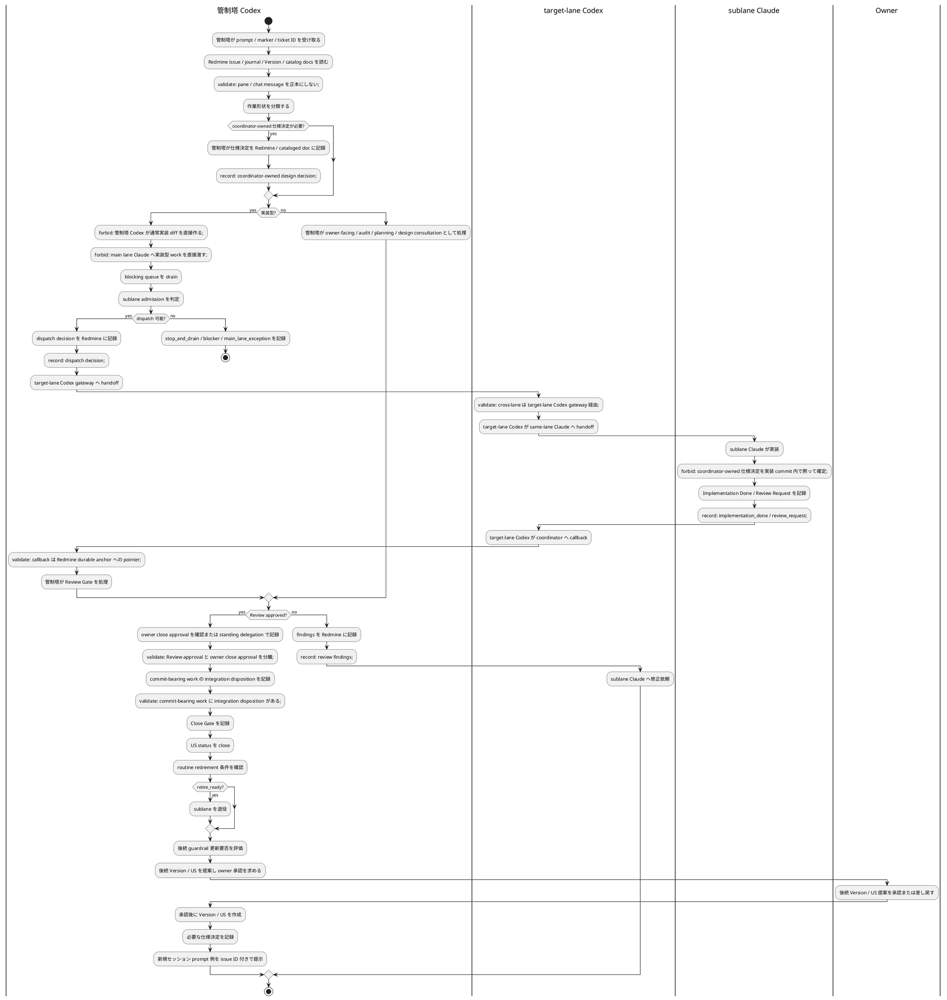

# 管制塔 / サブレーン開発フロー

Redmine #12200。`mozyo_bridge` の通常開発が cockpit-visible sublane 前提へ移行したため、管制塔とサブレーンの責務分担を 1 つの spine として定義する。

この文書は詳細規則の複製ではない。既存の `agent-workflow.md`、`sublane-bandwidth-policy.md`、`sublane-worktree-operating-runbook.md`、skill workflow reference、central preset を、どの順序で読むかを決める地図である。

## 用語と表記ゆれ

owner / user は状況に応じて、同じ運用単位を `管制塔`、`メインレーン`、`メインセッション`、`メインユニット`、`coordinator`、`main lane` と呼ぶことがある。これは人間の記憶と会話上の揺れとして許容する。

本 flow では、これらの語が実装依頼や owner-facing 判断の文脈で出た場合、原則として **管制塔 Codex** を指すものとして解釈する。つまり、owner-facing、dispatch、仕様決定、audit、US close、integration、retirement、後続計画を担う actor である。

ただし、次は区別する。

- `main lane Claude`: 管制塔が補助的に使う Claude pane。read-only 調査、要約、draft、Design Consultation 補助はできるが、通常開発実装者ではない。
- `default lane` / `primary checkout`: checkout / workspace identity の概念。意思決定 actor ではない。
- `Owner`: product、Version close、release、production publish、credential / destructive / security-sensitive 判断の承認者。管制塔とは別である。

ユーザーが `メインでやって`、`メインレーンで判断して`、`管制塔で処理して` と言った場合、それは通常 **管制塔 Codex が判断・routing・audit を行う** という意味であり、main lane Claude に実装 diff を作らせてよいという意味ではない。

## 目的

- 管制塔が owner-facing、仕様決定、dispatch、audit、US close、retirement、後続計画を担当する。
- 通常開発の実装 diff は cockpit-visible sublane へ委譲する。
- 仕様決定と実装判断を混ぜない。
- US close と Version close の承認境界を分ける。
- close 済み sublane を退役させ、cockpit / worktree / agent context を残し続けない。
- ルールを既存 guardrail へ追記し続けるのではなく、本 flow を参照 spine として使う。

## ルール配置判断

guardrail は書けばよいものではない。agent が迷った事実を durable record 化するために書くが、配置を誤ると「読まれるべき rule」が増えるだけで、実行時の判断精度は下がる。

新しい超大 rule を作る前に、管制塔は次を確認する。

```yaml
placement_order:
  1_existing_spine:
    条件: 既存 flow / runbook / policy の責務内で説明できる
    action: 既存文書へ短い section または参照を追加する
  2_authoring_rule:
    条件: LLM 向け規約文書の書き方、正本分離、形式選択、gate 構造化そのもの
    action: `.mozyo-bridge/rules/llm_rule_authoring.md` の upstream / central preset 更新候補として扱う
  3_catalog_governance:
    条件: catalog、resolver、generated file、coverage、audit-impact の統治
    action: `.mozyo-bridge/rules/docs_catalog_governance.yaml` の upstream / central preset 更新候補として扱う
  4_new_repo_local_logic:
    条件: 既存 spine に入れると責務が混ざり、かつ project-local に閉じる判断軸がある
    action: `vibes/docs/logics/**` に小さい spine を作り catalog 登録する
  5_new_central_rule:
    条件: 複数 project に配布すべき実行契約で、既存 authoring / catalog / workflow へ自然に入らない
    action: central preset 昇格 issue を作る。repo-local で巨大 rule を先に固定しない
```

新規 rule / logic を増やす soft trigger:

- 既存文書へ入れると、読者 actor、責務、停止条件、検証責務が混ざる。
- 1 つの判断を 2 つ以上の既存文書へ重複記載しそうになる。
- PlantUML activity + swimlane で actor 境界を描かないと、管制塔 / sublane / Owner の責務が誤読される。
- 表記ゆれ、alias、非同義語を明示しないと、次セッションで routing が壊れる。

新規 rule / logic を増やさない hard stop:

- 「念のため」「あとで迷いそう」だけで、観測可能な trigger と durable-record 出力が無い。
- 既存 spine へ 5-10 行で足せる。
- 入口文書、router、skill reference へ詳細本文を複製しようとしている。
- central preset 配布面 (`.mozyo-bridge/rules/**`、skill、scaffold preset) の話なのに、repo-local doc で恒久正本化しようとしている。

flow 型 guardrail を作る場合は、原則として次を含める。

- `目的`: 何を減らすための flow か。
- `役割`: actor ごとの責務。管制塔 / sublane / Owner を混ぜない。
- `routing 条件`: 管制塔で決める条件、sublane へ渡す条件、停止条件。
- `PlantUML activity + swimlane`: 誰が何をするかを図で固定する。workflow 文書では原則これを使う。
- `PlantUML macro / function`: `$validate`、`$forbid`、`$record` のような少数の契約関数で validation / 禁止事項 / durable record を圧縮する。
- `用語と表記ゆれ`: 正規語、alias、非同義語を分ける。
- `参照正本`: 既存 rule / runbook / catalog への参照。本文を複製しない。
- `検証`: catalog validate、generated check、audit-impact、resolve、diff check。

PlantUML activity + swimlane を原則とする理由:

- actor ごとの lane を見れば責務が分かる。
- branching、stop、handoff、owner approval、callback の順序を具体化できる。
- text の箇条書きより少ない行数で、agent が実行順に読みやすい。
- `$validate` / `$forbid` / `$record` の契約関数により、validation や禁足事項を図の近くに置ける。

ただし、macro / function は少数の primitive に留める。関数を増やしすぎると図だけで読めなくなり、guardrail の目的である実行時判断の明瞭さが落ちる。

## 役割

詳細な実行責務は `標準フロー` の swimlane を読む。ここでは actor の authority だけを定義する。

```yaml
Owner:
  authority: product / release / Version close / production publish / credential / destructive / security-sensitive approval
管制塔 Codex:
  authority: owner-facing, dispatch, coordinator-owned design decision, audit, US close, integration disposition, sublane retirement, follow-up planning
main lane Claude:
  authority: read-only 調査 / 要約 / draft / design consultation 補助。通常開発実装者ではない
target-lane Codex:
  authority: cross-lane gateway / same-lane Claude handoff / coordinator callback
sublane Claude:
  authority: bounded implementation / implementation_done / review_request。owner close approval は収集しない
```

## 仕様決定 routing

管制塔が持つ仕様決定は、後戻りコストが高いもの、横断的なもの、または authority / safety に触れるものである。

### 管制塔で決める

- 複数 UserStory、複数 Version、複数 provider / module / surface に影響する判断。
- file path、config file name、schema version、source-of-truth、config precedence。
- workflow authority、owner approval、review authority、close approval、routing authority、handoff / send safety、credential / secret / auth / permission / billing / destructive-operation、release / publish approval に関わる判断。
- user-facing behavior、operator UX、diagnostics、validation command の標準。
- migration、backward compatibility、public/private boundary、future plugin API への制約。
- 「どちらでも実装できる」が、選択により今後の roadmap が変わる判断。
- sublane 間で file / invariant / merge order が衝突する判断。

### sublane で決めてよい

- 1 UserStory 内に閉じる local implementation detail。
- helper 関数、class split、test file 分割、internal naming。
- coordinator 決定済み方針から機械的に導ける edge case。
- migration や利用者影響が無い小さい error message detail。

### escalation

実装中に coordinator-owned 仕様決定が必要になった場合、sublane は実装を止め、Redmine に design consultation / blocked / owner-action-needed を記録し、coordinator Codex へ callback する。

## 標準フロー

PlantUML の activity diagram + swimlane 記法で、誰が責務を持つかを明示する。管制塔と sublane の境界を読むための図なので、細かい retry path はここに複製しない。

validation / 禁止事項 / durable record は、図の流れから離れた長い箇条書きにせず、必要に応じて `$validate` / `$forbid` / `$record` で近接させる。



## US close と Version close

- US close は管制塔 Codex が担当する。Review Gate approved、owner close approval journal、integration disposition、Close Gate が揃った場合、standing delegation 条件下で status close できる。
- Review Gate approval は close approval ではない。owner close approval journal は別に記録する。
- commit-bearing work は、target branch merge / push / patch-equivalence / explicit deferral のいずれかを Close Gate の basis に含める。
- Version close は owner approval を要求する。管制塔は readiness summary、残 open issue、release / publish scope、follow-up version を提示し、owner 承認後に閉じる。

## sublane retirement

管制塔は、US close 後に sublane retirement を必ず検討する。retirement は後続提案より前に行う。

routine retirement の条件:

- issue が close 済み、または scope が explicit defer 済み。
- commit-bearing work が target branch に統合済み、または patch-equivalent / explicit deferral が durable record にある。
- worktree が clean、または残 diff が disposable local runtime state と判定済み。
- active review / owner_waiting / blocked / callback_due が無い。
- lane identity が明確で、削除対象 worktree を取り違えない。

条件を満たす場合、管制塔は owner 確認なしに退役してよい。条件を外れる場合は Redmine に理由を残し、retirement を止める。

## 後続 Version / US 提案の順序

1. active sublane の callback / review / owner / integration / close / retirement を drain する。
2. 管制塔自身の guardrail 更新要否を評価する。必要なら repo-local autonomous lane として更新し、Redmine に記録する。
3. 後続 Version の目的、scope、非目標、due date を提案する。
4. owner 承認後に Version を作成する。
5. Version ごとの UserStory を作成し、親 Feature と relation を設定する。
6. 実装前に必要な coordinator-owned 仕様決定を Redmine / cataloged doc に残す。
7. 新規セッション prompt 例を、開始すべき issue ID と durable anchor とともに提示する。

## 失敗として扱う例

`標準フロー` の `$forbid` / `$validate` に反する状態は失敗として扱う。特に、main lane Claude への実装直送、hidden subagent の sublane 扱い、owner close approval と Review Gate の混同、integration disposition なし close、retirement 未検討の lane 放置、Version close の owner approval bypass は invalid である。

## 参照正本

- `vibes/docs/rules/agent-workflow.md`
- `vibes/docs/logics/sublane-bandwidth-policy.md`
- `vibes/docs/logics/sublane-worktree-operating-runbook.md`
- `vibes/docs/logics/worktree-lifecycle-boundary.md`
- `vibes/docs/logics/cockpit-sublane-operating-model.md`
- `skills/mozyo-bridge-agent/references/workflow.md`
- `.mozyo-bridge/rules/presets/redmine-governed/agent-workflow.md`
- `.mozyo-bridge/rules/llm_rule_authoring.md`
- `.mozyo-bridge/rules/docs_catalog_governance.yaml`

## 検証

- `mozyo-bridge docs validate --repo .`
- `mozyo-bridge docs validate --check-file-coverage --repo .`
- `mozyo-bridge docs generate-file-conventions --check --repo .`
- `mozyo-bridge docs audit-impact --all-changed --check-generated --repo .`
- `mozyo-bridge docs resolve vibes/docs/logics/coordinator-sublane-development-flow.md --repo . --format text`
