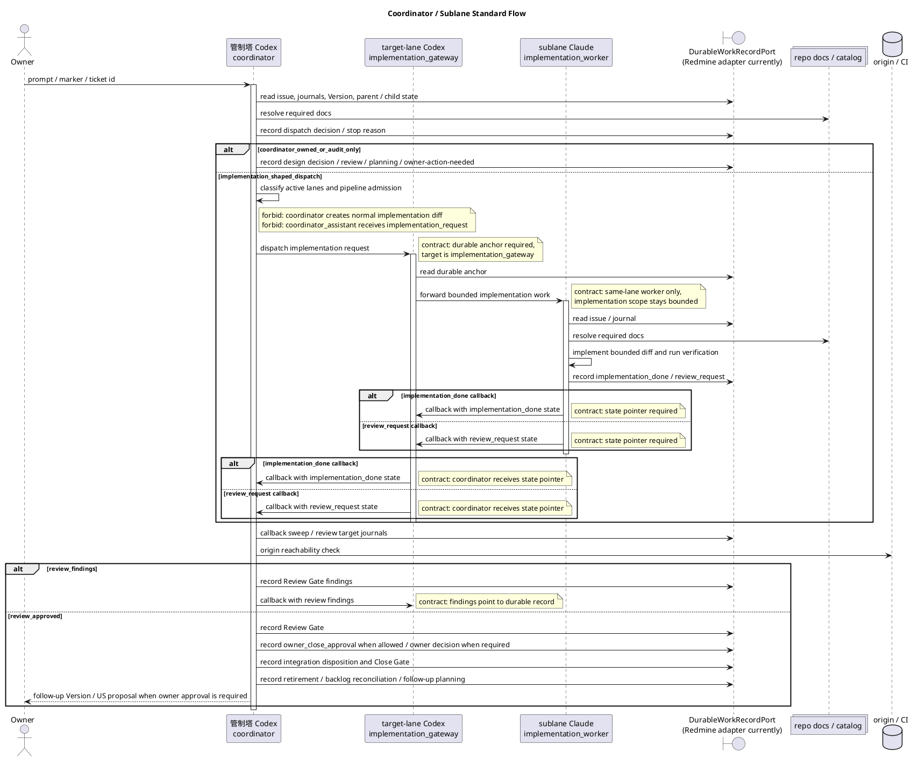

# 管制塔 / サブレーン開発フロー

Redmine #12200。`mozyo_bridge` の通常開発が cockpit-visible sublane 前提へ移行したため、管制塔とサブレーンの責務分担を 1 つの spine として定義する。

この文書は repo-local の **一次 spine** である。管制塔 / サブレーン開発フローに関する dispatch、callback、review、close、integration、retirement の順序と責務はこの文書を先に読む。旧 operating model / runbook 文書の規約本文は本書へ統合済みであり、旧ファイルは物理削除する。workspace identity / launch / worktree / callback / retire / merge / acceptance smoke を横断したライフサイクル段階関係と各段階の正本所在を一望する index は [[logic-sublane-lifecycle-map]] を読む (段階の実行正本は引き続き本書ほか canonical doc 側)。

この文書はサブレーン開発フローの実行正本である。dispatch / callback / review / close / integration / retirement に加え、サブレーン帯域、admission、pipeline fill、drain order、dogfood soft profile も本書に一本化する。`agent-workflow.md`、skill workflow reference、central preset は入口・役割・配布面の規約として読み、本書と重なる詳細規則を増やさない。

製品レベルのオーケストレーターにおける、プロバイダー非依存の権限・イベント・回復契約は
`vibes/docs/logics/ticket-system-neutral-orchestrator.md` を正本とする。本書はその契約を
Redmineアダプターで運用する `mozyo_bridge` リポジトリ固有の実行spineであり、Redmineを
製品必須プロバイダーとして定義しない。

## 用語と表記ゆれ

owner / user は状況に応じて、同じ運用単位を `管制塔`、`メインレーン`、`メインセッション`、`メインユニット`、`coordinator`、`main lane` と呼ぶことがある。これは人間の記憶と会話上の揺れとして許容する。

本 flow では、これらの語が実装依頼や owner-facing 判断の文脈で出た場合、原則として **coordinator role** (現在の binding では管制塔 Codex) を指すものとして解釈する。つまり、owner-facing、dispatch、仕様決定、audit、US close、integration、retirement、後続計画を担う actor である。

ただし、次は区別する。

- `coordinator_assistant`: 管制塔に隣接する provider-neutral な非権威的補助 actor。read-only 調査、要約、draft、Design Consultation 補助はできるが、通常開発実装者ではない。`main lane Claude` / `default-lane Claude` は現在または過去の `coordinator_assistant via claude` を示す互換表記であり、正式な actor 名ではない。authority 正本は skill `references/workflow.md` の **`coordinator_assistant` の安全使用境界**。
- `default lane` / `primary checkout`: checkout / workspace identity の概念。意思決定 actor ではない。
- `Owner`: product、Version close、release、production publish、credential / destructive / security-sensitive 判断の承認者。管制塔とは別である。

ユーザーが `メインでやって`、`メインレーンで判断して`、`管制塔で処理して` と言った場合、それは通常 **coordinator が判断・routing・audit を行う** という意味であり、`coordinator_assistant` に実装 diff を作らせてよいという意味ではない。

## 目的

- 管制塔が owner-facing、仕様決定、dispatch、audit、US close、retirement、後続計画を担当する。
- 通常開発の実装 diff は cockpit-visible sublane へ委譲する。
- 仕様決定と実装判断を混ぜない。
- US close と Version close の承認境界を分ける。
- close 済み sublane を退役させ、cockpit / worktree / agent context を残し続けない。
- ルールを既存 guardrail へ追記し続けるのではなく、本 flow を参照 spine として使う。

## ワークフロー管制ロードマップ

### 背景

#12668 / #12659 の実機 dogfood では、実装そのものよりも
`implementation_done`、`review_request`、`review_result`、owner close approval の
間をつなぐ手続きが詰まりやすいことが分かった。Claude が review request を
Redmine に記録しても、Codex auditor へ live 通知されない。Codex が review result を
記録しても、implementer へ callback されない。これらは単純な pane 操作の失敗ではなく、
手続き型 workflow の runtime state と next action が machine-readable に管理されていない
ことによる。

また、`Codex` / `Claude` という名前は現在の runtime provider であり、workflow 上の責務
そのものではない。今後 Grok、別 Claude model、別 Codex surface などを使う場合でも、
workflow は `auditor` / `implementer` / `root_coordinator` / `project_gateway` /
`implementation_worker` のような抽象 role を正本にし、provider は binding として扱う。

製品中核は `DurableWorkRecordPort` を durable external memory / audit log として読み、細かい
state machine をticket providerへ閉じ込めない。このrepositoryの現在のport bindingはRedmineで
あり、workflow runtime state、pending delivery、route identity、duplicate suppressionはmozyo DB
側で扱い、Redmine journalはadapterがevent sourceとdurable anchorへ正規化する。

### 意図

この roadmap の目的は、agent が「次に何をすべきか」を毎回自然文から推測しない状態へ
移行することである。最初から完全自動化しない。まず lane / role / transition の設計語彙を
固定し、次に mozyo DB に workflow state と next action を持たせ、各 workflow-aware command
が結果として次 action を返す。event watcher と UI はその後に載せる。

重要なのは、`mozyo-bridge next-action` のような別コマンドだけでは足りない点である。
agent は「いつ next-action を叩くべきか」を忘れる。したがって workflow-aware command は、
通常の実行結果に `workflow.next_action` を含める。`suggested_command` は補助であり、正本は
structured field である。

### 設計思想

- `DurableWorkRecordPort`: durable external memory / audit log / owner-visible source。Redmineは現在の推奨・既定adapterであり、製品必須providerではない。
- mozyo DB: workflow runtime state、pending delivery、route identity、duplicate suppression。
- live tmux / cockpit: liveness evidence と delivery projection。pane id は cache/evidence であり authority ではない。
- repo-local docs: 現在の設計思想、背景、意図、invariant の正本。手順の置き場ではない。
- workflow role: `auditor` / `implementer` / `root_coordinator` / `project_gateway` / `implementation_worker`。
- runtime provider: `codex` / `claude` / future provider。role ではなく binding target。
- command result: workflow-aware command は `workflow.state` と `workflow.next_action` を返す。
- event watcher: portが正規化したdurable eventを読み、mozyo DBのpending actionに変換する。現行adapterはRedmine journal updateを読む。
- UI: workflow truth ではなく projection。DB / Redmine / live target の read model を表示する。

### ロードマップUS

Redmine Version は semantic version number を含む名前にしない。Version 名は日本語を基本に、
日付・優先度・作業窓を表す計画枠として付ける。番号付き release name にはしない。Version は
roadmap / milestone / acceptance bundle の候補範囲 (grouping surface) であり、active lane-set の正本ではない。
Version rename / lock / close / delete と Version 内 open leaf issue listing は #12651 で操作手段を
確定する対象であり、誤作成や retirement cleanup はそこへ残す。Redmine subject も日本語を基本にし、
固定フィールド名、CLI 名、コード識別子、固有 provider 名だけを literal token として残す。

管制塔の lane 配置は **ready work unit 数最大化問題** として扱う (標準単位は UserStory)。入力は Redmine issue / journal、review /
owner / integration / close state、branch ancestry、changed paths、merge-tree、module_health baseline、
callback state、release / credential / destructive / real-machine gates である。Version / `fixed_version`
は候補探索や roadmap 表示の補助情報として読んでよいが、dispatch / hold の authority ではない。

- Version は作業単位そのものではない。標準作業単位は UserStory (`1US=1作業単位`; owner decision #13002)、
  受け入れ単位も UserStory、実行中の local state は lane / worktree / journal で扱う。
  work-unit granularity は `epic` | `feature` | `user_story` | `leaf_issue` の設定 enum で表し、
  schema / dispatch 契約の正本は [[spec-work-unit-granularity-config]] を読む。`leaf_issue` は
  central preset の `us_level_audit.task_level例外` に該当する場合の例外単位であり、新しい例外語彙を
  作らない。`epic` / `feature` は explicit owner/operator decision (durable anchor) なしに
  implementation dispatch しない。
- active lane-set は coordinator の drain / dispatch decision journal で決まる。Version が同じことは
  stop reason ではなく、Version が違うことも独立性の証明ではない。
- dispatch する work unit は、file / module / command surface、runtime invariant、route identity、
  handoff rail、cockpit projection、workflow state、module_health baseline、merge order の overlap を
  読んで選ぶ。
- OOP-first decomposition、workflow runtime、Redmine event watcher、role/provider binding のように
  依存はあるが file surface が薄いものは、live conflict cost が低いなら別 lane 候補にする。
- Smoke / acceptance / real-machine rerun は実装 blocker と混ぜず、owner 承認付きの run window として
  最後に扱う。実装 blocker が残る間は blocker issue を実装候補として扱い、smoke issue は実行承認まで
  hold する。
- 親 UserStory が umbrella で複数 roadmap / acceptance group にまたがる場合は、親の fixed_version を
  lane-set 正本にしない。子 issue の実行可否は各 leaf の durable record と live integration state から
  読み、親には umbrella / cross-group であることと close 条件を記録する。
- Version 付け替えを行う場合は、移動先、理由、roadmap / acceptance / close readiness への影響を移動元
  または関連 issue の journal に残す。lane-set を変えるための付け替えではなく、owner-visible roadmap を
  整えるための付け替えとして扱う。
- Roadmap group を細かく切ることで scope が押し出される場合、押し出した scope を不可視にしない。
  移動先 Version、残す container issue、owner decision pending、または explicit no-op のいずれかを
  durable record に残す。Version 名だけ、chat 上の合意だけ、または coordinator journal だけで
  owner intent を仮置きしない。
- Redmine custom field (`lane_group` / `lane_set` 相当) や workflow DB が整備された場合も、
  それは candidate grouping / decision support であり、active lane-set authority ではない。authority は
  coordinator の drain / dispatch decision journal と、その根拠になる Redmine / Git / gate state である。
- #12922 / #12919 の provider 境界 (`LaneBucketProvider`) と `workflow dispatch-plan --bucket-source ...` は
  candidate grouping を正規化する読み取り経路である。`fixed-version` provider も custom-field provider も
  dispatch-plan の input であり、project の active lane-set source of truth を切り替えるものではない。
  未設定値、multi-value、allow-list 外値は fail-closed で扱い、最終 dispatch / hold はこの節の
  coordinator decision として記録する。
- #13687 Increment 1 の `workflow dispatch-plan --live-redmine` は、この読み取り経路を live Redmine へ
  接続する **read-only opt-in** である。candidate grouping を live に読むだけであり、上記の authority 境界は
  変わらない: dispatch / hold は依然として coordinator decision journal が決める。live path の性質:
  - **explicit opt-in**。snapshot `--issues-json` と mutually-exclusive-required。flag の書き忘れが
    network 到達や API key 使用へ暗黙に昇格することはない。
  - **project-scoped**。repo の project defaults が宣言する project identifier と host を読み、host が
    trusted credential host と一致する場合のみ読む (不一致は request 発行前に block)。issues read も
    `project_id` で scope するため、shared Version から他 project の issue を混入させない。
    ここで `project_id` は **numeric id** である: official Issues REST contract が identifier ではなく
    numeric を要求するため、`GET /projects/<identifier>.json` で numeric id を解決してから issues read に
    渡す (identifier をそのまま渡すと project isolation が undocumented な server 挙動に依存する)。
    Version 側の path segment は identifier のままでよい。shared Version が持つ owner project id を
    current project id として流用しない。
  - **confirmed-open のみ**。`GET /projects/<identifier>/versions.json` で Version status を live に読み、
    `open` と確認できない (closed / locked / unknown / 欠落) 場合は zero-actuation で block する。pure
    snapshot provider の unknown-status 互換 (advisory 用) は変更していない。live 側だけが厳格である。
  - **blocked read ≠ 候補ゼロ**。credential / host / project / version / transport のいずれの失敗も
    exit 2 + 明示 reason であり、空の plan を返さない。「読めなかった」を「やることが無い」に潰さない。
  - **actuation を含まない**。selection / Start record / sublane dispatch は Increment 3 の範囲であり、
    この経路は Redmine write も handoff も行わない。custom-field bucket source の live 読みは
    (live issues read が custom field を取得しないため) 明示 reject する。

1. #12670 `ワークフローのレーン所有と遷移関数レジストリを設計する`
   - PlantUML sequence、lane registry、transition function contract を固定する。
   - lane owner は pane id ではなく workflow role / route identity で表す。
   - `Codex` / `Claude` は provider であり role ではない、という語彙を最初に入れる。
   - #12675 / #12676 / #12677 で、祖父→親→子→孫の実機テスト前ワークフローを
     PlantUML sequence、transition surface、fail condition、実機前監査へ分解する。

2. #12671 `DBベースのワークフロー状態とコマンド結果の次アクションを実装する`
   - mozyo DB に workflow state / pending delivery / route identity を持つ。
   - workflow-aware command result に `workflow.next_action` を含める。
   - `workflow resume` / `workflow action run` 相当の明示実行入口を持つ。
   - 自動 watcher ではなく、まず半自動・明示実行で duplicate / risk / fail-closed を固定する。

3. #12672 `Redmine履歴から保留ワークフローアクションを作る監視機構を実装する`
   - Redmine journal / issue update を event source として poll する。
   - 自然文 parse ではなく structured gate / marker を読む。
   - pending action 作成、duplicate suppression、missing / ambiguous route の fail-closed を固定する。

4. #12673 `ワークフロー役割と実行プロバイダの対応を分離する`
   - workflow role から runtime provider への binding を config 化する。
   - DB / event schema は role を正本にし、provider は resolution result として扱う。
   - 表示では `auditor via codex` のように role と provider を分けて出す。

5. #12603 `サブレーンのGit作業木ライフサイクルと統合ドキュメントを整備する`
   - wrong-base lane、base commit、dependency branch、retire / merge policy を強化する。
   - workflow state / role binding が先に無い状態で worktree lifecycle だけを core 化しない。
   - Cockpit UI projection より前には lane / worktree lifecycle の hardening が必要である。

6. #12674 `ワークフロー状態をCockpit UIで追跡できる投影を設計する`
   - UI は source of truth ではなく projection とする。
   - owner_role、provider、lane、next_action、blocked_reason、anchor を見せる。
   - WebSocket / live update は state model と watcher が固まった後に扱う。

## 文書言語

この repo の LLM 向け規約本文は日本語で書く。英字の固定フィールド名、gate 名、CLI option、コード識別子、branch 名、path はそのまま保持してよいが、見出しと説明本文を英語だけで置かない。

LLM 向け規約文書の一般 authoring rule は `.mozyo-bridge/rules/llm_rule_authoring.md` の `## 言語` を正本とする。本 flow では、サブレーン開発フロー固有の適用として「本文は日本語、固定フィールド名は literal token」と明示する。

## ルール配置判断

guardrail は書けばよいものではない。agent が迷った事実を durable record 化するために書くが、配置を誤ると「読まれるべき rule」が増えるだけで、実行時の判断精度は下がる。

新しい超大 rule を作る前に、管制塔は `$placement_decision()` の配置順を確認する。

新規 rule / logic を増やす trigger は、actor / 責務 / 停止条件 / 検証責務が混ざる、同じ判断を複数文書へ重複しそうになる、sequence なしでは lane boundary が誤読される、表記ゆれで routing が壊れる場合に限る。「念のため」だけ、既存 spine へ短く足せるもの、入口文書 / router / skill reference への詳細複製、central 配布面を repo-local で恒久正本化することは hard stop とする。

flow 型 guardrail の一般 authoring rule、Markdown 補足境界、`$validate` / `$forbid` / `$record` primitive は `.mozyo-bridge/rules/llm_rule_authoring.md` を正本とする。ただし本 spine では lane boundary の解釈幅を減らすため、標準フローの正本図は sequence diagram とし、activity + swimlane 図は併置しない。この文書にはサブレーン開発フロー固有の判断だけを残す。

## 役割

詳細な実行責務と lane boundary は `標準フロー` の sequence を読む。authority は、Owner = product / release / Version close / production / credential / destructive approval、coordinator = owner-facing / dispatch / design decision / audit / US close / integration / retirement / follow-up planning、`coordinator_assistant` = read-only 調査 / 要約 / draft / design consultation 補助、`implementation_gateway` = cross-lane gateway / same-lane worker handoff / callback、`implementation_worker` = bounded implementation / implementation_done / review_request である。Codex / Claude は現在の provider binding 例であり role 名ではない。

## 運用モデル

cockpit-visible sublane では、identity (workspace / lane / role / pane)、routing (handoff を受け取って行動できる agent)、display (pane / window / tab / iTerm / tmux view)、governance (Redmine gate が承認する実行 / close) を混同しない。window layout は display であり routing の source of truth ではない。隣に pane が見えていても、lane 境界や project 境界を越えた direct send の承認にはならない。

### レーンと actor

- **管制塔 Codex** は coordinator、auditor、owner-facing actor である。owner への質問、close approval 回収、Redmine gate 解釈、review conclusion、release / push / CI coordination、sublane 作成・退役、PoC finding の Redmine / repo-local docs 記録を担当する。
- **target-lane Codex** はその lane の gateway である。durable Redmine anchor を読み、自 lane に属する request か確認し、same-lane Claude へ route し、blocked / review-ready / owner-action-needed を管制塔へ callback する。
- **sublane Claude** は bounded implementation worker である。pane scrollback ではなく Redmine journal から実装し、implementation_done / review_request / verification / residual risk を再現可能に残す。owner close approval は回収しない。
- **`coordinator_assistant`** は provider-neutral な補助 actor である。長い journal / diff / log の要約、candidate 抽出、read-only 調査、draft wording、非権威的な option 比較には使えるが、通常開発実装者でも owner-facing coordinator でもない。

`coordinator_assistant` が implementation-shaped request を受け取った場合は、実装前の設計矛盾・scope 不足・invariant 衝突を design consultation として整理してよい。ただし、調査や reroute 用の事実整理を終えたら停止する。実装 diff は専用 sublane / worktree に移して、`implementation_gateway` 経由で `implementation_worker` へ渡す。coordinator は `$forbid("coordinator_assistant へ実装型 work を直接渡す")` を遵守する。

### Coordinator-owned docs と direct-edit review exemption

coordinator が所有する standalone policy / operations docs の変更は、別 auditor の review を既定では要求しない。repo file の編集権限は別問題であり、Codex が編集する場合は Repo-Local Guardrail Autonomous Lane または有効な `codex_direct_edit` gate を通す。権限を満たしたこと自体を Review Gate approval と呼ばず、変更・verification・review exemption を durable record に残す。

有効な `codex_direct_edit` で Codex が当該 scope の実装主体へ明示昇任した場合も、既定は `follow_up_review: false` である。同じ監査能力を持つ別 Codex session を形式的に立てることや、実装 actor が自己 Review Gate を書くことはしない。owner が当該変更について独立 review を明示要求した場合だけ `follow_up_review: true` とし、reviewer と理由を durable gate に記録する。

この exemption は通常の Claude 実装 code や、その code に付随して同じ受け入れ条件を説明する docs へ波及しない。それらは従来どおり UserStory 単位の横断 audit 対象である。`coordinator_assistant` も review authority を持たないため、この exemption の判断者または Review Gate writer にはならない。

#### exemption の runtime projection (#14539)

上記 policy は runtime の read-model にも反映する。exemption は integration disposition / work unit と同じ **issue 全体・latest-wins の authority fact** であり、lifecycle gate ではない (`## Gate: codex_direct_edit` は gate heading allowlist に入れない)。正本実装は `review_exemption` domain module で、`workflow glance` の fold と terminal retire の admission が同じ fold を共有する。

- **glance projection**: 有効な exemption が in force の lane は `review_waiting` へ戻さない。review が owed でないだけなので、approved review と同じ後続 projection (pending integration disposition があれば `integration_waiting`、なければ `owner_waiting`) に載せる。**`review_conclusion` を `approved` に捏造しない** — exemption を Review Gate approval と表現しない規則を実装側でも守る。
- **path coverage**: exemption 成立の条件は `allowed_paths` が非空であることではなく、**対象 commit の全 changed path を覆う**ことである (preset `close.review_exemption` の literal)。runtime は durable record が宣言する change scope (`changed_paths` を持つ最新 journal とその `commit`) と照合し、覆えない path が 1 つでもある場合、および照合対象の宣言自体が無い場合は `path_coverage_unproven` として exemption を与えない。glob は segment 単位で解釈する (`src/*` は nested path を覆わない。`src/**` は任意深さ)。
- **supersession**: exemption はそれ自身より前の記録を exempt する。exemption journal より **新しい** review round (`review_request` / `review`) がある場合は review が再び owed になる。`implementation_done` は review round ではないため順序を問わない。この判定は glance と terminal retire が**同一の fact を共有**する (別々に判定すると同じ durable record について両者の結論が食い違う)。
- **terminal retire**: exempt lane には review generation が存在しないため、`--latest-generation-admissible` (「latest generation は approved で未解決 blocking finding なし」) を真として assert できない。代わりに `--review-exemption-json` が durable journals を受け取り、**in-force exemption・Close・integration disposition complete** の 3 点を action-time に再照合して `stale_review_generation` を解く。observation の `issue` は retire 対象 `--issue` と **literal exact-match** を要求する (別 issue の durable evidence で fence を解除させない)。measured input を渡した場合は operator assertion へ fall back しない。
- **fail-closed 方向**: gate の必須 field 欠落 / 非 canonical `role` / marker 単独 / `follow_up_review: true` / path coverage 未証明は全て exemption 不成立として扱い、review と既存 generation fence をそのまま維持する。
- **declare と mint を分け、mint 側では heading が marker を救済しない**: journal が gate を **宣言している**か (heading か marker のどちらかで足りる) と、その journal が exemption を **mint できる**かは別問題である。gate を marker で名乗る journal は、**canonical producer が描画し得る marker を持つこと**を mint の条件とする — 「structural qualification にすぎない」という読みは effect chain 上で誤りで、qualify した時点でその journal の field 群が authority として読まれ、成立すれば glance projection と terminal retire admission の両方へ届く。**この条件を「marker でしか qualify していない journal」に限定してはならない**: heading は宣言としては十分だが、**隣にある same-gate marker を読めるようにはしない**。heading を採って marker を無視するのは 1 層下の `strict_gate_markers` が禁じている readable subset そのものである。救済しない結果は `invalid` (= review owed) であり、当該 journal は依然として current declaration として古い有効 gate を **shadow** する。
- **supersede-by-EXISTING は gate と change scope の両方に適用する**: 新しい malformed gate は古い有効 gate を **shadow** し、同様に新しい change scope 宣言は — 項目が空でも `commit` を欠いていても — 古い proven scope を **shadow** する (declaration は valid だからではなく**存在によって** supersede する)。片方だけに適用すると、新 commit の path 集合が未証明のまま古い commit の scope に対して exemption が成立してしまう。
- **change scope を「宣言している」journal の定義**: (1) `changed_paths` field を持つ journal (内容を問わない)、または (2) **change-bearing gate** (`implementation_done` / `review_request`) であって `commit` を宣言している journal。(2) が必要なのは、新しい実装結果として**新しい対象 commit を名乗ること自体が change scope の宣言**だからである。field の有無だけを条件にすると、新 commit を宣言しつつ `changed_paths` を丸ごと省いた journal が「何も宣言していない」扱いになり、前 commit の scope が authority のまま残る。`close` / `owner_close_approval` / integration disposition は `commit` を持ちうるが、既に scope 済みの作業を報告するものなので change-bearing に含めない (含めると閉じようとしている作業の scope を消す)。gate 語彙の正本は glance grammar 側に置き、exemption module へは認識済み journal id を渡す (語彙を 2 か所に持たない)。
- **不在は宣言ではない**: 上記いずれにも当たらない journal は scope を supersede しない。
- **combined heading の全 gate を読む**: 1 journal が `## Gate: Implementation Done + Close` のように複数 gate を宣言する場合、lane state 用の代表値 (最上位 precedence) は「lane が今どの状態か」の答であって、「特定の gate が起きたか」の答ではない。change-bearing 判定と review round 判定は **journal が認識した全 gate 集合**から導出する。代表値だけを見ると、`close` が precedence で勝つために `Implementation Done + Close` は新 commit を宣言せず、`Review Request + Close` は review round を開かないことになり、古い scope / 古い exemption のまま retire が admit されうる。`close` 単独の journal が何も宣言しない境界は不変。
- **open review round の progression 抑止は 1 箇所で、outcome 確定後に判定する**: glance grammar の F10 不変条件 (open review round が conflicting `close` / `owner_close` を抑える) は無条件の contract である。これを marker 経路と heading 経路で別々に扱うと、同じ意味の record が **marker の有無だけで別 state に落ちる**: marker 経路は conclusion を読む前に無条件で抑止していたため canonical な `conclusion=approved` が Close を失い、heading 経路は抑止が無かったため open round が `retire_ready` へ進んだ。判定は `review` outcome を解決した後の 1 箇所に集約する。`review_request` は常に open、`review` は `結論` が承認**でない**場合 (要修正・blocker・pending) に open とする — pending を open に数えるのは、結論を確定できなかった review の fail-closed な読みだからである。承認済み review + Close の combined は正当な governed 組合せなので抑止せず、marker の有無で結論が変わってはならない。
- **exemption・Close・integration は同一 target commit へ束縛する**: 3 つの fact が「issue 内のどこかに存在する」ことの連言は、それらが**同じ作業について**であることを意味しない。terminal retire は (a) Close gate が宣言する commit が exemption の coverage を証明した commit と **literal 一致**すること、(b) integration disposition の journal がその change scope 宣言より**古くない**こと、(c) **strict integration evidence の reviewed source head が同じ commit を名乗る**ことを併せて要求する。短縮 hash は full hash と照合しない (safety fence 側に resolve 対象の repository が無いため、長さ不一致は fail-closed)。
- **terminal retire は strict integration evidence を読む (lenient fold は authority ではない)**: `glance_integration_disposition` は表示用 projection であり、(1) どの commit についての disposition かを持たず、(2) 同一 journal 内の矛盾する `disposition` 宣言を記載順で解決する。自動 retire の evidence には lane-enveloped な strict grammar (`hibernate_evidence_integration`、#14219 T2b) を使い、その `head` (reviewed source head。`integration_head` とは別値で、patch_equivalent では両者が異なる) を covered commit と literal 一致させる。legacy な lane-unbound `## Integration disposition` note は glance では今後も有効だが、terminal retire を自動 admit させる根拠には**ならない**。journal ordering は identity の代替にならない。
- **readable subset を authority にしない**: same-gate の**数えられない** sibling が同一 note にあれば、その gate の読取は **note 全体を fail-closed** にする。readable な兄弟だけ返すと clean + forged 併記の note が clean な note と同一に読める。別 gate の unreadable marker は当該 gate の関知外 (過剰 fail-closed を避ける)。
  - **この規則は gate marker 専用ではない。専用 channel では channel が gate である**: `dispatch-authorization` / `dispatch-disposition` のように 1 channel が 1 種の authority だけを運ぶ場合、poison の scope は **note × channel** になる。同一 note に producer 不能な marker が 1 つでもあれば、その note の当該 channel の記録は**全て**数えない。読める兄弟を返すと、canonical 1 件 + forged 1 件の note が clean な note と同一に読め、実際に **worker send が authorize され、terminal discharge が成立した**。
  - **closed vocabulary の channel は「producer が描画し得るか」まで検査する**: 自 channel の field 集合が固定なら、**extra field・同値の重複 key・空 value** はいずれもその producer が出力し得ない body である。共有の「読めるか」判定 (`strict_marker_fields`) は open-ended な gate marker には正しいが、closed channel には弱すぎる — 実測でこの 3 形すべてが `authorize` / `discharged` に到達した。closed channel は `strict_marker_body_fields(body, expected=<field 集合>)` を使う。**refusal は marker を unreadable にするので、note poison がそのまま伝播し、incomplete sibling が「読み飛ばす対象」でなくなる**という副次効果が本質的である (required-field 検査で個別に弾く形だと poison を素通りする)。
  - **idempotent success は「疑う理由が 1 つも無い」ときにだけ返す**: 既存 record を探す loop が**最初の一致で `return` する**と、答が note 順に依存する。同一 clean record の後に conflict/poison があると writer は `already_recorded` (gateway では成功) を返し、同じ entry 列を読む correlator は `ambiguous` を返した。**causal prior は全件評価し、ambiguity/conflict を idempotent success より優先する**。
  - **poison した record は捨てずに「数えられない」印を付けて返す**: 落とすと下流には「記録が無い」と見え、`monitor` (まだ authorize されていない) や `owed` (まだ実行中) という**別の意味**に化ける。identity field を保ったまま invalid とすることで、`blocked` / `ambiguous` として operator に現れる。印は record 自身に持たせ、consumer 側の `valid` 判定 1 箇所に効かせる — call site ごとに検査を足すと、次の consumer で必ず漏れる。
  - **「数えられない」は「読めない」より広い**: body が綺麗に parse できても **2 gate を名乗る marker はどちらの evidence でもない** (ruling #14219 j#86718) ため、当該 gate の evidence としては malformed と同格である。poison 条件を先に「strict parse が失敗したか」で書くと、`gate=implementation_request:kind=unknown_gate` は parse に成功し「厳密一致でない」として**黙って skip され、clean な兄弟に authority が渡る**。判定順序は「この marker はこの gate の evidence として数えられるか」が先で、可読性はその内訳でしかない。
- **latest-wins は journal 間の規則であり、1 journal 内の複数 record には適用しない**: 「後の record が前を supersede する」は **別 journal 間**でのみ成立する。同一 journal に同一 lane 向けの valid な record が 2 件あるのは supersession ではなく **ambiguity** であり、note 順で後者を採るのは推測である。cardinality (0 / 1 / 2+) は 3 つの異なる答であり、**1 のときだけ**行動してよい。
  - **この規則は同じ durable record を読む全 entry で一致していなければ意味がない**: discharge 側 (`correlate_dispatch_disposition`) だけが 2+ を `ambiguous` として拒否し、send 側 (`_select_authorization`) が last-wins のままだったため、**同一の journal が「retire が訊けば ambiguous、sender が訊けば authorize」**になっていた。fail-closed 規則を足すときは、**同じ入力を読む対向 entry を列挙して parity を regression test で固定する**。片側だけの fail-closed は、緩い側から素通りするので防御にならない。
- **strict evidence は current declaration からのみ読む**: 「どの journal が現在の disposition か」の選択は lenient fold (`fold_integration_disposition(...).journal`) が唯一の authority であり、`hibernate_basis_producer._latest_disposition_declaration` も同じ選択を使う。terminal retire がこれと別に **issue 全体の marker を resolve** すると、古い enveloped merge が source head を供給し、新しい heading-only legacy note が freshness 用 journal id を供給する合成が成立し、ordering fence を迂回できる。current declaration が marker を持たない (heading-only / legacy) 場合は **その journal について** strict evidence 不在として fail-closed にし、古い evidence へ fallback しない。
- **strict evidence の envelope identity は「実測した retire 対象」へ束縛し、exact lifecycle key ごと carry する**: lane-enveloped evidence を要求しながら `workspace` / `lane` / `lane_generation` / `integration_branch` を捨てるなら identity fence として成立しない。かつ**期待値の出所が caller 側にあってはならない** — observation file 由来は「同じ untrusted document が自分の binding を証明する」ことになり、専用 CLI flag 由来でも caller が evidence と同じ値を指すだけで一致してしまう。期待値は **retire 対象 lane の lifecycle row から実測**する。
  - **counter の一致は identity ではない**: generation / revision だけを carry し lookup key (workspace / lane) を別入力から再解決すると、**別 workspace の同一 counter を持つ row で close が通る**。destructive generic execute は exact `LaneLifecycleKey` (workspace + lane) を carry し、close 側が解決した key と一致することを要求する。target を解決できない場合も zero-actuation とする (既存の owner / worktree 診断を潰さないよう、精密な診断を出す attestation の**後**に置く)。
  - **check-to-act の窓を閉じる**: attestation と実 close の間には inventory 読み・plan 確定が入る。**唯一の destructive call の直前で同一 target を再読**し、generation / revision が動いていれば zero-actuation とする。preflight 1 回だけでは check-then-hope でしかない。
  - なお hibernated-bound / active-live-zero の 2 intent は既に `expected_revision` を bounded CAS (`CAS_STALE_REVISION`) へ渡しており、CAS を欠くのは generic guarded close のみである。
- **automated evidence として Hibernate contract を再利用するなら issuer 条項も引き継ぐ**: central `### Hibernate Evidence Marker Contract` は `integration_disposition` の writer を coordinator に固定する。envelope だけ検証して issuer を落とすと、contract の一部だけを借りたことになる。
  - **解決方式は owner ruling で確定している。** anchor: `redmine:#14219:j#85530:Q3` (gate→writer role mapping) / **#14219 j#86718 Fork A** (採択判断)。同 ruling は「canonical gate structure → writer role の対応を採用する … **ただしこれは issuer identity の認証ではない**。単一 Redmine user workspace では role を個人 identity から識別不能であり、『その gate kind を書く契約上の role』を表す policy binding に限定する」と述べる。したがって role は **note の gate 構造から policy として**解決し、committed config blob を basis anchor とする。marker 本文の自己申告や caller assertion で代替しないのは当然として、**author metadata も authority 入力にしない** — 全 role が同一 Redmine user で投稿する本 workspace では author から role を導けないためである (問題設定: #14219 j#86717)。
  - **これは「gate 構造だけで十分」という意味ではない。** ruling は同じ文で「author 一致だけで authority を満たしたと扱わず、exact lane/generation/head、request 相関、actor-specific grammar、corroboration を引き続き必須とする」と要求している。issuer 層は「その gate 種を書き得る role」の意味づけに限定され、**forgery を実際に拒むのは多層検査**である (measured lane envelope の exact 一致 / covered commit への head 束縛 / current declaration 選択 / conflict 検査)。
  - basis を確立できない場合、および 1 note が複数の authority gate を名乗る場合 (`gate` / `kind` は同一 logical field として union する) は unresolved として fail-closed。
  - **未解消の文面不整合**: central preset の同条項は「issuer は … 記録の author から解決する」と書いており、ruling j#86718 との間に文面上の差が残っている。解消 (preset への例外明記か ruling 見直しか) は owner 判断であり、#14539 j#91858 の design_consultation (dispute) で escalate 済み。実装は ruling 準拠を維持している。
- **marker の authority 読取は「単一の strict reader」に集約する。判定対象は current declaration のみ**: 共有 marker parser は body を dict へ last-write-wins で畳み、さらに component / key / value の前後 whitespace を正規化する。**表示・routing にはそれでよいが、authority 判定に使ってはならない** — 重複 key は consumer に届く前に消え、`gate = integration_disposition` のような canonical producer が描画し得ない body が綺麗な field に化ける。
  - **宣言の存在と evidence の可読性は別問題**: latest-wins は「宣言が**在る**こと」で決まり、その marker が読めるかで決まらない。選択を strict parse 結果で行うと、**新しい malformed 宣言が「無い」ことになり古い valid 宣言が復活する**。`declares_gate()` (raw scan) で current journal を選び、`strict_gate_markers()` で evidence を読む — 2 関数に分ける。
  - **共有 reader を作ったら canonicalizer も一緒に渡す**: governed vocabulary (`disposition`) の同値重複は 1 宣言である。共有 helper が hook を落とすと、同じ marker について terminal は valid、Hibernate basis は unreadable という**consumer 間不一致が再発**する。
  - authority consumer は **uncollapsed な raw component を読む同一の strict reader** を共有する。対象は **effect (send / actuation / admission) に到達する全 reader**: terminal retire (issuer 解決 / conflict 検査 / strict evidence)、Hibernate authority (basis declaration / review_request selector / park evidence / dogfood receipt)、bound-pair owner approval (convergence / composer-discard)、callback sweep (dispatch anchor / round generation / progress 分類)、recovery action key、recovered worker anchor。**consumer 分類は名前ではなく call-chain が effect に届くかで判定する** — 「watermark 計算」「key 導出」「宛先解決」という名前はいずれも send / actuation に到達していた。**分類そのものを regression test で pin する**。pin は 2 本要る: (1) 共有 lenient fold を呼んでよい module の allowlist、(2) **marker body を自前 parse する module の禁止** — 独自 parser を持つ reader は共有 symbol 名の sweep では原理的に見つからず、実際に dispatch authorization / dispatch disposition が lenient なまま残っていた。より厳格な private parser は例外として理由付きで allowlist する (共有 reader へ寄せると緩むため)。個別 consumer を 1 つずつ潰す方式は本US で 3 round 連続して漏れを出したため採らない。
    - **pin が検出するのは変数名ではなく操作である**: 「`body.split(` を含む module」は inventory ではなく綴りの照合でしかない。`match.group("body").split(":")` と書いた 2 module (`recovery_anchor_delivery` / `recovered_pair_pin_reconciliation`) が gate の外に居た。**body を component へ割る (`split(":")`) か component を field へ割る (`partition("=")`) かのいずれかを行い、かつ marker token を走査している module** を機械的に列挙する。両 module は当時たまたま strict だったが、**gate が検査していない理由で green だった**という状態は「漏れていない」ことの証明にならない。
    - **producer は自分の parser が読み戻せる値しか書かない**: reader 側に「producer はこれを出力し得ない」という前提を置いたなら、**その前提を producer 側で強制する**。実測では canonical renderer が `lane_id='r1:unexpected=1'` を受け取って marker を返し、直後に自分の parser がそれを unreadable として拒否した — **canonical producer が durable authority channel へ自己 poison する record を書ける**状態だった。値の validator は **空値・grammar の delimiter (`:` `=` `[` `]`)・whitespace** を write 前に拒否する。whitespace は reader より厳しい (reader が拒否するのは component 前後のみ) が、**どの whitespace が生き残るかを producer に考えさせない**方が安全である。**この規則は既に別 channel で硬化済みなら書き下ろさず昇格させる** (実際 `callback_recovery_key` の実装を共有 domain へ移し、元 module がそれを import する形にした)。**caller が渡す全 field に適用する** — 1 field だけの規則は record についての規則ではない。
    - **inventory の単位は「綴り」でも「file 名」でもなく、所持している capability である**: 「`\[mozyo:` を含み `finditer` を含む file」は inventory ではなく本文検索である。実測で 3 方向に破れた — allowlist 済み basename を**別 package** に置く / pattern を **import** して使う (literal が現れない) / **`findall`** で走査する。加えて **docstring に `finditer` と書いただけで赤くなる**偽陽性も同時に出た (偽陽性と偽陰性が同一原因)。正しい単位は **「marker token を所持しているか」**を **AST から** 判定すること: **value 位置の文字列 literal** (docstring / 裸の文字列文は除外するので prose は数えない) と、その 1 段の import 解決 (owner は **fully-qualified module path** で解決する)、identity は **repo 相対 path**、capability は **その module が名指せる channel 集合**。

  この「所持」路線に至るまで 3 round を要した。R23 は `body.split(` という**綴り**、R25 は `\[mozyo:` + `finditer` という**綴り**、R26 は `ast.Assign` + `re.compile` という**構文形**を数え、いずれも次の round で別の形に破られた (annotated assignment / 名前へ束縛しない直接 call / basename を共有する 2 owner / **key しか比較しない gate**)。**同じ形で 3 round 外したら、条件を足すのではなく路線を捨てる。** 所持は構文形を問わないので、producer も reader も、束縛の有無も、iteration の綴りも区別しない。

  併せて次の 4 点が要る。**(1) gate は path 集合ではなく `path → capability` の対応全体を比較する** — key だけ比較すると、宣言済み module が第 2 channel を獲得しても既存 discipline を継承して green のままになる。**(2) 比較そのものを synthetic な不一致で pin する** — repo は定義上一貫しているので、`src` に対する assertion は「capability まで比較しているか」を判別できない。**(3) import provenance は「1 段」と書くだけでは足りず、その 1 段の**全ての書き方**を、思い出すのではなく**言語仕様から導出して**解決する** — 「全ての書き方に対応した」と 2 round 続けて書き、2 度とも列挙が不完全だった (1 度目は相対 import と module import、2 度目は **package `__init__.py` の相対 import** と **wildcard**)。名前を他 module から束縛する文は `import` と `from ... import` の 2 つだけなので、cell は**その文法の軸**で決まる: 文の種別 × 相対 level × 名指す対象 (symbol / submodule / `*`) × 別名の有無 × **consumer が package `__init__` かどうか**。`__init__.py` は package 自身なので相対 import の基準が親ではなく自分であり、これを一律に親とすると `__init__` 内の相対 import が 1 段ずれて consumer が丸ごと消える。wildcard は禁止規則が無い以上 gate が黙って除外してよい形ではなく、owner の `__all__` / public 名で展開する (読めない `__all__` は過検出側へ倒す)。**test は軸の直積を生成して回す** — 軸に沿って手で並べた form を loop で回すのは導出ではない (R28 はそれを「導出した」と記録し、`ImportFrom(module=None)`・level 3・alias なし deep dotted import を落としていた)。**固定の cell 数を assert するのは「選んだ N 件を走らせた」以上を証明しない**ので、代わりに**導出した cell 集合と実際に materialize して検査した集合の一致**を assert する。生成した matrix が言語の許す形を落としていれば、それは導出の穴であって「書き忘れた 1 行」ではない、と分かる形にしておく。**import 関係は owner の capability 集合を丸ごと伝播する (どの名前に束縛されたかを安全条件にしない)** — 「どの名前がその capability を持つか」を AST から決める路線は **4 round 連続で漏れた**: `__all__` の読取で 3 度 (walk の最初 / `tree.body` 直下 / binder 5 種)、さらに owner 側の name 対応で 1 度 (`Assign`/`AnnAssign` のみ)。**同じ問いが層を移動して再発する**ことが、路線が誤っている証拠である。Python が名前を束縛する構文面は inventory が列挙してよい対象ではない。

  したがって owner の正本は **`module_path → held capabilities` の平坦な集合**とし、名前対応を持たない。explicit import / module import + attribute は **使われている import 関係**の owner の capability を全て伝播し、wildcard は使用の有無を問わず全て伝播する (wildcard の used-name filter は不完全な名前対応に依存していたので外す)。**false negative を構造的に作れない**形であり、**過検出は宣言 1 行、見落としは未宣言 authority reader** という非対称に従う。

  この収束には**測定可能な代償**がある: 本 repo では inventory が **19 → 97 件**になった (増加 78 件はすべて 「token を自分では持たず、owner から helper を import しているだけの module」)。**宣言表は「所持」と「継承」を分けて持ち**、継承側には owner を明記する — さもないと「新しい effect-bearing reader が未宣言で入れない」という信号が継承エントリに埋もれる。**収束と表の可読性はトレードオフであり、どちらを取るかは明示的な判断として記録する。****(4) 汎用 capability を 1 つの値へ潰さない** — channel を regex group で受ける scanner を全て `*` と書いて集合へ入れると、**既に `*` を持つ module に第 2 の汎用 scanner を足しても検出できない**。束縛名で区別し (`*:<name>`)、無名の出現は**多重度**で数える。
    - **allowlist は最後の手段で、既定は共有 body reader へ寄せる**: closed vocabulary を持つ reader (自前の channel regex を持つもの) には `strict_marker_body_fields(body, expected=...)` を用意し、**閉じた field 集合と key 重複禁止という追加制約だけを module 側に残す**。「private parser の方が strict だから寄せられない」は成立しないことが多い — 実際この 2 module は component を判定前に `strip()` していたため、`issue = 14539` という producer 不能な body を綺麗な field として読んでいた。**寄せることが tightening になる**ケースを allowlist で温存しない。共有の実体は `strict_gate_markers(notes, gate)` 1 関数であり、「どの marker がその gate の evidence として数えられるか」の定義を 1 箇所に置く。**consumer を移し忘れると、同じ入力が別 authority 経路で通る** — corroborating receipt が producer 不能な body で成立し、malformed な current delegation が外部 read を誘発した実例がある。marker 全体を fail-closed にする条件は central `### Hibernate Evidence Marker Contract` の列挙どおり: 空 component / `=` を欠く fragment / 空 key / **whitespace 混入** / 同一 key の異値重複。**fragment を捨てて残りを一致させない。**
  - `gate` / `kind` は同一 logical field の別綴りであり **union** する。first-non-empty で読むと別綴りに second claim を隠せる。**未知の gate token も claim として数える** — 数えないと「1 契約しか名乗っていない」ように見える。ただし authority は `workflow-event` channel のみで、`handoff` channel は delivery notification であり gate を主張しない (この channel 制限があって初めて alias union が安全になる)。
  - governed value (`disposition`) は canonical 化してから重複比較し、それ以外の key は literal 比較する。**canonicalizer は全 consumer で同一のものを渡す** — 片方だけ canonical 化すると、同じ marker について consumer 同士の判定が食い違う。
  - この conflict 判定を**履歴全体へ適用してはならない**: strict evidence / lenient disposition / journal id と同じ current declaration 1 件へ束縛する。issue-global にすると valid な新 declaration が supersede した後も古い malformed record が永久に block し、latest-wins に反する。表示 projection の歴史的 leniency は parser / consumer を分離して保持する。
- **`work_unit` の重複宣言も同じ規則で畳む**: `work_unit` は review authority の owner を決める (`user_story` = auditor の US-level audit / `leaf_issue` = same-lane implementation_gateway)。latest journal 内の全 `work_unit:` 行を列挙し、同値なら 1 宣言、異値なら undeclared (`""` = same-lane 側) へ倒す。first-win は行順で review owner を変える。
- **governed field は exactly-one で読む**: 同一 field が**異なる値**で重複する record は不完全ではなく**一意に解釈不能**であり、先頭一致で勝者を決めてはならない。`role` / `direct_edit` / `allowed_paths` / `reason` / `follow_up_review` のいずれかが矛盾する gate は `invalid` (review owed)、change scope 側で `commit` / `changed_paths` が矛盾する journal は unproven scope として扱う。完全同値の重複は 1 宣言として畳む (転記の重複であって別宣言ではない)。
- **path 語彙は閉じる**: coverage glob の語彙は `**` (0 個以上の whole segment) / `*` / `?` / exact segment に固定し、それ以外の文字は literal とする (`[]` character class は解釈しない)。また両辺は **repository-relative canonical path** でなければならない (先頭 `/`、`//`、末尾 `/`、`.` / `..` segment、`\` は不可)。非 canonical な入力を正規化して照合すると、record が宣言していない形に coverage を与えることになるため、coverage 未証明側へ倒す。
- **境界**: runtime は durable record が**宣言した** change scope を読む。真の changed set を git から再導出はしない (pure domain)。preset は record が replay 可能であることを既に要求しており、ここで加わるのは「gate を宣言済み scope と照合してから信頼する」という一段である。

### レーン作成単位

一つの作業単位は `$work_unit()` の対応で扱う。対応は Redmine issue / journal に記録し、pane 配置から推測しない。

標準の dispatch 単位は UserStory である (`1US=1作業単位`; #13002)。coordinator は 1US を target-lane Codex gateway へ渡し、gateway が同一 US を same-lane Claude worker へ渡す。worker は US 配下の Task / Test / Bug を US scope 内で一気通貫に処理し、各 child の implementation_done / task_close 相当と US の review_request (US-level audit request) を durable record に残す。granularity を変える場合 (`leaf_issue` 例外 / `epic`・`feature` の explicit decision) の設定 schema と fail-closed 契約は [[spec-work-unit-granularity-config]] を正本とし、本書に複製しない。`mozyo-bridge sublane create/start` はこの granularity gate を plan / actuation の両面で fail-closed に適用する。

現行実装では、worktree の add / remove は素の git または operator recipe で行う。mozyo-bridge core はまだ Git worktree manager ではない。具体 path / branch 命名、local soft profile、private cockpit composition は operator runtime policy であり OSS default に混ぜない。

#12603 / `sublane lifecycle and worktree integration late window` roadmap group では、この境界を「設定駆動の sublane lifecycle」として再設計する。Git worktree 管理を sublane command に組み込むか、retire 時に target branch へ自動 merge するかは config knob で制御し、mozyo_bridge dogfood では UX 重視の default として core-managed worktree + retire-time merge を採用する方向で検討する。merge conflict / checkout failure / dirty state などで安全に統合できない場合、sublane は退役せず、管制塔へ feedback を返す。

```text
git worktree add <worktree-path> -b <branch>
mozyo cockpit ...
mozyo-bridge init claude   # / codex
mozyo-bridge agents targets --session <cockpit-session>
```

## 帯域 / admission / pipeline fill

sublane bandwidth は CPU capacity ではなく、管制塔の注意力である。実用上の default は pipeline-first であり、管制塔が drain すべき coordinator-owned queue を持たない間は、独立した実装 work を止めずに進める。

lane は、管制塔が durable state を読み、仕様判断を route し、audit し、owner approval を集め、local state を retire する必要がある時に bandwidth を消費する。単に `implementing` の lane よりも、待機中 lane の方が review / close / release / retirement を止めるため高コストになることがある。

効率的な並列開発は明示的な目標である。durable state 上 ready な implementation work があり、下記 admission check を満たすなら、管制塔は sublane を積極的に使う。すべての work を main lane に直列化することは cockpit model を無駄にするため、default ではなく throughput smell として扱う。既に `implementing` の lane があることは positive pipeline occupancy であり、管制塔が idle になる理由ではない。

一方で、pane や worktree を作れるというだけで work を開いてはならない。管制塔は callback を受け、必要な audit を実施し、完了 lane を durable state を失わず retire できる場合に限って dispatch する。

また、並列化が総 latency や risk を増やす場合は意図的に直列化する。例は、未決の design decision、file / invariant overlap、管制塔だけが drain できる review / owner decision、release / credential / destructive-operation gate、別 lane を見えなくする callback backlog である。

### Lane State Classes

bandwidth 判断では、すべての lane を durable record から次のいずれかに分類する。pane layout だけから状態を推測しない。

- `implementing`: local Claude が durable issue / journal に基づいて実装中。
- `callback_due`: dispatch は行われたが、期待される callback または durable gate が無い。
- `review_waiting`: implementation_done / review_request があり Codex audit が必要。
- `owner_waiting`: review / close flow が main coordinator Codex 経由の owner approval を必要とする。
- `close_waiting`: review / owner close approval / integration disposition または明示的 no-integration 判断は記録済みだが、Redmine issue status がまだ open。
- `integration_waiting`: review / owner close approval は満たされ得るが、commit-bearing implementation について target branch merge、CI / merge 用 push、target branch との patch-equivalent、または branch / commit owner 付き explicit deferral が未記録。
- `blocked`: blocker、design consultation、failed handoff、未解決 dependency が記録されている。
- `retire_ready`: work は integrated または patch-equivalent、issue scope は完了、active gate は残っていない。
- `idle`: active durable work が無く、reuse または retire できる。

`callback_due`、`review_waiting`、`owner_waiting`、`integration_waiting`、`close_waiting`、`blocked` は coordinator-blocking state である。optional new work を開く前に drain する。close-ready issue が `着手中` のまま残る状態は harmless な bookkeeping ではなく、durable state の不整合であり、sublane が active なのか retire ready なのかを隠す。同様に、closed issue に unmerged local sublane commit しか無い状態は drain 完了ではない。実装は存在するが、target branch / CI / release path を issue から再構築できない。

`implementing` は coordinator-blocking state ではない。local soft profile の lane count には数えるが、それだけでは次の dispatch を止めない。active set が `implementing` lanes と coordinator だけなら、管制塔の期待 action は独立した ready work を探して pipeline に載せることである。この状態で直列実行を選ぶなら、具体的な durable reason が必要である。

### Lane Actionability (#13756)

state class は「lane が何を待っているか」しか言えず、「**誰がその次の action を持つか**」を言えない。そのため `review_waiting` は、review を dedicated same-lane gateway へ送達済みで main coordinator の重複 review が禁止されている場合でも、一律に pipeline を止めていた (2026-07-13 実運用: #13441 US audit が dedicated gateway 稼働中、#13734 が外部 supersede 条件待ちで、独立 ready な #13682 dispatch が止まった)。

state class を偽らずに (未 review の lane を `implementing` に寄せない)、直交する **actionability 軸**を各 lane に持たせる。

- `coordinator_actionable`: main coordinator が今 drain できる。新規 optional dispatch を止める。**default かつ fail-closed sink**。
- `delegated_in_flight`: dedicated gateway / worker が次の action を所有し、main の重複 action は禁止。capacity には数えるが fill stop にしない。
- `non_actionable_wait`: durable な外部 unblock 条件待ちで、main coordinator に実行可能な action が無い。capacity / retirement 判断には残すが、独立 work の dispatch を一律停止しない。

`next_action_owner` は closed vocabulary: `main_coordinator` / `dedicated_gateway` / `dedicated_worker` / `owner` / `external_condition` / `unknown`。

非 blocking な主張は **獲得するもの**であり、宣言するものではない。次のいずれかを満たさない主張は `coordinator_actionable` へ落とす (fail-closed)。

- `delegated_in_flight` は、`next_action_owner` が `dedicated_gateway` / `dedicated_worker` であり、delivery が確認済み (`sent`) であり、durable callback expectation があり、callback が期限超過していないときのみ成立する。**ACK は completion ではない**: `delivery_failed`、callback 期限超過 (stall)、callback expectation 欠落、owner unknown はすべて coordinator-blocking へ復帰する。
- `non_actionable_wait` は、`next_action_owner=external_condition` かつ durable な unblock 条件が記録済みで、その wait 自体が stall していないときのみ成立する。条件を書けない wait は反証不能な wait であり、認めない。
- 主張できるのは **verified managed sublane だけ**である (`### Execution Surface`)。internal task agent / bare worktree / provenance を提示できない lane は delegation を主張できない。
- `owner_waiting` / `integration_waiting` / `close_waiting` / `callback_delivery_failed` は構造上 main coordinator が所有し、**delegable ではない** (owner 集約・integration disposition・close は coordinator authority であり、delivery 失敗は「何も in-flight でない」ことの証明である)。読めない state class も同様に扱い、いかなる主張でも救済しない。

owner / release / credential / destructive gate、overlap、cap、review 品質、owner close approval separation は本軸で弱まらない。

### Execution Surface (#13756 j#78320)

`sublane` は **closed product term** である。durable lane metadata / lifecycle identity と high-level runtime projection を伴うものだけが sublane であり、internal task agent は決してこれを満たさない。実運用で、管制塔が dispatch blocker に当たって internal parallel task agent を代用し、それを "lane" と叙述した事故が発生した (#12499 j#78316 / #13763 j#78318)。free-form な "lane" label は managed sublane / task agent / coordinator-local work / detached worktree / 未 dispatch の resident pair を同一視してしまう。

各 lane は machine-verifiable な `execution_surface` と provenance (workspace / lane / issue generation / lifecycle revision / durable anchor / gateway・worker identity / dispatch ACK) を持つ。

- `managed_sublane` は **上記 provenance を全て**提示できたときのみ成立する。workspace / lane / issue generation / lifecycle revision / durable anchor / gateway identity / worker identity のいずれか一つでも欠けたら検証は通らない。generation を欠くと superseded lane と recovery lane を識別できず、pair identity を欠くと high-level runtime projection を証明できないため、いずれも `unknown` へ落とす (fail-closed)。dispatch ACK は既知 token であることを要し、`none` (resident だが未 dispatch) は正当な値だが、その場合も pair identity は名指せる必要がある。
- `internal_task_agent` は別枠で数え、**sublane capacity を消費も充填もしない**。「pipeline は埋まっている」とも「並列に生産している」とも主張できない。
- unknown / free-form な surface、および検証できなかった `managed_sublane` 主張は fail-closed。lane set にこの unverified surface が一つでもあれば、fill decision は `stop_unverified_surface` で止まる。分類できない lane set の上で dispatch を続けない。legacy の no-claim (`unspecified`) はこれに該当せず、従来どおり非 blocking である。
- narrative の lane 数は、下記 projection からのみ render する。

capacity projection は次を区別して出す。canonical identity `(workspace, lane, issue generation)` で一意化し、同一 identity の重複記載は一度だけ数える。同一 identity で lifecycle revision / anchor / pair / ACK / blocking verdict が矛盾する記載は、一つの lane についての相反する読みなので、その lane を unverified へ fail-close する。

- `resident_managed_sublanes`: 検証済み managed sublane の総数 (capacity / cap の正本)。
- `gateway_dispatched_sublanes`: dispatch ACK が gateway に到達したもの。
- `worker_confirmed_productive_sublanes`: worker が confirm し、かつ coordinator-blocking でないもの。**「work が動いている」と言えるのはこの数だけ**。
- `blocked_or_undispatched_sublanes`: 残余 (blocked、未 dispatch、gateway ACK 止まりで worker 未確認)。

owner が sublane を明示要求した場合、管制塔は task agent / direct edit / main-lane work / bare worktree で代用しない。high-level actuation が使えないなら、代用せず固定の blocked 結果 (`stop_actuation_unavailable`) を返す。

### Completion Semantics

sublane の `implementation_done` / `review approved` / owner close approval は、target branch へ入る前の必要 gate であって、owner-facing な「実装完了」の十分条件ではない。commit-bearing work は、次のいずれかが durable record に残るまで `integration_waiting` として扱う:

- target branch (`main` / release branch / integration branch) へ merge され、push 済みである。
- target branch と patch-equivalent であることを commit / diff / verification と共に記録している。
- branch / commit owner、再開条件、期限、下流消費者を明記した explicit deferral がある。
- no-commit work であることが review / close record 上明確である。

管制塔は、owner から「実装終わったのか」と問われた場合、sublane branch 上の実装だけを根拠に `完了` と答えない。正しい返答は `実装・review は完了、main 統合待ち`、`main 統合済み`、`explicit deferral 済み` のように integration state を含める。closed issue に unmerged sublane commit しか無い状態は、`retire_ready` ではなく `integration_waiting` である。

本節の portable extract (2 層 push authority: 実装者 = issue/lane branch push のみ / coordinator = integration disposition による target branch 前進、ff-only 標準、main-unit 例外実装の branch 規約) は #13026 で配布側へ upstream 済み: skill `references/workflow.md` `## Integration disposition と push authority` + central preset `### Commit Hash Origin 到達可能性`。gate 語彙・禁止遷移の正本は preset 側、深い運用文脈は本節が持つ (重複させない)。

### Admission Rule

implementation-shaped work に Implementation Request を出す前に、管制塔は dispatch decision を記録する。隣接する `coordinator_assistant` に binding された provider / pane が既に開いていても同じである。この decision を省略すると、管制塔 lane が黙って implementation lane へ変わるため process gap になる。

decision には次を記録する。

- work が implementation-shaped か coordinator-only か。
- sublane dispatch が default route か。
- sublane dispatch を使わない場合、main-lane / default-lane work の方が安全または速い具体例外。
- current active lane count と coordinator-blocking queue。
- dispatch を止める場合の次 drain action。

implementation-shaped work では sublane dispatch が default である。`coordinator_assistant` として許されるのは read-only investigation、summary / draft、design consultation preparation までである。urgent minimal correction や owner / operator decision に基づく実装を行う場合も、先に別の実装 role と gate を明示しなければならず、その作業は `coordinator_assistant` 利用ではない。「pane が既に開いている」は理由にならない。

新しい sublane を dispatch する前に、管制塔は次を記録または確認する。

- target issue、target lane、branch / worktree identity、durable dispatch anchor が既知。
- work が implementation-shaped であり、main coordinator lane / `coordinator_assistant` が担うべきではない。
- 未読の `review_request`、`owner_waiting`、`integration_waiting`、`close_waiting`、`blocked`、`callback_delivery_failed` が coordinator action を待っていない。
- 開く lane について、次に必要な review / owner aggregation / retirement を管制塔が実施できる。
- 別 active sublane と file、invariant、release-critical surface が実質的に重ならない。重なる場合は ordering / merge plan が記録済み。
- production、release、credential、destructive-operation、owner decision gate が active な時に lower-priority optional item を開いていない。
- local soft profile を超える `retire_ready` lane がある場合、退役済みまたは保持理由が記録済み。

いずれかが満たせない場合は、追加 sublane を開かない。blocking state を記録し、先に drain する。

すべて満たし ready implementation work がある場合、dispatch が preferred action である。ready work を残して管制塔が止まる場合、または `coordinator_assistant` に binding された provider / pane へ別の明示 role / gate で渡す場合は、その状態で直列実行の方が効率的または安全である理由を記録する。

### Implementation Request Preflight

implementation_request delivery を実行する直前に、管制塔は次の
preflight を同一 issue の durable record へ照合する。これは上記 `### Admission Rule`
の実行時 checklist であり、別の正本を増やすものではない。

```yaml
implementation_request_preflight:
  required_before_send:
    - work_shape を分類済み
    - target が sublane / main-unit / default-lane のどれかを明示済み
    - sublane を使わない場合は main_lane_exception を先に journal 記録済み
  default:
    implementation_shaped_work: sublane_dispatch
  valid_main_lane_exception:
    - read_only_investigation
    - summary_or_draft
    - design_consultation_preparation
    - urgent_minimal_correction_with_durable_reason
    - explicit_owner_or_operator_exception
  invalid_main_lane_exception:
    - stale_lane_avoidance_only
    - pane_already_open
    - default_claude_is_nearby
    - old_issue_lane_is_inconvenient
  stop_condition:
    - work_shape が implementation かつ target が main/default Claude で、
      有効な main_lane_exception journal が無い場合は送信しない
    - sublane candidate が無い場合は、送信ではなく sublane create/adopt または
      blocked/retry plan を記録する
```

この preflight は pane 選択を routing authority に昇格させない。target pane が一意に
見えても、implementation-shaped work の default は sublane dispatch である。例外は
「既存 lane が使いづらい」ではなく、main lane で処理する方が安全または速いことを
durable record から説明できる場合だけである。

Recovered pair では、gateway への recovery anchor delivery ACK と worker forward completion を
同一視しない。resume approval が `lane_lifecycle.decision_journal`、元の
`implementation_request` が work anchor である場合、standard `dispatch-worker` の current-decision
gate を緩めたり lifecycle pointer を書き換えたりしない。gateway deliveryが `started` でもworker
deliveryは別の causal edgeであり、typed/send/turn-start/target 0がdurableに証明されたときだけ、
action-specific owner authorization下の `sublane recover-worker-delivery` でexact worker generationへ
一度送る。これは通常dispatchの代替入口ではなく、recovered pairの未完edgeを閉じる限定recoveryである。

`recover-worker-delivery` が `declared_pair_generation_moved` を返した場合、current pair に合わせて
generation checkを緩めたり lifecycle decisionをwork anchorへ書き換えたりしない。まず
`sublane reconcile-recovered-pair-pins` の read-only preflightで、old declared pairがexact
`recover-pair` actionのsource generationであり、current pairがそのactionにboundした
live/settled/attested generationであることを確認する。exact structured owner authorizationと
revision/generation CASが成立した場合だけmetadata snapshotを補正し、同じ
`recover-worker-delivery` preflightを再実行する。補正command自体はprocess launch/close/resume/sendを
行わず、通常のactive lane pin rewrite入口として使わない。

### Pipeline Dispatch Check

待つかどうかを決める前に、次の quick classification を使う。

- `review_waiting`、`owner_waiting`、`integration_waiting`、`close_waiting`、`blocked`、`callback_due`、`callback_delivery_failed` があれば、まず coordinator-owned queue を drain する。
- 既存 active lanes が `implementing` のみで、新しい work が独立しているなら、local soft profile 内で別 sublane を dispatch する。
- 独立性が不明なら、疑われる overlap を記録し、bounded read-only investigation または明示的 serialization decision のどちらかを選ぶ。黙って待たない。
- 管制塔が otherwise idle なのに待つ場合、journal に dispatch を unblock する条件を書く。

### Post-Dispatch Fill Loop

pipeline-first は dispatch 前の一回限りの admission ではない。管制塔は、次の各時点で active lane set を再分類し、`maximize independent_ready_active_lanes` (`### Local Soft Profile`) を hard cap まで再評価して pipeline を埋めるか、止める理由を下記 stop reasons のいずれかとして durable record に残す。この再評価は「毎 dispatch / drain 後の lane-set 最大化問題」であって、1 本 dispatch した時点で終わる一回限りの判断ではない。

- sublane dispatch が 1 本成功した直後。
- callback / review / owner / integration / close / retirement を drain した直後。
- owner-facing next action を提示する前。
- 「次にやるべきタスク」を判断する前。

この loop では、まず **main coordinator が所有する** action を drain する。それが無く、独立した ready implementation work が残っており、local soft profile に余力があるなら、管制塔は次の sublane を dispatch する。1 本目の dispatch が成功したことは stop condition ではない。

停止条件から外れるのは次の2つであり、いずれも「管制塔が実行できない work」だからである (`### Lane Actionability`)。

- `implementing` lane が active であること。
- 検証済みの `delegated_in_flight` / `non_actionable_wait` lane が active であること。これらは capacity を占有し projection にも現れるが、main coordinator が実行できる action ではないため、停止理由にならない。

ready work が残っているのに追加 dispatch しない場合、次のいずれかの durable reason を record する。理由なしの待機、pane 上の雰囲気、または「いま 1 本動いているから」は invalid である。

- `stop_no_ready_work`: ready implementation work が無い。
- `stop_overlap`: file / invariant / merge order の衝突があり、直列化が安全。
- `stop_coordinator_blocking`: main coordinator が次の action を所有する lane (drain 前の review / owner / integration / close / blocked / callback_due、および delegation 主張が検証できなかった lane) を先に drain する。
- `stop_soft_profile_full`: local soft profile の target / burst / stop 条件に達している。
- `stop_owner_or_release_gate`: owner decision、release、credential、destructive-operation gate が active。
- `stop_actuation_unavailable`: high-level managed-sublane actuation rail が使えない (#13756 j#78320)。固定の blocked 結果であり、task agent / direct edit / main-lane work / bare worktree での代用は禁止する。
- `stop_unverified_surface`: lane set に検証できない execution surface (free-form、provenance 不足で検証を通らなかった `managed_sublane`、矛盾する重複 identity) が含まれる (#13756 j#78320 item 5)。分類できない lane set の上で dispatch しない。legacy `unspecified` は該当しない。

post-dispatch fill は無制限 dispatch ではない。soft profile、overlap、owner / release gate、callback backlog、retirement cadence は維持する。変えるのは default の停止条件であり、「1 lane が implementing 中」と「main が触れない delegated / external-wait lane がある」を停止条件から外す。

この decision は `mozyo-bridge workflow fill-decision` で machine-readable に再現できる。legacy `--lane ISSUE:STATE` は fail-closed 互換 (主張なし = `coordinator_actionable`) であり、非 blocking な actionability は provenance 付きの明示 `--lane-spec` でのみ選べる。

### Drain Order

複数 lane が attention を必要とする場合、durable issue により強い依存が無ければ次の順に扱う。

1. production / release / credential / destructive-operation blockers。
2. 管制塔だけが集約できる `owner_waiting`。
3. `review_waiting`。
4. commit はあるが merge / push / patch-equivalence / explicit deferral が未記録の `integration_waiting`。
5. durable close gates が満たされた `close_waiting`。
6. `blocked` または `callback_due`。callback delivery failure を含む。
7. cockpit / worktree attention を消費する `retire_ready` lane。
8. new dispatch。

この順序は coordinator bandwidth のためのものであり、Redmine gate、review quality、owner close approval separation を変更しない。

### Local Soft Profile

mozyo_bridge dogfooding では次の repo-local soft profile を使う。ここで "soft" は「portable core default ではなく、この repo-local dogfood profile として owner が改定できる」の意味であり、profile 内の cap を per-dispatch に override してよいという意味ではない。この profile は active implementation sublane 数を固定 target ではなく、**毎 dispatch / drain 後に再評価する lane-set 最適化問題** として扱う。目的は辞書式であり、(1) coordinator-blocking state を drain する、(2) dependency critical path と完了 throughput を最大化する、(3) その二つを悪化させない同値な schedule の中で `independent_ready_active_lanes` を最大化する、の順で評価する。制約は下記 cap と `### Post-Dispatch Fill Loop` の stop reasons である。

- objective: `drain_blockers -> maximize_critical_path_throughput -> maximize_independent_ready_active_lanes`。coordinator-blocking state を drain した上で、独立した ready implementation work を cap まで pipeline に載せる。載せる lane 数は「いま durable state 上で独立に ready な work の数」であって、埋めるべき quota ではない。lane を増やして review / callback backlog や dependency critical path を悪化させる schedule は、active lane 数が多くても劣後する。
- cap (hard stop): main coordinator に加えて active implementation sublane 10 本を hard cap とする (owner normalized policy `lane_count <= 10`; #13489 j#74982。旧 max7 は #13472 j#74553)。10 本に達したら `stop_soft_profile_full` で新規 dispatch を hard stop する。11 本目は per-dispatch の owner / operator override では開かない。cap を将来変更する必要が出た場合は、per-dispatch override ではなく、新しい owner decision + 本 profile doc の改定を別 gate として行う。
- no artificial fill: cap 10 は充填目標 (quota) ではなく上限である。10 本に届かせるために人工的な issue を起こす、独立していない work を無理に分割する、overlap 済み work を並列化する、のいずれも禁止する。independent ready work が無ければ cap 未満でも `stop_no_ready_work` で止める。
- counted population: cap が数えるのは `### Execution Surface` の **検証済み `managed_sublane` だけ** (`resident_managed_sublanes`) である。internal task agent は cap を消費せず、cap を埋めたことにもできない。`delegated_in_flight` / `non_actionable_wait` lane は fill stop 理由にならないが resident には数えるため、cap は弱まらない。
- gates unchanged: file / invariant / merge order の overlap (`stop_overlap`)、coordinator-blocking queue の drain 優先 (`stop_coordinator_blocking`)、owner / release / credential / destructive gate (`stop_owner_or_release_gate`) は弱化しない。これらが active な間は cap 未満でも新規 dispatch を止める。
- cleanup: lane count が cap に近く `retire_ready` lane がある場合、次の optional dispatch batch の前に退役する。

これらの数字 (cap 10 を含む) は portable な mozyo-bridge core default ではなく、この repo-local dogfood profile だけに置く。downstream project は別の private operating profile を定義してよい。portable rule は上記 admission / drain model、lane-set 最適化を毎 dispatch / drain 後に再評価する requirement、overlap decision と profile 改定を durable ticket system に記録する requirement であり、具体的な cap 値・lane 数は portable skill / core default へ複製しない。

### Bandwidth Record Template

target 超過 dispatch または bandwidth full による dispatch stop では、短い journal を記録する。

```markdown
## Sublane dispatch decision

- current_lanes:
  - <issue>: <state> / <coordinator_actionable | delegated_in_flight | non_actionable_wait> / next_action_owner=<main_coordinator | dedicated_gateway | dedicated_worker | owner | external_condition | unknown> / surface=<managed_sublane | internal_task_agent | coordinator_local | detached_worktree>
    <managed_sublane を主張する lane は machine-verifiable provenance を併記する: workspace / lane / generation / lifecycle_revision / durable_anchor / gateway / worker / dispatch_ack。後続 audit が non-blocking claim・重複 identity・cap 計算を replay できるよう、`workflow fill-decision --json` の per-lane `lanes[]` record を durable decision の source とする>
- coordinator_blocking_states: <none | list>
- active_implementing_lanes: <none | list>
- delegated_in_flight_lanes: <none | list>
- non_actionable_wait_lanes: <none | list; 各 lane の durable unblock 条件を併記>
- sublane_projection:
  - resident_managed_sublanes: <number>
  - gateway_dispatched_sublanes: <number>
  - worker_confirmed_productive_sublanes: <number>
  - blocked_or_undispatched_sublanes: <number>
  - internal_task_agents: <number; sublane capacity には算入しない>
  - unverified_surface: <number; free-form / 検証不能 / 矛盾する重複 identity。> 0 なら stop_unverified_surface>
- ready_independent_work: <none | issue list>
- capacity_remaining: <number within local soft profile>
- work_shape: <implementation | coordinator_only | read_only | design_consultation>
- admission_decision: <dispatch_sublane | stop_and_drain | burst_dispatch | main_lane_exception>
- purpose: <preserve_coordinator_context | throughput | not_applicable>
- grandchild_dispatch: <dispatched | avoided | not_applicable>
- post_dispatch_fill_check: <done | not_applicable>
- fill_decision: <dispatch_next | stop_no_ready_work | stop_overlap | stop_coordinator_blocking | stop_soft_profile_full | stop_owner_or_release_gate | stop_actuation_unavailable | stop_unverified_surface>
- reason: <why this decision is safe; if serializing, the concrete dependency or overlap>
- next_drain_action: <review | owner aggregation | blocker | retirement | none>
```

journal には issue ID と state class を書き、private path や operator-specific cockpit details は書かない。

lane 数の叙述は `sublane_projection` (検証済み projection) からのみ render する。`delegated_in_flight` / `non_actionable_wait` を記録する場合は、その主張を支える durable 根拠 (送達済み callback anchor と期限、または unblock 条件) を同じ journal から辿れるようにする。根拠を書けない主張は `coordinator_actionable` として記録する。

### 孫 dispatch / context 保護

孫 (grandchild) dispatch 判断の正本 — `purpose: preserve_coordinator_context` を軸とする判断基準、孫 dispatch を選ぶ候補条件 (long diff / long test log / iterative trial / 大量 journal 読解 / parent callback context 保持)、孫 dispatch を避けてよい context-neutral な作業、no-dispatch 記録の粒度 — は、#13029 により配布側 `skills/mozyo-bridge-agent/references/workflow.md` の `### 孫 dispatch / context 保護` (`## 委譲コーディネータ role model (delegated coordinator)` 配下) にある。本 spine は再掲しない (#13029 で pointer 化)。

本 repo 固有の結線: context を消費し得る work を孫に出さずに coordinator 自身が処理する非自明判断は、新しい独立 journal を起票せず、`### Admission Rule` の dispatch decision に `grandchild_dispatch: avoided` と短い `reason` (例: `context_cost_low` / `single_pass_no_iteration` / `urgent_minimal_correction`) を 1 行追記する。dispatch decision template の `grandchild_dispatch` / `purpose` field は本書 `## Sublane dispatch decision` を正とする。

## 実行 runbook

この節はサブレーン作成から退役までの時系列手順である。判断規約は本書の各節を正とし、旧 runbook へ再分散しない。

1. Redmine issue / journal / parent / Version / 参照 docs を読む。
2. work unit と branch / worktree / lane / pane の対応を Redmine に記録する。
3. dispatch 前に bandwidth admission を確認する。未読 review_request、owner_waiting、close_waiting、integration_waiting、blocked、callback_due / callback_delivery_failed は coordinator-blocking state として先に drain する。
4. 既存 lane が `implementing` のみで、coordinator が review / owner / close / callback / blocker を待っていない場合は、新しい independent ready work を止めない。`implementing` lane は coordinator-blocking state ではなく、pipeline dispatch の対象である。止める場合は、file / invariant overlap、merge order、release gate、owner decision など具体的な直列化理由を Redmine dispatch decision に残す。
5. sublane を 1 本 dispatch しただけで管制塔 turn を完了扱いしない。dispatch 成功後、callback / review / owner / integration / close / retirement drain 後、または next-action planning の前に、必ず pipeline fill を再実行する。local soft profile に余力があり、coordinator-blocking state がなく、independent ready work が残るなら次の sublane を dispatch する。止める場合は Redmine に `stop_no_ready_work`、`stop_overlap`、`stop_coordinator_blocking`、`stop_soft_profile_full`、`stop_owner_or_release_gate` のいずれかと根拠を書く。
6. cross-lane handoff は target-lane Codex gateway へ送る。Claude への direct delivery は same-lane addressing に限定する。
7. target-lane Codex が durable anchor を読み、same-lane Claude へ実装依頼を submit 完結で渡す。`--no-submit` / `--mode pending` は operator / debug fallback であり標準 dispatch default にしない。
8. sublane Claude が implementation_done / review_request を Redmine に記録する。commit hash を gate に書く場合は origin reachability を先に確認する。
9. sublane は handoff-worthy state で管制塔 Codex へ callback する。callback は Redmine durable anchor への pointer であり、work log ではない。
10. 管制塔 Codex が review / owner close approval / integration disposition / Close Gate を処理する。
11. close 後、管制塔 Codex が retirement drain を実行する。retire_ready / retired journal で destructive 操作の前後を bracket する。
12. callback / review / owner / integration / close / retirement を drain してから、pipeline fill を再実行し、その後に後続 Version / US 提案へ進む。

### callback 欠落時の sweep

callback は pointer なので、欠けても durable progress は消えない。管制塔は新しい sublane を開く前に active lane の Redmine journal を sweep し、`$callback_sweep()` の 4 状態 (`progress_without_callback / no_progress_after_handoff / callback_delivery_failed / callback_not_attempted`) へ分類して記録する。done な work は再 dispatch しない。この sweep は owner approval や close を self-authorize しない。

#### sweep watermark contract (#13889)

進捗の有無は **agent が事前 read から手で宣言しない**。宣言式 (`--progress` 相当) は「agent が read した時点」を cutoff にするため、read と判定の間に着地した durable gate を見落とし、false stall → 不要な recovery → duplicate replay を生む (#13883 j#79995→j#79996 は 8 秒差で誤判定)。sweep の progress は次の 4 規律で **導出** する。

- **anchored**: 進捗は **exact dispatch anchor** (当該 lane+generation の `implementation_request` marker を持つ entry 自身の journal id) より後だけを見る。coordinator-local な「最後に読んだ journal」を cutoff にしない。anchor が無い (prose-only IR) 場合は **fail-closed** で abstain し、`0` を捏造しない。
- **ordered**: 前後判定は **順序付き durable journal id の数値比較**であり wall-clock ではない。8 秒差は時刻 cutoff では解けず id 比較では厳密に解ける。
- **re-read + zero-send**: recovery mutation の直前に **再読取**し、判定時点以降に qualifying gate が着地していれば mutation を実行せず、first pass で `progress_without_callback` を記録する (事後訂正 journal に頼らない)。
- **at-most-once**: 生き残った mutation は `DispatchOutboxFence` に dispatch anchor で reserve され、同一 gate anchor への recovery delivery は高々 1 回。fence 不在 / 読取不能は zero-send。

**mutation の前提は「機構を書いたか」でなく「その機構が実際に効くか」で判定する (#13889 review j#80160)**。actuating sweep は次の 3 つを **positive に測ってから**でなければ mutate しない。いずれも「書いたのに効かない」形で一度実際に破れた箇所である。

- **source の freshness**: re-read は **source が新しい値を返せるとき**にのみ guard である。凍結 snapshot (取得済み mapping) の re-read は同一 payload を返す **no-op** であり、TOCTOU 窓は開いたままになる。よって source は `fresh_read` を **明示的に宣言** した場合のみ actuation に使える (opt-in。宣言しない source は not-fresh 扱い)。snapshot は read-only 分類専用。
- **workspace identity の measurement**: fence key は workspace で partition される。誤った / 捏造された id は **別 row を reserve する**ため、同一 recovery が二度送られる。id は **canonical resolver** (registry row → local anchor → **linked worktree が main checkout の identity を継承** → derivation) から測る。`read_anchor` 単独では **sublane linked worktree で `None`** になり、CLI 引数への fallback が実質の authority になってしまう (= 引数が fence partition を mint する)。明示指定は **equality assertion 専用**であり authority を供給できない。authority が blank なら **zero-send**。測っていない partition は fence ではない。
- **3 つの authority を分ける —— attempt は lease、record は publication fence、send は outbox fence**: 順序は `lease acquire → decision read → boundary re-read → publication reserve → record → mark_published → final live read → outbox fence reserve → send → mark_delivered → lease release`。
  - **`DispatchOutboxFence` は保持できない**。その契約は **reservation が瞬時であること**を前提とし、残存 `reserved` row を **crash residue と見なして `uncertain` へ倒す**。attempt 全体を跨いで保持すると、並行 sweep が **live owner を破壊**し、owner は release できず anchor は恒久遮断される。fence へ `release()` を生やす方向は誤り (`state=reserved` は「send していない」を **証明しない** —— row に owner identity が無いため)。
  - **保持できる authority は row が owner を名指すもの**である (`CallbackSweepLease`)。loser は **passive** で owner の state を変更せず、release は **owner-conditional**。
- **acquire は own ではない。そして再照合は guarantee ではない**: lease に TTL がある以上、**死んでいない、ただ遅いだけの owner** が期限切れ後も生存し reclaim される分岐が必然的に生じる。durable act の直前で owner token を再照合するのは正しいが、**check と PUT は atomic にならない** —— fencing token を尊重しない resource (Redmine) に対し、**check 後・PUT 前**に reclaim される窓は原理的に閉じない。**TTL margin を積む方向は誤り** (margin は窓を狭めるだけで、任意長の suspension を排除しない。「そこまで遅い process は scope 外」は実装者による acceptance の緩和であって、設計ではない)。したがって **lease は「誰が試すか」しか決めない**。durable act の at-most-once は、それぞれの **never-reclaimed fence** が持つ (R9-F1 / disposition j#80383 option (d))。
- **「使えない」は「空」ではない / artifact inventory は SQLite の実体に合わせる (R16-F1 / R17-F2)**: `pair healthy == False` は **DB-only / sidecar-only / nonce mismatch / unreadable / schema mismatch** を含み、**DB file には live `reserved` row が残る**。したがって `not healthy` を「store が無い ⟹ 何も予約されていない」の証明に使ってはならない (事実ではなく、**事実と呼ばれた別の推論**)。再 mint の唯一の根拠は **「row を保持し得る artifact が物理的に 1 つも存在しない」** こと。ただし **その inventory は main DB + anchor では足りない** —— SQLite は未 commit の row を **`-journal` / `-wal` (+`-shm`)** に置くため、**DB を消しても journal が生きていれば reservation は生きている**。判定は **`lexists` semantics** で行う (`exists()` は symlink を辿るため、**dangling entry を「不在」と誤読**し、mint がその先へ書き抜ける)。artifact が 1 つでもあり healthy でないなら **fail-closed**、復旧は **backup からの restore のみ**。診断面 (CLI status) も **artifact の存在と health を分離**し、torn を fresh install と表示しない。
- **artifact 削除を recovery として案内しない (R17-F1)**: 「Redmine で in-flight 無しを確認してから artifact を削除」は **本 doc の `### 残存 reserved の解放禁止` 規律に反する** (今 0 件でも、停止中 owner が後で PUT しない証明にはならない)。quiescence / owner-termination protocol が無い以上、**削除は operator に案内できる操作ではない**。error message / CLI / doc の三者を同一 disposition に揃え、**古い案内文を残さない** (自分が書いた規律に反する手順を、同じ系列の中で案内していた)。
- **旧版の「形式」を認識することと、旧版の「意味論」を再現することは別 (R17-F1)**: plain `initializing` を parser に足しても、**その seal を書いた build の `reserve()` が seal を検査していなかった**なら、同じ字面は **current build の first-init marker と同義ではない**。`legacy_initializing + artifact 無し` は **loss / unknown-owner として fail-closed** とし、current versioned `initializing` (reserve が operational を強制する build の出力) のみ resume を許す。**旧形式を matrix に載せた時点で仕事を終えたと考えない** —— その形式が **何を保証していたか**を旧 code で確かめる。
- **旧版出力は「自分の直前の commit」を含めて全数を数える (R16-F2)**: 本系列では seal 形式が 3 度変わり (prose → plain lifecycle word → format header)、**1 つ前だけを legacy 扱いして 2 つ前を落とした**。既知の正規出力を unknown 扱いすると duplicate は防げても **upgrade が永久停止**する。規律: 形式を変えるときは `git log` で **自分が過去に書いた全 on-disk 形式を列挙**し、state ごとの disposition を matrix と regression に落とす。
- **既に disk にある state は、旧版が書いたものとして扱う (R14-F1 / R15-F1 の共通根)**: 新しい guard は **将来の書き込み**しか止められず、**旧 code が既に durable に書いた row を遡及的に無効化できない**。したがって「この state は成立し得ない」という推論は、**自分の現行 code だけが動いた前提**では書けない。具体的には `initializing + healthy pair` に live `reserved` row があり得る (mutation guard 導入前の code が作った)。規律: **存在する store は seal が何であれ adopt (in-place で operational 化、nonce と全 row を保持)**。**再 mint を許すのは、(1) row を運ぶ artifact が物理的に 1 つも無く、(2) authority を主張する artifact (seal 本体・その temp) も無いか、あっても current build の `initializing` のみ**である場合に限る。「crash した init だから空のはず」「使えないから空のはず」はいずれも推論であり、**disk の観測だけを根拠にする**。同根の失敗は 3 度出た (seal の**形式** = R14-F1、seal の**状態** = R15-F1、**使えない = 空** = R16-F1) ため、**形式・状態・使用可否の 3 軸で旧版の出力を列挙する**こと。
- **on-disk format の history は body だけでなく filename にもある (R19-F1)**: seal temp は最初 **固定名 `<seal>.tmp`**、後に **`<seal>.<pid>.tmp`** へ変わった。body の綴りだけを matrix にして filename を数えないと、**旧 build が残した authority evidence が glob に掛からず inventory が空になる**。規律: 形式変更時は `git log` で **body と filename の両方**の履歴を列挙する。
- **`lexists` は「entry があるか」、read は「中身が読めるか」—— authority の判定は前者から始める (R19-F2)**: `read_text()` は dangling symlink でも `FileNotFoundError` を投げるため、**entry が目の前にあるのに absent と読める**。`FileNotFoundError` を absent に直結させず、**`lexists` で entry の有無を確認してから**、present-but-unreadable は **invalid → fail-closed** とする。store artifact / temp / **main seal 本体**の 3 者すべてに同じ規律を適用する (2 者で学んで 3 者目に適用しない、が実際に起きた)。
- **artifact には「row を運ぶもの」と「authority を運ぶもの」の 2 種類がある (R18-F1)**: inventory を「row を保持し得る file」(DB / `-journal` / `-wal` / `-shm`) だけで完成させると、**seal 本体やその temp のような authority-bearing artifact を数え落とす**。`operational` と書かれた seal temp は「この store は grant し得た」という **durable な証拠**であり、これを inventory 外に置くと pair loss が fresh install に見える。規律: **lifecycle authority artifact も lock 下で `lexists` により再読**し、**main seal absent + operational temp + store 喪失 = unknown-owner loss として fail-closed**。ただし **current build の `initializing` temp のみ**が残る中断は、その build の `reserve()` が operational を強制する以上 grant され得ないため **resume を許す** (安全側で product を brick させない)。**曖昧な temp は absent に畳み込まず fail-closed** —— 曖昧とは **unknown / unreadable / legacy / 相異なる主張の混在 (conflicting multiple)** を指す。**同一の current `initializing` が複数あるのは曖昧ではない**: 同じ事実が複数回記録されただけで、その build の `reserve()` が operational を要求する以上どれも grant し得ない。**one or more の all-current-initializing は resume 可**とする (個数を 1 に狭めるのは safety の裏付けなく「2 度 crash した machine」を永久 fail-closed にする)。
- **「absent + artifact 無し = 常に genuine first init」とは主張しない (R18-F2)**: seal 導入前 store の total pair loss と、別 machine から copy された store は、**local には fresh install と識別不能**である。これは local check の限界であり、**external-lifecycle / quiescence follow-up が所有する residual** (j#80408 / j#80428 disposition)。code / doc は「証明」ではなく「local にできる最善」と書く。
- **seal を読む側で fail-open しない / seal 自身の migration を数える (R14-F1)**: seal の parser が **旧形式・unknown・読取不能を「absent」に畳み込む**と、`bootstrap` はそれを「一度も運用されていない」authority として fresh init する。**「読めない」は「無かった」ではない**。規律: **`lexists` が false の場合のみ** absent (`FileNotFoundError` は dangling entry でも起きるため、例外の種類だけで absent と断じない)。他の read error / decode error / unknown content / 未知 version は **fail-closed**。旧形式 seal は `legacy_operational` として **operational authority** に扱い、pair healthy なら reservation 保持のまま in-place migrate、pair 欠損なら loss として拒否。token は `startswith` でなく **exact format + version** で検証する。**seal 形式を変えるときは、自分が直前の release で書いた on-disk 形式が移行元に含まれることを具体的に数える** (抽象的に「migration が要る」と述べるだけでは、自分の 1 つ前の commit を読み落とす)。
- **authority は入口ではなく mutation で自分を守る / authority を作る手続きにも排他が要る (R14-F2)**: readiness check を composition root に置くだけでは、`reserve()` 等の mutation は **seal を見ずに publication 権を与える**。**全 mutation が authority 自身で seal=operational を要求**すること。また fence 本体を `BEGIN IMMEDIATE` + UNIQUE で排他しても、**その fence を作る手続き (bootstrap/adopt/resume) に排他が無ければ**、2 process が「fresh」と判定し、後発が operational store を再 mint する。**lifecycle lock (crash で OS が解放する flock 等) の下で seal + pair を再読して分岐を決める**。単一 write の atomicity (`tmp`→`replace`) は **mutual exclusion ではない** — 両者を混同して「atomic だから安全」と記述しないこと。`initializing` の「一度も運用されていない」という含意は、**全 reserve path が operational を要求し、かつ lifecycle が排他・monotonic である場合にのみ**成立する。
- **seal は readiness の構成要素でなければ意味がない (R13-F1)**: first-init seal を足しても、`is_bootstrapped()` がそれを見なければ **鍵を足して錠に繋いでいない**のと同じで、**healthy かつ未 seal の store** が運用可能なまま残る (= seal 導入前に作られた既存 store すべて、および seal write 中断)。そこで pair を失えば seal 不在ゆえ fresh 扱いとなり、再 mint bypass が復活する。規律は 2 つ。(1) **readiness ⊇ seal**: `is_bootstrapped()` は pair healthy ∧ seal operational とし、**`is_bootstrapped()` ⟹ `has_operated()`** を invariant として test で pin する (case ではなく seal × pair の全組合せに対する property として)。(2) **未 seal healthy pair には adoption path を与える**: 既存 reservation を保持したまま in-place で seal する (再 mint は禁止)。seal は **pair より先**に `initializing` を書き、完成後に `operational` へ遷移させることで、どの中断点でも「運用可能な未 seal store」を作らない。`initializing` は operational になったことが無い = reservation が存在し得ないため **再開可能**であり、「中断 = 永久 loss」と誤認しない。
- **reset は「削除」だけでは閉じない —— 通常経路の再 mint も塞ぐ (R12-F1)**: `recover()` を消しても、`bootstrap()` の both-absent 分岐が **同一の一括 reclaim** を提供し、しかも production `--execute` が毎回それを呼んでいた。「DB も sidecar も無い」は **fresh install と total loss で区別がつかない**ため、both-absent を無条件に初期化する実装は「store を消せば fence が消える」経路そのものになる。対策は 2 つで、(1) **first-init seal** (DB+sidecar の外側の durable artifact) を持ち、seal があって pair が欠ける状態を **loss と断定して fail-closed**、(2) **通常 execute は bootstrap しない** (check only、未初期化なら sweep を止める)。bootstrap は operator の初回限定行為とする。**限界の明示**: seal ごと全 artifact を消された場合は fresh install と区別できない (local の外に信頼できる状態を持たない限り原理的に不可能)。この限界は code と doc に書き、availability 回復は quiescence follow-up が所有する。
- **`recover()` を持たない唯一の store である (R11-F1)**: sibling (`CallbackSweepLease` / `DispatchOutboxFence`) の `recover()` が健全なのは、それらが**契約上 reclaim 可能**だから (lease は TTL で奪われる前提、outbox fence は残存 reservation を crash residue と見なす)。publication fence の契約は正反対で、**reservation を決して reclaim しない**。したがって「fresh store を作って全 reservation を忘れる」は recovery ではなく **一括 reclaim** であり、reclaim してはならない state に対して行う操作になる。`--recover` という綴りと「no sweep is mid-attempt を確認せよ」という help があるため安全に見えるが、**依頼は fence ではない** — reserve と PUT の間で停止した owner は不可視かつ停止不能で、再開しない証明は local に存在しない。よって **store loss も crashed `reserved` も permanent fail-closed** とする。availability の回復には、旧 owner の再開不能性を実際に証明できる quiescence / owner-termination protocol が必要で、それが無い限り安全な reset は提供できない (follow-up)。
- **operator surface は authority の override ではない (R10-F1)**: fence が anchor を止める以上 operator surface は必要だが、そこに手動 reclaim を置くと **fence の存在理由そのものを迂回する back door** になる。`reconcile` は current state 条件付きで、**record 数を増やし得ない遷移のみ**許す: `reserved`/`uncertain` → `published` (一方向に締まるだけ) と、`uncertain` → 解放 (owner は PUT 試行を終え結果不明を報告済み = 再開して書かない) のみ。**`reserved` の解放は拒否**する —— 「Redmine が今 0 件」は停止中 owner が後で PUT しないことの証明ではなく、local にその証明手段は無い (lease 期限切れは「遅い」であって「死んだ」ではない、が R9 の教訓)。terminal `published` の再開放・absent key の暗黙成功も拒否 (前者は重複、後者は typo の隠蔽)。crash した `reserved` は quiescence / owner-termination protocol が無い限り **恒久 stuck のまま fail-closed** とし、実装で緩和しない。
- **publication は retryable な lease act ではなく、non-retryable な outbox act である**: `CallbackPublicationFence` は record identity (`workspace / lane / issue / generation / dispatch anchor / outcome`) を UNIQUE key に reserve し、**TTL を持たず、決して reclaim しない**。残存 `reserved` row は **owner が PUT 中かもしれない** —— これを crash residue と見なして再取得することこそが重複 record を生んだ経路である。よって **anchor を止めて operator reconcile へ倒す** (availability を捨てて safety を取る、意図的な選択)。PUT が例外で終わった場合は `uncertain` を刻み、**自動再試行しない** —— それが landed したか否かは Redmine だけが知る。
- **すべての publication を serialize する**: stall record だけでなく、**zero-send resolution (最頻経路)** も lease 内で publish する。片方だけ守ると、もう片方で重複が出る。
- **store identity を pin する**: lease / fence の DB が削除・置換されたとき、**黙って再生成する store は split-brain を生む** (old owner は old inode、new process は new store で同じ anchor を同時所有)。nonce + DB 外 sidecar を持ち、**DB と sidecar が同一 nonce で共存する場合のみ**開く。missing / recreate / nonce mismatch は fail-closed。**この形は `DispatchOutboxFence` が既に持っている** —— 新 authority を作るときは隣の authority の防御を差分で読む。
- **CAS が無い store では窓は 0 にならない。最小化し、それ以上を主張しない**: record の journal id `R` は **記録時点の position** であり **将来の write と CAS しない**。final live read を **send 直前**に置いて窓を read→transport へ最小化する。この残余窓は **coordinator disposition (#13889 j#80302 option (b)+(c)) により documented residual として受容**されており、**receiver 側の真の exactly-once は #13910** が所有する。**実装者が acceptance を緩めることはできない** —— 緩和・分割は owner/coordinator の durable decision による。
- **記録義務を best-effort に落とさない**: 規約が durable event と呼ぶのは **分類そのもの**であって送信の有無ではない。zero-send の resolution であっても記録が落ちたら **incomplete として fail-closed に報告**する (`resolution_recorded=False` / 非ゼロ exit)。「first pass で解決した」と表示しながら durable event が存在しない状態を成功と見せてはならない。

**coordinator 自身の sweep record は「認識されるが progress ではない」第 3 の vocabulary (`callback_sweep_record`)** とする。progress vocabulary に入れると自分の recovery record が worker 進捗に化けて genuine stall を消し、逆に marker 無し (prose) にすると自分の record が opaque となり**以後の sweep が自らの記録のせいで永久に abstain する**。両方を避けるには「recognized ∧ not progress」が要る。

**stall は「証明」して初めて宣言できる (#13889 review j#80105 F2)**。「progress marker が見つからなかった」は「何も起きていない」ではない。dispatch anchor より後に **marker を持たない journal が 1 件でもある**場合、sweep はそれが lane の進捗か無関係な noise かを判別できず、stall は **unprovable** である。この状態で stall を宣言することが stale replay そのものであり、**re-read は救わない** (再読取も同じく marker を読めない) し、**fence も救わない** (fence が止めるのは 2 回目以降であり、実害である 1 回目は通る)。よって sweep は `stall_unprovable` として **abstain** する。stall を宣言してよいのは anchor 以降が **完全に無音**であると証明できる場合のみである。producer が canonical writer へ結線されるに従いこの opaque 集合は空へ向かい、sweep は prose を推測することなく精度を取り戻す。

**progress vocabulary は callback-required gate vocabulary と別**である。`GATE_BEARING_KINDS` (`implementation_done / review_request / review_result / owner_close_approval_waiting / blocked`) は *coordinator を起こす* state であり、`review_finding_verdict` / `progress_log` / `start` / `design_consultation` のような worker 側 durable gate は「lane は生きている」ことを示すが callback を負わない。後者を前者へ混ぜると全 verdict が coordinator wake になり、本 issue が消そうとしている重複通知そのものになる。よって progress は **別 closed vocabulary** として持ち、判定は「gate ∪ progress」の和で行う (`#13758` の dispatch marker が gate vocabulary を広げなかったのと同じ前例)。

**consumer だけでは成立しない。producer 結線が必須**である。marker を **production で誰も書かない** reader は実 issue を読んでも何も見つけない (#13520 F1a と同じ失敗)。実際 #13883 の evidence は **2 事例とも prose-only** であり (j#79995 / j#80002 のいずれも marker 不在)、consumer 側の anchor / 順序判定だけでは解消しない。よって gate は `workflow callbacks --emit-gate`、progress gate は `--emit-progress` という canonical writer で記録する。

**round scope**: progress marker は dispatch marker と同じく **lane + lane_generation で scope** する。scope が無いと round N の watermark が round N+1 の progress を吸い込み、superseded な round が「後継が働いているから生きている」ように見える。また **supersede の検出は「最新 generation」を authority とする**: 特定 generation を固定して anchor を引く resolver は、その定義上「新しい round が開いた」ことを報告できない (2 回読んでも常に同じ anchor を返す) ため、anchor 同士の比較では検出不能である。

progress の判定は **structured marker のみ**を読む。coordinator 自身の stall check / recovery journal も同じ issue 上のより新しい entry であり、かつ観測 workspace では coordinator と worker が **同一 Redmine user** で journal を書く (#13883 evidence は全て同一 author) ため、author 識別では両者を分離できない。marker 方式のみがこの自己参照を原理的に防ぐ。

### Redmine journal recovery と nagger の位置づけ

handoff-worthy state の欠落検出は、pane 状態や Claude / Codex の自己申告ではなく、
Redmine issue / journal から復元する。`implementation_done`、`review_request`、
`review_result`、`owner_close_approval_waiting`、`blocked`、`verification green`
などの durable gate が進んでいるのに、対応する callback outcome が無い状態は
`progress_without_callback` として扱い、管制塔が sweep で回収する。

Claude Nagger や類似の機械的 reminder は、品質を上げる補助 tool であって governance
authority ではない。nagger の通知、pane prompt、local cache、LLM への注意喚起を
Redmine gate の代替にしない。nagger が callback を促すことは許すが、callback が成立
したか、どの issue が次 action を待つか、close / owner approval へ進めるかは Redmine
journal から判定する。

この境界は、LLM に規約遵守を完全に期待しないためのものでもある。Claude が最後に確認
質問で止まる、pane notification を送り切らない、宛先を取り違える、といった失敗は
起こり得る前提で設計する。是正は「Claude を機械的に従わせる」方向ではなく、Redmine
journal を source of truth とした callback sweep / recovery で行う。

## 仕様決定 routing

coordinator / sublane の仕様決定 routing の正本 — 管制塔 (coordinator) で決める判断 (後戻りコストが高い / 横断的 / authority・safety に触れる)、サブレーンで決めてよい判断 (1 US 内に閉じる local implementation detail 等)、実装中に coordinator-owned 判断へ当たった場合の停止・記録・escalation — は、#13029 により配布側 `skills/mozyo-bridge-agent/references/workflow.md` の `## 仕様決定 routing` にある。本 spine は再掲しない (#13029 で pointer 化)。

本 repo での適用: escalation の記録は Redmine の design consultation / blocked / owner-action-needed journal で行い、coordinator Codex へ callback する (`### Admission Rule` / `## Sublane dispatch decision` の記録形式)。Design Consultation の発火 / 非発火判断は配布側 `## Design Consultation 発火判断` と `vibes/docs/rules/claude-design-consultation.md` (repo 採用記録) を読む。

## 標準フロー

PlantUML sequence diagram で、lane boundary と callback boundary を固定する。管制塔と sublane の境界を読むための正本図なので、activity swimlane を併置しない。図が複数あると、差分が意図か drift かを LLM が判断する余地が増える。

この図は CLI catalog ではない。transition の実コマンド名、flag、必須 option、error wording は CLI parser / help / validation error を正本とし、この図には複製しない。


```plantuml
@startuml coordinator_sublane_standard_sequence
title Coordinator / Sublane Standard Flow

actor Owner
participant "管制塔 Codex\ncoordinator" as Coordinator
participant "target-lane Codex\nimplementation_gateway" as Gateway
participant "sublane Claude\nimplementation_worker" as Worker
boundary "DurableWorkRecordPort\n(Redmine adapter currently)" as WorkRecord
collections "repo docs / catalog" as Docs
database "origin / CI" as Origin

Owner -> Coordinator: prompt / marker / ticket id
activate Coordinator
Coordinator -> WorkRecord: read issue, journals, Version, parent / child state
Coordinator -> Docs: resolve required docs
Coordinator -> WorkRecord: record dispatch decision / stop reason

alt coordinator_owned_or_audit_only
  Coordinator -> WorkRecord: record design decision / review / planning / owner-action-needed
else implementation_shaped_dispatch
  Coordinator -> Coordinator: classify active lanes and pipeline admission
  note right of Coordinator
    forbid: coordinator creates normal implementation diff
    forbid: coordinator_assistant receives implementation_request
  end note
  Coordinator -> Gateway: dispatch implementation request
  note right
    contract: durable anchor required,
    target is implementation_gateway
  end note
  activate Gateway
  Gateway -> WorkRecord: read durable anchor
  Gateway -> Worker: forward bounded implementation work
  note right
    contract: same-lane worker only,
    implementation scope stays bounded
  end note
  activate Worker
  Worker -> WorkRecord: read issue / journal
  Worker -> Docs: resolve required docs
  Worker -> Worker: implement bounded diff and run verification
  Worker -> WorkRecord: record implementation_done / review_request
  alt implementation_done callback
    Worker -> Gateway: callback with implementation_done state
    note right: contract: state pointer required
  else review_request callback
    Worker -> Gateway: callback with review_request state
    note right: contract: state pointer required
  end
  deactivate Worker
  alt implementation_done callback
    Gateway -> Coordinator: callback with implementation_done state
    note right: contract: coordinator receives state pointer
  else review_request callback
    Gateway -> Coordinator: callback with review_request state
    note right: contract: coordinator receives state pointer
  end
  deactivate Gateway
end

Coordinator -> WorkRecord: callback sweep / review target journals
Coordinator -> Origin: origin reachability check
alt review_findings
  Coordinator -> WorkRecord: record Review Gate findings
  Coordinator -> Gateway: callback with review findings
  note right: contract: findings point to durable record
else review_approved
  Coordinator -> WorkRecord: record Review Gate
  Coordinator -> WorkRecord: record owner_close_approval when allowed / owner decision when required
  Coordinator -> WorkRecord: record integration disposition and Close Gate
  Coordinator -> WorkRecord: record retirement / backlog reconciliation / follow-up planning
  Coordinator --> Owner: follow-up Version / US proposal when owner approval is required
end
deactivate Coordinator
@enduml
```

## US close と Version close

US close は管制塔 Codex が担当し、条件は `$close_contract()` を正とする。Version close は owner approval を要求する。管制塔は readiness summary、残 open issue、release / publish scope、follow-up version を提示し、owner 承認後に閉じる。ここでの Version は Redmine roadmap / milestone / acceptance grouping surface であり、package release 番号の決定でも active lane-set authority でもない。package release 番号、tag、publish scope は release gate へ渡して別に決める。

US close / Version readiness / session retrospective の前に、管制塔は `$backlog_reconciliation()` を実行する。gate の正本 — deferred 提案 (`後で` / `別 Version` / `follow-up` / `later-stage` / `deferred`) の immediate durable classification (`new issue` / `existing issue` / `explicit no-op` / `owner decision pending` の 4 分類)、close / readiness 前の棚卸し対象語彙、owner intent 保存を backlog の綺麗さより優先する原則、Version roadmap 提案の durable classification 要件 — は、#13029 により配布側 `skills/mozyo-bridge-agent/references/workflow.md` の `## Backlog reconciliation gate (deferred intent の即時 durable 分類)` にある。本 spine は再掲しない (#13029 で pointer 化)。

本 repo 固有の追加: 棚卸し論点には、private consumer 側に置くか `mozyo-bridge` の reusable primitive に切り出すかで迷った論点 (`vibes/docs/rules/public-private-boundary.md`) と、標準プラグイン / 配布形態の未決論点を含める。分類の記録先は Redmine journal / issue description であり、explicit no-op で不要になった issue は `不要` status で閉じられる。

Version close 前に open issue が残っている場合、管制塔は「未完のまま黙って無視」しない。各 issue について次のいずれかを durable record に残す。

- current Version の completion blocker として扱い、実装 / review / close / retirement を drain する。
- current Version scope から外す。移動先 Version、理由、残る受け入れ条件、current Version に残さない根拠を issue journal に記録し、Version を実際に付け替える。
- explicit defer とする。defer 先が未定なら follow-up planning decision として記録し、current Version の readiness summary に residual scope として載せる。

Version status の更新 API / MCP / UI が使えない場合でも、管制塔は Version readiness を止めたままにしない。open issue が 0、commit-bearing work が main / release branch に統合済み、sublane retirement が drain 済み、owner が Version close を承認済みであれば、Version issue / parent Feature / relevant durable anchor に `Version Close Approval / Readiness Summary` を記録して先へ進む。これは Redmine Version object の status 更新を代替する operational record であり、後で API / UI が復旧したら status を同期する。

### Publication checkpoint の採用 (integration / publication 2 層)

本 flow は publication checkpoint doctrine を採用する。integration (統合) と publication (公開) の 2 層分離、Redmine Version close = `origin/main` 昇格 checkpoint、release gate 分離、無応答分岐の `push_waiting` 記録、Redmine Version close 前の readiness checklist、MCP tool 整備前の手動 close 手順の詳細規範は、#13170 により配布側 skill `references/workflow.md` の `## Publication checkpoint (integration 層と publication 層の分離)` にある。本 spine は再掲しない (pointer 化)。正本決定の出所は owner_intent (Redmine #13126 j#71777 確定事項 5) / Codex triage (#13126 j#71786 item 4) である。

本 repo 固有の結線 (配布正本と矛盾させない採用差分):

- staging branch は `main-next` を採用する。#13126 j#71900 / j#71905 で `origin/main-next` を実際の integration target として運用済みであり、UserStory close 後の自律 push 先はこの staging branch である。`origin/main` への push authority は `## Completion Semantics` の 2 層 push authority (#13026) と整合し、publication checkpoint を通ってから前進する。
- Redmine Version close 操作を実行する MCP tool は epic_ladder #13136 で整備予定であり、現時点では未配線である。整備前は owner が Redmine UI で対象 Redmine Version を close する。Redmine Version 操作面 (rename / close / lock / delete) の safety 境界と capability gap の正本は #12651 ([[logic-redmine-version-operation-surface]]) が持つ。
- 無応答分岐の `push_waiting` 相当の待機は、`### Lane State Classes` の lane state enum には追加せず、publication 層の durable annotation として Redmine journal に記録する (どの staging branch head が publication 待ちか、どの Redmine Version の close を待つか)。
- Redmine Version は release scope 化しない (#13024 現行 guideline)。裸の「バージョン」を使わず Redmine Version / release tag / package version を修飾する用語規律 (#13162) は本 flow でも維持する。

## サブレーン退役

管制塔は、US close 後に sublane retirement を必ず検討する。retirement は後続提案より前に行う。

routine retirement の条件:

- issue が close 済み、または scope が explicit defer 済み。
- commit-bearing work が target branch に統合済み、または patch-equivalent / explicit deferral が durable record にある。
- worktree が clean、または残 diff が disposable local runtime state と判定済み。
- active review / owner_waiting / blocked / callback_due が無い。
- lane identity が明確で、削除対象 worktree を取り違えない。

条件を満たす場合、管制塔は owner 確認なしに退役してよい。条件を外れる場合は Redmine に理由を残し、retirement を止める。

### 退役 fixed fields

retirement は destructive 寄りの操作なので、pane kill / worktree remove の前後を Redmine journal で挟む。閉じた lane は default retire candidate だが、dependency ancestor lane は downstream merge / rebase が消費されるまで保持できる。状態・fixed fields・safety preflight・blocker は `$retirement_contract` を正とする:

```
retirement_state = retire_candidate / retire_ready / retain_until_downstream_consumed / retire_blocked / retired
fields = retirement_state, lane, worktree, pane, redmine_issue_state, retain_reason, downstream_consumed, retire_blockers, safety_preflight, durable_anchor
safety_preflight = redmine_closed, worktree_clean, origin_reachable, pending_prompt_absent, callback_drained, target_identity_known
retire_blockers = active_lane, review_pending, owner_approval_pending, unresolved_callback, dirty_worktree, pending_prompt, unpushed_commit, unknown_target_identity
```

`retired` journal には removed / killed した worktree、pane、branch、`durable_anchor` (`retire_ready` journal) を残す。retirement は close を自己承認しない。

## Early hibernate / dogfood 集約 / drain-queue / late-finding escalation (Redmine #13967)

owner decision (Redmine #13967) は、feature lane の early hibernate、installed dogfood の集約、late-finding 面レビューを標準化し、coordinator の常駐 lane 回収を速める。配布正本 (portable rule) は各々次にあり、本 spine は再掲せず repo-local wiring だけを持つ。

- **early hibernate** (feature lane の process 解放を ticket close / installed dogfood に直列結合しない): 配布正本は skill `references/workflow.md` `## Sublane hibernate (プロセス解放) と early hibernate` と central preset `## Completion` の hibernate 節。repo-local runtime は `sublane hibernate` の 2 park basis (`dependency` / `early_hibernate`)。early hibernate は same-lane Review Gate approved + staging integration (`main-next`) + required CI green を basis とし、**dogfood の execution/evidence を専用 release issue へ委譲する (source issue の close authority と owner close approval は委譲せず coordinator の通常経路に残る)**。common safety gate (pending review/callback/integration/work/prompt・dirty/unpushed・identity 不明) は従来どおり fail-closed だが、**owner close approval pending は basis 依存**で early hibernate では blocker にしない (owner_waiting でも発動可、両 basis 成立時は early を優先)。retire (issue closed 前提) とは別 disposition であり、`## サブレーン退役` を置き換えない。
- **dogfood 集約** (TestPyPI / installed dogfood を専用 release issue へ集約): 配布正本は skill `references/release.md` `## Release-dogfood の集約`。repo-local の非循環 exact-candidate gate は `vibes/docs/logics/release-flow.md` `### Internal beta の非循環 gate` と `#13528 → #13527` 順序を運用単位とする。委譲は release issue の durable link (source issue / exact SHA / acceptance / resume・close 条件) で表現する。
- **drain-queue projection** (dependency drain queue の可視化と process retention): 配布正本は skill `references/workflow.md` `### Drain queue projection と process retention`。repo-local runtime は `mozyo-bridge workflow drain-queue` (read-only projection)。`### Drain Order` の bucket に委譲済み dogfood の `release_dogfood` bucket を加え、bucket ごとに `coordinator_actionable` / `delegated_in_flight` / `non_actionable_wait` を数え、`process_retention` (`hold` | `releasable`) を返す。`retirement` / `release_dogfood` は holding bucket から除外し (batch cleanup / release issue 委譲)、early hibernate の可否判断に使う。`### Lane State Classes` の enum は変えない。
- **durable-event callback uptake** (#13968 fence 維持): 配布正本は skill `references/workflow.md` `### callback uptake は durable Redmine event を正本とする`。repo-local の fence 正本は #13968 callback supervisor workspace partition と `### callback 欠落時の sweep` / `#### sweep watermark contract`。sublane → coordinator uptake は durable Redmine event を正本とし、authoritative workspace 一意性・issue generation fence・historical replay suppression を維持する。pane ACK / process 終了を gate へ昇格しない。
- **late-finding full-surface escalation** (同一 subsystem の反復 late authority finding → 次 round を full-surface adversarial sweep へ deterministic 昇格): 配布正本は central preset `### Late-Finding Full-Surface Adversarial Sweep Escalation`。repo-local runtime は `mozyo-bridge workflow review-escalation` (subsystem ごとの round history から escalate 要否と next_round_mode を deterministic 算出)。review / close authority は緩めない (scope を足すのみ)。

## 後続 Version / US 提案の順序

後続計画は `$followup_contract()` の順序で扱う。実装前に必要な coordinator-owned 仕様決定は Redmine / cataloged doc に残し、新規セッション prompt 例は開始すべき issue ID と durable anchor 付きで提示する。

提案順は、まず callback / review / owner / integration / close / retirement を drain し、次に `$backlog_reconciliation()` で immediate durable classification の漏れを確認し、その後に Version / US を提案する。Version roadmap を提案する場合は、各 Version を `container issue exists` または `owner decision pending` に分類してから owner approval へ進む。owner approval 後に作る Version / US も、作成結果の issue id / Version id を元の planning issue に relation または journal で戻す。

2026-06-20 時点の module health / PyLint responsibility hardening roadmap では、次の Version anchor と container issue が作成済みである。これらは「後で」「別 Version」の会話を durable classification へ落とした歴史的な例として扱う。番号付き Version 名は当時の anchor であり、新規 roadmap group の命名例ではない。

- Version #238 `v0.10.7 module health visibility / PyLint gate foundation` -> #12321
- Version #239 `v0.10.8 presentation responsibility split` -> #12322
- Version #240 `v0.10.9 cockpit UI responsibility split` -> #12323
- Version #241 `v0.10.10 module health ratchet / regression policy` -> #12324

## 失敗として扱う例

`標準フロー` の `$forbid` / `$validate` に反する状態は失敗として扱う。特に、`coordinator_assistant` への実装直送、hidden subagent の sublane 扱い、owner close approval と Review Gate の混同、integration disposition なし close、retirement 未検討の lane 放置、Version close の owner approval bypass、後続提案の未分類放置は invalid である。

## 参照正本

- `vibes/docs/rules/agent-workflow.md`
- `vibes/docs/specs/work-unit-granularity-config.md` (configurable work-unit granularity の schema / dispatch 契約の正本)
- `vibes/docs/specs/delegated-coordinator-role-profile.md` (親→子委譲の採用記録 / packaged runtime 設定同期 anchor。role 語彙と責務境界の配布正本は #13029 により `skills/mozyo-bridge-agent/references/workflow.md` `## 委譲コーディネータ role model (delegated coordinator)`)
- `vibes/docs/logics/sublane-bandwidth-policy.md` (互換 pointer。帯域正本は本書)
- `vibes/docs/logics/worktree-lifecycle-boundary.md`
- `skills/mozyo-bridge-agent/references/workflow.md`
- `.mozyo-bridge/rules/presets/redmine-governed/agent-workflow.md`
- `.mozyo-bridge/rules/llm_rule_authoring.md`
- `.mozyo-bridge/rules/docs_catalog_governance.yaml`

## 検証

- `mozyo-bridge docs validate --repo .`
- `mozyo-bridge docs validate --check-file-coverage --repo .`
- `mozyo-bridge docs generate-file-conventions --check --repo .`
- `mozyo-bridge docs audit-impact --all-changed --check-generated --repo .`
- `mozyo-bridge docs resolve vibes/docs/logics/coordinator-sublane-development-flow.md --repo . --format text`
