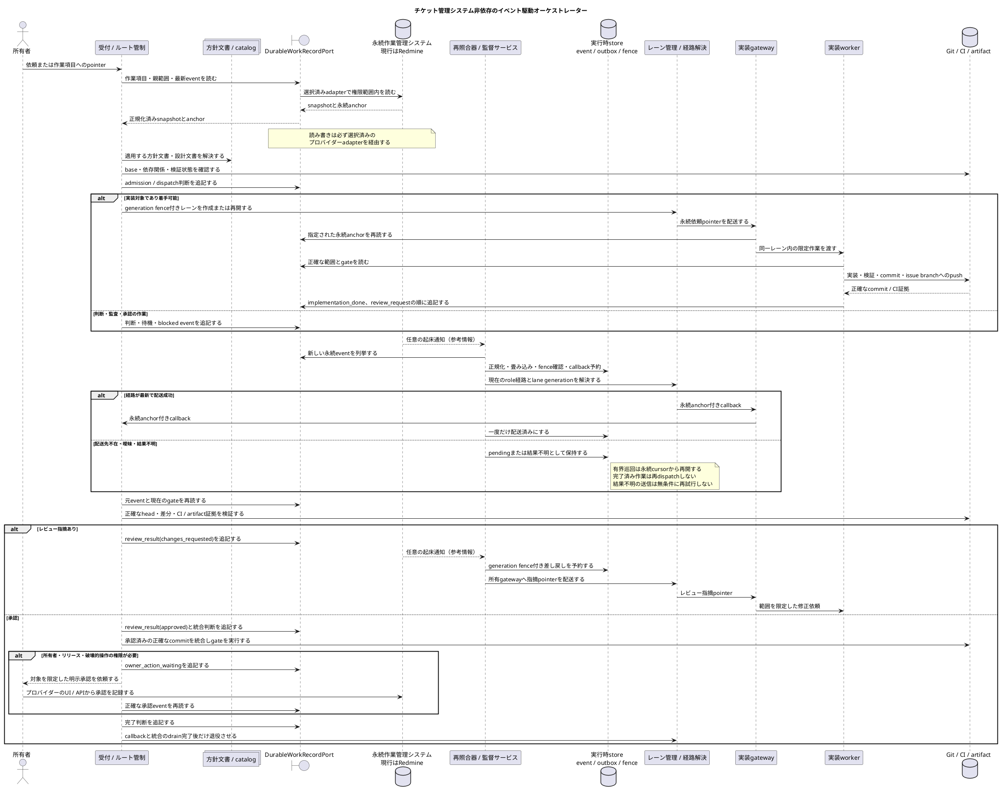

# チケット管理システム非依存のイベント駆動オーケストレーター設計

## 目的と設計判断

本書は、人間の依頼から管制、実装、レビュー、統合、完了、レーン退役までを、途中で停止しても
再開可能に進める自動オーケストレーターの製品レベル設計正本である。主に定義するのは、
正本境界、イベント駆動の制御順序、再照合、停止、復旧、段階移行である。この責務に基づき、
静的な構造仕様を置く `vibes/docs/specs/` ではなく、意思決定と制御設計を置く
`vibes/docs/logics/` に格納する。

中核は Redmine ではなく `DurableWorkRecordPort` に依存する。Redmine は現在の
`mozyo_bridge` リポジトリで使う推奨・既定アダプターだが、製品の必須プロバイダーではない。
Asana や別の作業管理システムも、下記の契約を満たすアダプターを持てば同じ状態機械に接続できる。
プロバイダー固有のステータス、journal、comment の語彙を中核へ漏らさない。

一般的な内蔵プロバイダー分類、既存 `TicketProvider`、外部プラグインを公開しない境界は
`plugin-ready-adapter-boundary.md` が正本である。本書はそれを置き換えず、作業記録ポートを使って
オーケストレーターをどの順序で閉ループ化するかだけを定義する。

```yaml
architecture_status:
  product_contract: target
  current_release: 0.12.2
  current_snapshot_date: 2026-07-20
  current_work_record_adapter: redmine
  provider_requirement: durable_work_record_contract
  redmine_requirement: false
```

## 対象外

- LLM に製品・業務領域・設計の判断を無制限に委ねること。
- 作業項目の作成・選択、レビュー承認、所有者承認を実行時状態から自動承認すること。
- リリース、公開、credential、破壊的操作を通常のcallbackの延長で実行すること。
- pane、terminal、UI、SQLiteの投影をワークフローの正本にすること。
- 任意コードを読み込む外部プラグインAPIを公開すること。

## 永続作業記録ポートの契約

`DurableWorkRecordPort` は、チケット管理システムの違いを次の閉じた契約へ正規化する。
操作名とfield名は実装識別子なので英字のまま固定する。

```yaml
DurableWorkRecordPort:
  required_operations:
    - read_work_item(work_item_ref) -> WorkItemSnapshot
    - resolve_parent_scope(work_item_ref) -> ParentScope
    - list_events(work_item_ref, after_cursor) -> EventPage
    - append_event(work_item_ref, event_command, idempotency_key) -> DurableAnchor
  optional_operations:
    - list_candidates(scope_query) -> CandidatePage
  required_properties:
    - stable work_item_ref and event_id
    - provider-issued durable anchor
    - deterministic event order or cursor
    - scoped read and append authorization
    - idempotent append or caller correlation key
    - structured event kind; prose inference is not required
  failure_policy: fail_closed_without_provider_fallback_guess
```

中核が読む正規化イベントは次の形とする。`payload_ref` はプロバイダー上の永続記録を指し、
秘密値、paneのscrollback、生のpromptを複製しない。

```yaml
DurableWorkEvent:
  provider: <adapter id>
  project_key: <provider-scoped project id>
  work_item_id: <stable id>
  event_id: <provider event id or deterministic correlation id>
  source_sequence: <ordered cursor>
  event_kind: <closed workflow event vocabulary>
  actor_role: <workflow role>
  lane_generation: <integer or none>
  durable_anchor: <provider-issued pointer>
  payload_ref: <same-system detail pointer>
  occurred_at: <provider timestamp>
```

Redmineアダプターは `work_item_id=issue id`、`event_id/source_sequence=journal id`、
`durable_anchor=issue + journal` として写像する。Asanaアダプターならtask、story、commentを
同じ正規化形式へ写像する。プロバイダーごとのgate解釈はアダプターが検証するが、中核の
`event_kind` と権限境界は変えない。

webhookやpush通知は処理を早めるための最適化であり、必須契約ではない。取りこぼし回復の正本経路は、
順序付きcursorを使う有界ポーリングと巡回照合である。

## 正本境界

| 対象 | 正本となる情報 | 正本ではない情報 |
| --- | --- | --- |
| `DurableWorkRecordPort` | 目的、範囲、永続イベント、承認・レビュー・完了gate | 生きているprocess、commit内容 |
| Git・CI・artifact store | commit系譜、差分、test・build結果、artifact同一性 | 所有者の意図、ワークフロー承認 |
| mozyo実行時store | 畳み込み済み状態、cursor、outbox、lease、冪等性、generation fence | レビュー・完了・リリース承認 |
| 生きているagentの探索 | 操作時点の生存性、正確な配送先、プロバイダーprocess identity | 永続的な完了、経路方針 |
| リポジトリ文書・catalog | 方針、役割、port、状態遷移の不変条件 | 現在の実行時事実 |
| UI・cockpit・通知 | 時刻付き投影、永続anchorへのpointer | ワークフローの正本、操作権限 |

副作用の実行権限は、永続gate、Git・artifactの証拠、実行時fence、操作直前の生存確認を、
command境界ですべて照合した結果だけから得る。どれか一層だけでは許可しない。

## 標準シーケンス

次の図は、製品レベルの標準シーケンスの正本である。Redmine固有のリポジトリ運用手順は
`coordinator-sublane-development-flow.md`、具体的なCLI flagはCLI helpとvalidation errorを読む。



## 再照合契約と停止条件

一回のcontroller cycleは、新しい永続eventを畳み込み、許可済みの安全な操作を最大一つだけ実行し、
結果を記録して終了する。常駐serviceであっても、一回のcycleを無期限待機にしない。

```yaml
cycle:
  - read durable events after stored cursor
  - normalize and fold deterministic state
  - resolve exactly one next action
  - validate durable authority and generation fence
  - reserve idempotency / outbox key
  - perform at most one external mutation
  - record delivered, blocked, or uncertain outcome
hard_stop:
  - missing or ambiguous durable anchor
  - provider read/write failure
  - stale lane generation or ambiguous live route
  - unresolved review, owner, release, credential, or destructive gate
  - commit / artifact identity mismatch
  - reserved or uncertain prior send without explicit reconciliation
recovery:
  - restart from durable cursor and runtime outbox
  - re-read the exact provider event before mutation
  - never infer progress from notification or pane text
```

## 現行0.12.2と目標状態の差

| 領域 | 現行0.12.2 | 目標の契約 |
| --- | --- | --- |
| event source | `RedmineJournalSource` / `LiveRedmineJournalSource` が構造化journal markerを読む | プロバイダー非依存の `DurableWorkRecordPort` が返す正規化eventを読む |
| 状態・配送 | `WorkflowRuntimeStore`、callback outbox、lease / generation fence、`WorkspaceCallbackSupervisor` が存在する | 同じ機構をプロバイダー非依存のeventと経路契約へ接続する |
| agent入口 | `workflow step` が安全な一手を解決し、現行herdr経路はRedmine anchorを検証する | adapterを変えても同じ結果形式と停止理由を返す |
| 閉ループ化 | dispatch、callback、review、integrationの部品はあるが、全工程を常時閉ループで完走するcontrollerは未完成 | 再起動とcallback欠落を含む単一入口E2Eで完了・退役まで収束する |
| callback取込み | supervisorと回復経路はあるが、永続Review Requestが即時取得されない運用差が残る（#14131 container release smoke tests配置是正 j#83023） | 起床通知の欠落を有界巡回で回収し、投影もpendingを正しく示す |
| プロバイダー可搬性 | source Protocolはtest可能だが、Redmineのissue / journal語彙がdomainとCLIへ残る | 中核からプロバイダー語彙を除き、Redmineアダプターの挙動を契約testで固定する |

従って現状は「半自動の安全な部品群」であり、完全な無人オーケストレーターではない。
Redmineを外せば動く状態でもなく、Redmineを必須にすべき状態でもない。先にport境界を固定し、
現在のRedmine経路を挙動維持のままadapter化するのが正しい順序である。

## 段階的な移行

1. 正規化した作業項目・event・anchorと、adapter契約testを追加する。
2. 現行Redmine source / writerをRedmineアダプターとして包み、挙動とmarker語彙を変えない。
3. `workflow step`、watch / supervisor、glanceを `DurableWorkRecordPort` 入力へ移す。
4. memory上の参照adapterと第二プロバイダーadapterで同じ契約test一式を通す。
5. crash、起床通知欠落、重複event、配送結果不明、changes-requestedの反復を含む
   単一入口E2Eで完了・退役まで検証する。

port導入を理由に所有者・レビュー・リリースgateを弱めない。第二プロバイダー実装はport契約の
証明であり、Redmineアダプターの廃止要件ではない。

## 参照正本と検証

- `vibes/docs/logics/plugin-ready-adapter-boundary.md`
- `vibes/docs/logics/coordinator-sublane-development-flow.md`
- `vibes/docs/logics/workflow-step-command-design.md`
- `vibes/docs/logics/autonomous-ticket-entrypoint.md`
- `vibes/docs/logics/managed-state-model.md`
- `vibes/docs/specs/route-identity-ledger.md`
- `vibes/docs/specs/delegated-coordinator-decision-records.md`
- `.mozyo-bridge/rules/llm_rule_authoring.md`

検証は `mozyo-bridge docs validate --repo .`、file coverage、generated conventions、
`docs audit-impact --all-changed --check-generated`、`git diff --check` を実行する。
