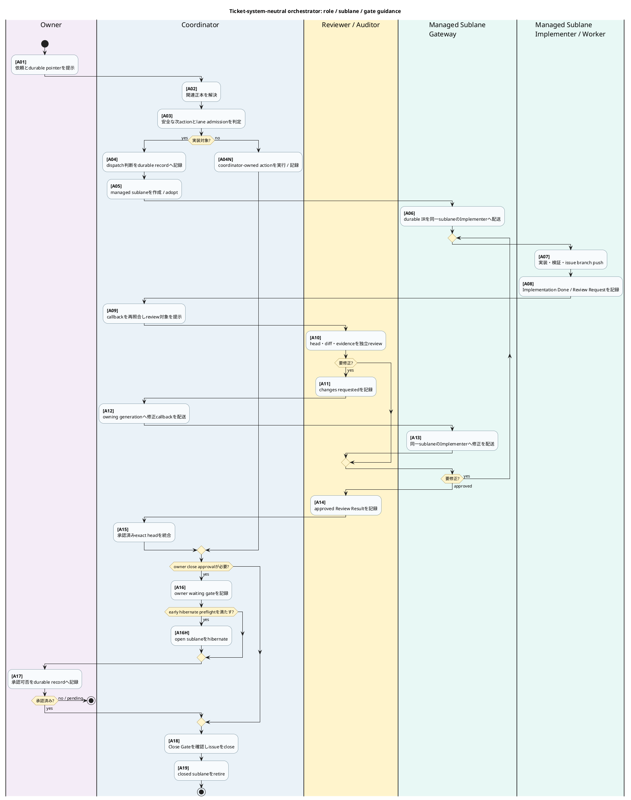

# チケット管理システム非依存のイベント駆動オーケストレーター設計

## 目的と設計判断

本書は、人間の依頼から管制、実装、レビュー、統合、完了、レーン退役までを、途中で停止しても
再開可能に進める自動オーケストレーターの製品レベル設計正本である。主に定義するのは、
正本境界、イベント駆動の制御順序、再照合、停止、復旧、段階移行である。この責務に基づき、
静的な構造仕様を置く `vibes/docs/specs/` ではなく、意思決定と制御設計を置く
`vibes/docs/logics/` に格納する。

中核は Redmine ではなく `DurableWorkRecordPort` に依存する。Redmine は現在の
`mozyo_bridge` リポジトリで使う推奨・既定アダプターだが、製品の必須プロバイダーではない。
Asana や別の作業管理システムも、下記の契約を満たすアダプターを持てば同じ状態機械に接続できる。
プロバイダー固有のステータス、journal、comment の語彙を中核へ漏らさない。

一般的な内蔵プロバイダー分類、既存 `TicketProvider`、外部プラグインを公開しない境界は
`plugin-ready-adapter-boundary.md` が正本である。本書はそれを置き換えず、作業記録ポートを使って
オーケストレーターをどの順序で閉ループ化するかだけを定義する。

```yaml
architecture_status:
  product_contract: target
  current_release: 0.12.2
  current_snapshot_date: 2026-07-20
  current_work_record_adapter: redmine
  provider_requirement: durable_work_record_contract
  redmine_requirement: false
```

## 読み方と用語の状態

本書では、現行実装と目標設計を同じ見た目で混ぜない。用語と図中の操作には、次の状態を明示する。

| 状態 | 意味 | 例 |
| --- | --- | --- |
| `current-public` | 0.12.2の公開CLIとして実行できる | `mozyo-bridge workflow step`、`mozyo-bridge docs resolve` |
| `current-internal` | 現行sourceに存在するが、単独の公開CLI契約ではない | `WorkflowRuntimeStore`、`WorkspaceCallbackSupervisor`、各種generation fence |
| `target-only` | 本書が予約する目標契約。現行sourceの型や公開CLIではない | `DurableWorkRecordPort`、`DurableWorkEvent` |
| `external-authority` | mozyo-bridgeが代行しない人間・Git・CI・ticket providerの操作 | review判断、Git統合、owner承認、issue close |

`admission`、`dispatch`、`generation fence` は製品で使われている正式な用語群だが、単独では
実行面を一意にしない。本書では必ず対象を限定する。

| 限定語 | 意味 | 現行の主な公開surface |
| --- | --- | --- |
| lane admission | laneを並列dispatch可能か分類するread-only/advisory判断 | `mozyo-bridge workflow admission`、`mozyo-bridge workflow lane-admission`、`mozyo-bridge workflow dispatch-plan` |
| Implementation Request dispatch | 永続IRを記録し、workerへanchor付きhandoffを送る | `mozyo-bridge workflow dispatch-ir --execute` |
| managed sublane dispatch | worktree・gateway・workerを作成またはadoptし、IRをdispatchする | `mozyo-bridge sublane create --execute` |
| same-lane worker dispatch | gatewayから同一laneのworkerへIRをforwardする | `mozyo-bridge sublane dispatch-worker --execute` |
| callback admission / delivery | callback recoveryを一度だけclaimし、outboxから配送する | `mozyo-bridge workflow callback-admit`、`mozyo-bridge workflow callbacks --deliver` |
| lane lifecycle generation | 同じlane名の新旧process・dispatch roundを区別する | `mozyo-bridge sublane create` / `mozyo-bridge sublane resume`が管理する。単独の「generation作成」commandはない |
| worker-dispatch fence | 同じdispatch actionの重複送信を拒否する | `mozyo-bridge workflow dispatch-fence`はstore lifecycle用。通常reserveはdispatch経路内部 |
| review-generation fence | review対象head・request journal・decisionの世代不一致を拒否する | `mozyo-bridge workflow callbacks --emit-gate --gate review_result ...` |
| callback outbox / publication fence | callbackのclaim・公開・再送状態を区別する | `mozyo-bridge workflow callbacks ...`、`mozyo-bridge workflow callback-publication ...` |
| coordinator-forward fence | Herdr上の同じforward generationの重複実行を拒否する | `mozyo-bridge workflow forward-fence`はstore lifecycle用。通常reserveは`mozyo-bridge workflow step`内部 |

従って図中で単に「admission」「dispatch」「generation fence」とは書かない。どのauthority、
identity、公開commandを指すかをaction IDで直下のcommand ledgerへ接続する。なお「三次元図」は
採用しない。主図は一枚のPlantUML swimlane activityとし、人間が読むactionにはguidanceとIDだけを
表示する。実command、side effect、現行／目標境界は同じIDを持つledgerで追跡する。

## 対象外

- LLM に製品・業務領域・設計の判断を無制限に委ねること。
- 作業項目の作成・選択、レビュー承認、所有者承認を実行時状態から自動承認すること。
- リリース、公開、credential、破壊的操作を通常のcallbackの延長で実行すること。
- pane、terminal、UI、SQLiteの投影をワークフローの正本にすること。
- 任意コードを読み込む外部プラグインAPIを公開すること。

## 永続作業記録ポートの契約

`DurableWorkRecordPort` は、チケット管理システムの違いを次の閉じた契約へ正規化する
`target-only`の予約名である。0.12.2のsource typeや公開CLIとして実装済みという意味ではない。
操作名とfield名は目標契約の識別子として英字のまま固定する。

```yaml
DurableWorkRecordPort:
  required_operations:
    - read_work_item(work_item_ref) -> WorkItemSnapshot
    - resolve_parent_scope(work_item_ref) -> ParentScope
    - list_events(work_item_ref, after_cursor) -> EventPage
    - append_event(work_item_ref, event_command, idempotency_key) -> DurableAnchor
  optional_operations:
    - list_candidates(scope_query) -> CandidatePage
  required_properties:
    - stable work_item_ref and event_id
    - provider-issued durable anchor
    - deterministic event order or cursor
    - scoped read and append authorization
    - idempotent append or caller correlation key
    - structured event kind; prose inference is not required
  failure_policy: fail_closed_without_provider_fallback_guess
```

中核が読む正規化イベントは次の形とする。`payload_ref` はプロバイダー上の永続記録を指し、
秘密値、paneのscrollback、生のpromptを複製しない。

```yaml
DurableWorkEvent:
  provider: <adapter id>
  project_key: <provider-scoped project id>
  work_item_id: <stable id>
  event_id: <provider event id or deterministic correlation id>
  source_sequence: <ordered cursor>
  event_kind: <category-scoped closed workflow event vocabulary>
  actor_role: <workflow role>
  lane_generation: <integer or none>
  durable_anchor: <provider-issued pointer>
  payload_ref: <same-system detail pointer>
  occurred_at: <provider timestamp>
```

Redmineアダプターは `work_item_id=issue id`、`event_id/source_sequence=journal id`、
`durable_anchor=issue + journal` として写像する。Asanaアダプターならtask、story、commentを
同じ正規化形式へ写像する。プロバイダーごとのgate解釈はアダプターが検証するが、中核の
`event_kind` と権限境界は変えない。

`event_kind`は一個の曖昧な語彙へ平坦化しない。現行0.12.2では、次の公開surfaceが受理する
category別closed vocabularyをauthorityとする。

| category | authority / 確認command | 規律 |
| --- | --- | --- |
| workflow gate intake | central preset `Gate Schema`、`mozyo-bridge workflow watch --help` | `review` / `review_result`のような明示alias以外を推測しない |
| callback-required gate | `mozyo-bridge workflow callbacks --help`の`--gate` | worker progress vocabularyと混ぜない |
| worker progress | 同helpの`--progress-kind` | coordinator callbackを自動発生させない |
| dispatch round | `mozyo-bridge workflow dispatch-ir --help`のlane / generation marker | gate語彙へ混ぜない |

本書は新しい同義tokenを追加しない。特に`owner_action_waiting`は現行closed vocabularyに存在しないため
使用しない。owner closeのcallback-required stateは`owner_close_approval_waiting`、lane projectionは
`owner_waiting`であり、owner承認そのものはprovider上の`owner_close_approval` durable gateである。

webhookやpush通知は処理を早めるための最適化であり、必須契約ではない。取りこぼし回復の正本経路は、
順序付きcursorを使う有界ポーリングと巡回照合である。

## 正本境界

| 対象 | 正本となる情報 | 正本ではない情報 |
| --- | --- | --- |
| `DurableWorkRecordPort` | 目的、範囲、永続イベント、承認・レビュー・完了gate | 生きているprocess、commit内容 |
| Git・CI・artifact store | commit系譜、差分、test・build結果、artifact同一性 | 所有者の意図、ワークフロー承認 |
| mozyo実行時store | 畳み込み済み状態、cursor、outbox、lease、冪等性、lane / review / dispatch / callback別のfence | レビュー・完了・リリース承認 |
| 生きているagentの探索 | 操作時点の生存性、正確な配送先、プロバイダーprocess identity | 永続的な完了、経路方針 |
| リポジトリ文書・catalog | 方針、役割、port、状態遷移の不変条件 | 現在の実行時事実 |
| UI・cockpit・通知 | 時刻付き投影、永続anchorへのpointer | ワークフローの正本、操作権限 |

副作用の実行権限は、永続gate、Git・artifactの証拠、実行時fence、操作直前の生存確認を、
command境界ですべて照合した結果だけから得る。どれか一層だけでは許可しない。

## 一枚で読む標準フロー

主図は「誰が次に何を判断・実行するか」だけを示す。command全文を図へ詰めず、各actionの
`[Axx]`を直下のcommand ledgerへ接続する。PlantUML procedure `$guidance`はIDと表示形式を
一箇所で固定するための描画関数であり、runtime実装の関数ではない。

薄緑の2列は同じ`managed_sublane` execution boundaryを共有する。Gatewayはlane境界でdurable
anchorとroute identityを検証し、Implementer / Workerだけが実装差分を作る。黄色のReviewer /
AuditorはCoordinatorと別の論理roleであり、同じproviderを使う場合でもImplementerのself-reviewへ
統合しない。lane列はprovider brandではなく責務を表す。



## Action ID command ledger（現行0.12.2）

CLI helpをflagの正本とすることと、設計書からcommand名を省くことは別である。主図の全actionは
このledgerで、現行公開surfaceまたは「現行公開commandなし」へ必ず接続する。複数commandは
`<br>`で分け、図の人間向けguidanceへ逆流させない。

| ID | action / 責務 | 現行command / 操作 | side effect・authority・境界 |
| --- | --- | --- | --- |
| `A01` | Owner: 依頼とdurable pointer | provider UI / API / MCP（`mozyo-bridge` commandなし） | `external-authority`。pane通知はpointerであり正本ではない |
| `A02` | Coordinator: 関連docs解決 | `mozyo-bridge docs resolve <paths...> --repo .` | `current-public`、read-only。catalogから読むべき正本を解決 |
| `A03` | Coordinator: next action / lane admission | `mozyo-bridge workflow step --dry-run --json`<br>`mozyo-bridge workflow admission` / `workflow lane-admission` / `workflow dispatch-plan` | `current-public`、read-only / advisory。ticketは変更しない |
| `A04` | Coordinator: dispatch decisionを永続化 | `mozyo-bridge workflow admission --journal`等で本文をrender<br>provider UI / API / MCPで記録 | renderはread-only。provider書込みは`external-authority`。provider-neutral writerなし |
| `A04N` | Coordinator: coordinator-owned action | `mozyo-bridge workflow step`で許可済みの一手、またはprovider / Git操作 | action固有authorityを再照合。全種類を代行する単一commandなし |
| `A05` | Coordinator: managed sublane作成 / adopt | `mozyo-bridge sublane create --issue <id> --lane-label <label> --branch <branch> --worktree <path> --base-ref origin/main --journal <j> --execute` | worktree、lane generation、Gateway / Worker pair、初期handoffを変更 |
| `A06` | Gateway: durable IRをsame-lane dispatch | marker記録＋送信: `mozyo-bridge workflow dispatch-ir --issue <id> --lane <lane> --generation <n> --body-file <path> --target <worker> --target-repo <repo> --gateway-callback-target <gateway> --role-profile implementation_worker --execute`<br>既存IR anchorのforward: `mozyo-bridge sublane dispatch-worker --issue <id> --lane-label <label> --journal <j> --execute` | Gatewayがlane境界を所有。現行はRedmine anchor。`A05`が既存anchorを初期dispatch済みなら重複送信しない |
| `A07` | Implementer / Worker: 実装・test・issue branch push | Git / test command（全体を代行する`mozyo-bridge` commandなし） | Git・CIが差分、commit、test evidenceのauthority。Implementerだけが実装diffを作る |
| `A08` | Implementer / Worker: gate記録 | `mozyo-bridge workflow callbacks --emit-gate --issue <id> --gate implementation_done ...`<br>`mozyo-bridge workflow callbacks --emit-gate --issue <id> --gate review_request --target-head <sha> ...` | marker-bearing Redmine journal write。未記録はnon-zero。provider-neutral appendなし |
| `A09` | Coordinator: callback再照合・review提示 | `mozyo-bridge workflow supervisor --run-once --json`<br>`mozyo-bridge workflow glance --json` / `workflow resume --json` / `workflow step --dry-run --json`<br>`mozyo-bridge handoff send --to codex --source redmine --issue <id> --journal <review-request-j> --kind review_request --target <reviewer> --target-repo <repo>` | supervisorはevent供給、fold、outbox配送。projectionはread-only。review通知はdurable requestへのpointerであり判断ではない |
| `A10` | Reviewer / Auditor: 独立review | Git / CI / durable Review Requestを読む（review判断を代行する`mozyo-bridge` commandなし） | `external-authority`。ReviewerはImplementerと別role。projectionは判断材料であって承認ではない |
| `A11` | Reviewer / Auditor: changes requested記録 | `mozyo-bridge workflow callbacks --emit-gate --issue <id> --gate review_result --target-head <sha> --review-request-journal <j> --review-decision changes_requested` | exact head / request journal付きresult。non-approvalなのでapproval generation leaseは取らない |
| `A12` | Coordinator: correction callback再照合・配送 | `mozyo-bridge workflow supervisor --run-once --json` | review resultをfoldし、owning lane generationへfenceしたcallbackを配送 |
| `A13` | Gateway: same-lane Implementerへ修正配送 | `mozyo-bridge handoff send --to claude --source redmine --issue <id> --journal <j> --kind review_result --role-profile implementation_worker` | same-lane標準handoff。Coordinatorから別laneのWorkerへ直接送信しない |
| `A14` | Reviewer / Auditor: approval記録 | `mozyo-bridge workflow callbacks --emit-gate --issue <id> --gate review_result --review-decision approval --target-head <sha> --review-request-journal <j> --review-generation-json <path> --consumer-id <id>` | review-generation fence通過後だけmarker-bearing approvalを記録 |
| `A15` | Coordinator: integration disposition | Git / CI操作（`mozyo-bridge` integration commandなし） | approved exact headだけを標準`ff-only`で統合し、remote到達性を記録 |
| `A16` | Coordinator: owner waiting | `mozyo-bridge workflow callbacks --emit-gate --issue <id> --gate owner_close_approval_waiting ...` | owner actionが必要なdurable gateを先に記録。Review Resultと同じjournalへ畳まない |
| `A16H` | Coordinator: eligibleなopen sublaneをhibernate | `mozyo-bridge sublane hibernate --issue <id> --lane <label> --journal <j> <measured-preflight-flags> --execute` | `--review-approved --staging-integrated --required-ci-green --dogfood-delegated --commits-pushed`等、CLI helpが要求する実測basisを省略しない。hibernateはclose / approvalではない |
| `A17` | Owner: owner close approval | provider UI / API / MCP（owner判断を代行する`mozyo-bridge` commandなし） | `external-authority`。未承認・不明はfail-closedでopenのまま停止 |
| `A18` | Coordinator: Close Gate / issue close | provider UI / API / MCP（provider-neutral `mozyo-bridge` close commandなし） | review、owner approval、commit evidenceを再確認後だけclose |
| `A19` | Coordinator: closed sublane退役 | `mozyo-bridge sublane retire --issue <id> --journal <j> --lane-label <label> --branch <branch> --integration-branch main --issue-closed --callbacks-drained --verified --durable-record --target-identity-known --latest-generation-admissible --execute` | managed process / lifecycleを変更。remote branchやworktreeは削除しない |

`docs validate`はcatalogを検査するcommandであり、関連文書を解決するcommandではない。解決は必ず
`mozyo-bridge docs resolve`で行う。また`mozyo-bridge workflow admission`や
`mozyo-bridge workflow dispatch-plan`のadvisory出力は、providerへ記録されるまでdurable
decisionではない。

`DurableWorkRecordPort` / `append_event`は`target-only`であり、上のprovider read / writeを現行
0.12.2で代行する公開commandではない。review判断も同様に`external-authority`であり、
mozyo-bridgeは対象identityの検証、marker-bearing resultの記録、callback配送だけを担う。

`handoff send --role-profile`の現行closed vocabularyにはReviewer / Auditor専用profileがない。
従って`A09`は`kind=review_request`、durable anchor、明示targetでreview workを配送し、reviewerの
独立性はpresetのrole境界とReview Request / Resultの別actor記録で担保する。未実装profile名を
設計書だけで追加しない。

## 再照合契約と停止条件

一回のbounded reconcile pass（現行公開surfaceは`mozyo-bridge workflow supervisor --run-once`）は、
新しい永続eventを畳み込み、許可済みの安全な操作を最大一つだけ実行し、結果を記録して終了する。
`--watch`や常駐serviceであっても、一回のpassを無期限待機にしない。

```yaml
cycle:
  - read durable events after stored cursor
  - normalize and fold deterministic state
  - resolve exactly one next action
  - validate durable authority and the exact named fence for this action
  - reserve idempotency / outbox key
  - perform at most one external mutation
  - record delivered, blocked, or uncertain outcome
hard_stop:
  - missing or ambiguous durable anchor
  - provider read/write failure
  - stale lane generation or ambiguous live route
  - unresolved review, owner, release, credential, or destructive gate
  - commit / artifact identity mismatch
  - reserved or uncertain prior send without explicit reconciliation
recovery:
  - restart from durable cursor and runtime outbox
  - re-read the exact provider event before mutation
  - never infer progress from notification or pane text
```

## 現行0.12.2と目標状態の差

| 領域 | 現行0.12.2 | 目標の契約 |
| --- | --- | --- |
| event source | `RedmineJournalSource` / `LiveRedmineJournalSource` が構造化journal markerを読む | プロバイダー非依存の `DurableWorkRecordPort` が返す正規化eventを読む |
| 状態・配送 | `WorkflowRuntimeStore`、callback outbox、lease、lane / review / dispatch / publication別fence、`WorkspaceCallbackSupervisor` が存在する | 同じ機構をプロバイダー非依存のeventと経路契約へ接続する |
| agent入口 | `mozyo-bridge workflow step` が安全な一手を解決し、現行herdr経路はRedmine anchorを検証する | adapterを変えても同じ結果形式と停止理由を返す |
| 閉ループ化 | dispatch、callback、review、integrationの部品はあるが、全工程を常時閉ループで完走するcontrollerは未完成 | 再起動とcallback欠落を含む単一入口E2Eで完了・退役まで収束する |
| callback取込み | supervisorと回復経路はあるが、永続Review Requestが即時取得されない運用差が残る（#14131 container release smoke tests配置是正 j#83023） | 起床通知の欠落を有界巡回で回収し、投影もpendingを正しく示す |
| プロバイダー可搬性 | source Protocolはtest可能だが、Redmineのissue / journal語彙がdomainとCLIへ残る | 中核からプロバイダー語彙を除き、Redmineアダプターの挙動を契約testで固定する |

この表の「目標」はcommandが存在するという意味ではない。`DurableWorkRecordPort`を読む／書く
provider-neutral CLI、reviewからGit統合・owner承認・closeまでを自動実行するCLIは、現行0.12.2に
存在しない。後続実装は上のcommand-to-authority表の`target gap`を一つずつ閉じる。

従って現状は「半自動の安全な部品群」であり、完全な無人オーケストレーターではない。
Redmineを外せば動く状態でもなく、Redmineを必須にすべき状態でもない。先にport境界を固定し、
現在のRedmine経路を挙動維持のままadapter化するのが正しい順序である。

## 段階的な移行

1. 正規化した作業項目・event・anchorと、adapter契約testを追加する。
2. 現行Redmine source / writerをRedmineアダプターとして包み、挙動とmarker語彙を変えない。
3. `mozyo-bridge workflow step`、`mozyo-bridge workflow watch`、
   `mozyo-bridge workflow supervisor`、`mozyo-bridge workflow glance`を
   `DurableWorkRecordPort`入力へ移す。
4. memory上の参照adapterと第二プロバイダーadapterで同じ契約test一式を通す。
5. crash、起床通知欠落、重複event、配送結果不明、changes-requestedの反復を含む
   単一入口E2Eで完了・退役まで検証する。

port導入を理由に所有者・レビュー・リリースgateを弱めない。第二プロバイダー実装はport契約の
証明であり、Redmineアダプターの廃止要件ではない。

## 参照正本と検証

- `vibes/docs/logics/plugin-ready-adapter-boundary.md`
- `vibes/docs/logics/coordinator-sublane-development-flow.md`
- `vibes/docs/logics/workflow-step-command-design.md`
- `vibes/docs/logics/autonomous-ticket-entrypoint.md`
- `vibes/docs/logics/managed-state-model.md`
- `vibes/docs/specs/route-identity-ledger.md`
- `vibes/docs/specs/delegated-coordinator-decision-records.md`
- `.mozyo-bridge/rules/llm_rule_authoring.md`

関連正本の解決は
`mozyo-bridge docs resolve vibes/docs/logics/ticket-system-neutral-orchestrator.md --repo .`を使う。
検証は`mozyo-bridge docs validate --repo .`、file coverage、generated conventions、
`mozyo-bridge docs audit-impact --all-changed --check-generated --repo .`、PlantUML render、
`git diff --check`を実行する。公開surfaceの現在値は`mozyo-bridge <family> --help`を正本とする。
