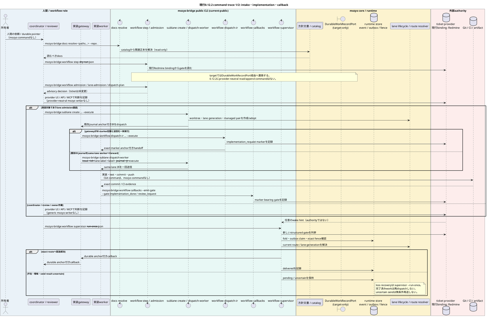
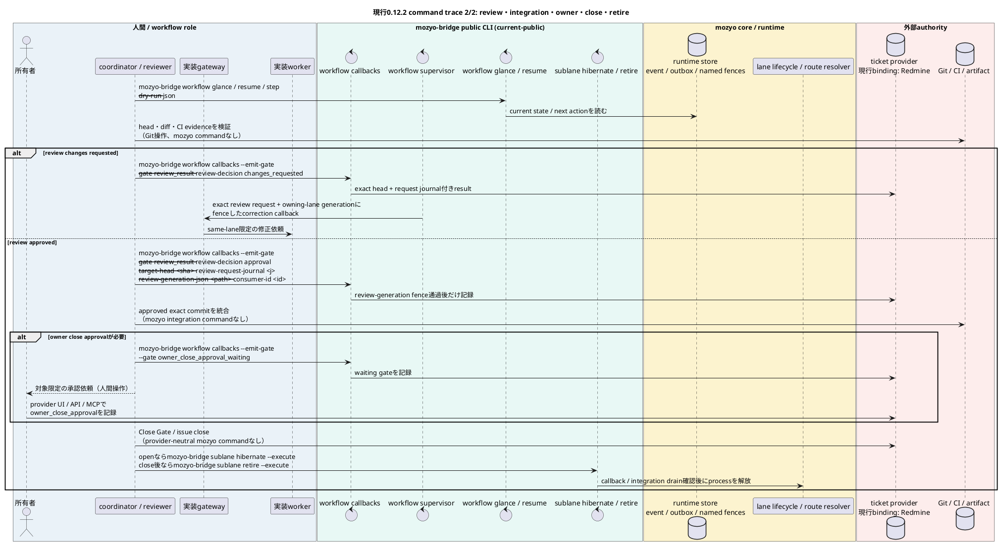

# チケット管理システム非依存のイベント駆動オーケストレーター設計

## 目的と設計判断

本書は、人間の依頼から管制、実装、レビュー、統合、完了、レーン退役までを、途中で停止しても
再開可能に進める自動オーケストレーターの製品レベル設計正本である。主に定義するのは、
正本境界、イベント駆動の制御順序、再照合、停止、復旧、段階移行である。この責務に基づき、
静的な構造仕様を置く `vibes/docs/specs/` ではなく、意思決定と制御設計を置く
`vibes/docs/logics/` に格納する。

中核は Redmine ではなく `DurableWorkRecordPort` に依存する。Redmine は現在の
`mozyo_bridge` リポジトリで使う推奨・既定アダプターだが、製品の必須プロバイダーではない。
Asana や別の作業管理システムも、下記の契約を満たすアダプターを持てば同じ状態機械に接続できる。
プロバイダー固有のステータス、journal、comment の語彙を中核へ漏らさない。

一般的な内蔵プロバイダー分類、既存 `TicketProvider`、外部プラグインを公開しない境界は
`plugin-ready-adapter-boundary.md` が正本である。本書はそれを置き換えず、作業記録ポートを使って
オーケストレーターをどの順序で閉ループ化するかだけを定義する。

```yaml
architecture_status:
  product_contract: target
  current_release: 0.12.2
  current_snapshot_date: 2026-07-20
  current_work_record_adapter: redmine
  provider_requirement: durable_work_record_contract
  redmine_requirement: false
```

## 読み方と用語の状態

本書では、現行実装と目標設計を同じ見た目で混ぜない。用語と図中の操作には、次の状態を明示する。

| 状態 | 意味 | 例 |
| --- | --- | --- |
| `current-public` | 0.12.2の公開CLIとして実行できる | `mozyo-bridge workflow step`、`mozyo-bridge docs resolve` |
| `current-internal` | 現行sourceに存在するが、単独の公開CLI契約ではない | `WorkflowRuntimeStore`、`WorkspaceCallbackSupervisor`、各種generation fence |
| `target-only` | 本書が予約する目標契約。現行sourceの型や公開CLIではない | `DurableWorkRecordPort`、`DurableWorkEvent` |
| `external-authority` | mozyo-bridgeが代行しない人間・Git・CI・ticket providerの操作 | review判断、Git統合、owner承認、issue close |

`admission`、`dispatch`、`generation fence` は製品で使われている正式な用語群だが、単独では
実行面を一意にしない。本書では必ず対象を限定する。

| 限定語 | 意味 | 現行の主な公開surface |
| --- | --- | --- |
| lane admission | laneを並列dispatch可能か分類するread-only/advisory判断 | `mozyo-bridge workflow admission`、`mozyo-bridge workflow lane-admission`、`mozyo-bridge workflow dispatch-plan` |
| Implementation Request dispatch | 永続IRを記録し、workerへanchor付きhandoffを送る | `mozyo-bridge workflow dispatch-ir --execute` |
| managed sublane dispatch | worktree・gateway・workerを作成またはadoptし、IRをdispatchする | `mozyo-bridge sublane create --execute` |
| same-lane worker dispatch | gatewayから同一laneのworkerへIRをforwardする | `mozyo-bridge sublane dispatch-worker --execute` |
| callback admission / delivery | callback recoveryを一度だけclaimし、outboxから配送する | `mozyo-bridge workflow callback-admit`、`mozyo-bridge workflow callbacks --deliver` |
| lane lifecycle generation | 同じlane名の新旧process・dispatch roundを区別する | `mozyo-bridge sublane create` / `mozyo-bridge sublane resume`が管理する。単独の「generation作成」commandはない |
| worker-dispatch fence | 同じdispatch actionの重複送信を拒否する | `mozyo-bridge workflow dispatch-fence`はstore lifecycle用。通常reserveはdispatch経路内部 |
| review-generation fence | review対象head・request journal・decisionの世代不一致を拒否する | `mozyo-bridge workflow callbacks --emit-gate --gate review_result ...` |
| callback outbox / publication fence | callbackのclaim・公開・再送状態を区別する | `mozyo-bridge workflow callbacks ...`、`mozyo-bridge workflow callback-publication ...` |
| coordinator-forward fence | Herdr上の同じforward generationの重複実行を拒否する | `mozyo-bridge workflow forward-fence`はstore lifecycle用。通常reserveは`mozyo-bridge workflow step`内部 |

従って図中で単に「admission」「dispatch」「generation fence」とは書かない。どのauthority、
identity、公開commandを指すかを同じ行に置く。なお「三次元図」は採用しない。PlantUMLの`box`で
責務層を奥行きの代わりに表現し、矢印の前後関係とside effectの有無を優先する。

## 対象外

- LLM に製品・業務領域・設計の判断を無制限に委ねること。
- 作業項目の作成・選択、レビュー承認、所有者承認を実行時状態から自動承認すること。
- リリース、公開、credential、破壊的操作を通常のcallbackの延長で実行すること。
- pane、terminal、UI、SQLiteの投影をワークフローの正本にすること。
- 任意コードを読み込む外部プラグインAPIを公開すること。

## 永続作業記録ポートの契約

`DurableWorkRecordPort` は、チケット管理システムの違いを次の閉じた契約へ正規化する
`target-only`の予約名である。0.12.2のsource typeや公開CLIとして実装済みという意味ではない。
操作名とfield名は目標契約の識別子として英字のまま固定する。

```yaml
DurableWorkRecordPort:
  required_operations:
    - read_work_item(work_item_ref) -> WorkItemSnapshot
    - resolve_parent_scope(work_item_ref) -> ParentScope
    - list_events(work_item_ref, after_cursor) -> EventPage
    - append_event(work_item_ref, event_command, idempotency_key) -> DurableAnchor
  optional_operations:
    - list_candidates(scope_query) -> CandidatePage
  required_properties:
    - stable work_item_ref and event_id
    - provider-issued durable anchor
    - deterministic event order or cursor
    - scoped read and append authorization
    - idempotent append or caller correlation key
    - structured event kind; prose inference is not required
  failure_policy: fail_closed_without_provider_fallback_guess
```

中核が読む正規化イベントは次の形とする。`payload_ref` はプロバイダー上の永続記録を指し、
秘密値、paneのscrollback、生のpromptを複製しない。

```yaml
DurableWorkEvent:
  provider: <adapter id>
  project_key: <provider-scoped project id>
  work_item_id: <stable id>
  event_id: <provider event id or deterministic correlation id>
  source_sequence: <ordered cursor>
  event_kind: <category-scoped closed workflow event vocabulary>
  actor_role: <workflow role>
  lane_generation: <integer or none>
  durable_anchor: <provider-issued pointer>
  payload_ref: <same-system detail pointer>
  occurred_at: <provider timestamp>
```

Redmineアダプターは `work_item_id=issue id`、`event_id/source_sequence=journal id`、
`durable_anchor=issue + journal` として写像する。Asanaアダプターならtask、story、commentを
同じ正規化形式へ写像する。プロバイダーごとのgate解釈はアダプターが検証するが、中核の
`event_kind` と権限境界は変えない。

`event_kind`は一個の曖昧な語彙へ平坦化しない。現行0.12.2では、次の公開surfaceが受理する
category別closed vocabularyをauthorityとする。

| category | authority / 確認command | 規律 |
| --- | --- | --- |
| workflow gate intake | central preset `Gate Schema`、`mozyo-bridge workflow watch --help` | `review` / `review_result`のような明示alias以外を推測しない |
| callback-required gate | `mozyo-bridge workflow callbacks --help`の`--gate` | worker progress vocabularyと混ぜない |
| worker progress | 同helpの`--progress-kind` | coordinator callbackを自動発生させない |
| dispatch round | `mozyo-bridge workflow dispatch-ir --help`のlane / generation marker | gate語彙へ混ぜない |

本書は新しい同義tokenを追加しない。特に`owner_action_waiting`は現行closed vocabularyに存在しないため
使用しない。owner closeのcallback-required stateは`owner_close_approval_waiting`、lane projectionは
`owner_waiting`であり、owner承認そのものはprovider上の`owner_close_approval` durable gateである。

webhookやpush通知は処理を早めるための最適化であり、必須契約ではない。取りこぼし回復の正本経路は、
順序付きcursorを使う有界ポーリングと巡回照合である。

## 正本境界

| 対象 | 正本となる情報 | 正本ではない情報 |
| --- | --- | --- |
| `DurableWorkRecordPort` | 目的、範囲、永続イベント、承認・レビュー・完了gate | 生きているprocess、commit内容 |
| Git・CI・artifact store | commit系譜、差分、test・build結果、artifact同一性 | 所有者の意図、ワークフロー承認 |
| mozyo実行時store | 畳み込み済み状態、cursor、outbox、lease、冪等性、lane / review / dispatch / callback別のfence | レビュー・完了・リリース承認 |
| 生きているagentの探索 | 操作時点の生存性、正確な配送先、プロバイダーprocess identity | 永続的な完了、経路方針 |
| リポジトリ文書・catalog | 方針、役割、port、状態遷移の不変条件 | 現在の実行時事実 |
| UI・cockpit・通知 | 時刻付き投影、永続anchorへのpointer | ワークフローの正本、操作権限 |

副作用の実行権限は、永続gate、Git・artifactの証拠、実行時fence、操作直前の生存確認を、
command境界ですべて照合した結果だけから得る。どれか一層だけでは許可しない。

## 現行0.12.2のcommand-to-authority対応

CLI helpをflagの正本とすることと、設計書からcommand名を省くことは別である。各工程は、次の
公開surfaceまたは「現行公開commandなし」へ必ず接続する。

| 工程 | 実行者 | 現行0.12.2のcommand / 操作 | side effectとauthority | target gap |
| --- | --- | --- | --- | --- |
| 関連docs解決 | coordinator / agent | `mozyo-bridge docs resolve <paths...> --repo .` | read-only。catalogから読むべき正本を解決する | なし |
| 次の安全な一手 | coordinator / gateway | `mozyo-bridge workflow step --dry-run --json`で確認、`mozyo-bridge workflow step`で許可済みroutingを一手実行 | dry-runはread-only。通常実行は安全なtransportを一手だけactuateし得る | 入力は現行Redmine binding |
| lane admission | coordinator | `mozyo-bridge workflow admission` / `mozyo-bridge workflow lane-admission` / `mozyo-bridge workflow dispatch-plan` | advisory / read-only。ticketへ判断を自動追記しない | provider-neutral candidate sourceは未実装 |
| admission / dispatch判断の永続化 | coordinator | `mozyo-bridge workflow admission --journal`等で本文を生成後、provider UI / API / MCPで記録 | `--journal`はrenderのみ。現行のprovider-neutral writer commandはない | `DurableWorkRecordPort.append_event`はtarget-only |
| managed lane作成・初期dispatch | coordinator | `mozyo-bridge sublane create --issue <id> --lane-label <label> --branch <branch> --worktree <path> --journal <j> --execute` | worktree・managed process・IR handoffを変更する | 現行はRedmine issue / journal anchor |
| IR記録・worker送信 | gateway / coordinator | `mozyo-bridge workflow dispatch-ir --issue <id> --lane <lane> --generation <n> ... --execute` | Redmine IR journal write + exact worker send | provider-neutral writer未実装 |
| same-lane worker送信 | gateway | `mozyo-bridge sublane dispatch-worker --issue <id> --lane-label <label> --journal <j> --execute` | exact same-lane workerへ一回送信しACKを記録 | 現行はRedmine anchor |
| 実装・commit・push | worker | Git / test command。全体を代行する`mozyo-bridge` commandなし | Git・CIがcommit / test authority | 自動実装は非目標 |
| gate記録 | worker / coordinator | `mozyo-bridge workflow callbacks --emit-gate --issue <id> --gate <kind> ...` | marker-bearing Redmine journal write。未記録はnon-zero | provider-neutral append未実装 |
| callback再照合・配送 | supervisor | `mozyo-bridge workflow supervisor --run-once --json`、bounded pumpは`--watch` | durable event供給、runtime fold、outbox delivery。`--run-once`はloss recovery経路 | ticket provider sourceは現行Redmine |
| callback低レベル処理 | supervisor / operator | `mozyo-bridge workflow callbacks --sweep` / `--ingest` / `--deliver` / `--run-once` | `sweep`はread-only、`deliver` / `run-once`はsendをactuate | 通常はsupervisorを標準入口とする |
| review状態の確認 | coordinator / reviewer | `mozyo-bridge workflow glance --json`、`mozyo-bridge workflow resume --json`、`mozyo-bridge workflow step --dry-run --json` | read-only projection / next-action解決 | review判断そのものは人間・reviewer authority |
| Review Result記録 | reviewer | changes requested: `mozyo-bridge workflow callbacks --emit-gate --issue <id> --gate review_result --target-head <sha> --review-request-journal <j> --review-decision changes_requested`; approvalは加えて`--review-generation-json <path> --consumer-id <id>` | review-generation fenceを通ったmarker-bearing Redmine journal write | provider-neutral writer未実装 |
| Git統合・CI gate | coordinator | Git / CI操作。全体を代行する`mozyo-bridge` commandなし | exact approved commitとCIがauthority | `mozyo-bridge workflow step`へ統合判断を自動昇格させない |
| owner承認 | owner / coordinator | provider UI / API / MCP。owner承認を代行する`mozyo-bridge` commandなし | ownerがdurable gateを記録する。実行時stateは承認にならない | provider-neutral append未実装 |
| close | coordinator | provider UI / API / MCP。issue closeを一括実行するprovider-neutral `mozyo-bridge` commandなし | review・owner approval・commit evidence確認後だけclose | target port導入後もowner authorityは不変 |
| process解放・退役 | coordinator | open laneは`mozyo-bridge sublane hibernate ... --execute`、close後は`mozyo-bridge sublane retire ... --execute` | managed process / lifecycleを変更する。remote branchは削除しない | なし |

`docs validate`はcatalogを検査するcommandであり、関連文書を解決するcommandではない。解決は必ず
`mozyo-bridge docs resolve`で行う。また`mozyo-bridge workflow admission`や
`mozyo-bridge workflow dispatch-plan`のadvisory出力は、providerへ記録
されるまでdurable decisionではない。

## 公開commandを含む標準シーケンス

次の図は現行0.12.2の公開surfaceを基準にした標準シーケンスである。PlantUML `box`は
package相当の責務layerを表す。各起動矢印にはcommandを置き、commandが無い工程は明示的に
`現行公開commandなし`とする。`DurableWorkRecordPort`は目標内部境界としてだけ表示する。



review判断は`external-authority`であり、mozyo-bridgeは判断を代行せず、対象identityの検証、
marker-bearing resultの記録、callback配送だけを担う。後半は次の図に分ける。



## 再照合契約と停止条件

一回のbounded reconcile pass（現行公開surfaceは`mozyo-bridge workflow supervisor --run-once`）は、
新しい永続eventを畳み込み、許可済みの安全な操作を最大一つだけ実行し、結果を記録して終了する。
`--watch`や常駐serviceであっても、一回のpassを無期限待機にしない。

```yaml
cycle:
  - read durable events after stored cursor
  - normalize and fold deterministic state
  - resolve exactly one next action
  - validate durable authority and the exact named fence for this action
  - reserve idempotency / outbox key
  - perform at most one external mutation
  - record delivered, blocked, or uncertain outcome
hard_stop:
  - missing or ambiguous durable anchor
  - provider read/write failure
  - stale lane generation or ambiguous live route
  - unresolved review, owner, release, credential, or destructive gate
  - commit / artifact identity mismatch
  - reserved or uncertain prior send without explicit reconciliation
recovery:
  - restart from durable cursor and runtime outbox
  - re-read the exact provider event before mutation
  - never infer progress from notification or pane text
```

## 現行0.12.2と目標状態の差

| 領域 | 現行0.12.2 | 目標の契約 |
| --- | --- | --- |
| event source | `RedmineJournalSource` / `LiveRedmineJournalSource` が構造化journal markerを読む | プロバイダー非依存の `DurableWorkRecordPort` が返す正規化eventを読む |
| 状態・配送 | `WorkflowRuntimeStore`、callback outbox、lease、lane / review / dispatch / publication別fence、`WorkspaceCallbackSupervisor` が存在する | 同じ機構をプロバイダー非依存のeventと経路契約へ接続する |
| agent入口 | `mozyo-bridge workflow step` が安全な一手を解決し、現行herdr経路はRedmine anchorを検証する | adapterを変えても同じ結果形式と停止理由を返す |
| 閉ループ化 | dispatch、callback、review、integrationの部品はあるが、全工程を常時閉ループで完走するcontrollerは未完成 | 再起動とcallback欠落を含む単一入口E2Eで完了・退役まで収束する |
| callback取込み | supervisorと回復経路はあるが、永続Review Requestが即時取得されない運用差が残る（#14131 container release smoke tests配置是正 j#83023） | 起床通知の欠落を有界巡回で回収し、投影もpendingを正しく示す |
| プロバイダー可搬性 | source Protocolはtest可能だが、Redmineのissue / journal語彙がdomainとCLIへ残る | 中核からプロバイダー語彙を除き、Redmineアダプターの挙動を契約testで固定する |

この表の「目標」はcommandが存在するという意味ではない。`DurableWorkRecordPort`を読む／書く
provider-neutral CLI、reviewからGit統合・owner承認・closeまでを自動実行するCLIは、現行0.12.2に
存在しない。後続実装は上のcommand-to-authority表の`target gap`を一つずつ閉じる。

従って現状は「半自動の安全な部品群」であり、完全な無人オーケストレーターではない。
Redmineを外せば動く状態でもなく、Redmineを必須にすべき状態でもない。先にport境界を固定し、
現在のRedmine経路を挙動維持のままadapter化するのが正しい順序である。

## 段階的な移行

1. 正規化した作業項目・event・anchorと、adapter契約testを追加する。
2. 現行Redmine source / writerをRedmineアダプターとして包み、挙動とmarker語彙を変えない。
3. `mozyo-bridge workflow step`、`mozyo-bridge workflow watch`、
   `mozyo-bridge workflow supervisor`、`mozyo-bridge workflow glance`を
   `DurableWorkRecordPort`入力へ移す。
4. memory上の参照adapterと第二プロバイダーadapterで同じ契約test一式を通す。
5. crash、起床通知欠落、重複event、配送結果不明、changes-requestedの反復を含む
   単一入口E2Eで完了・退役まで検証する。

port導入を理由に所有者・レビュー・リリースgateを弱めない。第二プロバイダー実装はport契約の
証明であり、Redmineアダプターの廃止要件ではない。

## 参照正本と検証

- `vibes/docs/logics/plugin-ready-adapter-boundary.md`
- `vibes/docs/logics/coordinator-sublane-development-flow.md`
- `vibes/docs/logics/workflow-step-command-design.md`
- `vibes/docs/logics/autonomous-ticket-entrypoint.md`
- `vibes/docs/logics/managed-state-model.md`
- `vibes/docs/specs/route-identity-ledger.md`
- `vibes/docs/specs/delegated-coordinator-decision-records.md`
- `.mozyo-bridge/rules/llm_rule_authoring.md`

関連正本の解決は
`mozyo-bridge docs resolve vibes/docs/logics/ticket-system-neutral-orchestrator.md --repo .`を使う。
検証は`mozyo-bridge docs validate --repo .`、file coverage、generated conventions、
`mozyo-bridge docs audit-impact --all-changed --check-generated --repo .`、PlantUML render、
`git diff --check`を実行する。公開surfaceの現在値は`mozyo-bridge <family> --help`を正本とする。
