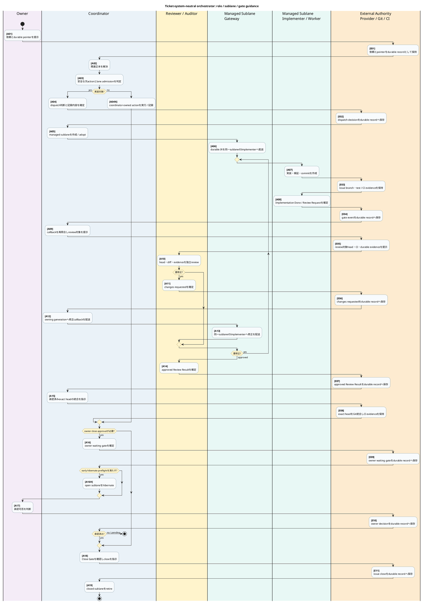

# チケット管理システム非依存のイベント駆動オーケストレーター設計

## 目的と設計判断

本書は、人間の依頼から管制、実装、レビュー、統合、完了、レーン退役までを、途中で停止しても
再開可能に進める自動オーケストレーターの製品レベル設計正本である。主に定義するのは、
正本境界、イベント駆動の制御順序、再照合、停止、復旧、段階移行である。この責務に基づき、
静的な構造仕様を置く `vibes/docs/specs/` ではなく、意思決定と制御設計を置く
`vibes/docs/logics/` に格納する。

中核は Redmine ではなく `DurableWorkRecordPort` に依存する。Redmine は現在の
`mozyo_bridge` リポジトリで使う推奨・既定アダプターだが、製品の必須プロバイダーではない。
Asana や別の作業管理システムも、下記の契約を満たすアダプターを持てば同じ状態機械に接続できる。
プロバイダー固有のステータス、journal、comment の語彙を中核へ漏らさない。

一般的な内蔵プロバイダー分類、既存 `TicketProvider`、外部プラグインを公開しない境界は
`plugin-ready-adapter-boundary.md` が正本である。本書はそれを置き換えず、作業記録ポートを使って
オーケストレーターをどの順序で閉ループ化するかだけを定義する。

### なぜ単一入口にするのか

本設計の目的は、オーケストレーション知識をAIの推論能力、会話履歴、個別promptから切り離し、
mozyo-bridgeの再現可能なstate machineへ移すことである。モデル、provider、role、sessionが変わり、
通知欠落や再起動が起きても、各agentが同じ標準入口を実行すれば、durable stateから安全な次の一手、
または明確な停止理由とnext ownerを得られるようにする。これにより、人間がagentごとに手順を
教え直す負担を減らす。ただし自律化はauthorityの拡張ではない。review、owner、release、credential、
破壊操作の判断は、標準入口が代行せず明示的なauthorityへ返す。

将来の変更は次の判断基準に従う。

- 新しいworkflow遷移は、通常AI向けcommandを増やす前に`workflow step`のstate解決または内部primitiveを拡張する。
- AIがpane、rail、role固有primitiveを選ばなければ進めない状態は、目標UXに対する設計負債として扱う。
- `blocked`とexact next action / next ownerの返却は安全な製品結果であり、別commandの推測を促さない。
- 実装やreview判断のようなdomain workは自動決定せず、`workflow step`が必要な作業とauthorityを案内し、
  durable eventが追加された後に同じ入口から再開する。
- primitiveはcompatibility / debug / 実装部品として残せるが、通常のagent手順へ昇格させない。

```yaml
architecture_status:
  product_contract: target
  current_release: 0.12.2
  current_snapshot_date: 2026-07-20
  current_work_record_adapter: redmine
  provider_requirement: durable_work_record_contract
  redmine_requirement: false
```

## 読み方と用語の状態

本書では、現行実装と目標設計を同じ見た目で混ぜない。用語と図中の操作には、次の状態を明示する。

| 状態 | 意味 | 例 |
| --- | --- | --- |
| `current-public` | 0.12.2の公開CLIとして実行できる | `mozyo-bridge workflow step`、`mozyo-bridge docs resolve` |
| `current-internal` | 現行sourceに存在するが、単独の公開CLI契約ではない | `WorkflowRuntimeStore`、`WorkspaceCallbackSupervisor`、各種generation fence |
| `target-only` | 本書が予約する目標契約。現行sourceの型や公開CLIではない | `DurableWorkRecordPort`、`DurableWorkEvent` |
| `external-authority` | mozyo-bridgeが代行しない人間・Git・CI・ticket providerの操作 | review判断、Git統合、owner承認、issue close |

`admission`、`dispatch`、`generation fence` は製品で使われている正式な用語群だが、単独では
実行面を一意にしない。本書では必ず対象を限定する。

| 限定語 | 意味 | 現行の主な公開surface |
| --- | --- | --- |
| lane admission | laneを並列dispatch可能か分類するread-only/advisory判断 | `mozyo-bridge workflow admission`、`mozyo-bridge workflow lane-admission`、`mozyo-bridge workflow dispatch-plan` |
| Implementation Request dispatch | 永続IRを記録し、workerへanchor付きhandoffを送る | `mozyo-bridge workflow dispatch-ir --execute` |
| managed sublane dispatch | worktree・gateway・workerを作成またはadoptし、IRをdispatchする | `mozyo-bridge sublane create --execute` |
| same-lane worker dispatch | gatewayから同一laneのworkerへIRをforwardする | `mozyo-bridge sublane dispatch-worker --execute` |
| callback admission / delivery | callback recoveryを一度だけclaimし、outboxから配送する | `mozyo-bridge workflow callback-admit`、`mozyo-bridge workflow callbacks --deliver` |
| lane lifecycle generation | 同じlane名の新旧process・dispatch roundを区別する | `mozyo-bridge sublane create` / `mozyo-bridge sublane resume`が管理する。単独の「generation作成」commandはない |
| worker-dispatch fence | 同じdispatch actionの重複送信を拒否する | `mozyo-bridge workflow dispatch-fence`はstore lifecycle用。通常reserveはdispatch経路内部 |
| review-generation fence | review対象head・request journal・decisionの世代不一致を拒否する | `mozyo-bridge workflow callbacks --emit-gate --gate review_result ...` |
| callback outbox / publication fence | callbackのclaim・公開・再送状態を区別する | `mozyo-bridge workflow callbacks ...`、`mozyo-bridge workflow callback-publication ...` |
| coordinator-forward fence | Herdr上の同じforward generationの重複実行を拒否する | `mozyo-bridge workflow forward-fence`はstore lifecycle用。通常reserveは`mozyo-bridge workflow step`内部 |

従って図中で単に「admission」「dispatch」「generation fence」とは書かない。どのauthority、
identity、公開commandを指すかをaction IDで直下のcommand ledgerへ接続する。なお「三次元図」は
採用しない。主図は一枚のPlantUML swimlane activityとし、人間が読むactionにはguidanceとIDだけを
表示する。実command、side effect、現行／目標境界は同じIDを持つledgerで追跡する。

## 対象外

- LLM に製品・業務領域・設計の判断を無制限に委ねること。
- 作業項目の作成・選択、レビュー承認、所有者承認を実行時状態から自動承認すること。
- リリース、公開、credential、破壊的操作を通常のcallbackの延長で実行すること。
- pane、terminal、UI、SQLiteの投影をワークフローの正本にすること。
- 任意コードを読み込む外部プラグインAPIを公開すること。

## 永続作業記録ポートの契約

`DurableWorkRecordPort` は、チケット管理システムの違いを次の閉じた契約へ正規化する
`target-only`の予約名である。0.12.2のsource typeや公開CLIとして実装済みという意味ではない。
操作名とfield名は目標契約の識別子として英字のまま固定する。

```yaml
DurableWorkRecordPort:
  required_operations:
    - read_work_item(work_item_ref) -> WorkItemSnapshot
    - resolve_parent_scope(work_item_ref) -> ParentScope
    - list_events(work_item_ref, after_cursor) -> EventPage
    - append_event(work_item_ref, event_command, idempotency_key) -> DurableAnchor
  optional_operations:
    - list_candidates(scope_query) -> CandidatePage
  required_properties:
    - stable work_item_ref and event_id
    - provider-issued durable anchor
    - deterministic event order or cursor
    - scoped read and append authorization
    - idempotent append or caller correlation key
    - structured event kind; prose inference is not required
  failure_policy: fail_closed_without_provider_fallback_guess
```

中核が読む正規化イベントは次の形とする。`payload_ref` はプロバイダー上の永続記録を指し、
秘密値、paneのscrollback、生のpromptを複製しない。

```yaml
DurableWorkEvent:
  provider: <adapter id>
  project_key: <provider-scoped project id>
  work_item_id: <stable id>
  event_id: <provider event id or deterministic correlation id>
  source_sequence: <ordered cursor>
  event_kind: <category-scoped closed workflow event vocabulary>
  actor_role: <workflow role>
  lane_generation: <integer or none>
  durable_anchor: <provider-issued pointer>
  payload_ref: <same-system detail pointer>
  occurred_at: <provider timestamp>
```

Redmineアダプターは `work_item_id=issue id`、`event_id/source_sequence=journal id`、
`durable_anchor=issue + journal` として写像する。Asanaアダプターならtask、story、commentを
同じ正規化形式へ写像する。プロバイダーごとのgate解釈はアダプターが検証するが、中核の
`event_kind` と権限境界は変えない。

`event_kind`は一個の曖昧な語彙へ平坦化しない。現行0.12.2では、次の公開surfaceが受理する
category別closed vocabularyをauthorityとする。

| category | authority / 確認command | 規律 |
| --- | --- | --- |
| workflow gate intake | central preset `Gate Schema`、`mozyo-bridge workflow watch --help` | `review` / `review_result`のような明示alias以外を推測しない |
| callback-required gate | `mozyo-bridge workflow callbacks --help`の`--gate` | worker progress vocabularyと混ぜない |
| worker progress | 同helpの`--progress-kind` | coordinator callbackを自動発生させない |
| dispatch round | `mozyo-bridge workflow dispatch-ir --help`のlane / generation marker | gate語彙へ混ぜない |

本書は新しい同義tokenを追加しない。特に`owner_action_waiting`は現行closed vocabularyに存在しないため
使用しない。owner closeのcallback-required stateは`owner_close_approval_waiting`、lane projectionは
`owner_waiting`であり、owner承認そのものはprovider上の`owner_close_approval` durable gateである。

webhookやpush通知は処理を早めるための最適化であり、必須契約ではない。取りこぼし回復の正本経路は、
順序付きcursorを使う有界ポーリングと巡回照合である。

## 正本境界

| 対象 | 正本となる情報 | 正本ではない情報 |
| --- | --- | --- |
| `DurableWorkRecordPort` | 目的、範囲、永続イベント、承認・レビュー・完了gate | 生きているprocess、commit内容 |
| Git・CI・artifact store | commit系譜、差分、test・build結果、artifact同一性 | 所有者の意図、ワークフロー承認 |
| mozyo実行時store | 畳み込み済み状態、cursor、outbox、lease、冪等性、lane / review / dispatch / callback別のfence | レビュー・完了・リリース承認 |
| 生きているagentの探索 | 操作時点の生存性、正確な配送先、プロバイダーprocess identity | 永続的な完了、経路方針 |
| リポジトリ文書・catalog | 方針、役割、port、状態遷移の不変条件 | 現在の実行時事実 |
| UI・cockpit・通知 | 時刻付き投影、永続anchorへのpointer | ワークフローの正本、操作権限 |

副作用の実行権限は、永続gate、Git・artifactの証拠、実行時fence、操作直前の生存確認を、
command境界ですべて照合した結果だけから得る。どれか一層だけでは許可しない。

## 一枚で読む標準フロー

主図は「誰が次に何を判断・実行するか」だけを示す。command全文を図へ詰めず、各actionの
`[Axx]`を直下のcommand ledgerへ接続する。PlantUML procedure `$guidance`はIDと表示形式を
一箇所で固定するための描画関数であり、runtime実装の関数ではない。

目標UXでは、Owner以外の各AI roleが次の工程を始める標準入口は常に
`mozyo-bridge workflow step`である。標準入口は、安全に許可済みの操作なら一手だけ実行し、
domain workまたは外部authorityが必要なら、その作業、停止理由、next ownerを返す。図のactionは
「次に必要な責務」を表し、直下ledgerの`target standard entry`と`現行command / 操作`を分けて、
目標入口と現在使うprimitiveを混同しない。

薄緑の2列は同じ`managed_sublane` execution boundaryを共有する。Gatewayはlane境界でdurable
anchorとroute identityを検証し、Implementer / Workerだけが実装差分を作る。黄色のReviewer /
AuditorはCoordinatorと別の論理roleであり、同じproviderを使う場合でもImplementerのself-reviewへ
統合しない。橙色のExternal Authority列はagent roleではなく、provider durable recordとGit / CIが
担うread / write / evidence境界である。lane列はprovider brandではなく責務を表す。


```plantuml
@startuml ticket_system_neutral_orchestrator_guidance
title Ticket-system-neutral orchestrator: role / sublane / gate guidance

skinparam shadowing false
skinparam activity {
  BackgroundColor #F8FBFD
  BorderColor #365A6C
  DiamondBackgroundColor #FFF4CC
  DiamondBorderColor #8A6D1D
}

!procedure $guidance($id, $label)
:<b>[$id]</b>\n$label;
!endprocedure

' 空actionを作らずlane順と同一sublaneの色を固定する。
|#F4ECF7|Owner|
|#EAF2F8|Coordinator|
|#FFF4CC|Reviewer / Auditor|
|#E8F8F5|Managed Sublane\nGateway|
|#E8F8F5|Managed Sublane\nImplementer / Worker|
|#FDEBD0|External Authority\nProvider / Git / CI|

|#F4ECF7|Owner|
start
$guidance("A01", "依頼とdurable pointerを提示")

|#FDEBD0|External Authority\nProvider / Git / CI|
$guidance("E01", "依頼とpointerをdurable recordとして保持")

|#EAF2F8|Coordinator|
$guidance("A02", "関連正本を解決")
$guidance("A03", "安全な次actionとlane admissionを判定")

if (実装対象?) then (yes)
  $guidance("A04", "dispatch判断と記録内容を確定")

  |#FDEBD0|External Authority\nProvider / Git / CI|
  $guidance("E02", "dispatch decisionをdurable recordへ保存")

  |#EAF2F8|Coordinator|
  $guidance("A05", "managed sublaneを作成 / adopt")

  |#E8F8F5|Managed Sublane\nGateway|
  $guidance("A06", "durable IRを同一sublaneのImplementerへ配送")

  repeat
    |#E8F8F5|Managed Sublane\nImplementer / Worker|
    $guidance("A07", "実装・検証・commitを作成")

    |#FDEBD0|External Authority\nProvider / Git / CI|
    $guidance("E03", "issue branch・test / CI evidenceを保持")

    |#E8F8F5|Managed Sublane\nImplementer / Worker|
    $guidance("A08", "Implementation Done / Review Requestを確定")

    |#FDEBD0|External Authority\nProvider / Git / CI|
    $guidance("E04", "gate eventをdurable recordへ保存")

    |#EAF2F8|Coordinator|
    $guidance("A09", "callbackを再照合しreview対象を提示")

    |#FDEBD0|External Authority\nProvider / Git / CI|
    $guidance("E05", "review対象head・CI・durable evidenceを提示")

    |#FFF4CC|Reviewer / Auditor|
    $guidance("A10", "head・diff・evidenceを独立review")
    if (要修正?) then (yes)
      $guidance("A11", "changes requestedを確定")

      |#FDEBD0|External Authority\nProvider / Git / CI|
      $guidance("E06", "changes requestedをdurable recordへ保存")

      |#EAF2F8|Coordinator|
      $guidance("A12", "owning generationへ修正callbackを配送")

      |#E8F8F5|Managed Sublane\nGateway|
      $guidance("A13", "同一sublaneのImplementerへ修正を配送")
    endif
  repeat while (要修正?) is (yes) not (approved)

  |#FFF4CC|Reviewer / Auditor|
  $guidance("A14", "approved Review Resultを確定")

  |#FDEBD0|External Authority\nProvider / Git / CI|
  $guidance("E07", "approved Review Resultをdurable recordへ保存")

  |#EAF2F8|Coordinator|
  $guidance("A15", "承認済みexact headの統合を指示")

  |#FDEBD0|External Authority\nProvider / Git / CI|
  $guidance("E08", "exact headをGit統合しCI evidenceを保持")
else (no)
  |#EAF2F8|Coordinator|
  $guidance("A04N", "coordinator-owned actionを実行 / 記録")
endif

|#EAF2F8|Coordinator|
if (owner close approvalが必要?) then (yes)
  $guidance("A16", "owner waiting gateを確定")

  |#FDEBD0|External Authority\nProvider / Git / CI|
  $guidance("E09", "owner waiting gateをdurable recordへ保存")

  |#EAF2F8|Coordinator|
  if (early hibernate preflightを満たす?) then (yes)
    $guidance("A16H", "open sublaneをhibernate")
  endif

  |#F4ECF7|Owner|
  $guidance("A17", "承認可否を判断")

  |#FDEBD0|External Authority\nProvider / Git / CI|
  $guidance("E10", "owner decisionをdurable recordへ保存")

  |#EAF2F8|Coordinator|
  if (承認済み?) then (yes)
  else (no / pending)
    stop
  endif
endif

|#EAF2F8|Coordinator|
$guidance("A18", "Close Gateを確認しcloseを指示")

|#FDEBD0|External Authority\nProvider / Git / CI|
$guidance("E11", "issue closeをdurable recordへ保存")

|#EAF2F8|Coordinator|
$guidance("A19", "closed sublaneをretire")
stop
@enduml
```

## Action ID command ledger（target standard entry / 現行0.12.2）

CLI helpをflagの正本とすることと、設計書からcommand名を省くことは別である。主図の全actionは
このledgerで、目標の標準入口と現行公開surfaceまたは「現行公開commandなし」へ必ず接続する。
`workflow step → guidance`は、そのroleが同じ入口から必要なdomain work / authorityを知るが、判断や
外部操作そのものは代行しないことを表す。複数commandは`<br>`で分け、図の人間向けguidanceへ
逆流させない。

| ID | action / 責務 | target standard entry / outcome | 現行command / 操作 | target gap・authority境界 |
| --- | --- | --- | --- | --- |
| `A01` | Owner: 依頼とdurable pointer | 対象外: Owner / provider action | provider UI / API / MCP（`mozyo-bridge` commandなし） | `external-authority`。pane通知はpointerであり正本ではない |
| `E01` | External Authority: intake保持 | 対象外: provider durable write | provider UI / API / MCP | provider-neutral `append_event`は`target-only` |
| `A02` | Coordinator: 関連docs解決 | `mozyo-bridge workflow step → execute / guidance` | `mozyo-bridge docs resolve <paths...> --repo .` | `workflow step`からcatalog解決までの一貫したguidanceを固定する |
| `A03` | Coordinator: next action / lane admission | `mozyo-bridge workflow step` | `mozyo-bridge workflow step --dry-run --json`<br>`mozyo-bridge workflow admission` / `mozyo-bridge workflow lane-admission` / `mozyo-bridge workflow dispatch-plan` | 現行`workflow step`の解決範囲を全lifecycleへ拡張する |
| `A04` | Coordinator: dispatch decision確定 | `mozyo-bridge workflow step → guidance / blocked` | `mozyo-bridge workflow admission --journal`等で本文をrender | work item選択は自動判断せず、必要authorityと記録内容を返す |
| `E02` | External Authority: dispatch decision保存 | `mozyo-bridge workflow step → execute`（authority確定後） | provider UI / API / MCP | provider-neutral writerとidempotent appendが未実装 |
| `A04N` | Coordinator: coordinator-owned action | `mozyo-bridge workflow step` | `workflow step`で許可済みの一手、またはprovider / Git操作 | action固有authorityを再照合し、対象外判断は`guidance / blocked`で返す |
| `A05` | Coordinator: managed sublane作成 / adopt | `mozyo-bridge workflow step → execute` | `mozyo-bridge sublane create --issue <id> --lane-label <label> --branch <branch> --worktree <path> --base-ref origin/main --journal <j> --execute` | durable decisionからlifecycle primitiveを安全に選ぶ統合が未完成 |
| `A06` | Gateway: durable IRをsame-lane dispatch | `mozyo-bridge workflow step → execute` | `mozyo-bridge workflow dispatch-ir --issue <id> --lane <lane> --generation <n> --body-file <path> --target <worker> --target-repo <repo> --gateway-callback-target <gateway> --role-profile implementation_worker --execute`<br>`mozyo-bridge sublane dispatch-worker --issue <id> --lane-label <label> --journal <j> --execute` | Gateway role / generation / anchorからprimitiveを自動選択する範囲が未完成 |
| `A07` | Implementer / Worker: 実装・test・commit | `mozyo-bridge workflow step → guidance / blocked` | Git / test command（全体を代行する`mozyo-bridge` commandなし） | domain workは意図的に自動決定しない。Implementerだけが実装diffを作る |
| `E03` | External Authority: branch / CI evidence保持 | `mozyo-bridge workflow step → read / verify` | Git / CI | commit系譜とtest evidenceはGit / CIがauthority |
| `A08` | Implementer / Worker: gate内容確定 | `mozyo-bridge workflow step → guidance / execute` | `mozyo-bridge workflow callbacks --emit-gate --issue <id> --gate implementation_done ...`<br>`mozyo-bridge workflow callbacks --emit-gate --issue <id> --gate review_request --target-head <sha> ...` | evidenceからgate候補を案内しても、未確定内容を自動承認しない |
| `E04` | External Authority: gate event保存 | `mozyo-bridge workflow step → execute`（内容確定後） | 現行`mozyo-bridge workflow callbacks --emit-gate`がRedmine journalへwrite | provider-neutral append未実装。未記録はnon-zero |
| `A09` | Coordinator: callback再照合・review提示 | `mozyo-bridge workflow step` | `mozyo-bridge workflow supervisor --run-once --json`<br>`mozyo-bridge workflow glance --json` / `mozyo-bridge workflow resume --json` / `mozyo-bridge workflow step --dry-run --json`<br>`mozyo-bridge handoff send --to codex --source redmine --issue <id> --journal <review-request-j> --kind review_request --target <reviewer> --target-repo <repo>` | supervisor / projection / delivery選択を単一入口へ閉じる |
| `E05` | External Authority: review evidence提示 | `mozyo-bridge workflow step → read / verify` | Git / CI / provider read | exact head、CI、Review Requestの連言を維持する |
| `A10` | Reviewer / Auditor: 独立review | `mozyo-bridge workflow step → guidance / blocked` | Git / CI / durable Review Requestを読む（review判断を代行する`mozyo-bridge` commandなし） | review判断は意図的な`external-authority`であり自動承認しない |
| `A11` | Reviewer / Auditor: changes requested確定 | `mozyo-bridge workflow step → guidance` | `mozyo-bridge workflow callbacks --emit-gate --issue <id> --gate review_result --target-head <sha> --review-request-journal <j> --review-decision changes_requested --review-findings-json <path>` | 判断入力なしにdecision / finding集合を推測しない |
| `E06` | External Authority: changes requested保存 | `mozyo-bridge workflow step → execute`（decision確定後） | 現行`mozyo-bridge workflow callbacks --emit-gate`がRedmine journalへwrite | provider-neutral append未実装。exact head / request journalを必須にする |
| `A12` | Coordinator: correction callback再照合・配送 | `mozyo-bridge workflow step → execute` | `mozyo-bridge workflow supervisor --run-once --json` | owning generationへのcallback選択を単一入口へ閉じる |
| `A13` | Gateway: same-lane Implementerへ修正配送 | `mozyo-bridge workflow step → execute` | `mozyo-bridge handoff send --to claude --source redmine --issue <id> --journal <j> --kind review_result --role-profile implementation_worker` | Coordinatorから別lane Workerへ直接送信せずGateway境界を維持する |
| `A14` | Reviewer / Auditor: approval確定 | `mozyo-bridge workflow step → guidance` | `mozyo-bridge workflow callbacks --emit-gate --issue <id> --gate review_result --review-decision approval --target-head <sha> --review-request-journal <j> --review-generation-json <path> --consumer-id <id>` | review判断は自動化せず、generation fence通過後だけ記録する |
| `E07` | External Authority: approval保存 | `mozyo-bridge workflow step → execute`（decision確定後） | 現行`mozyo-bridge workflow callbacks --emit-gate`がRedmine journalへwrite | provider-neutral append未実装。head / req / conclusionを連言する |
| `A15` | Coordinator: integration disposition | `mozyo-bridge workflow step → guidance / blocked` | Git / CI操作（`mozyo-bridge` integration commandなし） | 現行policyでは自動merge禁止。approved exact headの明示的dispositionを維持する |
| `E08` | External Authority: Git統合 / CI evidence | 対象外: 現行は明示Git / CI操作 | `git merge --ff-only` / CI | 自動統合は今回のtarget契約に含めず、policy変更なし |
| `A16` | Coordinator: owner waiting確定 | `mozyo-bridge workflow step → execute` | `mozyo-bridge workflow callbacks --emit-gate --issue <id> --gate owner_close_approval_waiting ...` | owner actionが必要なgateをReview Resultと分離する |
| `E09` | External Authority: owner waiting保存 | `mozyo-bridge workflow step → execute`（内容確定後） | 現行`mozyo-bridge workflow callbacks --emit-gate`がRedmine journalへwrite | provider-neutral append未実装 |
| `A16H` | Coordinator: eligibleなopen sublaneをhibernate | `mozyo-bridge workflow step → execute`（手動）／ `mozyo-bridge workflow supervisor --run-once`・`--watch`（自動, #14219） | `mozyo-bridge sublane hibernate --issue <id> --lane <label> --journal <j> <measured-preflight-flags> --execute` | measured preflightをstate machineへ接続する。hibernateはclose / approvalではない。自動path (#14219) は同じ public preflight / actuation primitiveをevent-driven supervisorのbounded passへfoldする（下記「自動 hibernate」） |
| `A17` | Owner: owner close approval判断 | 対象外: Owner action | provider UI / API / MCP | 未承認・不明はfail-closedでopenのまま停止 |
| `E10` | External Authority: owner decision保存 | 対象外: provider durable write | provider UI / API / MCP | provider-neutral append未実装。標準入口は承認を代行しない |
| `A18` | Coordinator: Close Gate / close指示 | `mozyo-bridge workflow step → guidance / execute` | provider UI / API / MCP（provider-neutral `mozyo-bridge` close commandなし） | review、owner approval、commit evidenceを満たすclose operationが未実装 |
| `E11` | External Authority: issue close保存 | `mozyo-bridge workflow step → execute`（authority充足後） | provider UI / API / MCP | provider-neutral close / append未実装 |
| `A19` | Coordinator: closed sublane退役 | `mozyo-bridge workflow supervisor --run-once`（自動）／高レベル `sublane retire`（手動） | supervisor は callback/backlog delivery 後・hibernate 前に一意候補を同一 lease 下で退役。手動 rail は `mozyo-bridge sublane retire --issue <id> --journal <j> --lane-label <label> --branch <branch> --integration-branch main --issue-closed --callbacks-drained --verified --durable-record --target-identity-known --latest-generation-admissible --execute` | 自動経路は shared typed API で1 pass 1 mutation、2回の完全 snapshot 一致を要求。worktree / local branch / remote branchは削除しない |

### 自動 hibernate（A16H auto path, #14219）

`A16H` は手動 `sublane hibernate --execute` に加えて、event-driven supervisor（`mozyo-bridge
workflow supervisor --run-once` / `--watch`）の bounded pass に **一 leg として fold** され、drain-ready
lane を coordinator 手動起動なしで自動 hibernate する（#14219 T3）。第二 supervisor / 第二 queue /
第三 scheduler cadence / 公開 `--hibernate` action は追加せず、既存の owned dual-agent lifecycle と
同じ public preflight / actuation primitive（`sublane hibernate` の measured preflight + T0/T1/T2
TOCTOU fence + lifecycle CAS）へ委譲する。

- **budget**: 一 bounded pass は delivery / reconcile / hibernate 合計で **最大 1 件の external
  mutation**。callback/outbox delivery を先に保ち、先行 leg が mutation または uncertain の場合は
  hibernate を typed defer する（Design Disposition。正本 anchor は Redmine #14219）。
- **wake 束縛**: `local_wake`（event-wake）は起床対象 issue の lane のみ hibernate し、
  `bounded_reconciliation`（timer/restart fallback）が whole-roster candidate selection を行う。
- **観測**: report は candidate / claimed / applied / released capacity / blocked / uncertain と、
  drain-ready（basis decision journal の provider `created_on`）から terminal disposition までの
  closed-enum time-to-drain status + nullable latency を secret-safe に roll up する。
- **public surface / tests**: 公開入口は `workflow supervisor` bounded pass と `sublane hibernate`
  で、新規 command は追加しない。実装・受入は #14219 の T3 tests（folded pass / pass-external-budget
  / time-to-drain / hibernate actuation）を正本とする。

### 自動 retire（A19 auto path, #15066）

既存 `workflow supervisor` bounded pass は、callback/backlog delivery 後・hibernate 前に、終了済み候補を最大1件だけ高レベル `sublane retire` と共通の typed application APIへ渡す。候補探索は `workflow step` へ追加せず、第二 supervisor / queue / schedulerも作らない。

- **authority**: durable issue close、callback debt 0、owner gate解消、最新review approval、integration disposition、exact integration CI green、clean worktree、branch tip、origin到達性、workspace/lane/generation/revisionを読み、effect直前に同じ完全snapshotを再生成する。exactly oneかつ2回が完全一致するときだけactuateする。
- **budget / ordering**: callback delivery / auto-integration / retire / hibernateが1 pass最大1件のexternal mutationを共有する。先行mutation/uncertainはretireをdeferし、retire mutation/uncertainはhibernateをdeferする。同じworkspace leaseを保持し、effect前にrenewできなければzero-mutation。
- **result**: `retired | already_retired | blocked | deferred | uncertain`、fixed reason、mutation/uncertaintyをstructured reportへ載せる。例外や部分作用不明は後続mutationを止める。
- **Git cleanup境界**: managed process/lifecycle terminalizationまでが自動範囲。worktree remove / local branch deleteはatomic identity guard不足のため`cleanup_blocked`とoperator runbookへ残し、forceとremote branch削除を禁止する。

`docs validate`はcatalogを検査するcommandであり、関連文書を解決するcommandではない。解決は必ず
`mozyo-bridge docs resolve`で行う。また`mozyo-bridge workflow admission`や
`mozyo-bridge workflow dispatch-plan`のadvisory出力は、providerへ記録されるまでdurable
decisionではない。

`DurableWorkRecordPort` / `append_event`は`target-only`であり、上のprovider read / writeを現行
0.12.2で代行する公開commandではない。review判断も同様に`external-authority`であり、
mozyo-bridgeは対象identityの検証、marker-bearing resultの記録、callback配送だけを担う。

`handoff send --role-profile`の現行closed vocabularyにはReviewer / Auditor専用profileがない。
従って`A09`は`kind=review_request`、durable anchor、明示targetでreview workを配送し、reviewerの
独立性はpresetのrole境界とReview Request / Resultの別actor記録で担保する。未実装profile名を
設計書だけで追加しない。

## 再照合契約と停止条件

一回のbounded reconcile pass（現行公開surfaceは`mozyo-bridge workflow supervisor --run-once`）は、
新しい永続eventを畳み込み、許可済みの安全な操作を最大一つだけ実行し、結果を記録して終了する。
`--watch`や常駐serviceであっても、一回のpassを無期限待機にしない。

```yaml
cycle:
  - read durable events after stored cursor
  - normalize and fold deterministic state
  - resolve exactly one next action
  - validate durable authority and the exact named fence for this action
  - reserve idempotency / outbox key
  - perform at most one external mutation
  - record delivered, blocked, or uncertain outcome
hard_stop:
  - missing or ambiguous durable anchor
  - provider read/write failure
  - stale lane generation or ambiguous live route
  - unresolved review, owner, release, credential, or destructive gate
  - commit / artifact identity mismatch
  - reserved or uncertain prior send without explicit reconciliation
recovery:
  - restart from durable cursor and runtime outbox
  - re-read the exact provider event before mutation
  - never infer progress from notification or pane text
```

## local drain と provider reconciliation の分離（#14150）

`mozyo-bridge workflow supervisor` の bounded one-shot pass は、次の三つの独立した実行経路へ分離する。
いずれも `WorkspaceCallbackSupervisor` を唯一の reconcile owner として共有し、第二 supervisor / 第二
outbox を作らない。local 状態 DB は derived state であり Ticket System Port の durable work record を
置き換えない。

| 経路 | current-public 入口 | provider 読み取り | 役割 |
| --- | --- | --- | --- |
| local outbox drain | `workflow supervisor --drain-only`（`SUPERVISION_LOCAL_DRAIN`） | **0** | local 状態だけを読み、local に attest 済みの pending row を claim・deliver する |
| event-driven ingest / wake | `workflow supervisor --watch`（`SUPERVISION_LOCAL_WAKE`） | 起床 issue のみ bounded | canonical gate 記録後、periodic reconcile を待たず即時 one-shot で到達する |
| ticket-provider reconciliation | `workflow supervisor --run-once`（`SUPERVISION_BOUNDED_RECONCILIATION`） | cursor/watermark + jitter/backoff で有界 | 起床喪失・外部/MCP 更新・restart を回収する低頻度 fallback |

### local drain の 0 provider-call 契約

local drain は ticket-provider source を一切 resolve しない（`redmine_source_fn` を呼ばない）。空 pass
と「安全に送信可能な pending pass」の双方で provider call は 0 である（`SupervisorReport.provider_calls`
で観測可能、`empty_pass` も併記）。row を local に安全に attest できる条件は、その row の
`enqueue_lane_generation`（ingest 時に **local lifecycle authority** から刻んだ owning-lane generation）が
現在の local lane generation と一致することである。coordinator route のみがこの local 属性で attest でき、
`review_return:<lane>` / `lane_gateway:<lane>` は送信時 round-fence（provider 読み）が必要なため drain は
それらを claim せず（route filter）、reconciliation 経路へ倒す。attest できない row は blind send せず
`deferred`（pending へ戻す。terminal 化しない・retry を消費しない）として reconciliation に委ねる。

drain の配送冪等性は outbox の row-level `claim_token`（`BEGIN IMMEDIATE` の単一勝者）が担う。workspace
lease は duplicate-supervisor fence（active duplicate owner の二重実行防止）として維持し、drain もこの lease
を通常取得する。

### provider reconciliation の cadence

provider reconciliation は per-workspace durable watermark（`reconcile-cadence.sqlite`）+ 連続空 pass の
指数 backoff + jitter で、全 workspace・全 journal の再読を常時の既定にしない。backoff window 内の workspace
は当該 pass で local drain へ downgrade する（provider 読み 0）。watermark は完了した provider 読みでのみ前進
し、drain-only tick は watermark を進めない（fallback を抑制しない）。cadence が壊れても安全側（未 reconcile
→ due）に倒れる rebuildable cache である。

さらに due な workspace 内でも **changed-work incremental read** で issue 単位に fetch を絞る（#14150 review F2）:
provider-neutral changed-work port（`select_reconcile_issues`）が、roster issue のうち (a) provider 変更
（Redmine adapter は `updated_on` を overlap 付きで問い合わせる changed-work watermark）**または** (b) local
snapshot 変化（owning-lane / generation / disposition / owner の per-issue fingerprint。provider が見ない
local 変化＝owner 解消を捕捉）**または** (c) 未処理の local outbox work、を持つものだけを provider-reconcile し、
残りは skip する（provider 読み 0、safe pending は local drain が配送）。changed-work watermark と per-issue
snapshot は成功 pass のみ前進する。changed-work read の失敗は fail-open（全 roster を reconcile）で provider
fallback を抑制しない。★(b) が必須なのは、単純な `updated_on` gating だけでは一時 refuse された gate（例:
ambiguous owner）が後で解消しても Redmine journal 変更を伴わず skip され永久 zero-send になる（review F3
regression）ため。local snapshot 変化が解消を捕捉して再 fetch を強制する。Redmine issue-detail は server-side
journal since を持たないため、fetch 削減は changed-issue 選別（不変 issue の detail fetch を省く）で得る。

### lease lifecycle（bounded / error 終了）

通常 `--run-once` 終了は workspace lease を解放する。`--watch` は iteration 跨ぎで lease を保持
（`release_after=False`）するが、bounded 終了・exception・`wake=error` の終了時に
`release_all_leases()`（token-conditional）で保持 lease を解放する。これにより終了済み holder の lease が
fallback `--run-once` を TTL まで starve させない。token-conditional なので新規 live owner の lease は evict
せず、duplicate-owner fence は維持する。

### OS scheduler adapter

LaunchAgent / systemd timer / cron は同じ bounded one-shot command を起動する adapter であり、LLM turn 内の
sleep/poll を要求しない。OS scheduler が登録するのは **`--run-once` のみ** であり、`--drain-only` /
`--watch` は手動・event-driven 入口として残るが OS timer へ登録しない（#15192）。portable default は
測定に基づく neutral 値（固定の私的運用値を OSS 既定へ焼かない）を持つ。

host realization は operator 契約（`status` / `install` / `restart` / `uninstall`）を共有する。#15192 以降は
**operator から見える形**——登録数（各 host 1 個）、実行 command（`workflow supervisor --run-once`）、cadence
（共通 portable default）、verb の意味、status が答える観測値——も共通である。共通化しないのは **内部実装**で
あり、launchd と systemd を互いの模倣にせず、cron 等へ無理に統一しない。どちらを使うかは
`supervisor_service_backend` が platform で解決し（darwin -> LaunchAgent、Linux -> systemd user、それ以外 ->
typed zero-mutation refusal）、結果 envelope を `{action, performed, reason, backend, agents: [...]}` に正規化
する。両 adapter が同名・同 signature の 4 verb を公開するため、backend に platform 別の呼び分けは残らない。

**macOS LaunchAgent** の realization（`supervisor_launchd`）は **owned agent 1 個**である。#14150 で導入した
`--drain-only` の第二 agent（`callback-supervisor.drain`）は #15192 で退役した: `--run-once` tick は drain leg
を含む **superset**（local drain を実行し、watermark が due なら provider leg も実行する）であるため、第二
agent が買っていたのは capability ではなく latency であり、その対価は Login Items に見える登録がもう 1 つ増え
ることと、整合を保つべき lifecycle がもう 1 つ増えることだった。各 verb は非 darwin / 実行ファイル欠落 /
退役 plist の identity 不明 / not-loaded で zero-mutation 拒否し、RunAtLoad + StartInterval（KeepAlive なし、
EnvironmentVariables なし）契約を維持する。**credential 未整備は拒否理由ではない**（両 OS 共通、後述の
「Redmine 未設定は導入の拒否理由にしない」を正本とする）。

**退役 agent の migration**（#15192）。#15192 以前に install した host には第二 LaunchAgent が残る。これを放置
すると受入条件（macOS は LaunchAgent 1 個）が破れ、既に包含済みの `--drain-only` tick が走り続けるため、
`install` / `uninstall` が**取り外す**。ただし取り外すのは **自分のもの** と証明できる場合だけである: plist は
自身の `Label` を持ち launchd はその Label で service を識別するので、退役 path に置かれた別 Label の file は
他人の agent であり、unlink は他人の service の削除になる。分類は `absent` / `owned` / `foreign` /
`unreadable` の 4 値で、`owned` だけが削除可能、`foreign` / `unreadable` は typed zero-mutation 拒否とする
（identity は推測しない）。

**停止は「試みた」ではなく「確認した」でなければならない**（review j#102151 Finding 1）。plist の unlink は
registration の削除ではない: launchd は bootstrap 済み job を **label** で保持するため、file を消しても job は
logout まで走り続ける。したがって退役 plist の削除は **「退役 job が消えている」という positive な証拠**が
得られた場合に限る。証拠の取り方は次の 2 つだけである:

1. `launchctl bootout` が **rc 0 で成功した** —— 自分でいま unload したのだから確実であり、error taxonomy の
   解釈に一切依存しない。
2. bootout が失敗し、続く `launchctl print` が **「そのような service は無い」と明示的に報告した** —— 元から
   load されていなかった場合であり、既に停止済みの退役 agent の通常状態である。

bootout の return code **単体**は判定に使わない（未 load の label にも非ゼロを返すため、失敗と読むと正常な
migration をすべて拒否する）。ただしその **成功は事実として使う**。これにより通常経路は error 解釈を経由せず
確定し、推測に依存するのは「元から load されていなかった」case だけになる。

**「読めなかった」を「無かった」に畳まない**（review j#102180 finding 1）。probe は `loaded` /
`confirmed_absent` / `unreadable` の 3 値であり、**`confirmed_absent` だけが削除を許可する**。権限不足・
service manager 異常・認識できない失敗・launchctl 不在はすべて `unreadable` であり、
`legacy_drain_state_unreadable` で拒否する。以前の版は `launchctl print` の非ゼロをすべて「not loaded」へ畳んで
いたため、**実際には読めていない状態を検証済みの停止として** plist を削除できてしまった。`still_loaded` と
`state_unreadable` は事実が異なる（「動いている」と「判別できない」）ため token を分ける。どちらの拒否でも退役
plist は**あえて残す**: それが operator にとって「まだ生きている登録があるかもしれない」ことを示す唯一の
durable な手掛かりであり、消せば live job を隠すことになる。

not-found の認識は **連言**である（review j#102200 finding r3f1）。`confirmed_absent` は次の**すべて**を要求する:
(1) `launchctl` の exit code が unknown label のもの、(2) 認識可能な not-found 語を含む、(3) その出力が
**自分の label を quote 付きで完全一致に名指ししている**、(4) 権限エラー等「不存在以外の理由で読めなかった」
signal を含まない。

(3) は「owned label が文面のどこかにある」ではなく **not-found clause の service operand が owned である**
ことを要求する（review j#102383 finding r8f1）。以前は「not-found 語がどこかにある」と「owned label が引用
span のどこかにある」という **2 つの独立した存在確認**を連言と称していた。しかし
`Could not find service "com.example.other"; suggestion "<owned>"` は両方を満たしながら **別 service の不在**を
報告しており、この読みが所有 plist の unlink を authorize した。**「名前を含む」と「その service について
述べている」は別の主張**である。したがって recognized wording とその直後の引用 span を **1 つの clause**
として parse し、その operand が exact owned target / bare label の場合のみ `confirmed_absent` とする。
別 service の not-found と owned label の併記、phrase の前後に owned label があるだけの入力、clause が
複数ある入力（どれが支配するかの規則がない）は、すべて `unreadable` へ倒す。

**stderr と stdout は独立した原文として parse する**（review j#102417 finding r10f1）。両者を 1 文字列へ
連結してから parse すると、挿入した改行が「clause と operand の間は空白のみ」を満たし、
`stderr="Could not find service"` と `stdout='"<owned>"'` のように **どちらの stream 単独にも存在しない文**を
合成して削除を authorize できた。parser をいくら厳格化しても、**その入力を作る側が検査対象の隣接関係を捏造
できる**なら意味がない。したがって: (a) stream をまたぐ補完を行わない、(b) recognized clause を含みながら
operand を解決できない stream があれば `unreadable`（曖昧さを他方の肯定で埋めない）、(c) ours 以外を operand と
する stream があれば `unreadable`（相反）、(d) いずれかの stream が **同一 stream 内で** ours を operand として
解決した場合のみ `confirmed_absent`。denial signal はどちらの stream にあっても read 全体を失格させる。

clause と operand の結合は **位置つきの単一 scanner** で行う（review j#102398 finding r9f1）。phrase 探索と
引用符探索を別々に行うと、次のいずれも「clause」を満たしてしまい所有 plist の削除を authorize した:
operand が**非引用**で ours が後続の別 span（`... service com.example.other; suggestion "<owned>"`）、
phrase が**引用 span の内側**にあり「直後の引用符」が span の閉じである入力、**隣接する 2 phrase** を 1 clause へ
併合した入力。したがって (a) phrase は **span の外側**にあること、(b) clause は **真に重なる** hit のみ併合し
隣接は別 clause（= 複数 clause は unreadable）、(c) operand span は clause の**直後に開始**し間は空白のみ、
(d) operand は scanner 自身が確定した完全 span であること、をすべて要求する。
位置計算は **元文字列上**で行う（`lower()` は長さを変え得る code point があるため、畳んだ写しの offset を
元文字列へ添字すると位置がずれる）。

(3) の照合は **quoted 完全一致のみ**である（review j#102309 finding r5f1）。以前は label 継続文字を
「英数 + `.` `-` `_`」と *こちらで定義* し、その集合外を境界とみなしていたが、Apple 正本は `Label` を
「unique な識別文字列」と述べるのみで **この文字集合を規定していない**。結果として `<owned>@helper` /
`<owned>:helper` / `<owned>+helper` / `<owned>/helper` という **別ラベル**がすべて owned と一致し、その一致が
plist 削除の authorization に到達し得た。quote は境界を *観測* にする（推測ではない）。quote されない文面では
束縛を証明できないため `unreadable` へ倒す —— **実機文面を確定できるまで over-refusal を選ぶ**（#15194）。

(3) の完全一致は **decoded string（code point 列）の完全一致**であり、照合前に case を畳まない
（review j#102327 finding r6f1）。文面（not-found 語・権限 signal）は散文であり大小文字は契約でないため
case-insensitive に照合してよいが、**label は identity** である。両者を同じ正規化文字列で扱っていたため、
`ORG.MOZYO-BRIDGE...DRAIN` という **別の文字列** —— したがって本 adapter が install していない別 job —— の
not-found が owned の確認済み不在として通り、plist 削除の authorization に到達し得た。Apple 正本は `Label` を
「job を一意に識別する文字列」と述べるのみで **case-insensitive 照合を規定していない**ため、case-fold は契約ではなく
*こちらの仮定*であった。大小文字だけが異なる 2 つの label は、実機が別を示すまで **別 label** として扱う（#15194）。
文面用の正規化文字列と identity 用の未加工文字列は実装上も分離する。

（本節は当初「raw byte の比較」と記していたが、runner は `subprocess.run(..., text=True)` で decode 済み `str` を
返すため、この経路に byte は存在しない。実装が使っていない語で契約を書くこと自体が欠陥であり、
review j#102378 finding r7f1 の副次指摘として訂正した。）

(3) の照合は **substring 検索ではなく quoted-name の走査**である（review j#102378 finding r7f1）。
`f'"{token}"' in message` は「その 2 文字が存在する」ことしか確かめておらず、2 つの quote が **同一 span の両端**である
保証がなかった。別 label を backslash escape で `"prefix\"<owned>"` と表示した場合、hit の開始 quote は *その別 label の
データである escaped quote*、終了 quote は外側 delimiter であり、hit は plist 削除の authorization に到達し得た。
launchctl の error wording は API ではなく、**quote を含む label をどう表示するかは未確認**である。したがって
走査が認識する grammar は「escape を一切含まない plain な `"` で区切られた span」1 つに限定し、別の grammar が
使われている兆候 —— backslash の存在、quote 数の不均衡（閉じない span）、隣接する span（`""` 形式の escape の兆候）
—— が 1 つでもあれば **文面を解析不能として `unreadable` へ倒す**。解析できた場合のみ、完全な span 群と exact 比較する。
「解析不能」は「一致しない」ではなく、確認済み不在には決してならない。

以前は (1) **または** (2) で足りるとしていたため、`113` + `Operation not permitted`（権限失敗）が不存在と判定され
所有 plist を削除した。単独の signal はこの帰結を負うには弱すぎる: launchctl の man page は成功=0 / 失敗=非0 しか
定めておらず **113 を不存在の契約としていない**し、`print` 出力は **API ではなく変更され得ると明記**されている。
自分の label に束縛した連言にして初めて「行動してよいだけの具体性」を持ち、権限 signal の非存在を要求して初めて
「読めなかった理由」が「見るものが無い」として通らなくなる。

**認識漏れの失敗方向は over-refusal**（typed reason 付きで install を拒否し plist を保持）であり、under-refusal
（二重登録）ではない。実機で契約を確定できるまでは拒否側が正直な答えである。実 macOS signal との突合は #15194。

**状態は投影にも出す**（review j#102200 finding r3f2）。内部で 3 値化しても結果を `loaded` / `pid` へ縮約すると、
「停止確認済み」と「読めなかった」が**同一の辞書**になり operator も共通 CLI も識別できない。status は固定語彙の
`probe_state`（`loaded` / `confirmed_absent` / `unreadable`）を返す。**両 OS で同じ key・同じ語彙**とする（macOS
だけに出すと、共通契約を統一するために足した key が逆に契約を host 別に割る）。Linux 側は `systemctl show` が
読めたか否かから同じ語彙へ写す（`show` は未知 unit にも応答するため、空の結果は「unit 不在」ではなく
**読み取り失敗**である）。生の launchctl / systemctl 文面と秘密値は投影に出さない。

`systemctl show` の応答が **同一 property を相反する値で複数回**返した場合、`_show` は **read 全体を破棄**する
（review j#102383 finding r8f2）。dict 代入による last-wins は先行値を黙って失い、`ActiveState=inactive` の後に
`ActiveState=active` が来れば `loaded`、逆順なら `confirmed_absent` と、**同じ相反集合が行順だけで確定事実を
反転**させ、その値が実際の `systemctl --user restart` を authorize していた。どちらが authoritative かを決める
順序 authority は存在しないため、解決せず捨てる（= `unreadable`）。**同値の重複は矛盾ではない**ため保持する
（規則は重複ではなく相反についてである）。

`restart` は refusal 理由を事実に対応させる: 確認済みで停止していれば `service_not_loaded`、状態を読めなければ
`service_state_unreadable`。どちらも zero-mutation だが、**「動いていない」と「判別できない」を同じ token で
報告しない**（本 issue が繰り返し是正してきた区別を refusal 側でも保つ）。

**この refusal 語彙は両 OS 共通の契約である**（review j#102398 finding r9f2）。backend は verb の
operator-visible な意味を両 host 同一と宣言しているため、token は OS 固有の manager 名詞（timer / LaunchAgent
等）を含めず、両 adapter が同一 token を publish する。R8 で Linux 側にのみ区別を入れ macOS 側を bool へ縮退した
ままにしたことで、**共通化を目的とする本 issue で共通性を壊していた**。macOS `restart` も 3 値 probe を保持し、
`probe_state` を refusal に載せる。両 backend の unreadable / absent / loaded matrix は **backend envelope まで**
回帰で固定する。

Linux の `ActiveState` 分類は **closed vocabulary** である（review j#102309 finding r5f2）。
`active` / `reloading` -> `loaded`（systemd は `reloading` を「active かつ設定 reload 中」と定義する）、
`inactive` / `failed` -> `confirmed_absent`、`activating` / `deactivating`（遷移中）**および未知値** ->
`unreadable`。以前は「`active` 以外はすべて不在」という **open な否定**で分類しており、reload 中・遷移中・
将来 systemd が追加する値までを「確認済み不在」と *断定* していた。macOS 側の「unknown を *absent* へ畳まない」
規則と同じ規則の裏返しであり、**未知値をいかなる確認済み状態へも畳まない**。`loaded` 投影は
`probe_state == loaded` から導出し、同一 state machine について 2 つの答えが出ないようにする。

この照合は **case-sensitive かつ trim なし**、すなわち値の **exact 比較**である（review j#102327 finding r6f2 /
j#102378 finding r7f2）。正規化を 1 つ挟むたびに closed vocabulary が開いた: lower() は `INACTIVE` を確認済み不在・
`ACTIVE` を確認済み稼働として通し、strip は `ActiveState= inactive ` に同じことをした。systemd upstream の D-Bus 契約が
列挙する `ActiveState` は **padding を持たない lowercase literal** であり、大小文字違いも空白付きも本実装が
「認識済み」と宣言した語彙ではない。すなわち unknown であり `unreadable` へ倒す（macOS 側 r6f1 / r7f1 と同型の
「未確認の同一性・状態を確認済み事実へ昇格しない」規則）。

strip を「`key=value` 行の解析に由来する framing」とした当初の根拠は成立しない: `splitlines()` が既に line terminator を
除いており、最初の `=` より後ろは manager の回答そのものである。したがって authority を担う読取
（`ActiveState` / `UnitFileState`）では key・value とも manager が書いたまま扱い、**表示専用の値の整形は投影側で行う**。
両者を同じ reader で正規化すると、表示の都合が migration fence の語彙を広げることになる。

**分類の consumer は 1 つの state machine に 2 つの答えを出さない**（同 finding）。`restart` は raw 値を
`active` と直接比較していたため、`reloading` の timer が status では `loaded`、restart では
`service_not_loaded` になっていた。`restart` は status と **同一の分類**を読み、`loaded` の positive な確認が
取れたときだけ実行する。確認済み不在と読み取り失敗はどちらも拒否側であり、これは macOS adapter の `restart` が
既に持つ契約と同じである。

**順序は「先に退役、後に install」**であり、これが partial failure 下で不変条件を保つ順序である。逆順（install
してから migration）にすると途中失敗時に **登録が 2 個** 残る——本変更が終わらせようとしている状態そのものであ
る。退役を先に行えば残るのは 0 個か 1 個にしかならず、install の再実行は idempotent で、退役した drain leg は
`--run-once` が既に行うため capability の喪失にならない。refusal 条件（platform / executable /
退役 plist の identity）はすべて **どちらの mutation よりも前**に評価するので、拒否された install は
zero-mutation のままである（credential readiness は gate ではないため、この列挙に含まれない）。`uninstall` 側では foreign / unreadable な退役 plist は報告のみで、**自分の** agent
の削除を妨げない（他人の file を理由に自分の登録を残す方が有害である）。

**Linux systemd user timer** の realization（`supervisor_systemd`）は **owned service 1 個 + timer 1 個**であ
る。timer は portable default cadence ごとに `workflow supervisor --run-once` を 1 回起動し、process は毎 tick
終了する。

**unit の書込先（`XDG_CONFIG_HOME`）は環境変数の値を未加工で読む**（review j#102378 finding r7f3）。これは表示文字列では
なく **mutation target** である: `install` はここへ unit file を書き、`uninstall` はここの file を削除する。値を strip して
から絶対 path 判定していたため、XDG Base Directory Specification 0.8 の規則を同時に 2 方向へ破っていた ——
`" /tmp/x"` は **absolute ではなく**、spec は invalid として無視することを要求するのに、trim が有効な root へ昇格させて
そこへ install した。`"/tmp/x "` は末尾空白を名前に含む directory を指す **absolute path** なのに、trim が別 directory へ
書込先を変えた。したがって規則は: **unset または empty のときのみ** default（`~/.config`）、raw が absolute ならその
**exact path**、それ以外（relative・空白のみ等）は invalid として無視し default を使う。未加工で読むことは user manager と
一致する唯一の読み方でもある —— manager 自身の unit 探索 path も同じ未加工の変数から決まるため、trim した先へ書けば
`systemctl --user` から見えない場所へ install することになり、この adapter が無くそうとしている
silently unscheduled supervisor をこちらから作ることになる。

**OS tick は Redmine poll ではない。** provider 読み取りは supervisor 本体が持つ durable な
per-workspace cadence watermark（`reconcile_cadence` / `should_reconcile_source`、portable default 300 秒 +
empty pass での指数 backoff と jitter）で gate される。window 内の tick は provider 読み取り **0** の local pass
へ downgrade されるので、頻繁な tick は SQLite + Herdr で動き、Redmine は低頻度の取りこぼし回収に留まる。この
gating は supervisor 本体の責務であり、scheduler adapter 側は cadence を供給するだけで再実装しない。

### OS tick interval の portable default（#15192 実測）

interval は **同一の設定 surface**（`--tick-interval`、既定は
`DEFAULT_OS_TICK_INTERVAL_SECONDS`）から両 host へ与える。launchd の `StartInterval` と systemd の
`OnUnitActiveSec` は同じ値を受ける。portable default は **180 秒**で、根拠なく 60 秒へ固定しない（60 は退役し
た drain agent の cadence の名残であり、専用登録が無くなった今その継承に根拠はない）:

| 観点 | 60s | **180s** | 300s |
| --- | --- | --- | --- |
| local attest 済み row の回収最大遅延 | 60s | 180s | 300s |
| provider 要求 row の回収最大遅延（watermark 300s + tick alignment） | 360s | **480s** | 600s |
| tick 数 / 日 | 1440 | **480** | 288 |

tick 実測コスト（#15192 参照 host、空 registry の 1 tick）は **約 0.48s wall / 0.47s CPU**。180 秒なら約
480 tick/日、60 秒なら約 1440 tick/日である。#15192 以前の macOS pair は 1728 tick/日（reconcile 288 + drain
1440）だったので、単一 180 秒 tick は **約 72% 少ない** scheduled work で、fallback 遅延の悪化は最大 120 秒に
留まる。対話 latency を担うのは event-driven な `--watch`（#13758）であり、OS timer は取りこぼし回収の
fallback である。tick 落ちは損失にならない（次 tick が outbox を読み直す）ため、これは safety ではなく latency
の knob である。

300 秒（= provider cadence と同値）を採らない理由は二つある。tick が Redmine poll に見えること、そして tick が
watermark と整列するため due を僅かに逃した pass が丸ごと 1 周期待つこと（最悪 600 秒）である。OS tick は
provider cadence より **厳密に細かい**ことを test で固定する。

owned artifact は XDG user unit directory（`$XDG_CONFIG_HOME/systemd/user`、既定 `~/.config/systemd/user`）下の
service + timer である。対応関係:

| LaunchAgent | systemd user | 意味 |
| --- | --- | --- |
| `RunAtLoad` | `[Timer] OnActiveSec=0s` | timer が active になった瞬間に 1 tick（`enable --now` と以後の user manager 起動の両方を覆う） |
| `StartInterval=<N>` | `[Timer] OnUnitActiveSec=<N>s` | 前回実行から N 秒後に再実行（N は共通 portable default / `--tick-interval`） |
| `KeepAlive` 不在 | `Restart=` / `RemainAfterExit=` 不在 + `Type=oneshot` | bounded one-shot を常駐化・tight relaunch loop 化しない（false 設定ではなく **構造的に不在**） |
| `EnvironmentVariables` 不在 | `Environment=` / `EnvironmentFile=` 不在 | unit に secret を書き込む code path が存在しない |
| `ProgramArguments` | `ExecStart`（token ごとに systemd quote + `%` escape） | shell string ではない構造化 argv。`/bin/sh -c` を経由しない |

`ExecStart` の literal pin には **3 種類の escape が同時に要る**。空白 (token を double quote する)、quote / backslash (`\"` / `\\`)、そして **percent (`%` -> `%%`)** である。3 番目は cosmetic ではない: `ExecStart` は systemd **specifier** を解決するため、executable や `--home` path に含まれる `%h` 等を systemd が load 時に展開する。実測 (#15183 review j#102053 Finding 4): `ExecStart="/opt/%h/mozyo-bridge" "--home" "/tmp/%h"` を書いた unit を `systemctl --user show` で読むと `argv[]=/opt//home/holly/mozyo-bridge --home /tmp//home/holly` となり、unit file の literal 文字列とは別の executable / mozyo home が exec される。quote では展開を抑止できず `%%` だけが literal を固定する。escape を欠くと pin が pin でなくなるうえ、`executable_matches` が file の literal text と比較して `True` を返すため **drift を検出できない**。

readback (`parse_exec_argv`) は renderer の正確な逆で `%%` -> `%` を戻すが、**単独 specifier (`%h` 等) が残る場合は readback 全体を信頼しない** (`unreadable_unit` -> `executable_matches=false`、restart は fail-closed)。systemd しか知らない値へ展開されるため、file 上の argv は実行される argv ではないからである。手書き specifier を literal と誤読しない。

さらに、unit file は行指向であるため、改行・復帰・その他 C0 制御文字を含む token は「変な path」ではなく**別の unit** を生む (末尾が別 directive として解釈される)。これらは escape で安全にできないので、破損 unit を書く前に typed refusal (`supervisor_command_not_renderable`) で install を拒否する。

service unit は `[Install]` を持たない（enable するのは timer のみ。service を直接 enable すると login 時 1 回
だけ実行され cadence が消える）。timer は `OnCalendar` / `Persistent=` を持たない（取りこぼしの replay は不要で、
次 tick が前 tick の未処理を reconcile する）。log は systemd journal に出るため owned log path を作らない。
systemctl 呼び出しは常に構造化 argv（`daemon-reload` / `enable --now` / `disable --now` / `stop` / `restart` /
`show` / `reset-failed`）で、shell を経由しない。

**Redmine 未設定は導入の拒否理由にしない（両 OS 共通）。** #15192 以前は macOS のみ credential 未整備で
`install` / `restart` を拒否していたが、これは **install できるか否かという operator から見える答え**が host に
よって違う状態であり、#15192 が解消しようとしている差そのものだった（review j#102151 Finding 4）。macOS の
gate は supervisor の目的が Redmine reconciliation のみだった #13683 当時の前提の残存であり、#14150 の local
drain leg 以降、tick は provider 無しでも SQLite + Herdr から有用な仕事をする。よって macOS を #15183 で承認済
みの local-capable semantics へ揃えた。credential の扱いは一切緩めない: 値を読むのは
`resolve_redmine_credentials` のみで、unsafe file には警告を返して値を渡さず、plist / unit / status / log の
いずれにも credential は出ない。credential readiness は
zero-mutation refusal の gate ではなく **projection** として `missing` / `incomplete` / `unsafe` / `ready` の
token で報告する。ローカル情報だけで安全に行える処理を止めないためである。安全境界は破れない —
値を読むのは `resolve_redmine_credentials` であり、unsafe な file には警告を返して値を渡さないので、timer を
導入しても不正な credential が使用されることはない。install は unsafe file の修復も迂回もしない。
zero-mutation 拒否が残るのは install 自体が無意味になる条件だけ、すなわち非 Linux host、**systemd user manager
到達不能**（`systemctl` 不在、または user bus に到達できない container / no-session 環境）、実行ファイル欠落で
ある。user manager を持たない環境は「install したが永久に schedule されない」に degrade させず、明示的に
unsupported として拒否する。

status は非破壊で、受入条件が求める観測値を秘密非表示で返す: 導入・有効化状態（`installed` / `timer_enabled` /
`loaded`）、**次回起動**（`next_elapse` + `next_elapse_basis`、および wall-clock の `last_trigger`）、**直近の
終了結果**（`last_result` / `last_exit_status` / `last_exit_at`）、**実行内容**（`installed_command`、
`scheduled_interval_seconds`、`home_pin`、`executable_matches`）、および参考値としての
`provider_reconcile_interval_seconds`。restart は owned timer が active な場合だけ作用し、installed command が
今 install するはずの command と一致しない場合は drift として拒否する（reinstall が正道）。

**この 3 つの観測値の意味は #15192 で両 host 共通にした**（key 名も語彙も同一）。ただし *供給できる範囲* は
host の manager が公開する情報に従い、**足りない分は key を落とさず explicit unknown で答える**:

- **実行内容**: 両 host が `installed_command` に exact argv を出す。値は executable path + 固定 flag +
  config directory（mozyo home）であり credential ではない。credential の値・URL・header 名は投影に出ない。
  macOS 側の status は #15192 以前 path を一切出さない契約だったが、Linux（#15183 で review 済み）に合わせて
  `installed_command` に限って mozyo home を含める。**それ以外の key は従来どおり path を含めない**（test は
  carve-out を明示した上でこの不変条件を保持する）。
- **次回起動**: systemd は monotonic / realtime の next-elapse を公開する。launchd は `StartInterval` agent の
  次回発火時刻を `launchctl print` に一切公開しないため、macOS は `next_elapse=""` +
  `next_elapse_basis`=unknown を返す。**key を省略しない**のは、key の不在が「予定なし」と読まれる一方、実際に
  は schedule されているからである。operator が使える cadence は `scheduled_interval_seconds` と直近実行である。
- **直近の終了結果**: systemd の `Result` 語彙（`success` / `exit-code` / ...）を共通語彙とし、launchd は
  `launchctl print` の `last exit code` / `last exit status`（綴りは macOS 版で揺れるため両方受理）を同語彙へ
  写す。launchd は終了時刻を公開しないため `last_exit_at` は空。値の読み取りは pid と同じ規律（ASCII 十進・
  `pid_t` 幅、読めなければ `None`）で、projection の "never raises" 契約を守る（#14753 と同じ欠陥類型）。

`next_elapse` は必ず `next_elapse_basis` と対で扱う。systemd は `NextElapseUSecRealtime` を **calendar timer に
しか設定せず**、本 adapter の monotonic timer では `NextElapseUSecMonotonic` 側に値が入る（片方だけ読むと実 timer
に対し空を返す。#15183 smoke で実測）。monotonic 値は **boot 起点**であり wall clock ではないため、basis 無しの
値は「あと 4 週間」と誤読される。JSON payload だけでなく **text 出力にも basis と `last_trigger` を必ず併記する**
（human-readable path だけが解釈手段を失う状態を作らない）。

宣言的 definition は backend が実際に **owned する service** に対応させる。`definitions` を owned service と 1 対 1
の roster とし、`--drain-only` の definition は **どの host の roster にも出さない**（#15192）。これは #15183
review Finding 6（「導入しない service の存在を示唆しない」）と同じ規則であり、drain 登録がどの host にも無く
なった今、例外を適用する host が残っていないだけである。`--drain-only` は manual action として残るが、action に
definition は要らない。CLI help も同様に、host 共通の事実（各 1 登録・共通 cadence・credential 非 gate）を書き、
撤回済み条件を host 共通の事実として書かない。

### 撤回した surface の互換扱い（#15192 review j#102151 Finding 3）

`drain_definition` key と `--drain-interval` / `--reconciliation-interval` flag は **即時削除しない**。いずれも
「実登録を設定していなかった」ことは削除の理由になるが、**互換性を不要にする理由にはならない**。`release.md` は
minor（feature 追加）を後方互換、major を breaking contract と定義し、#15192 は feature であって major decision
は存在しない。したがって previous release の parser surface を維持する:

| surface | 扱い | 根拠 |
| --- | --- | --- |
| `--tick-interval` | 正規の唯一の cadence knob | 受入条件「同じ設定surface」 |
| `--reconciliation-interval` | deprecated。`--tick-interval` 未指定時は **その synonym として採用** | previous release では definition の interval を実際に設定していたため、無視すると既存 invocation の設定内容が黙って変わる |
| `--drain-interval` | deprecated。受理するが **inert**（deprecation 通知を出して値を無視） | 設定対象の drain 登録が存在しないため、採用すると嘘になる |
| `drain_definition` | key は維持するが **retired marker**（`retired: true` / `registered: false`、`command` を持たない） | key を落とすと index する reader が壊れ、従来の内容のままだと F6 が消した「存在の示唆」に戻る |

deprecation は payload の `deprecations` と text 出力の `deprecation:` 行に出す。**沈黙して読み替えない**（何が
起きたか operator に伝える）。retired marker が「存在の示唆」に当たらないのは、F6 が禁じたのは *service が存在
するという主張* であって key そのものではなく、`registered: false` は主張ではないためである。

uninstall は unit file を消すだけでは足りず、最後に `reset-failed` で manager 側の状態も消す: 実行中の sweep を
`stop` すると one-shot は SIGTERM で終了するため systemd が `failed` を記録し、file 削除後もその記録が
`not-found`/`failed` entry として manager に残る（#15183 の installed-artifact smoke で実測。fake runner の
hermetic test では manager 側状態を観測できない）。launchd の `bootout` は痕跡を残さないため、「owned artifact
だけを正確に消す」は manager 側 residue も残さないことを含む。

`workflow supervisor --service-status` は解決された backend、owned service の redacted host 投影、secret-free な
definition を表示する。いずれの realization も独自常駐 daemon・無限 poll を導入せず、worktree / local branch /
remote branch を削除せず、#15066 の managed process / lifecycle 退役境界を変更しない。

## 現行0.12.2と目標状態の差

| 領域 | 現行0.12.2 | 目標の契約 |
| --- | --- | --- |
| event source | `RedmineJournalSource` / `LiveRedmineJournalSource` が構造化journal markerを読む | プロバイダー非依存の `DurableWorkRecordPort` が返す正規化eventを読む |
| 状態・配送 | `WorkflowRuntimeStore`、callback outbox、lease、lane / review / dispatch / publication別fence、`WorkspaceCallbackSupervisor` が存在する | 同じ機構をプロバイダー非依存のeventと経路契約へ接続する |
| agent入口 | `mozyo-bridge workflow step` が安全な一手を解決し、現行herdr経路はRedmine anchorを検証する | adapterを変えても同じ結果形式と停止理由を返す |
| 閉ループ化 | dispatch、callback、review、integrationの部品はあるが、全工程を常時閉ループで完走するcontrollerは未完成 | 再起動とcallback欠落を含む単一入口E2Eで完了・退役まで収束する |
| callback取込み | supervisorと回復経路はあるが、永続Review Requestが即時取得されない運用差が残る（#14131 container release smoke tests配置是正 j#83023） | 起床通知の欠落を有界巡回で回収し、投影もpendingを正しく示す |
| プロバイダー可搬性 | source Protocolはtest可能だが、Redmineのissue / journal語彙がdomainとCLIへ残る | 中核からプロバイダー語彙を除き、Redmineアダプターの挙動を契約testで固定する |

この表の「目標」はcommandが存在するという意味ではない。`DurableWorkRecordPort`を読む／書く
provider-neutral CLI、reviewからGit統合・owner承認・closeまでを自動実行するCLIは、現行0.12.2に
存在しない。後続実装は上のAction ID command ledgerの`target gap・authority境界`を一つずつ閉じる。

従って現状は「半自動の安全な部品群」であり、完全な無人オーケストレーターではない。
Redmineを外せば動く状態でもなく、Redmineを必須にすべき状態でもない。先にport境界を固定し、
現在のRedmine経路を挙動維持のままadapter化するのが正しい順序である。

## 段階的な移行

1. 正規化した作業項目・event・anchorと、adapter契約testを追加する。
2. 現行Redmine source / writerをRedmineアダプターとして包み、挙動とmarker語彙を変えない。
3. `mozyo-bridge workflow step`、`mozyo-bridge workflow watch`、
   `mozyo-bridge workflow supervisor`、`mozyo-bridge workflow glance`を
   `DurableWorkRecordPort`入力へ移す。
4. memory上の参照adapterと第二プロバイダーadapterで同じ契約test一式を通す。
5. crash、起床通知欠落、重複event、配送結果不明、changes-requestedの反復を含む
   単一入口E2Eで完了・退役まで検証する。

port導入を理由に所有者・レビュー・リリースgateを弱めない。第二プロバイダー実装はport契約の
証明であり、Redmineアダプターの廃止要件ではない。

## 参照正本と検証

- `vibes/docs/logics/plugin-ready-adapter-boundary.md`
- `vibes/docs/logics/coordinator-sublane-development-flow.md`
- `vibes/docs/logics/workflow-step-command-design.md`
- `vibes/docs/logics/autonomous-ticket-entrypoint.md`
- `vibes/docs/logics/managed-state-model.md`
- `vibes/docs/specs/route-identity-ledger.md`
- `vibes/docs/specs/delegated-coordinator-decision-records.md`
- `.mozyo-bridge/rules/llm_rule_authoring.md`

関連正本の解決は
`mozyo-bridge docs resolve vibes/docs/logics/ticket-system-neutral-orchestrator.md --repo .`を使う。
検証は`mozyo-bridge docs validate --repo .`、file coverage、generated conventions、
`mozyo-bridge docs audit-impact --all-changed --check-generated --repo .`、PlantUML render、
`git diff --check`を実行する。公開surfaceの現在値は`mozyo-bridge <family> --help`を正本とする。
