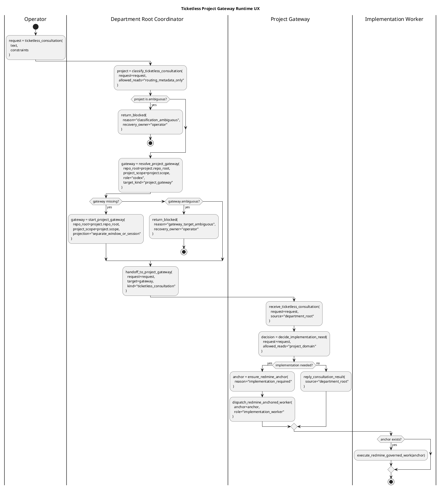

# Ticketless Project Gateway Runtime UX

Redmine #12667. This document fixes the runtime UX boundary discovered during
the GK3500IT real-machine acceptance preparation. It extends
`project-scoped-workspace-identity.md` with the visible execution shape needed
for ticketless consultation.

This is a design document, not an operation runbook. Concrete commands,
operator-local pane ids, local host paths, and one-off rerun steps belong in
Redmine journals or runbooks.

## Core UX Goal

Some work begins as consultation, not as an implementation issue. In that flow,
the operator may ask a department-level workspace a vague but project-shaped
question. The expected user experience is a visible three-level chain:

```text
department root coordinator
  -> project gateway
    -> implementation worker
```

For a workspace such as `gk-3500-it-operations`, the department root is the
umbrella workspace. A child project such as cloud-drive management is a project
gateway. A concrete implementation lane is only created after the project
gateway decides that implementation is needed.

The important acceptance signal is not that all panes sit in one tmux window.
The signal is that each level appears as the right kind of unit and hands work
to the next level through an explicit, auditable route.

## Window And Session Separation

Root and project gateway units may be shown in separate windows or sessions.
That separation is desirable when it preserves the organization hierarchy:

- department root: owns classification and routing
- project gateway: owns project-domain investigation and implementation
  decision
- implementation worker: owns Redmine-anchored changes and verification

Therefore, a project gateway not appearing beside the root in the same cockpit
column is not by itself a bug. It becomes a bug only if the runtime cannot
discover, create, focus, or message the project gateway through a standard
semantic route.

The model must avoid two false fixes:

- forcing project gateways into the same cockpit column when the desired UX is a
  separate project workspace surface
- falling back to operator-copied `%pane` ids as the normal route between root
  and project gateway

## Root Coordinator Contract

During ticketless consultation, the root coordinator is a bounded routing actor.

Allowed responsibilities:

- read root routing metadata and project identity metadata needed to classify
  the request
- choose the most likely project gateway, or return a classification blocker
- discover an existing project gateway target by semantic identity
- request or perform standard project gateway startup when the UX supports it
- deliver the consultation to the project gateway, or return a fail-closed
  blocker with the required operator action

Forbidden responsibilities before project gateway delegation:

- project-domain docs research
- web research for the domain problem
- local machine probes for the domain problem
- implementation target file resolution
- implementation documentation resolution
- direct Claude implementation handoff preparation

Examples of domain work that belongs to the project gateway, not the root,
include `rclone`, mount-label feasibility, Drive/Finder behavior, process
inspection for cloud-drive diagnosis, and project-specific scripts.

## Project Gateway Contract

The project gateway owns the domain consultation after root delegation.

Allowed responsibilities:

- read project docs and project-domain guardrails
- perform bounded official-doc or local fact checks that the project permits
- decide whether the consultation can be answered without implementation
- decide whether an implementation worker is needed
- request or create a Redmine work anchor before implementation dispatch

The project gateway may decline to create an implementation issue. That is a
normal outcome for consultation. Once it dispatches implementation, the normal
Redmine-governed workflow applies and a durable issue / journal anchor is
mandatory.

## Semantic Targeting Requirement

The standard route from root to project gateway must be expressible without a
volatile pane id.

The resolver should be able to use identity fields such as:

```text
role = codex
repo_root = <workspace git root>
project_scope = <project id>
session or cockpit_group = <operator runtime group>
target_kind = project_gateway
```

The resolver must fail closed when:

- no project gateway target exists
- multiple project gateway targets match
- the target has the right project scope but the wrong repository root
- the target has the right repository root but is not inside the expected
  project workdir when a project gate is requested
- the target role is not the project gateway role requested by the route

Failure output should name the classification and next safe action, such as
`gateway_missing`, `gateway_target_ambiguous`, or `selector_gap`. It should not
silently choose a pane because it happens to be active.

Direct `%pane` addressing remains useful as a debug escape hatch. It is not the
normal UX for the department-root to project-gateway route.

## Swimlane Command Functions

The workflow should be written as function-like lane transitions, not as vague
activities with detached explanatory notes. Agents should be able to read the
swimlane and understand which command contract is being exercised at each
boundary.

Function names in the swimlane are the stable design vocabulary. CLI command
names may evolve, but the implementation must provide an equivalent command
surface for each function before the flow can be considered product-ready.



### Function Contract

These functions are not generic prose. Each one must map to a concrete CLI
surface or to a fail-closed blocker that says which command is missing.

```text
classify_ticketless_consultation(...)
  allowed root action
  reads routing metadata only
  forbids project-domain docs, web research, local probes, implementation prep

resolve_project_gateway(...)
  resolves a live project-gateway target by repo_root + project_scope + role
  returns exactly one target or fail-closed reason
  never treats active pane or copied %pane as authority

start_project_gateway(...)
  creates or focuses a project-scoped gateway unit
  preserves repo_root as Git authority
  stamps project_scope / project_path / project_label
  allows separate window/session projection

handoff_to_project_gateway(...)
  sends ticketless consultation to the resolved project gateway
  uses semantic target identity
  does not direct-send to project Claude

ensure_redmine_anchor(...)
  creates or selects a durable issue/journal anchor
  required only when consultation becomes implementation

dispatch_redmine_anchored_worker(...)
  hands implementation to a worker through the normal governed workflow
  requires durable anchor before execution
```

If an implementation exposes lower-level primitives instead of these exact
function names, it must still let an agent perform the same transitions without
inventing command sequences from documentation search.

## Acceptance Meaning

The GK3500IT acceptance scenario is green only when the following are true:

- the root receives a sparse consultation and classifies it to the intended
  project from routing metadata
- the root does not perform project-domain research or local probes
- the root finds or starts the project gateway through a semantic route, or
  returns a concrete fail-closed blocker
- the project gateway receives the consultation as the domain owner
- implementation dispatch, if needed, creates or uses a Redmine issue / journal
  anchor before worker execution

Operator hand correction may be useful while debugging, but it does not prove
the product UX. If a run succeeds only because the operator copied a pane id,
manually selected a window, or supplied hidden project context, the acceptance
result should be recorded as assisted, not green.

## Relation To Existing Design

`project-scoped-workspace-identity.md` defines how a monorepo project directory
becomes a routable project identity without pretending to be a Git root.

`unit-target-model.md` defines Unit, Target, Projection, and fail-closed target
resolution. This document specializes that model for the ticketless
department-root to project-gateway route.

`cross-project-cockpit-smoke-runbook.md` remains a runbook-style smoke reference
for concrete checks. This document intentionally avoids step-by-step operator
procedure.

`route-identity-ledger.md` defines why stable route identity must be preferred
over pane ids. This document applies that principle to project gateway
discovery and consultation delivery.
