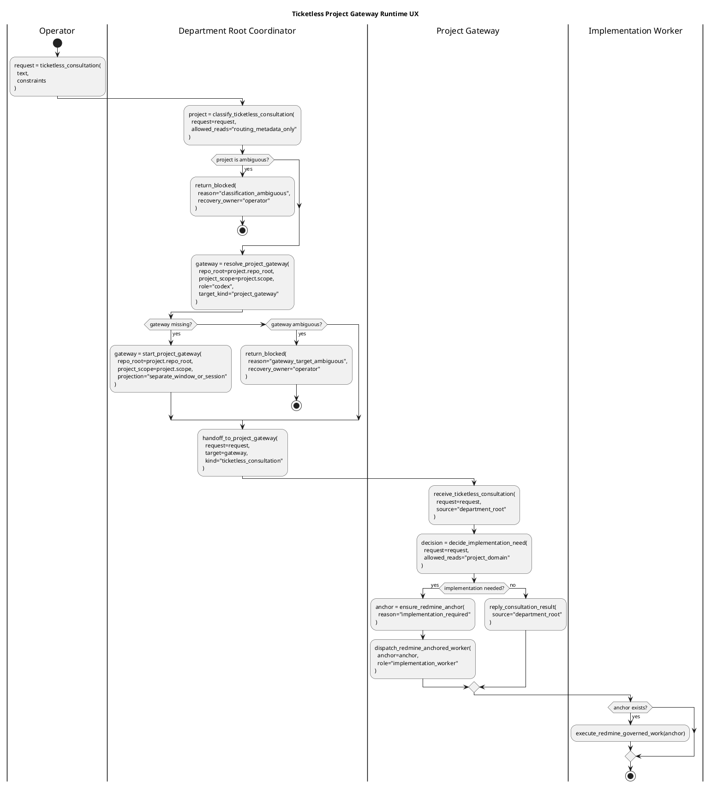

# Ticketless Project Gateway Runtime UX

Redmine #12667。GK3500IT の実機受け入れ準備で見えた、ticketless
consultation の runtime UX 境界を定義する。`project-scoped-workspace-identity.md`
を拡張し、部署 root から project gateway へ相談を渡すときの見え方と責務を固定する。

これは設計 doc であり、運用手順書ではない。実機固有の pane id、local path、
一回限りの rerun 手順、operator 固有の window 配置は Redmine journal または
runbook に置く。

## Core UX Goal

作業は常に実装 issue から始まるわけではない。operator が部署レベルの workspace に、
曖昧だが project-shaped な相談を投げることがある。この flow で期待する UX は、
次の 3 層が見えることである。

```text
department root coordinator
  -> project gateway
    -> implementation worker
```

`gk-3500-it-operations` のような workspace では、Git repo root が部署 root に相当する。
その配下の cloud-drive management のような project が project gateway になる。
具体的な implementation lane は、project gateway が「実装が必要」と判断した後にだけ
作られる。

受け入れ上の重要な signal は、全 pane が同じ tmux window に並ぶことではない。
各階層が正しい種類の Unit として見え、明示的で監査可能な route で次の階層へ
work を渡せることである。

## Window And Session Separation

root unit と project gateway unit は、別 window または別 session として表示されてよい。
組織階層を保つなら、その分離はむしろ望ましい。

- department root: 分類と routing を担当する。
- project gateway: project-domain 調査と implementation 判断を担当する。
- implementation worker: Redmine anchor 付きの変更と検証を担当する。

したがって、project gateway が root と同じ cockpit column に並ばないこと自体は
bug ではない。bug になるのは、runtime が project gateway を標準の semantic route で
発見、作成、focus、message できない場合である。

避けるべき false fix:

- project gateway を同じ cockpit column に強制すること。
- root -> project gateway の通常 route を operator がコピーした `%pane` に依存させること。

## Root Coordinator Contract

ticketless consultation 中の root coordinator は、bounded routing actor である。

許可される責務:

- request 分類に必要な root routing metadata と project identity metadata だけを読む。
- 最も妥当な project gateway を選ぶか、分類不能 blocker を返す。
- semantic identity で既存 project gateway target を発見する。
- UX が対応している場合、標準手段で project gateway startup を要求または実行する。
- consultation を project gateway へ渡すか、required operator action 付きで
  fail-closed blocker を返す。

project gateway へ渡す前に禁止される責務:

- project-domain docs research。
- domain problem に関する web research。
- domain problem に関する local machine probe。
- implementation target file resolution。
- implementation documentation resolution。
- Claude implementation handoff preparation。

`rclone`、mount label feasibility、Drive/Finder behavior、cloud-drive diagnosis 目的の
process inspection、project-specific scripts は project gateway の domain work であり、
root の責務ではない。

## Project Gateway Contract

project gateway は root から渡された後の domain consultation を担当する。

許可される責務:

- project docs と project-domain guardrails を読む。
- project が許可する範囲で official doc や local fact を bounded に確認する。
- implementation なしで回答できるか判断する。
- implementation worker が必要か判断する。
- implementation dispatch 前に Redmine work anchor を要求または作成する。

project gateway は implementation issue を作らない判断をしてよい。consultation では
それが正常 outcome である。一方、implementation を dispatch するなら通常の
Redmine-governed workflow が適用され、durable issue / journal anchor が必須になる。

## Semantic Targeting Requirement

root から project gateway への標準 route は、volatile な pane id なしで表現できなければ
ならない。

resolver は少なくとも次の identity field を扱える必要がある。

```text
role = codex
repo_root = <workspace git root>
project_scope = <project id>
session or cockpit_group = <operator runtime group>
target_kind = project_gateway
```

resolver は次の場合に fail closed する。

- project gateway target が 0 件。
- project gateway target が複数件。
- target の project scope は合うが repository root が違う。
- target の repository root は合うが、project gate 要求時に expected project workdir
  配下にいない。
- target role が route の要求する project gateway role と違う。

failure output は `gateway_missing`、`gateway_target_ambiguous`、`selector_gap` のような
分類と、次の安全な action を示す。active pane だからという理由で silent に選んでは
ならない。

直接 `%pane` addressing は debug escape hatch として残してよい。ただし
department-root -> project-gateway route の通常 UX ではない。

## Swimlane Command Functions

workflow は、曖昧な activity と後付け note ではなく、lane 間 transition を
function-like に書く。agent は swimlane を読めば、各境界でどの command contract を
実行するのか分かる状態でなければならない。

swimlane 内の function 名は安定した設計語彙である。CLI command 名は今後変わってよいが、
product-ready と呼ぶには、各 function と等価な command surface を実装する必要がある。

Ticketless callback / hands-off の正本は下の sequence と matrix に置く。Redmine anchor が
まだ無い phase でも callback 義務は残る。pane 上の自然文回答だけで停止することは callback
ではなく、`consultation_result` / `no_dispatch` / `blocked` / `anchor_required` のいずれかを
caller lane へ返す。



### Function Contract

これらの function は一般的な散文ではない。各 function は、具体的な CLI surface、
または「どの command が足りないか」を示す fail-closed blocker に対応しなければならない。

```text
classify_ticketless_consultation(...)
  root に許可される action
  routing metadata だけを読む
  project-domain docs / web research / local probe / implementation prep を禁止する

resolve_project_gateway(...)
  repo_root + project_scope + role で live project-gateway target を解決する
  target がちょうど 1 件なら返し、それ以外は fail-closed reason を返す
  active pane や copied %pane を authority として扱わない

start_project_gateway(...)
  project-scoped gateway unit を作成または focus する
  repo_root を Git authority として保つ
  project_scope / project_path / project_label を stamp する
  separate window/session projection を許可する

handoff_to_project_gateway(...)
  解決済み project gateway へ ticketless consultation を送る
  semantic target identity を使う
  project Claude へ direct-send しない

ensure_redmine_anchor(...)
  durable issue/journal anchor を作成または選択する
  consultation が implementation へ変わる場合だけ必須

dispatch_redmine_anchored_worker(...)
  通常の governed workflow で worker へ implementation を渡す
  execution 前に durable anchor を要求する
```

### Transition / Callback Matrix

| transition | transition surface | durable anchor | success condition | fail condition |
| --- | --- | --- | --- | --- |
| 祖父 -> 親 | project gateway resolution + lane handoff | ticketless の分類段階では不要。implementation に進む前に parent 以降で要求する。 | grandparent が routing metadata だけで parent project gateway を一意に解決または起動し、ticketless consultation を parent へ渡す。 | classification ambiguous、project gateway missing / ambiguous、semantic route identity 不一致、手打ち `%pane` を route authority として採用、project Claude への direct send。 |
| 親 -> 子 | delegated coordinator adoption + lane handoff | 必須。parent が implementation / domain probe 必要と判断した時点で Redmine issue / journal anchor を作成または選択する。 | parent は直接調査・実装せず、Redmine anchor と project identity を保持したまま child coordinator へ橋渡しする。 | Redmine anchor missing、parent direct investigation / implementation、grandchild への direct send、child coordinator の route identity 不一致、Claude 誤送信。 |
| 子 -> 孫 | grandchild dispatch + worker realization | 必須。grandchild worker は Redmine anchor を読めない限り実行しない。 | child が grandchild dispatch の可否を記録し、dispatch する場合は implementation worker が Redmine-governed work として実装・検証する。 | no-dispatch reason 未記録、route depth / owning route 不整合、worker realization 不明、Redmine anchor missing、hidden subagent 採用、Claude 誤送信。 |
| 孫 -> 子 | worker callback | 必須。implementation_done / review_request / blocked は Redmine journal を正本にする。 | grandchild が implementation_done / review_request / blocked を Redmine に記録し、child へ state pointer を返す。 | queue-enter 不達を durable record で回収しない、work log 本文を callback 正本にする、Redmine journal なしの完了主張、child 以外への direct callback。 |
| 子 -> 親 | gateway callback | 必須。child は grandchild の結果または no-dispatch reason を Redmine anchor に紐づける。 | child が grandchild 結果を集約し、parent project gateway へ review-ready / blocked / no-dispatch state pointer を返す。 | parent callback missing、callback target identity 不明、queue-enter 不達を Redmine で再構成できない、parent issue close を child が代行。 |
| 親 -> 祖父 | project gateway result callback / ticketless hands-off | ticketless no-dispatch では不要。implementation に進んだ場合は必須。 | parent が `consultation_result` / `no_dispatch` / `blocked` / `anchor_required` を grandparent へ返し、grandparent が transition result を記録する。 | pane 上の回答だけで停止する、parent が実装結果を保持したまま祖父へ返さない、callback transport missing を blocked として返さない、owner / grandparent へ work log を直接貼って durable anchor を欠く、親が close approval / review authority を代行。 |

実装がこれらと同名の command ではなく低レベル primitive を公開する場合でも、agent が
documentation search で command sequence を発明せずに同じ transition を実行できる
必要がある。

## Acceptance Meaning

GK3500IT acceptance scenario は、次が満たされた場合だけ green とする。

- root が sparse consultation を受け、routing metadata から意図した project に分類する。
- root が project-domain research や local probe を実行しない。
- root が semantic route で project gateway を発見または起動する。できない場合は
  concrete fail-closed blocker を返す。
- project gateway が domain owner として consultation を受け取る。
- implementation dispatch が必要な場合、worker execution 前に Redmine issue / journal
  anchor を作成または使用する。

debug 中の operator hand correction は有用なことがあるが、product UX の証明にはならない。
operator が pane id をコピーした、window を手選択した、隠れた project context を与えた、
といった補助で成立した run は green ではなく assisted として記録する。

## Relation To Existing Design

`project-scoped-workspace-identity.md` は、monorepo project directory を fake Git repo に
せず routable project identity にする方法を定義する。

`unit-target-model.md` は Unit、Target、Projection、fail-closed target resolution を定義する。
本 doc は、その model を ticketless department-root -> project-gateway route 向けに
具体化する。

`cross-project-cockpit-smoke-runbook.md` は concrete check の runbook-style smoke reference
である。本 doc は step-by-step operator procedure を意図的に扱わない。

`route-identity-ledger.md` は pane id より stable route identity を優先すべき理由を定義する。
本 doc は、その原則を project gateway discovery と consultation delivery に適用する。
