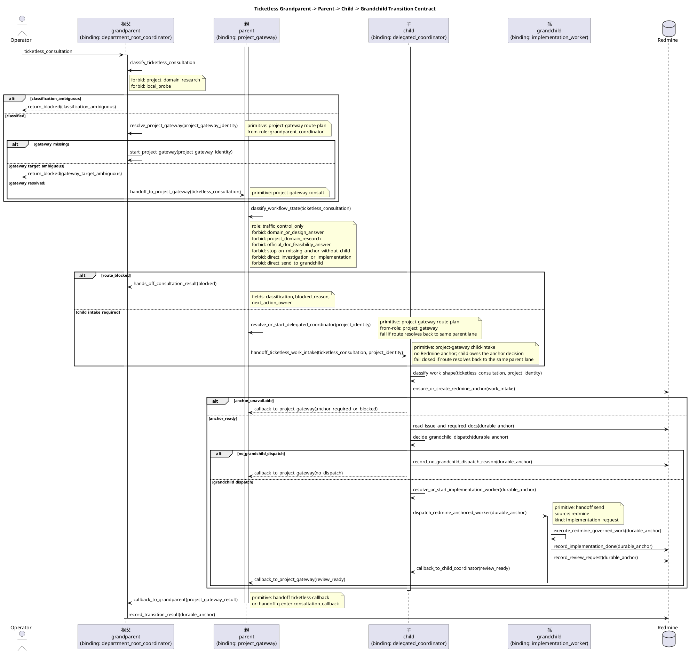

# チケットなしプロジェクトゲートウェイ実行UX

Redmine #12667。GK3500IT の実機受け入れ準備で見えた、ticketless
consultation の runtime UX 境界を定義する。`project-scoped-workspace-identity.md`
を拡張し、grandparent lane から parent project gateway へ相談を渡すときの見え方と責務を固定する。

これは設計 doc であり、運用手順書ではない。実機固有の pane id、local path、
一回限りの rerun 手順、operator 固有の window 配置は Redmine journal または
runbook に置く。

## 中核UX目標

作業は常に実装 issue から始まるわけではない。operator が部署レベルの workspace に、
曖昧だが project-shaped な相談を投げることがある。この flow で期待する UX は、
次の 4 階層が見えることである。

```text
grandparent lane
  -> parent lane
    -> child lane
      -> grandchild lane
```

`gk-3500-it-operations` のような workspace では、今回の binding として grandparent
lane が department root coordinator、parent lane が cloud-drive management のような
project gateway になる。具体的な child / grandchild lane は、parent gateway が
「実装が必要」と判断した後にだけ作られる。

受け入れ上の重要な signal は、全 pane が同じ tmux window に並ぶことではない。
各階層が正しい種類の Unit として見え、明示的で監査可能な route で次の階層へ
work を渡せることである。

## 祖父・親・子・孫レーン契約

#12675 では、GK3500 IT Operations 実機テスト前の workflow を 4 階層として固定する。
この 4 階層は家族比喩ではなく、lane ownership と transition function の depth を表す
設計語彙である。

正本語彙は相対階層の `grandparent` / `parent` / `child` / `grandchild` とする。
`root` は今回の GK3500 IT Operations binding では自然だが、抽象 contract には含めない。
ある 4 階層 slice の grandparent が system 全体の root とは限らないためである。

```text
grandparent lane = current binding: department_root_coordinator
  -> parent lane = current binding: project_gateway
    -> child lane = current binding: delegated_coordinator / implementation_gateway
      -> grandchild lane = current binding: implementation_worker
```

実機 acceptance では、parent gateway が直接調査・実装へ入らず、必要に応じて child
coordinator を起動し、その child が grandchild implementation lane を dispatch する形を
green path とする。

### Lane Registry

| 階層 | abstract lane | current binding | owner role | 主責務 | 禁止事項 | Redmine work item 境界 |
| --- | --- | --- | --- | --- | --- | --- |
| 祖父 | `grandparent` | `department_root_coordinator` | `grandparent_coordinator` | ticketless consultation を routing metadata だけで分類し、対象 parent gateway を semantic route で解決または起動する。 | project-domain docs research、web research、local probe、implementation prep、project Claude への direct send。 | consultation 分類だけでは作成しない。implementation 必要性は parent 以降で判断する。 |
| 親 | `parent` | `project_gateway` | `project_gateway` | grandparent から受けた相談を受領し、project identity / Redmine anchor 要否 / child coordinator route を交通整理する。domain/design 判断は child 以降へ渡す。 | parent 自身による design answer、project-domain docs research、official/web research、local probe、直接調査・実装、rclone / Drive 実操作、Redmine anchor なし domain probe、grandchild worker への direct implementation send。 | domain/design 判断、pilot、implementation、または worker dispatch が必要な相談は、worker 実行前ではなく **child coordinator へ渡す前** に Redmine issue / journal anchor を要求または作成する。 |
| 子 | `child` | `delegated_coordinator` / `implementation_gateway` | `delegated_coordinator` | Redmine anchor を読み、実装 scope を分解し、grandchild lane dispatch と callback aggregation を行う。 | owner close approval の代行、parent issue の close、release / publish / credential / destructive approval、parent への callback なしの完了扱い。 | child coordinator 自体は既存 anchor に従う。新たな実装 scope が分かれた場合だけ child work item を作る。 |
| 孫 | `grandchild` | `implementation_worker` | `implementation_worker` | Redmine-governed work を実装・検証し、implementation_done / review_request / residual risk を durable record に残す。 | ticketless request だけを根拠に実装すること、owner へ直接質問すること、Redmine anchor なしの変更、parent / grandparent への direct callback。 | 実行前に anchor が必須。anchor が無ければ実装せず、child へ blocked callback を返す。 |

`codex` / `claude` は上表の owner role ではなく runtime provider / binding である。pane id は
`last_seen_pane_id` 相当の cache/evidence であり、route authority ではない。通常 route は
workspace / project / lane / role class などの semantic route identity から解決する。

### Redmine Work Item 作成境界

ticketless consultation は、相談それ自体を即 Redmine issue 化しないことがある。境界は次の
とおり固定する。

- grandparent が行う分類、parent gateway の発見 / 起動、parent への ticketless handoff だけでは、
  implementation work item を作らない。
- parent は `decide_implementation_need(...)` のような domain/design 判断を行わない。親が判断してよいのは、
  route 不能、Redmine anchor 不足、または child coordinator へ橋渡しするための
  workflow state だけである。
- parent は project-domain research、official/web research、local probe、rclone / Drive 操作、
  file 変更、または implementation worker dispatch の要否判断を吸収しない。domain/design
  判断が必要な相談を受けた場合は、Redmine anchor の有無を理由に祖父へ戻さず、
  child coordinator へ ticketless work-intake として橋渡しする。
- child coordinator は、その相談を作業単位へ切る必要があるかを判断し、必要なら Redmine
  issue / journal anchor を作成または既存 issue を選択する。child でも framing / 権限 /
  project identity が不足して anchor を確保できない場合に限り、`anchor_required` / `blocked`
  を parent 経由で grandparent へ返す。
- child が grandchild へ dispatch する時点では、grandchild が読む Redmine issue / journal
  anchor が必須である。anchor が無い場合、child は
  `return_blocked(redmine_anchor_missing)` を parent へ返す。
- 実機 acceptance では rclone / Google Drive 実操作を実行しない。ここで固定するのは、
  本番前にどの transition が anchor を要求するかである。

### 禁止遷移

```yaml
禁止:
  - id: grandparent_does_domain_work
    条件: [lane: grandparent, action: project_domain_research_or_local_probe]
    action: stopしてparent_gatewayへ渡す
  - id: parent_implements_directly
    条件: [lane: parent, action: investigation_or_implementation_execution]
    action: Redmine anchor確保後にchild_coordinatorへdispatchする
  - id: parent_absorbs_domain_design_decision
    条件: [lane: parent, action: domain_or_design_answer_without_child]
    action: child_coordinatorへticketless_work_intakeとして渡す
  - id: parent_stops_on_missing_anchor
    条件: [lane: parent, action: return_anchor_required_without_child_intake]
    action: child_coordinatorへticketless_work_intakeとして渡す。anchor_requiredはchildがanchor確保不能と判断した場合だけ返す
  - id: parent_sends_to_grandchild_directly
    条件: [lane: parent, target: grandchild, child_coordinator: skipped]
    action: delegated_coordinatorを経由するか、no_child_delegation理由をdurable recordに残す
  - id: worker_runs_without_anchor
    条件: [lane: grandchild, redmine_anchor: missing]
    action: blocked callbackを返し実行しない
  - id: pane_id_as_authority
    条件: [routing_basis: copied_pane_id_only]
    action: semantic route identityで再解決する
```

## ウィンドウとセッションの分離

grandparent unit と parent project gateway unit は、別 window または別 session として表示されてよい。
組織階層を保つなら、その分離はむしろ望ましい。

- grandparent: 分類と routing を担当する。
- parent project gateway: project-domain 相談の受領、Redmine anchor 要否判定、child coordinator への橋渡しを担当する。domain/design 判断そのものは担当しない。
- child coordinator: Redmine anchor 付きの worker dispatch と callback aggregation を担当する。
- grandchild implementation worker: Redmine anchor 付きの変更と検証を担当する。

したがって、parent project gateway が grandparent と同じ cockpit column に並ばないこと自体は
bug ではない。bug になるのは、runtime が project gateway を標準の semantic route で
発見、作成、focus、message できない場合である。

避けるべき false fix:

- project gateway を同じ cockpit column に強制すること。
- grandparent -> parent project gateway の通常 route を operator がコピーした `%pane` に依存させること。

## Grandparent Lane の契約

ticketless consultation 中の grandparent coordinator は、bounded routing actor である。

許可される責務:

- request 分類に必要な routing metadata と project identity metadata だけを読む。
- 最も妥当な project gateway を選ぶか、分類不能 blocker を返す。
- semantic identity で既存 project gateway target を発見する。
- UX が対応している場合、標準手段で project gateway startup を要求または実行する。
- consultation を project gateway へ渡すか、required operator action 付きで
  fail-closed blocker を返す。

project gateway へ渡す前に禁止される責務:

- project-domain docs research。
- domain problem に関する web research。
- domain problem に関する local machine probe。
- implementation target file resolution。
- implementation documentation resolution。
- Claude implementation handoff preparation。

`rclone`、mount label feasibility、Drive/Finder behavior、cloud-drive diagnosis 目的の
process inspection、project-specific scripts は child coordinator 以降の domain/design work
であり、grandparent の責務でも parent project gateway の責務でもない。

## プロジェクトゲートウェイの契約

project gateway は grandparent から渡された後の consultation を **交通整理 actor** として受領する。
親は domain/design decision actor ではない。親が project facts を読んで「設計回答できる」
「implementation 不要」と結論する運用は、4 階層 workflow の acceptance では失敗として扱う。

許可される責務:

- selected project identity と routing contract を確認する。
- child coordinator を semantic route で起動 / 採用 / handoff する。
- Redmine anchor が無い相談でも、domain/design work shape なら child coordinator へ
  ticketless work-intake として渡す。
- route 不能 / ambiguous target / project identity mismatch を fail-closed で返す。

禁止される責務:

- project docs / official docs / web docs を読んで domain/design answer を作ること。
- `implementation_not_needed` / `no_dispatch` を domain/design 判断として親だけで決めること。
- feasibility、safety boundary、pilot 要否、実装要否を親 pane の最終回答として返すこと。
- local probe、rclone / nfsmount / mount / Finder / Drive 操作、project script / API probe。
- child coordinator を飛ばした grandchild worker dispatch。
- Redmine anchor が無いことだけを理由に、child coordinator へ渡さず祖父へ
  `anchor_required` を返すこと。

project gateway が返してよい ticketless result は、workflow state に限る:

- `anchor_required`: child coordinator が issue 作成/既存 issue 選択を試みたが、framing /
  権限 / project identity 不足などで anchor を確保できなかった。
- `blocked`: route 不能、project identity mismatch、anchor 作成不能、target ambiguous。
- `consultation_result`: domain answer ではなく、child coordinator への intake / child result
  pointer / 上記 workflow state を grandparent に返すための transport classification としてのみ使う。

親が domain/design answer を返して ticketless consultation を閉じた run は、
transport evidence としては利用できても、祖父・親・子・孫 workflow acceptance では
`insufficient` または `failed_acceptance` と分類する。

### プロジェクトゲートウェイの consultation callback 返却契約

#12737 の正本である。project gateway が ticketless consultation を処理して結果に到達した
とき、callback target が存在する限り、その結果を自身の pane の local 最終回答で停止せず、
product callback primitive で caller lane へ返すことを normal-operation contract として固定
する。

- **callback target がある consultation result は product callback primitive で返す。** project
  gateway が ticketless consultation を処理し、workflow state として `blocked` /
  `anchor_required` / `consultation_result` のいずれかに到達したら、その結果を caller lane へ次の
  いずれかで返す。
  - `mozyo-bridge handoff ticketless-callback ...` (Redmine anchor を carry しない structured
    callback transport。`### Ticketless No-Anchor Callback Primitive`)。
  - `mozyo-bridge handoff q-enter --intent consultation_callback ...` (LLM が rail / marker /
    raw Enter を判断しない #12705 の LLM-facing front-door。同じ no-anchor rail に乗る)。
- **local pane の最終回答は callback ではない。** pane 上に自然文の最終回答を書いて停止する
  ことは、callback target が存在する限り workflow completion ではない (`### Grandparent /
  Parent / Child / Grandchild Sequence` / matrix `親 -> 祖父` 行 fail condition と同一原則)。
  上記 primitive のいずれかで structured callback を caller lane へ届けて初めて、project
  gateway の ticketless 段階は完了扱いになる。
- **worker dispatch の Redmine anchor 要件は緩めない。** 本契約は consultation 段階の *返却
  経路* だけを固定する。実 worker execution / domain probe / implementation dispatch に進む
  場合は従来どおり Redmine anchor を作成し、`handoff send --kind implementation_request
  --source redmine --issue <id> --journal <id>` を使う。ticketless callback rail は anchored
  worker dispatch decision を表現できず、fail closed する。
- **operator / Codex による primitive の手動実行は product evidence ではない。** project
  gateway 自身が autonomous に callback primitive を呼んだ run だけが acceptance evidence で
  あり、operator / Codex が代理で `ticketless-callback` / `q-enter consultation_callback` を
  打った run は `### 受け入れ判定の意味` の assisted として記録する。

実 CLI flag / default / error wording は CLI help / parser / validation error を正本にする
(`### Transition Contract Scope`)。本節は返却経路の lane boundary 契約だけを持つ。

## 意味的ターゲット解決の要件

grandparent から parent project gateway への標準 route は、volatile な pane id なしで表現できなければ
ならない。

resolver が扱う identity field の正確な名前、必須 / 任意、default、表示順は CLI help /
validation error を正本にする。この文書は、volatile な pane id ではなく project gateway の
semantic route identity で一意解決することだけを固定する。

resolver は次の場合に fail closed する。

- project gateway target が 0 件。
- project gateway target が複数件。
- target の project identity と repository identity が一致しない。
- target が project gateway として要求される runtime location にいない。
- target の role class が project gateway として不適合である。

failure output は `gateway_missing`、`gateway_target_ambiguous`、`selector_gap` のような
分類と、次の安全な action を示す。active pane だからという理由で silent に選んでは
ならない。

直接 `%pane` addressing は debug escape hatch として残してよい。ただし
grandparent -> parent project-gateway route の通常 UX ではない。

### 相対 route 解決と cockpit-visible 起動 evidence

#12699 の正本である。本節は次の 2 点を固定する。第一に、`grandparent` を絶対 root として
読むと monorepo / subproject の delegation slice を表現しにくい。第二に、実行側が
`mozyo --repo ... --no-attach --json` に逃げると通常 tmux session は作れるが
cockpit-visible project gateway にならない。

- **route は current Unit からの相対 slice として解決する。** `grandparent` /
  `parent` / `child` / `grandchild` は絶対 root ではなく相対位置である (`### 祖父・親・
  子・孫レーン契約` の正本語彙)。current Unit (caller role) を anchor として、one-step-down の
  delegation target を semantic identity で解決する。
  - grandparent (`grandparent_coordinator`) -> `project_gateway`
  - parent (`project_gateway`) -> `delegated_coordinator`
  - child (`delegated_coordinator`) -> `implementation_worker`
  - caller は **一段だけ** 委譲する。grandparent が grandchild worker を直接解決することは
    禁止である (`禁止遷移` の `parent_sends_to_grandchild_directly` / direct-send 禁止)。
- **coordinator-class target (`project_gateway` / `delegated_coordinator`) の解決は
  launch-or-adopt に従う。** live discovery では両者は同型 (strong + project-scoped Codex) で
  あり、相対位置が contract label である。
  - `found` -> **adopt** (live lane を identity で採用)。
  - `gateway_missing` -> **cockpit-visible launch plan** (project workdir から
    `mozyo-bridge cockpit` を起動)。
  - `gateway_target_ambiguous` / `selector_gap` -> **blocked** (silent に選ばない)。
- **`implementation_worker` は launch-or-adopt しない。** worker は Redmine anchor に対して
  dispatch されるものであり、cockpit gateway として起動しない (`### Ticketless No-Anchor
  Callback Primitive`)。相対 route は anchor 要件と標準 `handoff send --kind
  implementation_request --source redmine` 導線だけを返す。
- **cockpit-visible 起動だけが green-path route evidence である。** 次のいずれも
  green path ではない。
  - `mozyo-bridge cockpit --json` は **preview** であり mutate しない。起動の証拠にならない。
  - `mozyo --no-attach` 系の **detached 通常 session** は `normal_window` であって cockpit
    Unit ではない。`--no-attach --json` で JSON-ready な通常 session を作っただけでは、
    route evidence として `insufficient` (= not PASS) として扱う
    (`delegated-coordinator-real-machine-acceptance.md` の Failure Classification)。
  - green path は、resolved lane が cockpit pane / cockpit member (peer pane あり) の
    **cockpit-visible Unit** である場合だけである。detached normal-window lane を adopt
    できても、cockpit-visible Unit を起動するまで route は green ではない。

resolver の field 名・必須/任意・default・error wording・実 command 名は CLI help /
validation error を正本にする (`### Transition Contract Scope`)。本節は相対 slice 境界と
cockpit-visible green-path 条件の契約だけを持つ。

## シーケンスと遷移関数

workflow は、曖昧な activity と後付け note ではなく、lane 間 transition を
function-like に書く。lane crossing は sequence diagram と transition command matrix で
transition surface / durable anchor / fail-closed state を読む。agent は sequence を読めば、
どの actor からどの actor へ、どの責務境界を越えるのかが一意に分かる状態でなければならない。

sequence 内の function 名は安定した設計語彙である。CLI flag / default / error wording は
今後変わってよいが、lane crossing の front-door primitive 名は runtime smoke で迷わない程度に
固定する。product-ready と呼ぶには、各 function と等価な command surface と validation message
を実装する必要がある。
正本 sequence と別に activity swimlane を併置しない。図が複数あると、差分が意図か drift
かを LLM が判断する余地が増えるためである。

### Grandparent / Parent / Child / Grandchild Sequence

Ticketless callback / hands-off の正本は下の sequence と matrix に置く。Redmine anchor が
まだ無い phase でも callback 義務は残る。pane 上の自然文回答だけで停止することは callback
ではなく、`consultation_result` / `no_dispatch` / `blocked` / `anchor_required` のいずれかを
caller lane へ返す。



### Transition Contract Scope

この文書は CLI catalog ではない。ただし、実機 smoke が実行時に command family を探索し始めると
evidence が濁るため、lane crossing の front-door primitive 名は sequence / matrix に固定する。
transition function ごとの詳細 flag、必須 option、default、error wording は CLI help / parser /
validation error を正本にする。ここでは LLM が lane boundary、durable anchor、禁止事項、
fail-closed 状態を誤読しないための契約だけを持つ。

### Transition Command Matrix

この matrix は #12676 の正本である。sequence の function を、transition surface、durable
anchor、成功条件、失敗条件へ対応させる。CLI flag、必須 option、default、error wording の
詳細は CLI help / parser / validation error を正本にし、この表では二重管理しない。

| transition | front-door primitive | durable anchor | success condition | fail condition |
| --- | --- | --- | --- | --- |
| 祖父 -> 親 | `project-gateway route-plan --from-role grandparent_coordinator` + `project-gateway consult` | ticketless の分類段階では不要。implementation に進む前に parent 以降で要求する。 | grandparent が routing metadata だけで parent project gateway を一意に解決または起動し、ticketless consultation を parent へ渡す。 | classification ambiguous、project gateway missing / ambiguous、semantic route identity 不一致、手打ち `%pane` を route authority として採用、project Claude への direct send、runtime command-family exploration を green evidence とする。 |
| 親 -> 子 | `project-gateway route-plan --from-role project_gateway` + `project-gateway child-intake` | 親 -> 子の intake では不要。child が work shape を見て作業化する時点で作成または選択する。 | parent は直接調査・設計回答・実装判断をせず、project identity と ticketless work-intake を child coordinator へ橋渡しする。 | parent direct design answer / investigation / implementation、Redmine anchor missing だけを理由に祖父へ返す、grandchild への direct send、child coordinator の route identity 不一致、route が parent 自身へ戻る、Claude 誤送信。 |
| 子 anchor intake | Redmine anchor creation / selection | child が domain/design/pilot/implementation work と判断した時点で必須。 | child が相談を作業単位に切る必要性を判断し、必要なら Redmine issue を作成または既存 issue / journal を選択する。作業化不要なら durable reason を記録する。 | child が anchor 判断をせず worker へ進む、anchor framing / 権限不足を blocked として返さない、親へ判断を戻す、owner close / review authority を代行。 |
| 子 -> 孫 | `handoff send --source redmine --kind implementation_request` | 必須。grandchild worker は Redmine anchor を読めない限り実行しない。 | child が grandchild dispatch の可否を記録し、dispatch する場合は implementation worker が Redmine-governed work として実装・検証する。 | no-dispatch reason 未記録、route depth / owning route 不整合、worker realization 不明、Redmine anchor missing、hidden subagent 採用、Claude 誤送信。 |
| 孫 -> 子 | Redmine-governed callback / reply rail | 必須。implementation_done / review_request / blocked は Redmine journal を正本にする。 | grandchild が implementation_done / review_request / blocked を Redmine に記録し、child へ state pointer を返す。 | queue-enter 不達を durable record で回収しない、work log 本文を callback 正本にする、Redmine journal なしの完了主張、child 以外への direct callback。 |
| 子 -> 親 | gateway callback | 必須。child は grandchild の結果または no-dispatch reason を Redmine anchor に紐づける。 | child が grandchild 結果を集約し、parent project gateway へ review-ready / blocked / no-dispatch state pointer を返す。 | parent callback missing、callback target identity 不明、queue-enter 不達を Redmine で再構成できない、parent issue close を child が代行。 |
| 親 -> 祖父 | `handoff ticketless-callback` または `handoff q-enter --intent consultation_callback` | child が anchor を確保できた場合は child result anchor が必須。child が anchor を確保できない場合は structured `anchor_required` / `blocked` を返す。 | parent が child coordinator から受けた workflow state (`blocked` / `anchor_required` / no-dispatch / review-ready pointer) を grandparent へ返し、grandparent が transition result を記録する。 | pane 上の回答だけで停止する、parent が domain/design answer を直接返して相談を閉じる、parent が child を経由せず `anchor_required` を返す、parent が実装結果を保持したまま祖父へ返さない、callback transport missing を blocked として返さない、owner / grandparent へ work log を直接貼って durable anchor を欠く、親が close approval / review authority を代行。 |

lane handoff transport、project gateway resolver、cockpit projection、delegated coordinator helpers、
grandchild dispatch helpers の詳細引数は CLI help / validation error に置く。front-door primitive 名は
上の matrix を smoke 時の実行入口として使う。
`workflow.next_action` 相当の判断は、各 transition の success / fail condition から次に owner /
grandparent / parent / child / grandchild / CLI validation のどれが動くべきかを返す runtime
decision として扱う。

queue-enter は delivery rail であり、task 完了 signal ではない。queue-enter 不達または marker
未観測は、Redmine journal と callback sweep で回収可能でなければならない。pane 上の見た目、
手打ち `%pane`、chat message、work log 本文は route authority / completion authority ではない。

### Ticketless No-Anchor Callback Primitive

#12703 の正本である。matrix の `親 -> 祖父` / `子 -> 親` ticketless hands-off 行のうち、
**Redmine anchor を要しない consultation 段階の callback** を返す product-standard transport を
定義する。receiver が `no_dispatch` の structured hands-off を作っても、標準 `handoff reply` /
`reply` は Redmine anchor (`--issue` + `--journal`) 必須のため `invalid_anchor` で fail-closed し、
低レベルの `mozyo-bridge message` しか残らない。本 primitive はその gap を埋める。

- 標準 primitive は `mozyo-bridge handoff ticketless-callback` とする。Redmine anchor を carry
  せず、偽装もしない。`--source` / `--issue` / `--journal` / `--task-id` を受け取らない。
  LLM-facing front-door として `mozyo-bridge handoff q-enter --intent consultation_callback`
  (#12705) も同じ no-anchor rail に乗り、同じ structured callback を返す。project gateway が
  consultation result をこのどちらかで caller lane へ返すことは `### プロジェクトゲートウェイの
  consultation callback 返却契約` (#12737) の必須返却経路である。
- structured callback fields (`classification` / `dispatch_decision` / `next_action_owner` /
  `callback_reason` / `read_contract`、および classification/dispatch から導出する
  `redmine_anchor_required`) を **workflow result** として carry する。これは transport outcome
  (`status` / `reason` / `notification_marker`) とは別 field に記録する。
- 標準 delivery rail (queue-enter / standard semantics、target admission / repo identity /
  cross-session gate) をそのまま使う。delivery marker の source は `ticketless` で、
  Redmine / Asana anchor rail とは混ざらない。
- `classification` は `consultation_result` / `no_dispatch` / `blocked` / `anchor_required` の
  4 つを transport 互換のため保持する。ただし parent project gateway は `no_dispatch` を
  domain/design 判断として使ってはならない。親が domain answer を吸収する場合、その run は
  acceptance evidence ではなく `insufficient` / `failed_acceptance` とする。
  `dispatch_decision` は no-anchor-safe な `no_dispatch` / `hand_back_to_caller` /
  `anchor_required_before_worker_dispatch` だけを許す。
- **子 -> 孫 worker dispatch の anchor 要件は緩めない。** 実 worker execution / domain probe /
  implementation dispatch を表す decision は ticketless rail で表現不能であり、CLI choice にも
  domain layer にも無い。implementation に進む場合は Redmine anchor を作成して
  `handoff send --kind implementation_request --source redmine --issue <id> --journal <id>` を使う。
- 既存の Redmine-governed `handoff reply` / `reply` rail は不変で、引き続き `--issue` + `--journal`
  を必須とする。

実 CLI flag / default / error wording は CLI help / parser / validation error を正本にする
(`### Transition Contract Scope`)。本節は lane boundary と fail-closed 状態の契約だけを持つ。

### Ticketless No-Anchor Work-Intake Primitive

#12748 の正本である。matrix の `親 -> 子` 行 ticketless work-intake を、Redmine anchor
を要しない product-standard delivery primitive として固定する。`### Ticketless No-Anchor
Callback Primitive` (#12703) が *返却経路* を、`project-gateway consult` (#12740) が
祖父 -> 親の *forward consultation* を埋めたのに対し、本 primitive は親 -> 子の *forward
work-intake* を埋める。これが無いと、親 -> 子は concept-level route のままで、受信側が
runtime command-family exploration を始め、smoke evidence が濁る。

- 標準 primitive は `mozyo-bridge project-gateway child-intake` とする。`project-gateway
  consult` の one-step-down sibling であり、child / implementation gateway
  (`delegated_coordinator`) を semantic identity で解決し、Redmine anchor を carry せず、
  偽装もせず work-intake を届ける。`--source` / `--issue` / `--journal` / `--task-id` を
  受け取らない。
- **位置づけ: 内部 primitive / compatibility surface であって、通常 user-facing standard
  entrypoint ではない。** #12755 の設計では agent の通常入口は将来 `workflow step` の単一
  standard command に統合される。`project-gateway child-intake` は親 -> 子 leg の product
  primitive を固定するものであり、その単一入口が内部で dispatch する compatibility surface
  として扱う。docs / CLI help は本 primitive を通常の標準入口として読ませない。
- **semantic route identity で child を解決し、active / copied `%pane` を route authority
  にしない。** child は project gateway と同型の live identity (strong project-scoped
  Codex) なので、caller の自レーンを除外したうえで解決する。`--from-pane` は caller 自身の
  lane id であり、**same-lane self-fence 専用** (child が parent 自身のレーンへ戻らないため)
  であって、target を addressing する authority ではない。
- **same-lane / missing / ambiguous は fail closed する。** child route が parent gateway 自身の
  レーンへ戻る場合 (`same_lane`)、distinct child が存在しない場合 (`child_missing`)、複数の
  distinct child が一致する場合 (`child_ambiguous`) は配送せず、次の安全な action を示す。
  parent を自分の child として adopt しない。
- **child が Redmine anchor 作成・選択・blocked を判断する。** 親は anchor を作らず、anchor が
  無いことだけを理由に `anchor_required` を返さない。structured work-intake fields
  (`work_shape` / `callback_to_role` / `callback_methods` / `read_contract` /
  `anchor_decision_owner`、および固定 invariant `worker_dispatch_requires_anchor` /
  `parent_must_not_answer_domain` / `child_owns_anchor_decision`) を **workflow request** として
  carry し、transport outcome (`status` / `reason` / `notification_marker`) とは別 field に
  記録する。delivery marker の source は `ticketless`。
- **子 -> 孫 worker dispatch の anchor 要件は緩めない。** 実 worker execution / domain probe /
  implementation dispatch を表す decision は本 work-intake rail で表現不能 (anchor も dispatch
  token も無い)。child は実装に進む場合 Redmine anchor を作成し
  `handoff send --kind implementation_request --source redmine --issue <id> --journal <id>` を使う。
- child -> 親、親 -> 祖父の callback は `### Ticketless No-Anchor Callback Primitive` /
  `### プロジェクトゲートウェイの consultation callback 返却契約` の no-anchor 返却経路を使い、
  偽の Redmine anchor を要しない。

実 CLI flag / default / error wording は CLI help / parser / validation error を正本にする
(`### Transition Contract Scope`)。本節は lane boundary と fail-closed 状態の契約だけを持つ。

## 受け入れ判定の意味

GK3500IT acceptance scenario は、次が満たされた場合だけ green とする。

- grandparent が sparse consultation を受け、routing metadata から意図した project に分類する。
- grandparent が project-domain research や local probe を実行しない。
- grandparent が semantic route で parent project gateway を発見または起動する。できない場合は
  concrete fail-closed blocker を返す。
- project gateway が traffic-control actor として consultation を受け取り、domain/design 判断を
  自身で吸収しない。
- domain/design 判断、pilot、implementation dispatch が必要な相談では、parent project gateway が
  Redmine anchor 不在を理由に止めず、child coordinator へ ticketless work-intake として橋渡しする。
- child coordinator が Redmine issue / journal anchor の作成・既存選択・blocked 判断を担う。
- parent project gateway が直接調査・設計回答・実装判断をせず、project identity と相談 payload を child coordinator へ橋渡しする。
- child coordinator が grandchild implementation lane を使うか判断し、使う場合は grandchild worker が
  Redmine-governed work として実装・検証・review_request を記録する。
- pane id は route authority ではなく cache/evidence として扱われ、semantic identity で
  gateway / coordinator / worker が解決される。

debug 中の operator hand correction は有用なことがあるが、product UX の証明にはならない。
operator が pane id をコピーした、window を手選択した、隠れた project context を与えた、
といった補助で成立した run は green ではなく assisted として記録する。

### 初回実機 run の扱い

#12677 の実機前監査と #12695 / #12696 の `0.9.2` 公開配布物整備が完了した後でも、
次に行う GK3500IT run は最初から full acceptance として扱わない。初回は
**exploratory real-machine smoke** として、上記 acceptance 条件を満たせる観測点が実機で
取れるかを確認する。

探索 smoke では、開始前 snapshot と実行 prompt、transition ごとの観測点、停止条件、
operator hand correction の有無、Redmine anchor 作成境界、route identity 解決結果を
Redmine journal に残す。結果分類は `exploratory_pass` / `blocked` /
`failed_acceptance` / `insufficient` / `contaminated` / `assisted` のいずれかとし、
`exploratory_pass` は full acceptance PASS ではない。full acceptance へ進む場合は、
探索 smoke の evidence を踏まえて acceptance gate または rerun 条件を別途記録する。

探索 smoke でも不変条件は緩めない。`rclone` / Google Drive 実操作、parent / project_gateway
による直接調査・実装、project Claude / grandchild への direct send、hidden subagent、
手打ち `%pane` を route authority とする運用は fail condition のままである。

## 既存設計との関係

`project-scoped-workspace-identity.md` は、monorepo project directory を fake Git repo に
せず routable project identity にする方法を定義する。

`unit-target-model.md` は Unit、Target、Projection、fail-closed target resolution を定義する。
本 doc は、その model を ticketless grandparent -> parent project-gateway route 向けに
具体化する。

`cross-project-cockpit-smoke-runbook.md` は concrete check の runbook-style smoke reference
である。本 doc は step-by-step operator procedure を意図的に扱わない。

`route-identity-ledger.md` は pane id より stable route identity を優先すべき理由を定義する。
本 doc は、その原則を project gateway discovery と consultation delivery に適用する。
