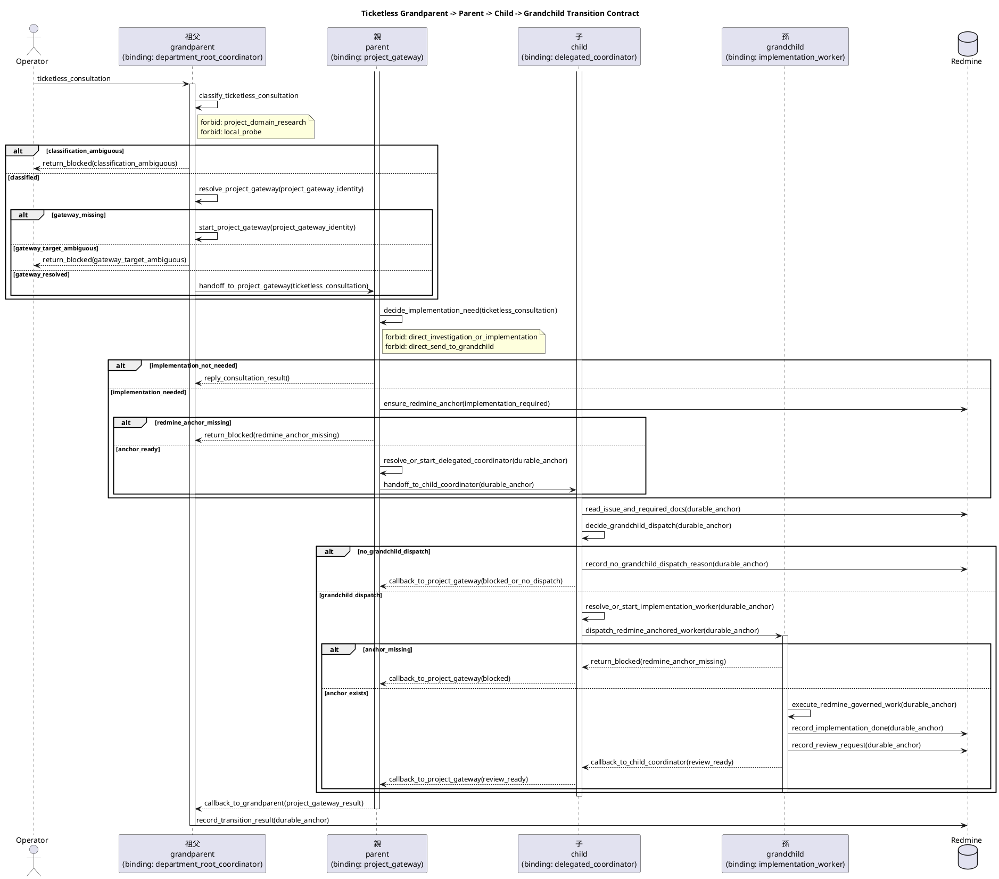

# チケットなしプロジェクトゲートウェイ実行UX

Redmine #12667。GK3500IT の実機受け入れ準備で見えた、ticketless
consultation の runtime UX 境界を定義する。`project-scoped-workspace-identity.md`
を拡張し、grandparent lane から parent project gateway へ相談を渡すときの見え方と責務を固定する。

これは設計 doc であり、運用手順書ではない。実機固有の pane id、local path、
一回限りの rerun 手順、operator 固有の window 配置は Redmine journal または
runbook に置く。

## 中核UX目標

作業は常に実装 issue から始まるわけではない。operator が部署レベルの workspace に、
曖昧だが project-shaped な相談を投げることがある。この flow で期待する UX は、
次の 4 階層が見えることである。

```text
grandparent lane
  -> parent lane
    -> child lane
      -> grandchild lane
```

`gk-3500-it-operations` のような workspace では、今回の binding として grandparent
lane が department root coordinator、parent lane が cloud-drive management のような
project gateway になる。具体的な child / grandchild lane は、parent gateway が
「実装が必要」と判断した後にだけ作られる。

受け入れ上の重要な signal は、全 pane が同じ tmux window に並ぶことではない。
各階層が正しい種類の Unit として見え、明示的で監査可能な route で次の階層へ
work を渡せることである。

## 祖父・親・子・孫レーン契約

#12675 では、GK3500 IT Operations 実機テスト前の workflow を 4 階層として固定する。
この 4 階層は家族比喩ではなく、lane ownership と transition function の depth を表す
設計語彙である。

正本語彙は相対階層の `grandparent` / `parent` / `child` / `grandchild` とする。
`root` は今回の GK3500 IT Operations binding では自然だが、抽象 contract には含めない。
ある 4 階層 slice の grandparent が system 全体の root とは限らないためである。

```text
grandparent lane = current binding: department_root_coordinator
  -> parent lane = current binding: project_gateway
    -> child lane = current binding: delegated_coordinator / implementation_gateway
      -> grandchild lane = current binding: implementation_worker
```

実機 acceptance では、parent gateway が直接調査・実装へ入らず、必要に応じて child
coordinator を起動し、その child が grandchild implementation lane を dispatch する形を
green path とする。

### Lane Registry

| 階層 | abstract lane | current binding | owner role | 主責務 | 禁止事項 | Redmine work item 境界 |
| --- | --- | --- | --- | --- | --- | --- |
| 祖父 | `grandparent` | `department_root_coordinator` | `grandparent_coordinator` | ticketless consultation を routing metadata だけで分類し、対象 parent gateway を semantic route で解決または起動する。 | project-domain docs research、web research、local probe、implementation prep、project Claude への direct send。 | consultation 分類だけでは作成しない。implementation 必要性は parent 以降で判断する。 |
| 親 | `parent` | `project_gateway` | `project_gateway` | grandparent から受けた相談を project-domain として受領し、実装不要回答、child coordinator 起動、または blocker へ分岐する。 | parent 自身による直接調査・実装、rclone / Drive 実操作、domain probe を Redmine anchor なしで実行すること、grandchild worker への direct implementation send。 | implementation または domain probe が必要になった時点で、worker 実行前に Redmine issue / journal anchor を要求または作成する。 |
| 子 | `child` | `delegated_coordinator` / `implementation_gateway` | `delegated_coordinator` | Redmine anchor を読み、実装 scope を分解し、grandchild lane dispatch と callback aggregation を行う。 | owner close approval の代行、parent issue の close、release / publish / credential / destructive approval、parent への callback なしの完了扱い。 | child coordinator 自体は既存 anchor に従う。新たな実装 scope が分かれた場合だけ child work item を作る。 |
| 孫 | `grandchild` | `implementation_worker` | `implementation_worker` | Redmine-governed work を実装・検証し、implementation_done / review_request / residual risk を durable record に残す。 | ticketless request だけを根拠に実装すること、owner へ直接質問すること、Redmine anchor なしの変更、parent / grandparent への direct callback。 | 実行前に anchor が必須。anchor が無ければ実装せず、child へ blocked callback を返す。 |

`codex` / `claude` は上表の owner role ではなく runtime provider / binding である。pane id は
`last_seen_pane_id` 相当の cache/evidence であり、route authority ではない。通常 route は
workspace / project / lane / role class などの semantic route identity から解決する。

### Redmine Work Item 作成境界

ticketless consultation は、相談それ自体を即 Redmine issue 化しないことがある。境界は次の
とおり固定する。

- grandparent が行う分類、parent gateway の発見 / 起動、parent への ticketless handoff だけでは、
  implementation work item を作らない。
- parent が `decide_implementation_need(...)` で「implementation 不要」と判断した場合は、
  ticketless consultation result として grandparent へ返し、implementation issue を作らない。
- parent が project-domain research、local probe、rclone / Drive 操作、file 変更、または
  implementation worker dispatch が必要と判断した場合、実行前に
  `ensure_redmine_anchor` を通し、implementation_required として記録する。
- child が grandchild へ dispatch する時点では、grandchild が読む Redmine issue / journal
  anchor が必須である。anchor が無い場合、child は
  `return_blocked(redmine_anchor_missing)` を parent へ返す。
- 実機 acceptance では rclone / Google Drive 実操作を実行しない。ここで固定するのは、
  本番前にどの transition が anchor を要求するかである。

### 禁止遷移

```yaml
禁止:
  - id: grandparent_does_domain_work
    条件: [lane: grandparent, action: project_domain_research_or_local_probe]
    action: stopしてparent_gatewayへ渡す
  - id: parent_implements_directly
    条件: [lane: parent, action: investigation_or_implementation_execution]
    action: Redmine anchor確保後にchild_coordinatorへdispatchする
  - id: parent_sends_to_grandchild_directly
    条件: [lane: parent, target: grandchild, child_coordinator: skipped]
    action: delegated_coordinatorを経由するか、no_child_delegation理由をdurable recordに残す
  - id: worker_runs_without_anchor
    条件: [lane: grandchild, redmine_anchor: missing]
    action: blocked callbackを返し実行しない
  - id: pane_id_as_authority
    条件: [routing_basis: copied_pane_id_only]
    action: semantic route identityで再解決する
```

## ウィンドウとセッションの分離

grandparent unit と parent project gateway unit は、別 window または別 session として表示されてよい。
組織階層を保つなら、その分離はむしろ望ましい。

- grandparent: 分類と routing を担当する。
- parent project gateway: project-domain 相談の受領と implementation 判断を担当する。
- child coordinator: Redmine anchor 付きの worker dispatch と callback aggregation を担当する。
- grandchild implementation worker: Redmine anchor 付きの変更と検証を担当する。

したがって、parent project gateway が grandparent と同じ cockpit column に並ばないこと自体は
bug ではない。bug になるのは、runtime が project gateway を標準の semantic route で
発見、作成、focus、message できない場合である。

避けるべき false fix:

- project gateway を同じ cockpit column に強制すること。
- grandparent -> parent project gateway の通常 route を operator がコピーした `%pane` に依存させること。

## Grandparent Lane の契約

ticketless consultation 中の grandparent coordinator は、bounded routing actor である。

許可される責務:

- request 分類に必要な routing metadata と project identity metadata だけを読む。
- 最も妥当な project gateway を選ぶか、分類不能 blocker を返す。
- semantic identity で既存 project gateway target を発見する。
- UX が対応している場合、標準手段で project gateway startup を要求または実行する。
- consultation を project gateway へ渡すか、required operator action 付きで
  fail-closed blocker を返す。

project gateway へ渡す前に禁止される責務:

- project-domain docs research。
- domain problem に関する web research。
- domain problem に関する local machine probe。
- implementation target file resolution。
- implementation documentation resolution。
- Claude implementation handoff preparation。

`rclone`、mount label feasibility、Drive/Finder behavior、cloud-drive diagnosis 目的の
process inspection、project-specific scripts は project gateway の domain work であり、
grandparent の責務ではない。

## プロジェクトゲートウェイの契約

project gateway は grandparent から渡された後の domain consultation を担当する。

許可される責務:

- project docs と project-domain guardrails を読む。
- project が許可する範囲で official doc や local fact を bounded に確認する。
- implementation なしで回答できるか判断する。
- implementation worker が必要か判断する。
- implementation dispatch 前に Redmine work anchor を要求または作成する。

project gateway は implementation issue を作らない判断をしてよい。consultation では
それが正常 outcome である。一方、implementation を dispatch するなら通常の
Redmine-governed workflow が適用され、durable issue / journal anchor が必須になる。

## 意味的ターゲット解決の要件

grandparent から parent project gateway への標準 route は、volatile な pane id なしで表現できなければ
ならない。

resolver が扱う identity field の正確な名前、必須 / 任意、default、表示順は CLI help /
validation error を正本にする。この文書は、volatile な pane id ではなく project gateway の
semantic route identity で一意解決することだけを固定する。

resolver は次の場合に fail closed する。

- project gateway target が 0 件。
- project gateway target が複数件。
- target の project identity と repository identity が一致しない。
- target が project gateway として要求される runtime location にいない。
- target の role class が project gateway として不適合である。

failure output は `gateway_missing`、`gateway_target_ambiguous`、`selector_gap` のような
分類と、次の安全な action を示す。active pane だからという理由で silent に選んでは
ならない。

直接 `%pane` addressing は debug escape hatch として残してよい。ただし
grandparent -> parent project-gateway route の通常 UX ではない。

## シーケンスと遷移関数

workflow は、曖昧な activity と後付け note ではなく、lane 間 transition を
function-like に書く。lane crossing は sequence diagram の arrow label と関数契約で
command family / semantic contract を読む。agent は sequence を読めば、どの actor から
どの actor へ、どの command family で境界を越えるのかが一意に分かる状態でなければならない。

sequence 内の function 名は安定した設計語彙である。CLI command 名や flag は今後変わってよいが、
product-ready と呼ぶには、各 function と等価な command surface と validation message を実装する必要がある。
正本 sequence と別に activity swimlane を併置しない。図が複数あると、差分が意図か drift
かを LLM が判断する余地が増えるためである。

### Grandparent / Parent / Child / Grandchild Sequence



### 関数契約

これらの function は一般的な散文ではない。各 function は、具体的な command family、
semantic contract、または「どの command surface が足りないか」を示す fail-closed blocker
に対応しなければならない。flag の完全な引数列、必須 option、誤入力時の誘導文は CLI parser /
help / validation error を正本とし、この文書へ複製しない。

```text
classify_ticketless_consultation(...)
  command_status: missing
  existing_command: none
  proposed_surface: mozyo-bridge project-gateway classify-ticketless
  help_contract: 許可 action / 禁止 probe / durable anchor 必要性を error message で返す
  grandparent に許可される action
  routing metadata だけを読む
  project-domain docs / web research / local probe / implementation prep を禁止する

resolve_project_gateway(...)
  command_status: missing
  existing_command: none
  partial_existing_command_family: mozyo-bridge agents targets
  proposed_surface: mozyo-bridge project-gateway resolve
  help_contract: semantic route identity の不一致と複数候補を fail-closed reason として返す
  project gateway identity で live target を解決する
  target がちょうど 1 件なら返し、それ以外は fail-closed reason を返す
  active pane や copied %pane を authority として扱わない

start_project_gateway(...)
  command_status: missing
  existing_command: none
  partial_existing_command_families:
    - mozyo-bridge cockpit
    - mozyo-bridge init codex
  proposed_surface: mozyo-bridge project-gateway start
  help_contract: project gateway identity の stamp 結果と既存 unit focus 結果を返す
  project-scoped gateway unit を作成または focus する
  repository identity を Git authority として保つ
  project gateway identity を stamp する
  separate window/session projection を許可する

handoff_to_project_gateway(...)
  command_status: missing
  existing_command: none
  anchored_near_command_family: mozyo-bridge handoff send
  missing_reason: true ticketless source/kind と project_gateway semantic target resolver が未実装
  help_contract: direct-send ではなく project gateway semantic target を要求し、不足時は resolve/start を案内する
  grandparent から解決済み parent project gateway へ ticketless consultation を送る
  semantic target identity を使う
  project Claude へ direct-send しない

ensure_redmine_anchor(...)
  command_status: missing
  existing_command: none
  missing_reason: mozyo-bridge CLI には Redmine issue / journal anchor 作成または選択 surface が無い
  durable issue/journal anchor を作成または選択する
  consultation が implementation へ変わる場合だけ必須

dispatch_redmine_anchored_worker(...)
  command_status: existing
  command_family: mozyo-bridge handoff send
  semantic_contract: Redmine anchored implementation request を implementation worker へ渡し、callback route を保持する
  child から grandchild worker へ通常の governed workflow で implementation を渡す
  execution 前に durable anchor を要求する

resolve_or_start_delegated_coordinator(...)
  command_status: composed_existing
  decision_command_family: mozyo-bridge handoff delegate-launch-adopt
  semantic_contract: child coordinator の採用 / 起動判断を Redmine anchor と route identity に基づいて行う
  note: read-only decision primitive。adopt 時は recommended handoff command を出す。launch actuator は別途必要。詳細 option は CLI help を正本にする。
  Redmine anchor に対応する child coordinator / implementation gateway を semantic identity で解決する
  target が無ければ project policy に従い起動または focus する
  複数候補、route identity 不一致、project scope 不一致は fail-closed にする

handoff_to_child_coordinator(...)
  command_status: existing
  command_family: mozyo-bridge handoff send
  semantic_contract: Redmine anchored request を delegated coordinator へ渡し、parent/child project identity を保持する
  parent project gateway から child coordinator へ Redmine anchored request を渡す
  ticketless text だけを渡さず、anchor と required_docs 解決入口を含める
  grandchild worker へ direct-send しない

decide_grandchild_dispatch(...)
  command_status: existing
  dispatch_command_family: mozyo-bridge handoff delegate-grandchild-dispatch
  semantic_contract: grandchild dispatch 可否を route depth / owning route / no-dispatch reason とともに決定する
  child coordinator が grandchild implementation lane を使うか判断する
  default purpose は preserve_coordinator_context
  no-dispatch の場合は context-neutral か urgent minimal correction などの理由を durable record に残す

resolve_or_start_implementation_worker(...)
  command_status: composed_existing
  dispatch_decision_family: mozyo-bridge handoff delegate-grandchild-dispatch
  realization_stamp_family: mozyo-bridge handoff delegate-grandchild-stamp
  realization_gate_family: mozyo-bridge handoff delegate-grandchild-gate
  semantic_contract: lane identity chain と parent/child issue relation を保った実装 worker 実現状態を記録する
  note: worker Claude 自体の semantic start は単独 CLI 未確定。実現確認と stamp は既存。
  Redmine anchor に対応する grandchild implementation worker を semantic identity で解決または起動する
  hidden subagent や copied %pane を authority にしない

callback_to_child_coordinator(...)
  command_status: existing
  command_family: mozyo-bridge handoff reply
  allowed_callback_states: implementation_done, review_request, reply
  semantic_contract: Redmine anchor への state pointer を child coordinator へ返す
  grandchild worker が implementation_done / review_request / blocked を child coordinator へ返す
  callback は work log ではなく Redmine durable anchor への pointer とする

callback_to_project_gateway(...)
  command_status: existing
  command_family: mozyo-bridge handoff send
  allowed_callback_states: implementation_done, review_request, review_result, reply
  semantic_contract: Redmine anchor への state pointer を parent project gateway へ返す
  child coordinator が implementation_done / review_request / blocked を parent gateway へ pointer として返す
  callback は work log ではなく Redmine durable anchor への pointer とする

callback_to_grandparent(...)
  command_status: existing
  command_family: mozyo-bridge handoff send
  allowed_callback_states: implementation_done, review_request, review_result, reply
  semantic_contract: Redmine anchor への state pointer を grandparent coordinator へ返す
  parent gateway が project gateway result を grandparent へ pointer として返す
  callback は work log ではなく Redmine durable anchor への pointer とする
```

実装がこれらと同名の command ではなく低レベル primitive を公開する場合でも、agent が
documentation search で command sequence を発明せずに同じ transition を実行できる
必要がある。

## 受け入れ判定の意味

GK3500IT acceptance scenario は、次が満たされた場合だけ green とする。

- grandparent が sparse consultation を受け、routing metadata から意図した project に分類する。
- grandparent が project-domain research や local probe を実行しない。
- grandparent が semantic route で parent project gateway を発見または起動する。できない場合は
  concrete fail-closed blocker を返す。
- project gateway が domain owner として consultation を受け取る。
- implementation dispatch が必要な場合、worker execution 前に Redmine issue / journal
  anchor を作成または使用する。
- parent project gateway が直接調査・実装せず、Redmine anchor 付きで child coordinator へ橋渡しする。
- child coordinator が grandchild implementation lane を使うか判断し、使う場合は grandchild worker が
  Redmine-governed work として実装・検証・review_request を記録する。
- pane id は route authority ではなく cache/evidence として扱われ、semantic identity で
  gateway / coordinator / worker が解決される。

debug 中の operator hand correction は有用なことがあるが、product UX の証明にはならない。
operator が pane id をコピーした、window を手選択した、隠れた project context を与えた、
といった補助で成立した run は green ではなく assisted として記録する。

## 既存設計との関係

`project-scoped-workspace-identity.md` は、monorepo project directory を fake Git repo に
せず routable project identity にする方法を定義する。

`unit-target-model.md` は Unit、Target、Projection、fail-closed target resolution を定義する。
本 doc は、その model を ticketless grandparent -> parent project-gateway route 向けに
具体化する。

`cross-project-cockpit-smoke-runbook.md` は concrete check の runbook-style smoke reference
である。本 doc は step-by-step operator procedure を意図的に扱わない。

`route-identity-ledger.md` は pane id より stable route identity を優先すべき理由を定義する。
本 doc は、その原則を project gateway discovery と consultation delivery に適用する。
