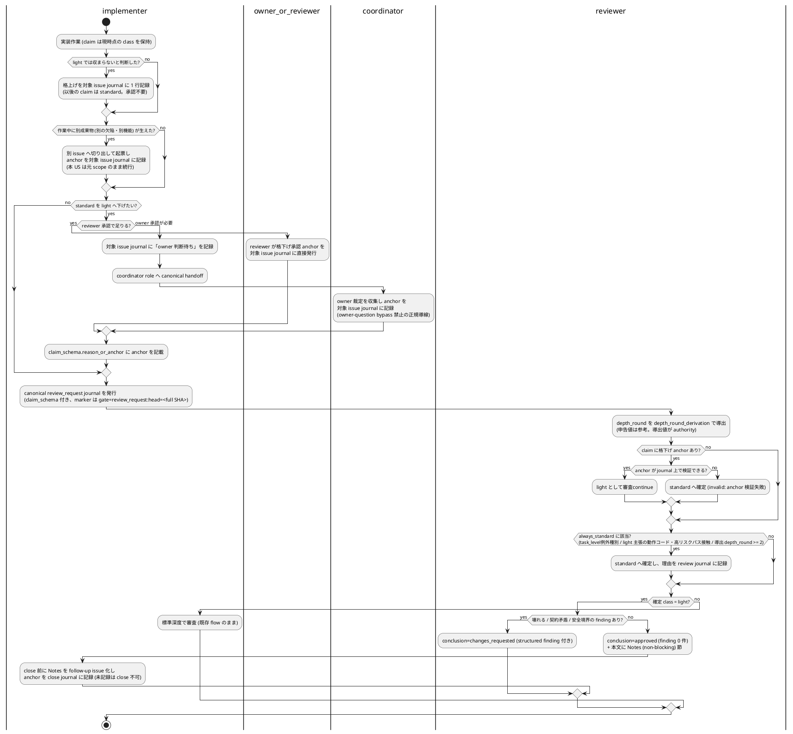
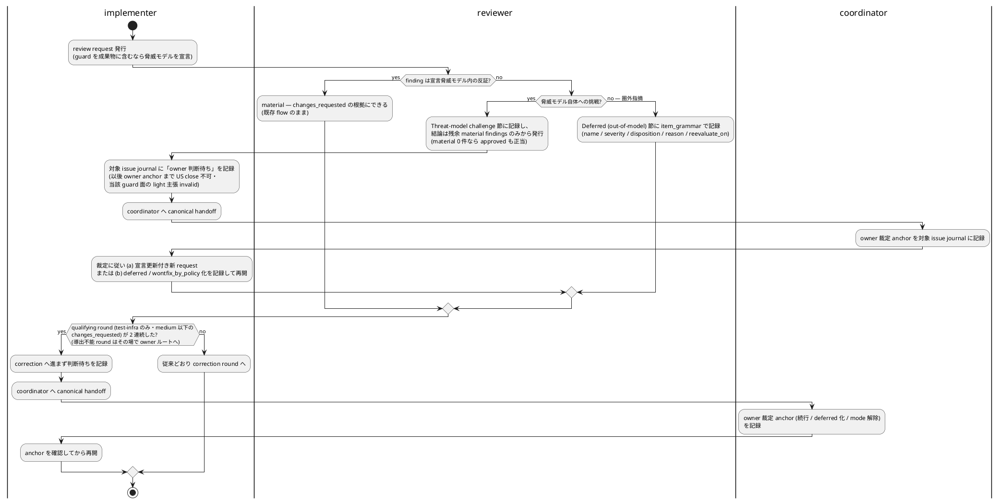

# Agent Workflow Rules

## 目的

この文書は `mozyo_bridge` repository で作業する AI agent の実行規約である。root の `AGENTS.md` / `CLAUDE.md` は router に留め、詳細規約はこの文書に置く。

役割の分界 (#13025): 本 doc は **mozyo_bridge repo 固有** の運用規約の正本である。配布される portable 運用手順の正本は `skills/mozyo-bridge-agent/references/workflow.md`、gate / 役割 / 編集権限 / close 条件の governance contract は central preset `.mozyo-bridge/rules/presets/redmine-governed/agent-workflow.md` にあり、本 doc はそれらを再掲せず、採用宣言・repo 固有拡張・pointer に留める。配置判断の正本は配布側 `skills/mozyo-bridge-agent/references/workflow.md` の `## Workflow docs の正本境界`、mozyo_bridge への適用は `vibes/docs/rules/workflow-docs-boundary.md` を読む。

## 作業開始

- 現在の `cwd` が対象 repository root、またはその配下であることを確認する。
- root の `AGENTS.md` / `CLAUDE.md` は router として扱い、central preset
  `.mozyo-bridge/rules/presets/redmine-governed/agent-workflow.md` と必要な
  project-local docs を読む。
- active な Redmine issue / journal を source of truth として確認する。該当
  issue がない場合は、実装前に作成または owner / coordinator へ起票を依頼する。
- pane message / chat message は通知にすぎない。判断前に Redmine issue
  description / journals / status と catalog で解決された docs を読む。

## Redmine 運用

- Redmine は durable な作業ログである。標準の作業・dispatch 単位は UserStory
  (`1US=1作業単位`; #13002) であり、Task / Test / Bug は US scope 内で実装者が
  まとめて遂行する内訳である。granularity の設定 enum
  (`epic|feature|user_story|leaf_issue`) と例外条件の正本は
  `vibes/docs/specs/work-unit-granularity-config.md` を読む。
- Issue は目的、作業対象、成果物、完了条件、必要な gate journal を持つ。
- narrative の issue 参照 labeling — `#<id> <短い概要>` の形、同一段落内の省略ルール、
  machine-readable surface (commit trailer / CLI flag / JSON field / branch 名 / file path)
  の対象外扱い — の正本は、#13029 により配布側
  `skills/mozyo-bridge-agent/references/workflow.md` の
  「Narrative の issue 参照は `#<id> <短い概要>` で書く」節にある。本 doc は再掲しない
  (#13029 で pointer 化)。repo 内の適用例: `#12703 ticketless no-anchor callback transport`。
- 作業が完了、block、scope 変更、handoff、review、owner close approval、close
  に進む場合は、該当 issue の journal を更新する。
- chat message を durable な作業ログとして扱わない。
- issue scope が膨らんだ場合は、黙って削らず follow-up issue に分割する。
- owner intent、future scope、non-goal、later-stage、decision pending の棚卸しと、
  「後で」「別 Version」「follow-up」「later-stage」提案の immediate durable
  classification (new issue / existing issue / explicit no-op / owner decision pending)
  の正本は、#13029 により配布側 `skills/mozyo-bridge-agent/references/workflow.md` の
  `## Backlog reconciliation gate (deferred intent の即時 durable 分類)` にある。
  repo の US close / Version close 運用への組み込みは
  `vibes/docs/logics/coordinator-sublane-development-flow.md` `## US close と Version close`
  を読む。会話だけに残さない。
- Claude の通常開発完了 journal には、次の最小証跡を短く残す。
  - `mozyo-bridge-agent` skill を loaded したこと。
  - active Redmine issue / journal と relevant project docs を確認したこと。
  - 変更 commit / 変更 file / 実施した verification / 残リスク。
  - 追加で参照した relevant rule / reference がある場合は、その path または source。
- 上記は監査可能性のための証跡であり、全 reference を毎回読むことを要求しない。

## Secret Handling

- PyPI / TestPyPI token、API key、personal credential、個人情報を repository、Redmine、external docs に記録しない。
- `.env`、`.env.*`、`.pypirc` は local-only の secret surface とし、ignored のままにする。
- production publish は local token upload を標準 route にしない。

## mozyo-bridge の扱い

- `mozyo-bridge` は notification transport であり、review、completion、task state の source of truth ではない。
- pane message を受けた agent は、作業前に Redmine issue / journal または明示された source of truth を確認する。
- 送信側は 2 本の rail から正しいものを選ぶ。default を黙って弱化しない。
  - **v0.4 以降の default rail** (`--mode queue-enter`、Claude / Codex agent pane 向け `mozyo-bridge handoff send` / `handoff reply` / `notify-*` 標準 variants、`--force` 不可): target / backend に応じた deterministic preflight が typing より先に走り、admission 不通過は `injection_stage=not_sent` のまま fail-closed する。admission 後の保証は backend で分かれる。**tmux compatibility rail** は本文を 1 回 type し、既存 marker probe 後に Enter を発行する。marker 観測ありは `sent` / `ok`、未観測は `sent` / `queue_enter` であり、promise は **strong preflight 付き practical queued submission** までである。inactive registered pane の `standard_target_admission` (live pane / strong role match / `workspace_id` present / unambiguous) と `tmux select-pane` activation も従来どおり維持する。**Herdr rail** は admission 後も本文を高々 1 回だけ type し、first Enter は generation 再確認・deadline check が揃った場合だけ発行する (zero-or-one)。idle / turn_ended baseline では causal wait を arm し、同じ terminal / launch generation に結び付く causal turn-start を確認した場合だけ `sent` / `ok` / exit 0 とする。**busy baseline は例外** (ADR-0002 / #15537): working-transition wait は attribution に使えないため pending-observer 要求なしで Enter を発行し、injected body が current composer から消えた事実を submission 証拠として `sent` / `queue_enter` (practical queued submission、causal claim なし) を返す。既定 30 秒 / 2 秒の単一 budget 内で fresh gate を毎回通した Enter-only fallback を行える。未確認・wait error・identity / generation drift・body / screen / runtime state の再確認不成立は precise `blocked` + non-zero であり、本文は再入力しない。
  - **strict explicit fallback** (`--mode standard`、`mozyo-bridge message --submit` 標準動作、non-agent pane 向け送信): **tmux compatibility rail** は `wait_for_text(marker)` を Enter の必要条件とし、未観測時は `C-u` rollback を発行して Enter を送らず `blocked` / `marker_timeout` にする。rollback は composer clear の証明ではないため、この blocked は `uncertain_partial` であり blind resend しない。**Herdr rail** は本文を高々 1 回だけ入力する event-driven turn-start rail で、causal confirmation が無ければ fail-closed する。strict landing / turn-start observation が監査要件・regression check・observability test として必要な送信、または default scope 外 (`mozyo-bridge message` / non-agent pane) で明示的に選ぶ。v0.4 で default ではなくなったが contract からは削除しない。
- delivery が `blocked` / non-zero の場合は、共有 `injection_stage` で再送可否を決める。`not_sent` (zero bytes / Enter なし) だけが bounded retry 可能であり、`uncertain_partial` (本文または Enter が到達した可能性あり) は blind resend せず、durable anchor と receiver 状態を照合して reconcile する。status / reason だけから `un-notified` と断定しない。
- どちらの rail を使った場合でも、durable record (Redmine journal 等) が正本である。pane notification は pointer。
- delivery rail dogfood、pre-smoke gate、release-adjacent runtime verification では runtime fingerprint を durable record に残す。portable 規律 (version 文字列単独を evidence にしない / fingerprint 記録 / 不一致は `blocked`・`environmental` で PASS に混ぜない / 実行 surface の無承認自己修復禁止) の配布正本は、#13060 により配布側 `skills/mozyo-bridge-agent/references/workflow.md` の `## Runtime fingerprint 検証規律` にある。本 repo 固有の適用: 依存 feature probe の例は `standard_target_admission` present、PASS evidence の代表例は #12546 real-machine smoke。local bare / pipx runtime alignment は source-runtime smoke green 後の別 Task とし、owner / operator approval なしに dogfood / smoke 中の pipx reinstall、local install、tag、publish、version bump で PASS を作らない。具体 field 一覧と alignment 手順は `vibes/docs/logics/tmux-send-safety-contract.md` の `### Runtime Fingerprint Gate` を参照する。
- 詳細・state machine 全体・例外条件の正本は `vibes/docs/logics/tmux-send-safety-contract.md` の `## Default Delivery Promise (v0.4)` / `## Queue-Enter Default Rail` 節を参照する (重複させない)。
- `.agent_handoff/tasks.json` は retired queue の棚卸し用であり、standard notification fallback として扱わない。

## User Interaction And Escalation

escalation trigger 一覧 (実装者 Claude がユーザー窓口 Codex へ escalate する 7 条件) と、escalation を受けた Codex の handling (source of truth 先行確認、ユーザー問い合わせの限定、対話窓口の Codex 統一、Claude への直接指示時の source of truth 更新) の正本は、#13029 により配布側 `skills/mozyo-bridge-agent/references/workflow.md` の `### 実装者 escalation trigger (Claude → Codex)` にある。本 doc は再掲しない (#13029 で pointer 化)。本 repo 固有の追加はない (durable record は Redmine issue / journal)。

## Claude / Codex Role Boundary

- 通常開発 task の実装者は Claude とする。Codex は通常開発 task を直接実装しない。
- Codex は escalation、audit、ユーザー対話窓口、source of truth からの判断整理を担当する。
- 上記の役割帰属は role 基準で読む。「Claude」「Codex」は実装者 role / 監査者・coordinator role の **default provider binding** であり、provider は交換可能な delivery 属性である。ユーザー対話窓口・owner-facing・owner_close_approval の集約先は coordinator role の一点であって特定 brand ではない (正本は中央 preset `### 既定役割` / `### Owner Close Approval Delegation`、binding config は #13157 provider_binding)。provider を差し替えても集約点は role のまま維持し、brand へ戻さない。
- Codex が通常開発 task ID を受けた場合の standard 動作は、自ら実装することではなく、Claude handoff に変換することである。task の規模、緊急度、実装難易度、ユーザーからの催促、ユーザーが Codex pane に直接書いたことを理由に standard を曲げない。
- cockpit / sublane 前提の開発フローでは、管制塔とサブレーンの責務分担、仕様決定 routing、帯域 / admission / pipeline fill、US close、sublane retirement、後続 Version / US 提案の順序は `vibes/docs/logics/coordinator-sublane-development-flow.md` を spine とする。この文書では詳細を複製せず、判断時は同 doc を先に読む。
- cockpit / sublane 運用中の通常開発 task は、coordinator / main lane / `coordinator_assistant` で実装しない。coordinator は owner-facing、audit、routing、drain 判断を担当する。`review_waiting` / `owner_waiting` / `close_waiting` / `integration_waiting` / `blocked` / `callback_due` / `callback_delivery_failed` は coordinator-blocking state として先に drain する。一方で、既存 lane が `implementing` のみなら coordinator は idle とみなし、独立した ready work を専用 sublane / worktree へ pipeline dispatch する。直列化する場合は file / invariant overlap、merge order、release gate、owner decision など具体理由を dispatch decision に残す。`coordinator_assistant` へ直接渡してよいのは read-only 調査、要約、draft、Design Consultation までであり、専用 sublane へ移されて別の実装 role になるまで実装 diff を出させない。正式語と authority は skill `references/workflow.md` の **`coordinator_assistant` の安全使用境界**を読む。
- `sublane` は cockpit / tmux / `mozyo-bridge agents targets` で発見できる checkout lane と agent pane identity を持つ実運用 lane を指す。Codex の内部 `multi_agent` / hidden worker / forked subagent は、operator の文字コックピットに現れず、Redmine callback と pane identity を同じ方法で監査できないため、この repo の sublane として扱わない。coordinator が sublane 実装を要求する作業で可視 sublane が存在しない場合は、不可視 worker や `coordinator_assistant` に流さず、worktree / cockpit lane の作成または operator 判断を Redmine に記録して停止する。
- coordinator は implementation-shaped work の Implementation Request を作る前に、Redmine に dispatch decision を記録する。dispatch decision では、work shape、current lane states、blocking queue、sublane dispatch 可否、default-lane / main-lane 例外理由を明示する。理由のない `coordinator_assistant` への implementation_request は process gap として correction 対象である。`main Claude` / `default-lane Claude` は現在または過去の `coordinator_assistant via claude` を示す互換表記に限る。
- coordinator は 1 本の sublane dispatch 成功を turn 完了条件にしない。dispatch 後、callback / review / owner / integration / close / retirement drain 後、next-action 判断前に `vibes/docs/logics/coordinator-sublane-development-flow.md` の Post-Dispatch Fill Loop を実行し、追加 dispatch または concrete stop reason を Redmine に残す。
- `mozyo_bridge` dogfooding の具体的な lane 数 soft profile は `vibes/docs/logics/coordinator-sublane-development-flow.md` `### Local Soft Profile` を正本とする。profile は active implementation sublane 数を固定 target ではなく、毎 dispatch / drain 後に再評価する lane-set 最大化問題 (`maximize independent_ready_active_lanes`) として扱い、repo-local hard cap と stop reasons を制約とする。cap は per-dispatch override 不可の hard stop であり、具体的な cap 値は本 doc へ複製せず spine を読む。review / owner / close / callback queue が詰まっている場合は cap 未満でも新規 dispatch を止めて drain を優先する。
- ユーザーからの「実行せよ」「対応して」「やって」「お願いします」「実装して」「進めて」など命令形・依頼形・激励形の指示は、それ単独では Codex の direct edit 権限の根拠にならない。これらは「実行してほしい」という意思表示であり、「Claude を経由しなくてよい」という意思表示ではない。
- Codex 受領時に上記 standard handoff を上書きできるのは、Policy / Skill Authoring Boundary に定義された Codex direct edit 例外に明示的に該当する場合だけである。
- Codex が自律フロー反映確認 task を受けた場合、検証対象となる通常開発 task を選定し、Claude へ handoff する。
- Codex は handoff 前に、選定理由、対象 issue、既存 worktree 差分の扱い、Codex の後続 audit 役割を Redmine に記録する。
- Codex が誤って通常開発 task を直接実装した場合、その実行は task の正規完了に数えない。確認 task 中であれば自律フロー反映確認の成功条件にも数えない。
- 上記の誤実装が発生した場合、対象 issue を未完了に戻し、誤実装の事実、影響範囲、後続対応(採用・破棄・再実装)の判断を Redmine に correction として記録したうえで、Claude 実装から Codex audit までの flow をやり直す。この correction flow は、検証対象の確認 issue に限らず、すべての通常開発 issue に適用する。
- `owner_close_approval` journal の記録は coordinator role が行う (standing delegation を含む)。lane gateway が発動条件充足を確認した場合は、close 条件充足の callback を coordinator へ返し、記録自体は coordinator が行う。lane gateway が standing_delegation を直接起票した既往は、条件充足時に限り coordinator の ratification journal で追認できるが、標準経路にしない (owner_intent anchor: #13358 j#73485 運用注記)。
- herdr backend での lane 実運用手順 (作成 / dispatch / relaunch / retire / 統合 / live smoke) の正本は `vibes/docs/tasks/herdr-lane-operations.md`。本 doc は手順を複製しない。

## Architecture Boundary For Modularization

- `src/**` / `tests/**` の分割・整理・新規設計を伴う通常開発では、単なる free function のファイル移動だけを architecture 改善として扱わない。対象 path の catalog resolve で `vibes/docs/logics/object-oriented-architecture-policy.md` を読み、command handler / use case / domain policy / value object / port-adapter のどこを改善する作業かを Redmine に記録する。
- OOP-first は「すべてを class にする」ことではない。pure deterministic helper、serialization helper、局所 validation は function のままでよい。一方で、外部副作用、複数 step の状態遷移、workflow authority / routing / approval / send safety、test double を必要とする境界は named object / typed result / Protocol port へ寄せる。
- `argparse.Namespace`、dict payload、raw subprocess / tmux / Redmine calls を use case deep layer へ流し続ける変更は、分割後も procedural coupling が残っているものとして residual を記録する。今回の scope で解消しない場合は、対応する OOP-first follow-up issue (例: #12638 / child task) へ明示的に引き継ぐ。
- Codex review では、line count や module count だけで承認しない。authority-bearing orchestration が handler / use case / port boundary に近づいたか、または未対応 residual が durable issue に接続されているかを確認する。

## Codex Pre-Edit Classification Gate

正本は central preset `### Codex Pre-Edit Classification Gate` (#13028 で pointer 化)。edit / commit 前に変更の実装主体を分類し、Markdown・runbook・設定例も repo 正本成果物なら実装成果物として扱う、という判断規約は preset 本文を読む。本 repo 固有の追加はなく、repo 固有の gated-surface path 拡張は `## Policy / Skill Authoring Boundary` を読む。

## Policy / Skill Authoring Boundary

- 役割分担 (Codex = 方針整理 / 文案 / ユーザー対話 / audit、Claude = repo file 実装)、Codex direct edit の例外 3 条件、edit 前の記録要件の正本は、skill `skills/mozyo-bridge-agent/references/workflow.md` `## Policy / skill authoring 境界` (cross-system 手順) と central preset `### Codex Direct Edit Gate` / Gate Schema `codex_direct_edit`。autonomous lane 外の Codex 直接編集には active issue 上の Redmine `codex_direct_edit` gate journal (必須 field は `role: 実装者`, `direct_edit: true`, `allowed_paths`, `reason`, `follow_up_review` — 意味論の正本は preset Gate Schema) が edit 前に必要。本 doc は semantics を再掲しない (#13028 で pointer 化)。
- **本 repo 固有の保護 scope 拡張**: 実装ファイル (`src/**`, `tests/**`, `docs/**`, `README.md`, release workflow, CLI behavior) に加え、autonomous lane 外の guardrail / docs / catalog surfaces として `AGENTS.md`, `CLAUDE.md`, `.mozyo-bridge/rules/**`, `.codex/skills/**`, `.claude/skills/**`, `skills/mozyo-bridge-agent/**`, `plugins/mozyo-bridge-agent/**`, `src/mozyo_bridge/scaffold/presets/**` を含む。chat 上の「ユーザーがガードレール変更を明示」だけでは bypass にならない。
- `Repo-Local Guardrail Autonomous Lane` に入る `vibes/docs/rules/**`, `vibes/docs/logics/**`, `vibes/docs/specs/**`, `.mozyo-bridge/docs/catalog.yaml` は preset と `vibes/docs/rules/codex-autonomous-guardrail-lane.md` (採用記録) に従って Codex が自律編集できる。
- **本 repo は central preset `### Coordinator-Owned Operational Config Direct Edit` の完全一致 allowlist を既定のまま採用する** (Redmine #15095、owner_intent 2026-08-07 / 2026-08-12 j#104373)。`.mozyo-bridge/config.yaml`, `.mozyo-bridge/project-defaults.yaml`, `.mozyo-bridge/workflow-role-bindings.json` の 3 file は resolved coordinator role が直接編集してよい。allowlist の拡張・縮小は本 repo では行わない。
  - owner が direct edit と対象を明示した場合は ticketless authority mode とし、active issue / journal の代わりに owner-authorized commit trailer を残す。owner の個別指示がない routine edit は active issue と `coordinator_operational_config_edit` journal を使う。どちらも差分確認、path 固有検証 (`mozyo-bridge config check-parse` / `config status`、`mozyo-bridge workspace-defaults --check`、`mozyo-bridge workflow role-authority --json`)、commit を維持する。`workflow-role-bindings.json` は owner explicit mode でも active issue 必須。詳細の正本は central presetであり、本 doc は再掲しない。
  - allowlist は **完全一致**で読む。`.mozyo-bridge/**` へ展開しない。legacy 互換名 `.mozyo-bridge/workspace-defaults.yaml`、`.mozyo-bridge/rules/**`、`.mozyo-bridge/docs/**`、`.mozyo-bridge/scaffold.json`、`redmine-defaults.md`、`.mozyo-bridge/tmux/**`、`workspace-anchor.json` / `workspace.json`、generated 物、DB、secret 保持 file、および将来追加される未登録 file は対象外 (既定 deny) で、上記 `本 repo 固有の保護 scope 拡張` と `codex_direct_edit` gate の側に残る。
  - 本 carve-out は編集権限であって review exemption ではない。allowlist 自体を変える作業は運用設定ではなく guardrail 変更であり、通常の Claude 実装 → US-level audit 経路を通す。
- `.mozyo-bridge/docs/file_conventions.generated.yaml` 等の catalog generator output は誰も手編集しない (`.mozyo-bridge/docs/catalog.yaml` 変更 → `mozyo-bridge docs generate-file-conventions` 再生成 → `--check`)。
- 記録が欠けた direct edit は事後 correction の対象 (過去 incident pattern: `codex_direct_edit` gate journal なし、または Review Gate 承認済み audit-owned commit path なしの Codex repo diff → correction journal に記録して governed flow へ戻す)。direct edit 後も反映確認 requirement は免除されない。correction flow の詳細は上記正本に従う。

## Redmine Hierarchy Semantics

一般的な記載粒度 / Version 運用の判断ロジック (Epic / Feature / US / leaf の granularity 判断表、原文要点と normalized intent の分離、US close conditions の書き方、Version の sizing / follow-up 収容 / dispatch 候補選定) の正本は、#13024 により配布側 `skills/mozyo-bridge-agent/references/redmine-issue-authoring.md` にある。本節はその一般則を再掲せず、`mozyo_bridge` workspace 固有の採用事実と例外を記録する。workspace 固有の採用: Epic と Feature の番号 prefix はそれぞれ独立した系列で、`110`, `120`, `130`... の 10 刻みが workflow 上の読み順・並び順を表す (優先度や進捗ではない)。

`mozyo_bridge` の Redmine 階層では、Epic / Feature を短期作業の完了単位として扱わない。これらは project の長期機能ポートフォリオであり、1 年以上残る投資領域や機能カテゴリを表す。

- Epic は product / governance の大きな投資領域を表す。例: `スキャフォールド統治`, `Agent UI / VS Code 連携`。
- Feature は Epic 配下の継続的な機能カテゴリを表す。例: `Redmine 統治プリセット`, `Workspace 横断セッション管理`, `VS Code Agent Pane PoC`。
- UserStory は実際に受け入れ条件を持ち、review / owner close approval / close の対象になる完了単位である。
- Task / Test / Bug は UserStory の実装・検証・不具合対応の内訳であり、replayable journal と commit / validation record が揃えば close する。
- Redmine Version は release / milestone の完了管理に使う。Epic / Feature の close で release 完了を表現しない。
- Version は、関連 issue が複数 Feature / UserStory に分かれる場合の roadmap の候補範囲 (grouping surface) でもある。同じ stabilization、UX 改善、dogfooding batch、acceptance batch に属する work package は、親子関係を無理に寄せず同じ Version に割り当てて束ねてもよい。Version は親子関係の代替でも、active lane-set の正本でもなく、進捗・残 scope・release readiness を横断して見るための planning axis である。
- Redmine Version / issue `fixed_version` は実行レーン配置の source of truth ではない。標準の実行・dispatch 単位は UserStory (`1US=1作業単位`; granularity は `epic|feature|user_story|leaf_issue` の設定 enum、正本は `vibes/docs/specs/work-unit-granularity-config.md`)、受け入れ単位も UserStory、active lane-set は coordinator が Redmine journal、branch ancestry、changed paths、merge state、owner / release gate、live callback state から都度決める。`leaf_issue` 単位の dispatch は central preset の `us_level_audit.task_level例外` に該当する場合の例外、`epic` / `feature` は explicit owner/operator decision なしに implementation dispatch しない。
- coordinator は `fixed_version` で候補を絞ってよいが、Version が同じことを理由に直列化したり、Version が違うことを理由に無条件で並列化したりしない。dispatch / hold の理由は concrete conflict cost、dependency、gate、integration backlog、callback / review / close drain のいずれかとして durable record に残す。
- active lane-set は ready work unit 数最大化問題として扱う (標準単位は UserStory)。local soft profile の範囲で、期待される merge conflict / module_health baseline conflict / shared invariant conflict / rework cost を増やさない ready work unit を優先的に載せる。管理が面倒、pane が多い、1 lane が既に動いている、という coordinator 都合は stop reason ではない。
- Smoke / acceptance / real-machine rerun は実装 blocker と混ぜず、最後に owner 承認付きの run window として扱う。実装 blocker が残る間は blocker issue を実装候補として扱い、smoke issue は実行承認まで hold する。
- 親 UserStory が umbrella として複数 roadmap / acceptance group にまたがる場合、親へ fixed_version を一括 propagation しない。子 issue の実行可否は各 leaf の durable record と live integration state から読み、親 issue には umbrella / cross-group であることと close 条件を journal / description に記録する。
- Redmine Version 名に将来の package release 番号 (`v0.10.x` など) を先入れしない。Redmine Version は作業テーマ / roadmap grouping / acceptance bundle の名前であり、package version の正本ではない。
- Package release 番号は release gate で、実際に release candidate に含める commit、互換性、release notes、tag / publish scope を確認してから決める。正本は Git tag、package metadata、release notes、release journal であり、Redmine Version 名ではない。
- 既存の番号付き Redmine Version 名は歴史記録として残してよいが、新規 roadmap group 作成時は semver 風の番号を避ける。番号付き Redmine Version を改名する場合は、参照 issue / journal / roadmap への影響を Redmine に記録し、release / tag / publish / version bump とは別作業として扱う。
- 将来 `lane_group` / `lane_set` 相当の Redmine custom field や workflow DB が整備された場合も、それは candidate grouping / decision support であり、active lane-set の正本にはしない。active lane-set の authority は coordinator の drain / dispatch decision journal と、その根拠になる Redmine issue / journal / Git state / gate state である。

進捗管理と構造管理を混同しない。進捗・完了判定は UserStory、child issues、Version で行う。Epic / Feature は「この領域が project 上まだ有効か」を表す構造 node であり、配下 UserStory がすべて close されても自動 close しない。

Epic / Feature を close するのは、その領域を今後使わない、統合・分割で別 node に移す、または product owner が portfolio から外すと判断した場合に限る。単に直近の US が完了した、または当面作業予定が無いという理由では close しない。

Redmine の表示上、Epic / Feature が `未着手` のまま配下 UserStory が `着手中` / `クローズ` になることがある。これは「親の機能領域が未着手」という意味ではなく、Epic / Feature を作業進捗 status として運用していないことを示す。status の見た目が誤解を生む場合は、親 issue の description / journal に「portfolio node / normally left open」と記録し、進捗判断は配下 UserStory と Version で行う。

## Audit Handoff (Claude → Codex)

- 監査の標準単位 (UserStory)、task_level例外、US-level audit request の必須内容、gate 語彙の正本は central preset `### US-Level Audit Model` / `### Gate Schema` (review_request)。handoff primitive の使い方 (高レベル `mozyo-bridge handoff send` 標準、低レベル read/message/type/keys は operator/debug 用、durable anchor を直接読む) の正本は skill `references/workflow.md` の `## Handoff ライフサイクル` / `## 同一レーン Claude dispatch`。本 doc は再掲しない (#13028 で pointer 化)。
- 本 repo 固有の宣言: US close 前の mandatory audit は `mozyo_bridge` repository の project-local policy として維持する (US-level audit model 自体は `redmine-governed` / `redmine-rails-governed` preset 経由で配布される)。doc-only / rule-only scope の US でも省略しない。
- `mozyo-bridge scaffold apply <preset>` ではユーザーが ticket system preset を明示選択する。選択された preset の workflow だけを適用し、他 preset やこの repo 固有の audit policy を混ぜない。

## ADR (Owner Decision Records) — Redmine #15536

owner の意思決定の正本は `vibes/docs/adr/` の ADR (書式・索引は `vibes/docs/adr/README.md`、判断
正本は ADR-0001)。本節はその**実行契約**であり、repo-local 宣言 (中央 preset 不変)。

```yaml
adr_conflict_gate:
  # static schema。owner 判断の収集順序は本節が所有せず、central preset
  # `### Claude Owner-Question Bypass Prohibition` の既存 flow (durable record →
  # coordinator role へ handoff → coordinator が owner 回答を収集・記録) へ委譲する。
  actors:
    reviewer: 監査 role (resolved auditor binding)
    implementer: 実装 role (resolved implementer binding)
    coordinator: owner 判断の唯一の収集窓口 (`### Claude Owner-Question Bypass Prohibition`)
    owner: ADR を変更できる唯一の authority
  trigger: review finding または実装変更が、active な ADR の「決定 (規約行)」と矛盾する、
    または矛盾の疑いがある場合
  scope: 本 gate が拘束するのは「矛盾指摘の採用」と「矛盾変更の実装」のみ。
    指摘の起票自体・矛盾しない通常の review / 実装は対象外
  required_fields:
    - adr_id                # 例: ADR-0002
    - conflict_statement    # どの規約行とどう衝突するか
    - evidence              # 根拠 (evidence_source 分類つき)
    - owner_approval_anchor # owner 裁定の Redmine journal 参照。未取得なら空
  reviewer:
    - 指摘の起票は常に自由 (独立性を維持)。ただし ADR 矛盾指摘は required_fields を伴う
      「ADR 変更の提案」として書く
    - owner_approval_anchor が空の間、その指摘を required_correction として採用しない (zero_adopt)
  implementer:
    - owner_approval_anchor の無い ADR 矛盾変更は実装しない (zero_implementation)。レビュー指摘
      への対応であっても同じ
    - owner 判断が必要な場合: 対象 issue の journal に required_fields を記録した上で、
      owner への確認は自分で行わず coordinator role へ canonical handoff で委ねる
      (正本: central preset `### Claude Owner-Question Bypass Prohibition`)
  invalid:
    - 関連 ADR の特定に失敗した場合、または ADR index (`vibes/docs/adr/README.md`) が読めない
      場合は「矛盾なし」とみなさず、implementer の owner 判断 route と同じ経路で停止する (fail_closed)
  record:
    - 判断・裁定・その anchor は対象 issue の journal に記録する。通知は canonical handoff のみ
    - ADR file の新規作成・supersede・status 変更は owner 裁定の journal anchor がある場合のみ。
      エージェント起草の提案は ADR file を作らず journal 上の draft として出し、
      anchor 成立後に file 化する (README の status enum に draft は存在しない)
```

## Review Depth Tiers — Redmine #15547 (判断正本: ADR-0004)

レビュー深度の段階化契約。単位は US のまま (ADR-0003)、深度だけを変更クラスで変える。
review 結果の wire format は既存の canonical `review_result` 契約
(`conclusion: approved|changes_requested`、approved は finding 0 件 / changes_requested は
1 件以上) を変更しない — 本節はその**中で** light の運用を定める。

```yaml
review_depth_tiers:
  # 判断正本は ADR-0004。本節は実行契約 (repo-local 宣言、中央 preset・wire format 不変)。
  claim_schema:            # review request journal に載せる class 主張
    class: light | standard          # 欠落・不正値は standard として扱う (invalid -> standard)
    light_subtype:                   # class=light のとき必須。閉じたリスト外は invalid -> standard
      - docs_typo_or_wording         # 文書の誤記・清書 (契約内容を変えない)
      - tests_only                   # tests/** のみの変更
      - comments_only                # コメント・docstring のみ (契約記述を変えない)
      - generated_regen              # generator 出力の再生成のみ
    target_head: <commit sha>        # 主張が指す exact head
    depth_round: <n>                 # 参考値。authority は reviewer の導出 (下記) であり自己申告ではない
    reason_or_anchor:                # 再分類時のみ: 格上げ理由 1 行、または格下げ承認 anchor
  depth_round_derivation:            # reviewer が実行する exact な導出
    # depth_round は review-depth 専用の「何周目の依頼か」であり、Review Generation Marker
    # Contract v2 の current review generation とは別概念。対象 review_request journal R ごとに
    # 一意に定まる。ADR-0004 の trigger は「2 周目の依頼に入った事実」なので、数える対象は
    # review の**結果**ではなく **request の通し番号**である。
    - count 対象は canonical な review_request marker
      (`gate=review_request:head=` を strict parser が同定した journal) のみ。marker を持たない
      journal は、本文が何を主張していても数えない (散文推定の禁止)。canonical でない依頼の
      試みは request として存在しない扱い
    - depth_round(R) = 当該 issue の journal のうち **id <= R の canonical review_request journal 数**
      (journal 単位 exactly-once。duplicate marker は journal 単位 1 回)。R 自身を含むため値は
      1 以上で、同じ R に対する導出値は後続 journal の追加で変わらない
    - 導出例 1 (#15547 実 marker 列、R = j#106456): canonical request は j#106443 / j#106452 /
      j#106456 の 3 件 → depth_round = **3**
    - 導出例 2 (approved 後の再依頼 probe): request j10 → approved result j20 → request j30 の列で
      depth_round(j30) = **2** → light 案件なら自動格上げが発火する (結果が approved でも
      2 周目の依頼は light の 1 往復契約を再適用できない)
    - implementer 申告と導出値が食い違う場合は導出値を採用し、差異を review journal に記す
  actors:
    implementer: class を主張し、格上げを随時宣言し、light 承認後の Notes を follow-up issue 化する
    coordinator: owner 裁定の唯一の収集窓口 (owner 承認が要る格下げで登場)
    reviewer: diff を主張と照合して最終 class を確定し、review journal に記録する
    owner_or_reviewer: 格下げ (standard -> light) の承認 anchor を発行できる唯一の authority。
      reviewer 承認は直接発行できるが、owner 承認は owner-question bypass 禁止 (central preset
      `### Claude Owner-Question Bypass Prohibition`) に従い、implementer の判断待ち記録 →
      coordinator への canonical handoff → coordinator による owner 裁定 anchor 記録、の順でのみ成立する
  always_standard:
    - us_level_audit.task_level例外 の高リスク種別 (主張にかかわらず reviewer が standard へ確定)
    - light 主張の diff が src の動作コード・高リスクパスに触れている場合 (自動格上げ)
    - light 案件の導出 depth_round >= 2 (自動格上げ。2 周目が要ること自体が light でなかった証拠)
  light_contract:
    - changes_requested にできるのは、ADR-0004 の観測可能 3 条件
      「壊れる / 契約と矛盾する / 安全境界に触れる」のいずれかを満たす finding のみ
    - それ未満の指摘は conclusion=approved (finding manifest は空) とし、review journal の
      本文に `### Notes (non-blocking)` 節として残す (structured finding にしない)
    - follow-up 起票の単一責任は implementer: US close 前に Notes を follow-up issue 化し、
      その issue anchor を close journal に記録する。anchor 未記録のまま close しない
  record_and_notify:
    - class の主張・確定・再分類・承認 anchor はすべて対象 issue の journal に記録する
    - 通知は canonical handoff のみ。pane 観測から class を推測しない
  invalid:
    - claim_schema の欠落・不正、light_subtype の照合不能、格下げ anchor の検証失敗は、
      いずれも standard として審査する (fail 側は常に「深い方」)
```

flow (最小 swimlane。既存の review request/result flow の上に class 判定を重ねるだけで、
gate 語彙・順序は変更しない):



## Adversarial Mode Convergence — Redmine #15553 (判断正本: ADR-0005)

full_surface_adversarial mode の収束契約。escalation の入口 (central preset
`### Late-Finding Full-Surface Adversarial Sweep Escalation` の deterministic trigger) と
review / close authority は変更しない — 本節は mode 継続中の審査対象を宣言脅威モデルで
区切り、圏外指摘の記録と必須 de-escalation を定める。wire format (canonical
`review_result` 契約・finding manifest) は変更しない。

```yaml
adversarial_convergence:
  # 判断正本は ADR-0005。本節は実行契約 (repo-local 宣言、中央 preset・wire format 不変)。
  threat_model_declaration:
    request_grammar:                 # review_request journal 本文の literal grammar
      key: "threat_model: "          # 行頭 literal。この行の残り全体が宣言テキスト (自由文 1-2 行相当)
      placement: claim_schema block と同じ journal 本文 (位置は任意、行頭一致で同定する)
      cardinality: 1 request につき最大 1 行
      missing: 宣言なし → 当該 request が主張する guard への指摘は全て material (fail 側は深い方)
      duplicate: 2 行以上 → 宣言なしとして扱う (fail 側は深い方)
    example: |
      threat_model: 将来の保守者による偶発的な契約巻き戻しの検出が対象。故意の回避工作 (bait 工作等) は対象外。
  material_boundary:
    in_model: |
      宣言脅威モデル内の反証 (宣言した検出能力が実際には成立しない実証) は material —
      従来どおり changes_requested の根拠になる
    out_of_model: |
      宣言脅威モデル外の指摘は changes_requested の根拠にしない。deferred finding として
      review result journal に記録する (下記 deferred_finding_record)
    model_challenge: |
      「宣言脅威モデル自体が甘い」という主張は policy 論点であり、implementer / reviewer の
      往復で裁定しない。reviewer は challenge を material finding にせず、review result journal
      本文の `### Threat-model challenge (owner decision pending)` 見出し配下に記録し
      (対象 model の引用 + 甘いと考える理由。machine marker prefix 不使用)、canonical
      review_result の結論は**残余の material findings のみ**から既存規則で出す (material 0 件
      なら approved も正当)。その後 implementer が対象 issue journal に判断待ちを記録 →
      coordinator へ canonical handoff → coordinator が owner 裁定 anchor を記録する
      (owner-question bypass 禁止の正規導線。ADR-0001 の延長: モデルの甘さの裁定者は往復の
      当事者ではない)。**停止点は Close Gate**: owner 裁定 anchor が記録されるまで当該 US は
      close できず、当該 guard 面に触れる light 主張は invalid。裁定後は (a) 宣言を更新した新
      review_request、または (b) challenge の deferred / wontfix_by_policy 化、のいずれかを記録して
      再開する
  mandatory_de_escalation:
    severity_vocabulary:
      values: low | medium | high    # closed。canonical finding manifest v1 は変更しない
      recording_authority: |
        reviewer が review result journal 本文の各 finding 見出しに `[High]` / `[Medium]` /
        `[Low]` (または `severity: <値>` 行) で記す。structured manifest には severity field を
        追加しない (payload contract 不変)。本文から severity を同定できない finding は
        high とみなす (fail 側は深い方)
    round_pairing:                   # round の単位は ADR-0004 depth_round_derivation の canonical request
      authoritative_result: |
        request R の authoritative result は、R より後かつ次の canonical review_request より前に
        あり、`req=<R>` と head 一致を満たす canonical review_result journal (最初の 1 件)。
        これを満たす result が無い round (orphan request)、または相関不能 result しか無い round は
        「導出不能 round」
    qualifying_round:                # counter が数える round の述語
      predicate: |
        authoritative result の全 finding が (a) 対象 location が tests/** の guard・検証 tooling
        のみ、かつ (b) severity が medium 以下、を満たす changes_requested round
      reset: |
        material finding に (a)(b) を満たさないものが 1 件でも含まれる round、および
        conclusion=approved の round は counter を 0 に戻す
      unreadable: |
        導出不能 round・severity 同定不能は count も reset もせず、その時点で下記 action と同じ
        owner 判断ルートへ止める (fail-closed の倒し先は owner)
    trigger: 直近の連続 qualifying round 数が 2 に達した時点
    action: |
      implementer は次の correction round へ進まず、対象 issue journal に判断待ちを記録して
      coordinator 経由で owner 判断を仰ぐ。chat での懸念表明は本 action の代替にならない
      (#15537 R10 の実例: 懸念表明のみで 2 round 追加続行した)
    outcome: owner 裁定 anchor (続行 / deferred 化 / mode 解除) を記録してから再開する
  deferred_finding_record:
    placement: |
      review result journal 本文の `### Deferred (out-of-model)` 見出し配下 (finding 単位の
      個別 issue は乱発しない)。material findings の `## Findings` 系見出しとは別見出しであり、
      deferred entry に machine marker prefix (`[mozyo:` 等) を使わない — strict parser の
      material finding / gate marker と衝突しない
    item_grammar:                    # 1 finding = 1 list item。closed keys、順不同、他 key は invalid
      name: <finding 名>             # 同一 result 内で一意。identity は (result journal id, name)
      severity: low | medium | high  # severity_vocabulary と同じ closed enum
      disposition: deferred | wontfix_by_policy
      reason: 費用対効果の判断 1 行 (owner 方針: 「効用が低いものは今はやらない。残しておく
        ことに価値はある」)
      reevaluate_on: surface_change | model_challenge   # closed enum。事象条件のみ。
        # 時間条件 (「いつか」「N ヶ月後」) は書かない
    invalid_handling: |
      closed key の欠落・enum 外の値・同一 result 内の name 重複は、その entry を deferred として
      無効化し、当該 finding を material として扱う (fail 側は深い方)
    example: |
      ### Deferred (out-of-model)
      - name: guard_dead_branch_bait
        severity: medium
        disposition: deferred
        reason: 故意の bait 工作は宣言脅威モデル外。committer が自組織のみの repo では費用対効果が薄い
        reevaluate_on: model_challenge
    invariants:
      - 記録は判断の追跡可能性のためであり、TODO の約束ではない。後日の再評価で
        wontfix_by_policy と結論することは正当な出口
      - deferred 記録を省略して指摘を黙って落とすことは禁止 (ADR-0005 の adr_conflict_gate 対象)
  authority_invariants:
    - escalation の入口 trigger は不変 (#15537 R6 High を発見した実績)
    - 本契約は review / close authority を緩めない。material finding の扱い・approved の条件は
      既存 canonical 契約のまま
```

flow (最小 swimlane。既存 review flow の上に脅威モデル判定を重ねるだけで、gate 語彙・順序は
変更しない):



## Workflow Change Verification

正本は skill `references/workflow.md` `## Workflow 変更の反映確認 (Workflow Change Verification)` (guardrail / skill / gate 変更後の新セッション反映確認、検証対象を直接変更しない通常開発 task の選定、Claude 実装 / Codex 選定・audit、結果記録と follow-up 起票)。本 doc は再掲しない (#13028 で pointer 化)。本 repo での適用: 反映確認は `mozyo_bridge` 本体の通常開発 task で行う。

## 禁止事項

- root の `AGENTS.md` / `CLAUDE.md` に詳細規約を大量貼り付けしない。
- `vibes/tools/mozyo_bridge` を runtime path として再導入しない。
- Redmine / Rails / vibes 前提の別 project 規約を、この repository に無断で持ち込まない。
- generated build outputs を commit しない: `build/`, `dist/`, `*.egg-info/`, `__pycache__/`。
