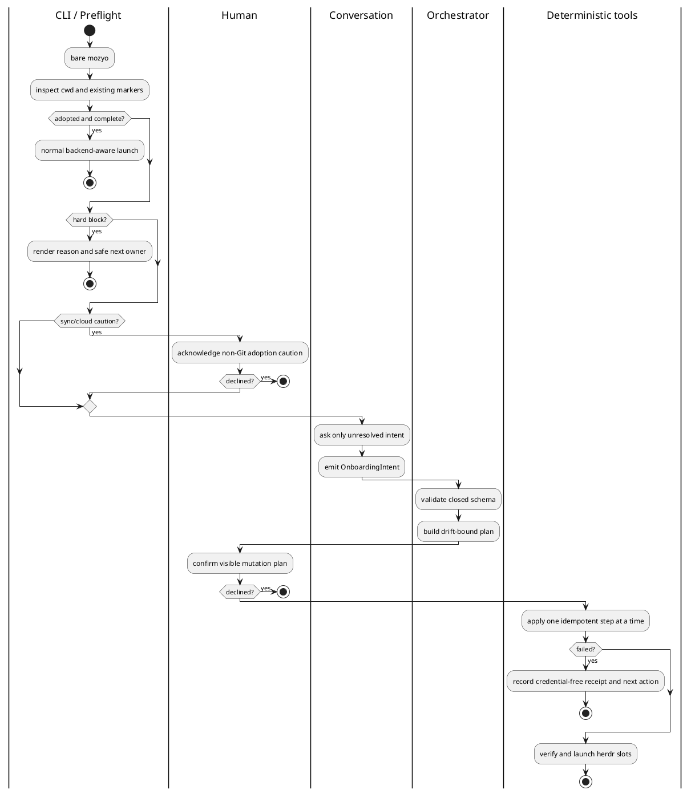

# 対話型 onboarding tool contract

Redmine #13424。未採用 directory で人間が bare `mozyo` を一度実行した後、CLI flag や
YAML を覚えず、会話から安全な project adoption と herdr 起動まで到達するための設計正本。
MVP は非エンジニアの単一 project 初期設定に限定し、汎用 scaffolding assistant は作らない。

## 目的と非目標

- LLM は自然言語を closed schema の tool call へ変換する UI だけを担う。
- filesystem、config、scaffold、workspace、runtime の mutation は決定論 tool が担う。
- home、同期 folder、Git、backend、preset、既存 state を model 起動前に機械判定する。
- 既存の `scaffold apply`、`rules install`、`workspace register`、`mozyo --json` を再利用する。
- owner approval、Redmine project 選択、credential、release、destructive cleanup は自動化しない。
- model に shell、任意 file write、任意 network、YAML 生成 tool を渡さない。

## Actor authority

| actor | owns | does not own |
| --- | --- | --- |
| Human | 目的の説明、caution の確認、mutation plan の最終確認 | CLI flag / YAML authoring |
| Preflight | path / adoption / Git / sync / binary の機械判定 | user intent、preset 推測 |
| Conversation | 自然言語から `OnboardingIntent` への変換 | mutation、gate override、approval |
| Orchestrator | state machine、schema validation、plan / apply / resume | domain decision の捏造 |
| Deterministic tools | scaffold / config / rules / registry / launch の実行 | 会話、owner approval |

source of truth は target root の実 file と typed config、workspace registry、tool outcome である。
会話 transcript は workflow truth ではなく、repo や ticket に保存しない。

## Model 起動前 hard gate

```yaml
onboarding_preflight:
  input: canonical cwd
  output:
    state: adopted | unadopted | adoption_in_progress | blocked | caution_requires_ack
    root_kind: git | non_git
    path_risk: normal | home | sync_or_cloud | ambiguous
    adoption_marker: absent | config | scaffold | workspace_anchor | onboarding_receipt
    herdr_binary: {state: resolved | missing | ambiguous, source: env | path | none}
  hard_block:
    - canonical root が home
    - cwd / symlink / mount identity が一意に解決できない
    - unreadable existing config または壊れた onboarding receipt
  caution_requires_human_ack:
    - sync_or_cloud
  invariant:
    - sync_or_cloud では git_mode=initialize を常に拒否する
    - model は block / caution を解除できない
```

sync/cloud 判定は既知 provider 名だけでなく、canonical path の platform-specific sync root と
mount metadata を deterministic classifier が返す。判定不能を `normal` に倒さず `ambiguous`
で止める。MVP の同期 folder は non-Git のまま採用する。

herdr binary は repo-local config から読まない。解決順は trusted environment の
`MOZYO_HERDR_BINARY`、次に trusted `PATH` 上の executable `herdr` とし、realpath と executable
bit を検証する。PATH 解決値は launch agent へ絶対 path で注入する。

## Closed conversation schema

```yaml
OnboardingIntent:
  schema_version: 1
  action: explain | propose | confirm_plan | revise | cancel
  preset: none | asana | redmine | redmine_governed | redmine_rails | redmine_rails_governed | undecided
  backend: herdr
  git_mode: existing | none | initialize
  rules_store: central | repo_local
  acknowledgements:
    sync_or_cloud: true | false
  free_text_summary: string
```

`free_text_summary` は表示専用で mutation input にしない。unknown enum / key、欠落 field、model の
shell command、file content、credential-shaped value は reject し、conversation へ構造化 error を
返す。`undecided` は追加質問を許すが plan を作れない。`git_mode=initialize` は通常 path でも
Human の独立確認を要求し、MVP acceptance では使用しない。

## Deterministic tool surface

```yaml
tools:
  onboarding.inspect:
    mutation: none
    result: OnboardingPreflight
  onboarding.plan:
    input: OnboardingIntent
    mutation: none
    result: {plan_id, root_fingerprint, ordered_steps, warnings, requires_confirmation}
  onboarding.apply:
    input: {plan_id, human_confirmed: true}
    mutation: bounded
    result: {state, applied_steps, no_op_steps, failed_step, next_action}
  onboarding.resume:
    input: current root
    mutation: one pending idempotent step
    result: same as onboarding.apply
```

`plan_id` は canonical root、root fingerprint、preflight facts、intent、existing file hashes、binary
realpath から生成する。`apply` は全 fact を再検査し、drift した plan を実行しない。

ordered steps:

1. onboarding receipt を atomic write し `adoption_in_progress` を記録する。
2. `scaffold apply <preset> --target <root> --backup` を既存 use case 経由で実行する。
3. `.mozyo-bridge/config.yaml` を typed write-once tool で作る。
4. 選択した store に `rules install` を実行する。
5. `workspace register` を実行する。
6. `scaffold status`、config reload、workspace inspect、herdr preflight を検証する。
7. receipt を `complete` に更新し、`mozyo --json` 相当を実行する。

config write は `{version: 1, terminal_transport: {backend: herdr}}` の typed record を atomic
create する。file 不在は create、typed-equivalent は no-op、その他の既存 config は上書きせず
`existing_config_requires_separate_merge` で停止する。LLM に YAML を生成・merge させない。

各 step は idempotent で、失敗時も完了 step と原因を credential-free receipt に残す。bare
`mozyo` は `adoption_in_progress` を通常 launch と解釈せず `onboarding.resume` へ戻す。自動 rollback
で user file を消さない。backup と resume を標準 recovery にする。

## Bare entry flow



## Verification contract

- pure tests: preflight matrix (home / normal / sync / symlink ambiguity / Git / non-Git)、schema reject、
  plan drift、config write-once、step resume、no credential persistence。
- scenario: fresh non-Git sync fixtureで bare `mozyo` → caution確認 → flagなし会話 → config / scaffold /
  registry / herdr slot ready。git init は実行されない。
- regression: adopted tmux / herdr project の bare launch byte-invariant、#13379 home refusal、壊れた
  config fail-closed、explicit subcommand は不変。
- live: owner shellで env 未設定かつ PATH 上の herdrを解決し、fresh targetを一度だけadoptする。
- E2Eは #13490 で human / coordinator / gateway / worker の入口をまとめて監査する。

## 参照正本

- `vibes/docs/logics/bootstrap.md`
- `vibes/docs/tasks/external-project-herdr-adoption.md`
- `vibes/docs/rules/public-private-boundary.md`
- `vibes/docs/logics/turnkey-e2e-acceptance.md`
- `vibes/docs/specs/herdr-native-identity.md`
