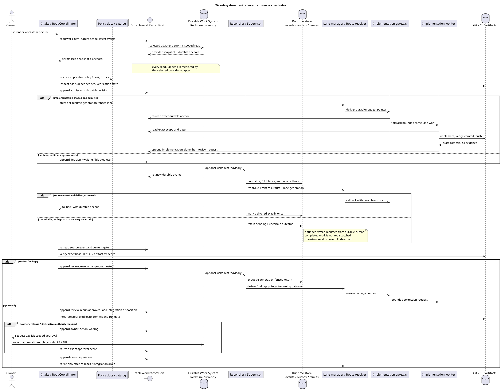

# Ticket-system neutral event-driven orchestrator

## 目的と設計判断

本書は、人間の依頼から coordinator、gateway、worker、review、integration、close / retire
までを再開可能に進める自動 orchestrator の product-level 正本である。

中核は Redmine ではなく `DurableWorkRecordPort` に依存する。Redmine は現在の
`mozyo_bridge` repository で使う推奨・既定 adapter だが、製品の必須 provider ではない。
Asana や別の work management system も、下記 contract を満たす adapter を持てば同じ
state machine に接続できる。provider 固有の status、journal、comment 語彙を core へ漏らさない。

```yaml
architecture_status:
  product_contract: target
  current_release: 0.12.2
  current_snapshot_date: 2026-07-20
  current_work_record_adapter: redmine
  provider_requirement: durable_work_record_contract
  redmine_requirement: false
```

## 非目標

- LLM に product / domain / design 判断を無制限に委ねること。
- work item の作成・選択、review approval、owner approval を runtime state から自動承認すること。
- release、publish、credential、destructive operation を通常 callback の延長で実行すること。
- pane、terminal、UI、SQLite projection を workflow truth にすること。

## Port contract

`DurableWorkRecordPort` は ticket system の違いを次の closed contract へ正規化する。

```yaml
DurableWorkRecordPort:
  required_operations:
    - read_work_item(work_item_ref) -> WorkItemSnapshot
    - resolve_parent_scope(work_item_ref) -> ParentScope
    - list_events(work_item_ref, after_cursor) -> EventPage
    - append_event(work_item_ref, event_command, idempotency_key) -> DurableAnchor
  optional_operations:
    - list_candidates(scope_query) -> CandidatePage
  required_properties:
    - stable work_item_ref and event_id
    - provider-issued durable anchor
    - deterministic event order or cursor
    - scoped read and append authorization
    - idempotent append or caller correlation key
    - structured event kind; prose inference is not required
  failure_policy: fail_closed_without_provider_fallback_guess
```

core が読む normalized event は次の形とする。`payload_ref` は provider 上の durable record を
指し、secret、pane scrollback、raw prompt を複製しない。

```yaml
DurableWorkEvent:
  provider: <adapter id>
  project_key: <provider-scoped project id>
  work_item_id: <stable id>
  event_id: <provider event id or deterministic correlation id>
  source_sequence: <ordered cursor>
  event_kind: <closed workflow event vocabulary>
  actor_role: <workflow role>
  lane_generation: <integer or none>
  durable_anchor: <provider-issued pointer>
  payload_ref: <same-system detail pointer>
  occurred_at: <provider timestamp>
```

Redmine adapter は `work_item_id=issue id`、`event_id/source_sequence=journal id`、
`durable_anchor=issue + journal` として写像する。Asana adapter なら task / story or comment を
同じ normalized shape へ写像する。provider ごとの gate semantics は adapter が検証するが、
core の `event_kind` と authority boundary は変えない。
webhook / push notificationは最適化であり必須contractではない。取りこぼし回復の正本経路は
ordered cursorを使うbounded poll / sweepとする。

## Authority map

| surface | authoritative for | authoritative ではないもの |
| --- | --- | --- |
| `DurableWorkRecordPort` | objective、scope、durable event、approval / review / close gate | live process、commit content |
| Git / CI / artifact store | commit ancestry、diff、test / build result、artifact identity | owner intent、workflow approval |
| mozyo runtime store | folded state、cursor、outbox、lease、idempotency、generation fence | review / close / release approval |
| live agent discovery | action-time liveness、exact delivery target、provider process identity | durable completion、route policy |
| repo docs / catalog | policy、role、port、state transition invariant | current runtime fact |
| UI / cockpit / notification | timestamped projection、durable anchor への pointer | workflow truth、action permission |

side effect permission は、durable gate、Git / artifact evidence、runtime fence、action-time live
preflight を command boundary で照合した結果だけから得る。いずれか一層だけでは許可しない。

## 標準 sequence

この図は product-level sequence の正本である。Redmine 固有の repo 運用手順は
`coordinator-sublane-development-flow.md`、実 CLI flag は CLI help / validation error を読む。



## Reconcile contract と stop conditions

一回の controller cycle は新しい durable event を fold し、許可済みの安全な action を最大
一つだけ実行し、outcome を記録して終了する。常駐 service であっても一回の cycle を無限 wait
にしない。

```yaml
cycle:
  - read durable events after stored cursor
  - normalize and fold deterministic state
  - resolve exactly one next action
  - validate durable authority and generation fence
  - reserve idempotency / outbox key
  - perform at most one external mutation
  - record delivered, blocked, or uncertain outcome
hard_stop:
  - missing or ambiguous durable anchor
  - provider read/write failure
  - stale lane generation or ambiguous live route
  - unresolved review, owner, release, credential, or destructive gate
  - commit / artifact identity mismatch
  - reserved or uncertain prior send without explicit reconciliation
recovery:
  - restart from durable cursor and runtime outbox
  - re-read the exact provider event before mutation
  - never infer progress from notification or pane text
```

## Current 0.12.2 と target の差

| area | current 0.12.2 | target contract |
| --- | --- | --- |
| event source | `RedmineJournalSource` / `LiveRedmineJournalSource` が structured journal marker を読む | provider-neutral `DurableWorkRecordPort` の normalized event を読む |
| state / delivery | `WorkflowRuntimeStore`、callback outbox、lease / generation fence、`WorkspaceCallbackSupervisor` が存在 | 同じ機構を provider-neutral event と route contractへ接続 |
| agent entry | `workflow step` が一つの安全な step を解決し、current herdr path は Redmine anchor を検証 | provider adapterを選んでも同じ outcome envelopeとstop理由を返す |
| orchestration closure | dispatch、callback、review、integrationの部品はあるが、全工程を常時閉ループで完走するcontrollerは未完成 | restart / callback lossを含むsingle-entry E2Eでclose / retireまで収束 |
| callback uptake | supervisorとrecovery railはあるが、durable Review Requestが即時pickupされない運用gapが残る（#14131 container release smoke tests配置是正 j#83023） | wake lossをbounded sweepで回収し、projectionもpendingを正しく示す |
| provider portability | source Protocol はtestableだがRedmineのissue / journal語彙がdomainとCLIへ残る | coreからprovider語彙を除き、Redmine adapterのbehaviorをcontract testで固定 |

従って現状は「半自動の安全な部品群」であり、完全な unattended orchestrator ではない。
Redmineを外せば動く状態でもなく、Redmineを必須にすべき状態でもない。先にport境界を固定し、
現在のRedmine pathをbehavior-preservingにadapter化するのが正しい順序である。

## Migration increments

1. normalized work item / event / anchor と adapter contract test を追加する。
2. 現行 Redmine source / writer を Redmine adapter として包み、挙動とmarker語彙を変えない。
3. `workflow step`、watch / supervisor、glanceを `DurableWorkRecordPort` 入力へ移す。
4. in-memory reference adapter と第二provider adapterで同一contract suiteを通す。
5. crash、wake loss、duplicate event、uncertain delivery、changes-requested loopを含む
   single-entry E2Eでclose / retireまで検証する。

port導入を理由に owner / review / release gateを弱めない。第二provider実装はport contractの証明であり、
Redmine adapterの廃止要件ではない。

## 参照正本と検証

- `vibes/docs/logics/coordinator-sublane-development-flow.md`
- `vibes/docs/logics/workflow-step-command-design.md`
- `vibes/docs/logics/autonomous-ticket-entrypoint.md`
- `vibes/docs/logics/managed-state-model.md`
- `vibes/docs/specs/route-identity-ledger.md`
- `vibes/docs/specs/delegated-coordinator-decision-records.md`
- `.mozyo-bridge/rules/llm_rule_authoring.md`

検証は `mozyo-bridge docs validate --repo .`、file coverage、generated conventions、
`docs audit-impact --all-changed --check-generated`、`git diff --check` を実行する。
